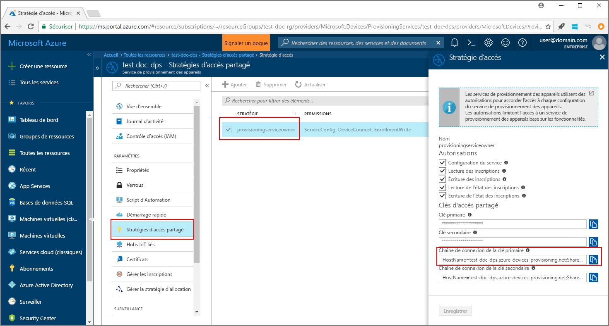
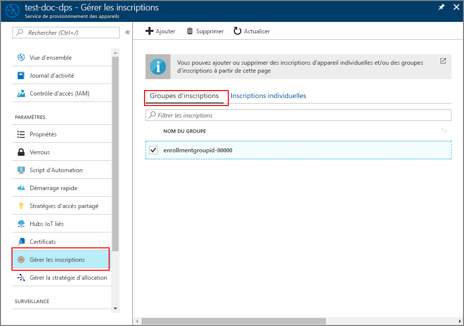

# <a name="enroll-x509-devices-to-iot-hub-device-provisioning-service-using-java-service-sdk"></a>Inscrire un appareil X.509 auprès du service Azure IoT Hub Device Provisioning à l’aide du Java Service SDK

[!INCLUDE [iot-dps-selector-quick-enroll-device-x509](../../includes/iot-dps-selector-quick-enroll-device-x509.md)]

Ces étapes indiquent comment inscrire un groupe d’appareils X.509 simulés auprès du service Azure IoT Hub Device Provisioning au moyen d’un programme et à l’aide du [Java Service SDK](https://azure.github.io/azure-iot-sdk-java/service/) ainsi que d’un exemple d’application Java. Bien que le Java Service SDK fonctionne sur les machines Windows et Linux, cet article utilise une machine de développement Windows pour présenter le processus d’inscription.

Veillez à [configurer le service IoT Hub Device Provisioning avec le portail Azure](./quick-setup-auto-provision.md) avant de continuer.

<a id="setupdevbox"></a>

## <a name="prepare-the-development-environment"></a>Préparer l’environnement de développement 

1. Assurez-vous que le [Java SE Development Kit 8](http://www.oracle.com/technetwork/java/javase/downloads/jdk8-downloads-2133151.html) est bien installé sur votre ordinateur. 

2. Configurez les variables d’environnement pour votre installation Java. La variable `PATH` doit inclure le chemin d’accès complet au répertoire *jdk1.8.x\bin*. S’il s’agit de la première installation de Java sur cet ordinateur, vous devez alors créer une variable d’environnement nommée `JAVA_HOME` et la faire pointer vers le chemin complet du répertoire *jdk1.8.x*. Sur une machine Windows, ce répertoire se trouve généralement dans le dossier *C:\\Program Files\\Java\\*. De plus, vous pouvez créer ou modifier les variables d’environnement en recherchant **Modifier les variables d’environnement du système** dans le **Panneau de configuration** de votre machine Windows. 

  Pour vérifier que Java est correctement configuré sur votre ordinateur, exécutez la commande suivante dans la fenêtre de commande :

    ```cmd\sh
    java -version
    ```

3. Téléchargez et extrayez [Maven 3](https://maven.apache.org/download.cgi) sur votre machine. 

4. Modifiez la variable d’environnement `PATH` et faites en sorte qu’elle pointe vers le sous-dossier *apache-maven-3.x.x\\bin* du dossier dans lequel Maven est extrait. Pour vérifier que Maven est correctement installé, exécutez la commande suivante dans la fenêtre de commande :

    ```cmd\sh
    mvn --version
    ```

5. Assurez-vous que l’élément [git](https://git-scm.com/download/) est installé sur votre ordinateur et qu’il est ajouté à la variable d’environnement `PATH`. 


<a id="javasample"></a>

## <a name="download-and-modify-the-java-sample-code"></a>Télécharger et modifier l’exemple de code Java

Cette section montre comment ajouter les détails de l’approvisionnement de votre appareil X.509 à l’exemple de code. 

1. Ouvrez une invite de commandes. Clonez le référentiel GitHub pour l’exemple de code d’inscription de l’appareil à l’aide du Java Service SDK :
    
    ```cmd\sh
    git clone https://github.com/Azure/azure-iot-sdk-java.git --recursive
    ```

2. Dans le code source téléchargé, accédez au dossier d’exemples **_azure-iot-sdk-java/provisioning/provisioning-samples/service-enrollment-group-sample_**. Ouvrez le fichier  **_/src/main/java/samples/com/microsoft/azure/sdk/iot/ServiceEnrollmentGroupSample.java_** dans l’éditeur de votre choix, puis ajoutez les informations suivantes :

    1. Ajoutez `[Provisioning Connection String]` pour votre service d’approvisionnement. Pour cela, procédez comme suit à partir du portail :
        1. Accédez au service d’approvisionnement dans le [portail Azure](https://portal.azure.com). 
        2. Ouvrez les **stratégies d’accès partagé**, puis sélectionnez une stratégie qui a pour autorisation *EnrollmentWrite*.
        3. Copiez la **chaîne de connexion de la clé primaire**. 

              

        4. Dans l’exemple de fichier de code **_ServiceEnrollmentGroupSample.java_**, remplacez `[Provisioning Connection String]` par la **chaîne de connexion de la clé primaire**.

            ```Java
            private static final String PROVISIONING_CONNECTION_STRING = "[Provisioning Connection String]";
            ```

    2. Ajoutez le certificat racine pour le groupe d’appareils. Si vous avez besoin d’un exemple de certificat racine, utilisez l’outil _Générateur de certificat X.509_ comme suit :
        1. Dans une fenêtre de commande, accédez au dossier **_azure-iot-sdk-java/provisioning/provisioning-tools/provisioning-x509-cert-generator_**.
        2. Compilez l’outil en exécutant la commande suivante :

                ```cmd\sh
                mvn clean install
                ```

        4. Exécutez l’outil en utilisant les commandes suivantes :

                ```cmd\sh
                cd target
                java -jar ./provisioning-x509-cert-generator-{version}-with-deps.jar
                ```

        5. Lorsque vous y êtes invité, vous pouvez également entrer un _nom commun_ pour vos certificats.
        6. L’outil génère localement un **certificat client**, la **clé privée du certificat client** et le **certificat racine**.
        7. Copiez le **certificat racine**, y compris les lignes **_---BEGIN CERTIFICATE---_** et **_---END CERTIFICATE---_**. 
        8. Attribuez la valeur du **certificat racine** au paramètre **PUBLIC_KEY_CERTIFICATE_STRING** comme indiqué ci-dessous :

                ```Java
                private static final String PUBLIC_KEY_CERTIFICATE_STRING =
                        "-----BEGIN CERTIFICATE-----\n" +
                        "XXXXXXXXXXXXXXXXXXXXXXXXXXXXXXXXXXXXXXXXXXXXXXXXXXXXXXXXXXXXXXXX\n" +
                        "XXXXXXXXXXXXXXXXXXXXXXXXXXXXXXXXXXXXXXXXXXXXXXXXXXXXXXXXXXXXXXXX\n" +
                        "XXXXXXXXXXXXXXXXXXXXXXXXXXXXXXXXXXXXXXXXXXXXXXXXXXXXXXXXXXXXXXXX\n" +
                        "XXXXXXXXXXXXXXXXXXXXXXXXXXXXXXXXXXXXXXXXXXXXXXXXXXXXXXXXXXXXXXXX\n" +
                        "XXXXXXXXXXXXXXXXXXXXXXXXXXXXXXXXXXXXXXXXXXXXXXXXXXXXXXXXXXXXXXXX\n" +
                        "XXXXXXXXXXXXXXXXXXXXXXXXXXXXXXXXXXXXXXXXXXXXXXXXXXXXXXXXXXXXXXXX\n" +
                        "XXXXXXXXXXXXXXXXXXXXXXXXXXXXXXXXXXXXXXXXXXXXXXXXXXXXXXXXXXXXXXXX\n" +
                        "XXXXXXXXXXXXXXXXXXXXXXXXXXXXXXXXXXXXXXXXXXXXXXXXXXXXXXXXXXXXXXXX\n" +
                        "XXXXXXXXXXXXXXXXXXXXXXXXXXXXXXXXXXXXXXXXXXXXXXXXXXXXXXXXXXXXXXXX\n" +
                        "XXXXXXXXXXXXXXXXXXXXXXXXXXXXXXXXXXXXXXXXXXXXXXXXXXXXXXXXXXXXXXXX\n" +
                        "-----END CERTIFICATE-----\n";
                ```

        9. Fermez la fenêtre de commande, ou saisissez **n** lorsque le *code de vérification* vous est demandé. 
 
    3. Si vous le souhaitez, vous pouvez configurer le service d’approvisionnement via l’exemple de code :
        - Pour ajouter cette configuration à l’exemple, procédez comme suit :
            1. Accédez au hub IoT associé à votre service d’approvisionnement dans le [portail Azure](https://portal.azure.com). Ouvrez l’onglet **Vue d’ensemble** du hub, puis copiez le **nom d’hôte**. Assignez ce **nom d’hôte** au paramètre *IOTHUB_HOST_NAME*.

                ```Java
                private static final String IOTHUB_HOST_NAME = "[Host name].azure-devices.net";
                ```
            2. Attribuez un nom convivial au paramètre *DEVICE_ID*, puis maintenez *PROVISIONING_STATUS* sur la valeur par défaut *ENABLED*. 

        - OU, si vous choisissez de ne pas configurer votre service d’approvisionnement, veillez à ajouter un commentaire ou à supprimer les instructions suivantes dans le fichier _ServiceEnrollmentGroupSample.java_ :

            ```Java
            enrollmentGroup.setIotHubHostName(IOTHUB_HOST_NAME);                // Optional parameter.
            enrollmentGroup.setProvisioningStatus(ProvisioningStatus.ENABLED);  // Optional parameter.
            ```

    4. Étudiez l’exemple de code. Il crée, met à jour, interroge et supprime une inscription d’un groupe d’appareils X.509. Pour vérifier la validité de l’inscription sur le portail, commentez temporairement les lignes suivantes de code à la fin du fichier _ServiceEnrollmentGroupSample.java_ :

        ```Java
        // ************************************** Delete info of enrollmentGroup ***************************************
        System.out.println("\nDelete the enrollmentGroup...");
        provisioningServiceClient.deleteEnrollmentGroup(enrollmentGroupId);
        ```

    5. Enregistrez le fichier _ServiceEnrollmentGroupSample.java_. 
 

<a id="runjavasample"></a>

## <a name="build-and-run-sample-group-enrollment"></a>Générer et exécuter un exemple d’inscription de groupe

1. Ouvrez une fenêtre de commande, puis accédez au dossier **_azure-iot-sdk-java/provisioning/provisioning-samples/service-enrollment-group-sample_**.

2. Générez l’exemple de code à l’aide de cette commande :

    ```cmd\sh
    mvn install -DskipTests
    ```

   Cette commande télécharge le package Maven [`com.microsoft.azure.sdk.iot.provisioning.service`](https://www.mvnrepository.com/artifact/com.microsoft.azure.sdk.iot.provisioning/provisioning-service-client) sur l’ordinateur. Ce package inclut les fichiers binaires du Java Service SDK dont l’exemple de code a besoin. Si vous avez exécuté l’outil _Générateur de certificat X.509_ dans la section précédente, ce package est déjà téléchargé sur votre machine. 

3. Exécutez l’exemple à l’aide de ces commandes dans la fenêtre de commande :

    ```cmd\sh
    cd target
    java -jar ./service-enrollment-group-sample-{version}-with-deps.jar
    ```

4. Observez la fenêtre de sortie pour savoir si l’inscription a abouti.

5. Accédez au service d’approvisionnement dans le portail Azure. Cliquez sur **Gérer les inscriptions**. Notez que le groupe d’appareils X.509 apparaît sous l’onglet **Groupes d’inscription**, avec un *NOM DE GROUPE* généré automatiquement. 

      

## <a name="modifications-to-enroll-a-single-x509-device"></a>Modifications pour inscrire un appareil X.509 unique

Pour inscrire un appareil X.509 unique, vous devez modifier l’exemple de code d’*inscription individuelle* utilisé dans [Inscrire un appareil TPM auprès du service Azure IoT Hub Device Provisioning à l’aide du Java Service SDK](quick-enroll-device-tpm-java.md#javasample) comme suit :

1. Copiez le *nom commun* de votre certificat client X.509 dans le presse-papiers. Si vous souhaitez utiliser l’outil _Générateur de certificat X.509_ comme indiqué dans la [section d’exemple de code précédente](#javasample), saisissez un _nom commun_ pour votre certificat, ou bien utilisez le **microsoftriotcore** par défaut. Utilisez ce **nom commun** comme valeur pour la variable *REGISTRATION_ID*. 

    ```Java
    // Use common name of your X.509 client certificate
    private static final String REGISTRATION_ID = "[RegistrationId]";
    ```

2. Renommez la variable *TPM_ENDORSEMENT_KEY* comme *PUBLIC_KEY_CERTIFICATE_STRING*. Copiez votre certificat client ou le **Certificat Client** à partir de la sortie de l’outil _Générateur de certificat X.509_, en tant que valeur de la variable *PUBLIC_KEY_CERTIFICATE_STRING*. 

    ```Java
    // Rename the variable *TPM_ENDORSEMENT_KEY* as *PUBLIC_KEY_CERTIFICATE_STRING*
    private static final String PUBLIC_KEY_CERTIFICATE_STRING =
            "-----BEGIN CERTIFICATE-----\n" +
            "XXXXXXXXXXXXXXXXXXXXXXXXXXXXXXXXXXXXXXXXXXXXXXXXXXXXXXXXXXXXXXXX\n" +
            "XXXXXXXXXXXXXXXXXXXXXXXXXXXXXXXXXXXXXXXXXXXXXXXXXXXXXXXXXXXXXXXX\n" +
            "XXXXXXXXXXXXXXXXXXXXXXXXXXXXXXXXXXXXXXXXXXXXXXXXXXXXXXXXXXXXXXXX\n" +
            "XXXXXXXXXXXXXXXXXXXXXXXXXXXXXXXXXXXXXXXXXXXXXXXXXXXXXXXXXXXXXXXX\n" +
            "XXXXXXXXXXXXXXXXXXXXXXXXXXXXXXXXXXXXXXXXXXXXXXXXXXXXXXXXXXXXXXXX\n" +
            "XXXXXXXXXXXXXXXXXXXXXXXXXXXXXXXXXXXXXXXXXXXXXXXXXXXXXXXXXXXXXXXX\n" +
            "XXXXXXXXXXXXXXXXXXXXXXXXXXXXXXXXXXXXXXXXXXXXXXXXXXXXXXXXXXXXXXXX\n" +
            "XXXXXXXXXXXXXXXXXXXXXXXXXXXXXXXXXXXXXXXXXXXXXXXXXXXXXXXXXXXXXXXX\n" +
            "XXXXXXXXXXXXXXXXXXXXXXXXXXXXXXXXXXXXXXXXXXXXXXXXXXXXXXXXXXXXXXXX\n" +
            "XXXXXXXXXXXXXXXXXXXXXXXXXXXXXXXXXXXXXXXXXXXXXXXXXXXXXXXXXXXXXXXX\n" +
            "-----END CERTIFICATE-----\n";
    ```
3. Dans la fonction **principale**, remplacez la ligne `Attestation attestation = new TpmAttestation(TPM_ENDORSEMENT_KEY);` avec les éléments suivants pour utiliser le certificat client X.509 :
    ```Java
    Attestation attestation = X509Attestation.createFromClientCertificates(PUBLIC_KEY_CERTIFICATE_STRING);
    ```

4. Enregistrez, générez et exécutez l’exemple de fichier d’*inscription individuelle*, à l’aide des étapes indiqués dans la section [Créer et exécuter l’exemple de code pour une inscription individuelle](quick-enroll-device-tpm-java.md#runjavasample).


## <a name="clean-up-resources"></a>Supprimer des ressources
Si vous prévoyez d’aller plus loin dans l’étude de l’exemple de service Java, ne supprimez pas les ressources créées dans ce démarrage rapide. Sinon, procédez aux étapes suivantes pour supprimer toutes les ressources créées lors de ce démarrage rapide.

1. Fermez la fenêtre de sortie de l’exemple Java sur votre ordinateur.
1. Fermez la fenêtre _Générateur de certificat X509_ sur votre machine.
1. Accédez à votre service d’approvisionnement d’appareil dans le portail Azure, cliquez sur **Gérer les inscriptions**, puis sélectionnez l’onglet **Groupes d’inscription**. Sélectionnez *NOM DU GROUPE* des appareils X.509 inscrits à l’aide de ce démarrage rapide, puis cliquez sur le bouton **Supprimer** dans la partie supérieure du panneau.  

## <a name="next-steps"></a>Étapes suivantes
Dans ce guide de démarrage rapide, vous avez inscrit un groupe simulé d’appareils X.509 auprès du service d’approvisionnement d’appareil. Pour en savoir plus sur l’approvisionnement de l’appareil en profondeur, référez-vous au didacticiel relatif à l’installation du service d’approvisionnement d’appareil dans le portail Azure. 

> [!div class="nextstepaction"]
> [Didacticiels relatifs au service d’approvisionnement d’appareil Azure IoT Hub](./tutorial-set-up-cloud.md)
