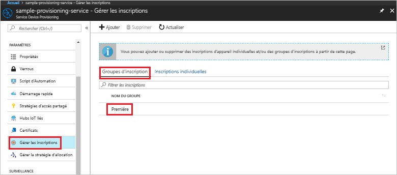

# <a name="enroll-x509-devices-to-iot-hub-device-provisioning-service-using-nodejs-service-sdk"></a>Inscrire un appareil X.509 auprès du service IoT Hub Device Provisioning à l’aide du Node.js Service SDK
> [!div class="op_single_selector"]
> * [Java](quick-enroll-device-x509-java.md)
> * [C#](quick-enroll-device-x509-csharp.md)
> * [Node.JS](quick-enroll-device-x509-node.md)

Ces étapes montrent comment créer, au moyen d’un programme, un groupe d’inscription pour un certificat X.509 d’autorité de certification racine ou intermédiaire en s’aidant du [Node.js Service SDK](https://github.com/Azure/azure-iot-sdk-node) et d’un exemple Node.js. Bien que ces étapes fonctionnent à la fois sous Windows et Linux, cet article utilise un ordinateur de développement sous Windows.
 

## <a name="prerequisites"></a>configuration requise

- N’oubliez pas de compléter les étapes décrites dans la section [Configuration du service IoT Hub Device Provisioning avec le portail Azure](./quick-setup-auto-provision.md). 

 
- Vérifiez que la [version 4.0 ou supérieure de Node.js](https://nodejs.org) est installée sur votre ordinateur.


- Vous avez besoin d’un fichier .pem. Celui-ci doit contenir un certificat X.509 d’autorité de certification racine ou intermédiaire qui a été au préalable chargé et vérifié avec votre service d’approvisionnement. **Azure IoT c SDK** contient des outils qui peuvent vous aider à créer une chaîne de certificats X.509, à charger un certificat racine ou intermédiaire à partir de cette chaîne et à générer une preuve de possession avec le service afin de vérifier le certificat. Pour utiliser ces outils, clonez [Azure IoT c SDK](https://github.com/Azure/azure-iot-sdk-c), puis suivez sur votre ordinateur les étapes décrites dans le fichier [azure-iot-sdk-c\tools\CACertificates\CACertificateOverview.md](https://github.com/Azure/azure-iot-sdk-c/blob/master/tools/CACertificates/CACertificateOverview.md).

## <a name="create-the-enrollment-group-sample"></a>Créer un exemple de groupe d’inscription 

 
1. À partir d’une fenêtre de commande dans votre dossier de travail, exécutez :
  
     ```cmd\sh
     npm install azure-iot-provisioning-service
     ```  

2. À l’aide d’un éditeur de texte, créez un fichier **create_enrollment_group.js** dans votre dossier de travail. Ajoutez le code suivant au fichier et enregistrez-le :

    ```
    'use strict';
    var fs = require('fs');

    var provisioningServiceClient = require('azure-iot-provisioning-service').ProvisioningServiceClient;

    var serviceClient = provisioningServiceClient.fromConnectionString(process.argv[2]);

    var enrollment = {
      enrollmentGroupId: 'first',
      attestation: {
        type: 'x509',
        x509: {
          signingCertificates: {
            primary: {
              certificate: fs.readFileSync(process.argv[3], 'utf-8').toString()
            }
          }
        }
      },
      provisioningStatus: 'disabled'
    };

    serviceClient.createOrUpdateEnrollmentGroup(enrollment, function(err, enrollmentResponse) {
      if (err) {
        console.log('error creating the group enrollment: ' + err);
      } else {
        console.log("enrollment record returned: " + JSON.stringify(enrollmentResponse, null, 2));
        enrollmentResponse.provisioningStatus = 'enabled';
        serviceClient.createOrUpdateEnrollmentGroup(enrollmentResponse, function(err, enrollmentResponse) {
          if (err) {
            console.log('error updating the group enrollment: ' + err);
          } else {
            console.log("updated enrollment record returned: " + JSON.stringify(enrollmentResponse, null, 2));
          }
        });
      }
    });
    ````

## <a name="run-the-enrollment-group-sample"></a>Exécuter l’exemple de groupe d’inscription
 
1. Pour exécuter cet exemple, vous avez besoin de la chaîne de connexion de votre service d’approvisionnement. 
    1. Connectez-vous au portail Azure, cliquez sur le bouton **Toutes les ressources** dans le menu de gauche et ouvrez votre service Device Provisioning. 
    2. Cliquez sur **Stratégies d’accès partagé**, puis sur la stratégie d’accès que vous voulez utiliser pour ouvrir ses propriétés. Dans la fenêtre **Stratégie d’accès**, copiez et notez la chaîne de connexion de la clé primaire. 

     


3. Comme indiqué dans les [conditions préalables](#prerequisites), vous avez également besoin d’un fichier .pem. Celui-ci doit contenir un certificat X.509 d’autorité de certification racine ou intermédiaire qui a été au préalable chargé et vérifié avec votre service d’approvisionnement. Pour contrôler que votre certificat a bien été chargé et vérifié, accédez à la page de résumé du service Device Provisioning sur le portail Azure, puis cliquez sur **Certificats**. Recherchez le certificat que vous voulez utiliser pour l’inscription du groupe, puis validez que son état est bien *vérifié*.

     

1. Afin de créer un groupe d’inscription pour votre certificat, exécutez la commande suivante (sans oublier les guillemets autour des arguments de commande) :
 
     ```cmd\sh
     node create_enrollment_group.js "<the connection string for your provisioning service>" "<your certificate's .pem file>"
     ```
 
3. Une fois la création terminée, la fenêtre de commande affiche les propriétés du nouveau groupe d’inscription.

     

4. Vérifiez que le groupe d’inscription a bien été créé. Dans le panneau de résumé du service Device Provisioning du portail Azure, sélectionnez **Gérer les inscriptions**. Sélectionnez l’onglet **Groupes d’inscription**, puis vérifiez la présence de la nouvelle entrée d’inscription (*premier*).

     
 
## <a name="clean-up-resources"></a>Supprimer des ressources
Si vous prévoyez d’aller plus loin dans l’étude des exemples de service Node.js, ne supprimez pas les ressources créées dans ce démarrage rapide. Dans le cas contraire, passez aux étapes suivantes pour supprimer toutes les ressources Azure créées dans ce démarrage rapide.
 
1. Fermez la fenêtre de sortie de l’exemple Node.js sur l’ordinateur.
2. Accédez à votre service Device Provisioning dans le portail Azure, cliquez sur **Gérer les inscriptions**, puis sélectionnez l’onglet **Groupes d’inscription**. Sélectionnez *l’ID d’inscription* correspondant à l’entrée d’inscription créée à l’aide de ce démarrage rapide, puis cliquez sur le bouton **Supprimer** dans la partie supérieure du panneau.  
3. À partir du service Device Provisioning dans le portail Azure, cliquez sur **Certificats**, sur le certificat que vous avez chargé pour ce démarrage rapide, puis sur le bouton **Supprimer** en haut de la fenêtre **Détails du certificat**.  
 
## <a name="next-steps"></a>étapes suivantes
Dans ce démarrage rapide, vous avez créé un groupe l’inscription pour un certificat X.509 d’autorité de certification racine ou intermédiaire à l’aide du service Azure IoT Hub Device Provisioning. Pour en savoir plus sur l’approvisionnement de l’appareil en profondeur, référez-vous au didacticiel relatif à l’installation du service d’approvisionnement d’appareil dans le portail Azure. 
 
> [!div class="nextstepaction"]
> [Didacticiels relatifs au service d’approvisionnement d’appareil Azure IoT Hub](./tutorial-set-up-cloud.md)