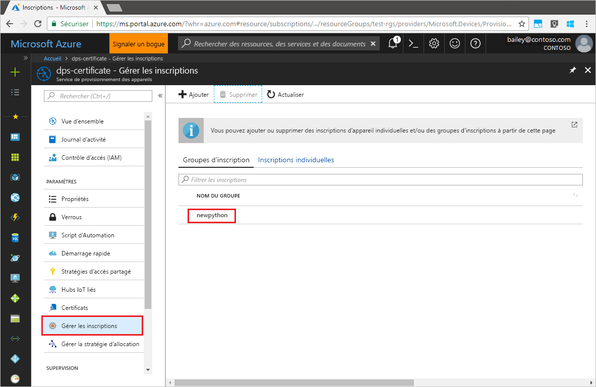

# <a name="enroll-x509-devices-to-iot-hub-device-provisioning-service-using-python-provisioning-service-sdk"></a>Inscrire des appareils X.509 auprès du service IoT Hub Device Provisioning à l’aide du Kit de développement logiciel (SDK) du service d’approvisionnement en Python
[!INCLUDE [iot-dps-selector-quick-enroll-device-x509](../../includes/iot-dps-selector-quick-enroll-device-x509.md)]

Ces étapes indiquent comment inscrire un groupe d’appareils X.509 simulés auprès du service Azure IoT Hub Device Provisioning au moyen d’un programme et à l’aide du [Kit de développement logiciel (SDK) du service d’approvisionnement en Python](https://github.com/Azure/azure-iot-sdk-python/tree/master/provisioning_service_client) et d’un exemple d’application Python. Bien que le kit Java Service SDK fonctionne sur les machines Windows et Linux, cet article utilise une machine de développement Windows pour présenter le processus d’inscription.

Veillez à [configurer le service IoT Hub Device Provisioning avec le portail Azure](./quick-setup-auto-provision.md) avant de continuer.

> [!NOTE]
> Ce démarrage rapide ne prend en charge que **Groupe d’inscription**. **L’inscription individuelle** via le _Kit de développement logiciel (SDK) du service d’approvisionnement en Python_ est en cours.
> 

<a id="prepareenvironment"></a>

## <a name="prepare-the-environment"></a>Préparer l’environnement 

1. Téléchargez et installez [Python 2.x ou 3.x](https://www.python.org/downloads/). Veillez à utiliser l’installation 32 bits ou 64 bits comme requis par votre programme d’installation. Lorsque vous y êtes invité pendant l’installation, veillez à ajouter Python à votre variable d’environnement propre à la plateforme. 

1. Choisissez l’une des options suivantes :

    - Générer et compiler le **Kit de développement logiciel (SDK) Python Azure IoT**. Suivez [ces instructions](https://github.com/Azure/azure-iot-sdk-python/blob/master/doc/python-devbox-setup.md) pour générer les packages Python. Si vous utilisez le système d’exploitation Windows, installez également [Visual C++ Redistributable Package](http://www.microsoft.com/download/confirmation.aspx?id=48145) pour autoriser l’utilisation de DLL natives de Python.

    - [Installer ou mettre à niveau *pip*, le système de gestion des packages Python](https://pip.pypa.io/en/stable/installing/) et installer le package via la commande suivante :

        ```cmd/sh
        pip install azure-iothub-provisioningserviceclient
        ```

1. Vous avez besoin d’un fichier .pem. Celui-ci doit contenir un certificat X.509 d’autorité de certification racine ou intermédiaire qui a été au préalable chargé et vérifié avec votre service d’approvisionnement. **Azure IoT C SDK** contient des outils qui peuvent vous aider à créer une chaîne de certificats X.509, à charger un certificat racine ou intermédiaire à partir de cette chaîne et à générer une preuve de possession avec le service afin de vérifier le certificat. Pour utiliser ces outils, clonez le Kit de développement logiciel [Azure IoT C SDK](https://github.com/Azure/azure-iot-sdk-c), puis suivez sur votre ordinateur les étapes décrites dans le fichier [azure-iot-sdk-c\tools\CACertificates\CACertificateOverview.md](https://github.com/Azure/azure-iot-sdk-c/blob/master/tools/CACertificates/CACertificateOverview.md).


## <a name="modify-the-python-sample-code"></a>Modifier l’exemple de code Python

Cette section montre comment ajouter les détails de l’approvisionnement de votre appareil X.509 à l’exemple de code. 

1. Dans un éditeur de texte, créez un fichier **EnrollmentGroup.py**.

1. Ajoutez les variables et instructions `import` ci-dessous au début du fichier **EnrollmentGroup.py**. Remplacez ensuite `dpsConnectionString` par la chaîne de connexion trouvée dans **Stratégies d’accès partagé** dans votre **Service Device Provisioning** sur le **portail Azure**. Remplacez l’espace réservé de certificat par le certificat créé précédemment dans [Préparer l’environnement](quick-enroll-device-x509-python.md#prepareenvironment). Pour finir, créez un ID `registrationid` unique et veillez à ce qu’il se compose uniquement de caractères alphanumériques minuscules et de traits d’union.  
   
    ```python
    from provisioningserviceclient import ProvisioningServiceClient
    from provisioningserviceclient.models import EnrollmentGroup, AttestationMechanism

    CONNECTION_STRING = "{dpsConnectionString}"

    SIGNING_CERT = """-----BEGIN CERTIFICATE-----
    XXXXXXXXXXXXXXXXXXXXXXXXXXXXXXXXXXXXXXXXXXXXXXXXXXXXXXXXXXXXXXXX
    XXXXXXXXXXXXXXXXXXXXXXXXXXXXXXXXXXXXXXXXXXXXXXXXXXXXXXXXXXXXXXXX
    XXXXXXXXXXXXXXXXXXXXXXXXXXXXXXXXXXXXXXXXXXXXXXXXXXXXXXXXXXXXXXXX
    XXXXXXXXXXXXXXXXXXXXXXXXXXXXXXXXXXXXXXXXXXXXXXXXXXXXXXXXXXXXXXXX
    XXXXXXXXXXXXXXXXXXXXXXXXXXXXXXXXXXXXXXXXXXXXXXXXXXXXXXXXXXXXXXXX
    XXXXXXXXXXXXXXXXXXXXXXXXXXXXXXXXXXXXXXXXXXXXXXXXXXXXXXXXXXXXXXXX
    XXXXXXXXXXXXXXXXXXXXXXXXXXXXXXXXXXXXXXXXXXXXXXXXXXXXXXXXXXXXXXXX
    XXXXXXXXXXXXXXXXXXXXXXXXXXXXXXXXXXXXXXXXXXXXXXXXXXXXXXXXXXXXXXXX
    XXXXXXXXXXXXXXXXXXXXXXXXXXXXXXXXXXXXXXXXXXXXXXXXXXXXXXXXXXXXXXXX
    XXXXXXXXXXXXXXXXXXXXXXXXXXXXXXXXXXXXXXXXXXXXXXXXXXXXXXXXXXXXXXXX
    XXXXXXXXXXXXXXXXXXXXXXXXXXXXXXXXXXXXXXXXXXXXXXXXXXXXXXXXXXXXXXXX
    XXXXXXXXXXXXXXXXXXXXXXXXXXXXXXXXXXXXXXXXXXXXXXXXXXXXXXXXXXXXXXXX
    XXXXXXXXXXXXXXXXXXXXXXXXXXXXXXXXXXXXXXXXXXXXXXXXXXXXXXXXXXXXXXXX
    XXXXXXXXXXXXXXXXXXXXXXXXXXXXXXXXXXXXXXXXXXXXXXXXXXXXXXXXXXXXXXXX
    XXXXXXXXXXXXXXXXXXXXXXXXXXXXXXXXXXXXXXXXXXXXXXXXXXXXXXXX
    -----END CERTIFICATE-----"""

    GROUP_ID = "{registrationid}"
    ```

1. Ajoutez la fonction et l’appel de fonction suivants pour implémenter la création de l’inscription du groupe :
   
    ```python
    def main():
        print ( "Initiating enrollment group creation..." )

        psc = ProvisioningServiceClient.create_from_connection_string(CONNECTION_STRING)
        att = AttestationMechanism.create_with_x509_signing_certs(SIGNING_CERT)
        eg = EnrollmentGroup.create(GROUP_ID, att)

        eg = psc.create_or_update(eg)
    
        print ( "Enrollment group created." )

    if __name__ == '__main__':
        main()
    ```

1. Enregistrez et fermez le fichier **EnrollmentGroup.py**.
 

## <a name="run-the-sample-group-enrollment"></a>Exécuter l’exemple d’inscription de groupe

1. Ouvrez une invite de commandes, puis exécutez le script.

    ```cmd/sh
    python EnrollmentGroup.py
    ```

1. Observez la sortie pour vérifier si l’inscription a abouti.

1. Accédez au service d’approvisionnement dans le portail Azure. Cliquez sur **Gérer les inscriptions**. Notez que le groupe d’appareils X.509 apparaît dans l’onglet **Groupes d’inscription** sous le nom `registrationid` créé précédemment. 

      


## <a name="clean-up-resources"></a>Supprimer des ressources
Si vous prévoyez d’explorer davantage l’exemple de service pour Java, ne nettoyez pas les ressources créées dans ce guide de démarrage rapide. Sinon, procédez aux étapes suivantes pour supprimer toutes les ressources créées lors de ce démarrage rapide.

1. Fermez la fenêtre de sortie de l’exemple Java sur votre ordinateur.
1. Fermez la fenêtre _Générateur de certificat X509_ sur votre machine.
1. Accédez à votre service Device Provisioning dans le portail Azure, cliquez sur **Gérer les inscriptions**, puis sélectionnez l’onglet **Groupes d’inscription**. Sélectionnez *NOM DU GROUPE* des appareils X.509 inscrits à l’aide de ce démarrage rapide, puis cliquez sur le bouton **Supprimer** dans la partie supérieure du panneau.  


## <a name="next-steps"></a>étapes suivantes
Dans ce guide de démarrage rapide, vous avez inscrit un groupe simulé d’appareils X.509 auprès du service d’approvisionnement d’appareil. Pour en savoir plus sur l’approvisionnement de l’appareil en profondeur, référez-vous au didacticiel relatif à l’installation du service d’approvisionnement d’appareil dans le portail Azure. 

> [!div class="nextstepaction"]
> [Didacticiels relatifs au service d’approvisionnement d’appareil Azure IoT Hub](./tutorial-set-up-cloud.md)
