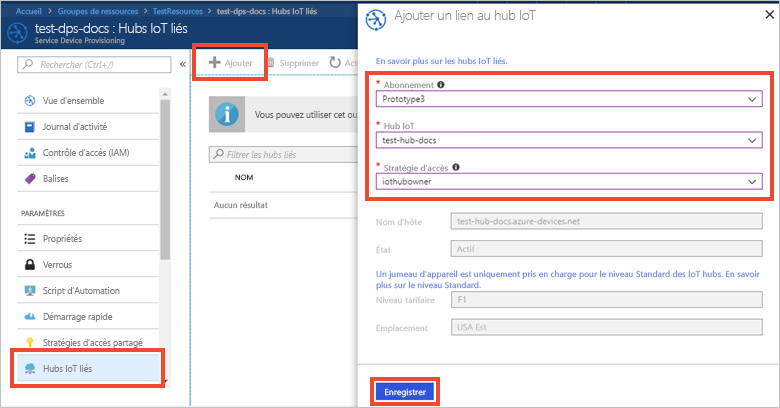

# Configurer le service d’approvisionnement d’appareil IoT Hub avec le portail Azure

Ces étapes indiquent comment configurer les ressources cloud Azure dans le portail pour l’approvisionnement de vos appareils. Cela inclut la création de votre IoT hub et d’un service d’approvisionnement d’appareil IoT Hub, ainsi que la liaison des deux services. 

Si vous n’avez pas d’abonnement Azure, créez un [compte gratuit](https://azure.microsoft.com/free/?WT.mc_id=A261C142F) avant de commencer.

## Connectez-vous au portail Azure.

Connectez-vous au [portail Azure](https://portal.azure.com/).

## Créer un hub IoT

1. Cliquez sur le bouton **Nouveau** dans le coin supérieur gauche du portail Azure.

2. Sélectionnez **Internet des objets** et **IoT Hub**, puis cliquez sur le bouton **Créer**. 

3. **Nommez** votre IoT Hub. Sélectionnez les options disponibles pour la tarification, entrez les [unités IoT Hub](https://azure.microsoft.com/pricing/details/iot-hub/), puis sélectionnez le nombre de partitions pour les messages appareil-à-cloud ainsi que l’abonnement à utiliser pour cette ressource. Entrez le nom d’un groupe de ressources nouveau ou existant, puis sélectionnez l’emplacement. Lorsque vous avez terminé, cliquez sur **Créer**.

      

4. Une fois que le déploiement du IoT hub est achevé, le panneau de résumé du concentrateur s’ouvre automatiquement.

## Créer une instance du service d’approvisionnement d’appareil IoT Hub

1. Cliquez sur le bouton **Nouveau** dans le coin supérieur gauche du portail Azure.

2. *Faites des recherches sur la Place de marché* concernant le **service d’approvisionnement d’appareil**. Sélectionnez le **service d’approvisionnement d’appareil IoT** et cliquez sur le bouton **Créer**. 

3. **Nommez** votre instance de service d’approvisionnement d’appareil. Sélectionnez l’abonnement à utiliser pour cette instance et nommez un groupe de ressources existant ou nouveau. Sélectionnez l’emplacement. Lorsque vous avez terminé, cliquez sur **Créer**.

      

4. Une fois que le déploiement du service est achevé, son panneau de résumé s’ouvre automatiquement.

## Lier le IoT Hub à votre service d’approvisionnement d’appareil

1. Cliquez sur le bouton **Toutes les ressources** dans le menu de gauche du portail Azure. Sélectionnez l’instance de service d’approvisionnement d’appareil que vous avez créée dans la section précédente.  

2. Dans le panneau de résumé du service d’approvisionnement d’appareil, sélectionnez **Hubs IoT liés**. Cliquez sur le bouton **+ Ajouter** qui s’affiche dans la partie supérieure. 

3. Dans le panneau du portail **Ajouter un lien à un IoT Hub**, sélectionnez l’abonnement actuel, ou entrez la chaîne de nom et la chaîne de connexion pour un autre abonnement. Dans la liste déroulante, sélectionnez le nom du hub. Lorsque vous avez terminé, cliquez sur **Enregistrer**. 

      

3. Désormais le hub sélectionné devrait s’afficher sous le panneau **Hubs IoT liés**. 

## Supprimer des ressources

Les autres démarrages rapides de cette collection reposent sur ce démarrage rapide. Si vous souhaitez continuer à utiliser d’autres démarrages rapides ou les didacticiels, ne nettoyez pas les ressources créées lors de ce démarrage rapide. Sinon, procédez comme suit pour supprimer toutes les ressources créées lors de ce démarrage rapide dans le portail Azure.

1. Dans le menu de gauche du portail Azure, cliquez sur **Toutes les ressources**, puis sélectionnez votre service d’approvisionnement d’appareil. Dans la partie supérieure du panneau **Toutes les ressources**, cliquez sur **Supprimer**.  
2. À partir du menu de gauche, dans le portail Azure, cliquez sur **Toutes les ressources**, puis sélectionnez votre IoT Hub. Dans la partie supérieure du panneau **Toutes les ressources**, cliquez sur **Supprimer**.  

## Étapes suivantes

Dans ce démarrage rapide, vous avez déployé un IoT Hub et une instance de service d’approvisionnement d’appareil, puis vous avez lié les deux ressources. Pour savoir comment utiliser cette configuration pour approvisionner un appareil simulé, référez-vous au démarrage rapide relatif à la création d’appareil simulé.

> [!div class="nextstepaction"]
> [Démarrage rapide pour créer un appareil simulé](./quick-create-simulated-device.md)
