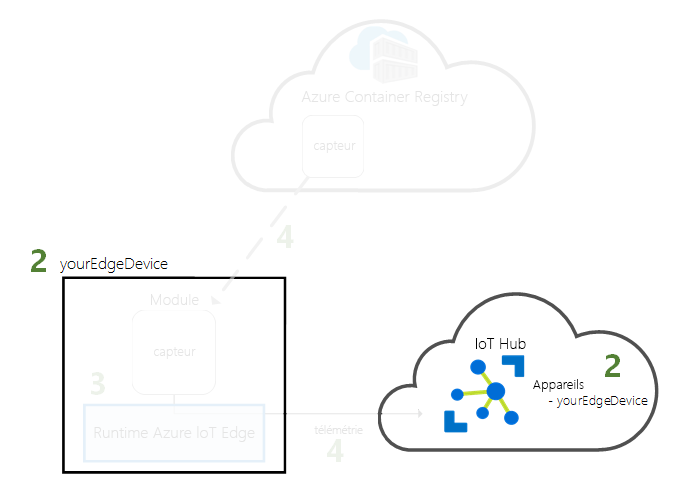
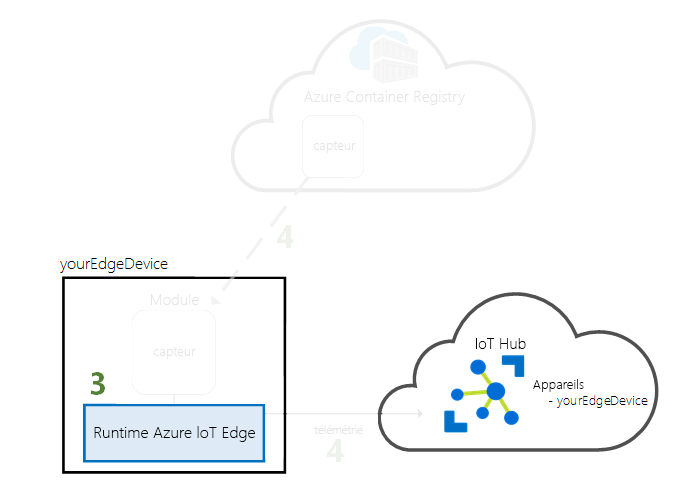
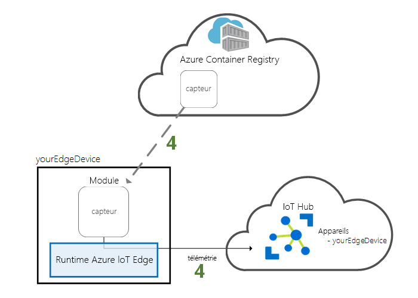

# <a name="quickstart-deploy-your-first-iot-edge-module-to-a-linux-x64-device"></a>Démarrage rapide : Déployer votre premier module IoT Edge sur un appareil Linux x64

Azure IoT Edge déplace la puissance du cloud vers vos appareils Internet des Objets. Dans ce guide de démarrage rapide, découvrez comment utiliser l’interface cloud pour déployer à distance un code prédéfini sur un appareil IoT Edge.

Dans ce guide de démarrage rapide, vous apprenez à :

1. Créer un hub IoT.
2. Inscrire un appareil IoT Edge à votre hub IoT.
3. Installer et démarrer le runtime IoT Edge sur votre appareil.
4. Déployer à distance un module sur un appareil IoT Edge.


Ce guide de démarrage rapide change votre machine virtuelle ou ordinateur Linux en appareil IoT Edge. Vous pouvez ensuite déployer un module du portail Azure sur votre appareil. Le module que vous déployez dans ce démarrage rapide est un capteur simulé qui génère des données de pression, d’humidité et de température. Les autres tutoriels Azure IoT Edge s’appuient sur le travail que vous effectuez ici en déployant des modules qui analysent les données simulées des informations métier.

Si vous n’avez pas d’abonnement Azure actif, créez un [compte gratuit](https://azure.microsoft.com/free) avant de commencer.

[!INCLUDE [cloud-shell-try-it.md](../../includes/cloud-shell-try-it.md)]

L’interface Azure CLI vous permet d’effectuer plusieurs étapes de ce démarrage rapide, et Azure IoT dispose d’une extension permettant d’activer des fonctionnalités supplémentaires. 

Ajoutez l’extension Azure IoT à l’instance de Cloud Shell.

   ```azurecli-interactive
   az extension add --name azure-cli-iot-ext
   ```

## <a name="prerequisites"></a>Prérequis

Ressources cloud : 

* Un groupe de ressources permettant de gérer toutes les ressources que vous utilisez lors de ce démarrage rapide. 

   ```azurecli-interactive
   az group create --name IoTEdgeResources --location westus2
   ```

Appareil IoT Edge :

* Un appareil ou une machine virtuelle Linux faisant office d’appareil IoT Edge. Si vous souhaitez créer une machine virtuelle dans Azure, utilisez la commande suivante pour démarrer rapidement :

   ```azurecli-interactive
   az vm create --resource-group IoTEdgeResources --name EdgeVM --image Canonical:UbuntuServer:16.04-LTS:latest --admin-username azureuser --generate-ssh-keys --size Standard_DS1_v2
   ```

   Quand vous créez une machine virtuelle, prenez note de **publicIpAddress**, qui est fourni dans la sortie de la commande create. Vous utilisez cette adresse IP publique pour vous connecter à la machine virtuelle plus loin dans le guide de démarrage rapide.

## <a name="create-an-iot-hub"></a>Créer un hub IoT

Commencez le guide de démarrage rapide en créant votre hub IoT avec Azure CLI.


Le niveau gratuit d'IoT Hub fonctionne pour ce démarrage rapide. Si vous avez déjà utilisé IoT Hub et que vous avez créé gratuitement un hub, vous pouvez l’utiliser. Chaque abonnement peut avoir un seul IoT hub gratuit. 

Le code suivant crée un hub gratuit **F1** dans le groupe de ressources **IoTEdgeResources**. Remplacez *{hub_name}* par un nom unique pour votre hub IoT.

   ```azurecli-interactive
   az iot hub create --resource-group IoTEdgeResources --name {hub_name} --sku F1 
   ```

   Si vous obtenez une erreur parce qu’un hub gratuit existe déjà dans votre abonnement, remplacez la référence SKU par **S1**. Si vous recevez une erreur indiquant que le nom du hub IoT n’est pas disponible, cela signifie que quelqu’un d’autre a déjà un hub portant ce nom. Essayez avec un autre nom. 

## <a name="register-an-iot-edge-device"></a>Inscrire un appareil IoT Edge

Inscrivez un appareil IoT Edge au hub IoT que vous venez de créer.


Créez une identité d’appareil pour votre appareil simulé afin qu’il puisse communiquer avec votre hub IoT. L’identité d’appareil se trouve dans le cloud, et une chaîne unique de connexion d’appareil vous permet d’associer un appareil physique à une identité d’appareil. 

Étant donné que le comportement et la gestion des appareils IoT Edge peuvent être différents de ceux des appareils IoT standard, déclarez cette identité en indiquant qu’elle est destinée à un appareil IoT Edge avec l’indicateur `--edge-enabled`. 

1. Dans Azure cloud shell, entrez la commande suivante pour créer un appareil nommé **myEdgeDevice** dans votre hub.

   ```azurecli-interactive
   az iot hub device-identity create --hub-name {hub_name} --device-id myEdgeDevice --edge-enabled
   ```

   Si vous recevez une erreur relative aux clés de stratégie iothubowner, vérifiez que votre shell cloud exécute la dernière version de l’extension azure-cli-iot-ext. 

2. Récupérez la chaîne de connexion pour votre appareil, qui lie votre appareil physique à l’aide de son identité dans IoT Hub. 

   ```azurecli-interactive
   az iot hub device-identity show-connection-string --device-id myEdgeDevice --hub-name {hub_name}
   ```

3. Copiez la chaîne de connexion et enregistrez-la. Vous utiliserez cette valeur pour configurer le runtime IoT Edge dans la section suivante. 

## <a name="install-and-start-the-iot-edge-runtime"></a>Installer et démarrer le runtime IoT Edge

Installez et démarrez le runtime Azure IoT Edge sur votre appareil IoT Edge. 


Le runtime IoT Edge est déployé sur tous les appareils IoT Edge. Il comprend trois composants. Le **démon de sécurité IoT Edge** démarre chaque fois qu’un appareil Edge démarre et amorce l’appareil en démarrant l’agent IoT Edge. **L’agent IoT Edge** facilite le déploiement et la surveillance des modules sur l’appareil IoT Edge, notamment le hub IoT Edge. Le **hub IoT Edge** gère les communications entre les modules sur l’appareil IoT Edge et entre l’appareil et IoT Hub. 

Pendant la configuration du runtime, vous fournissez une chaîne de connexion d’appareil. Utilisez la chaîne que vous avez récupérée dans Azure CLI. Cette chaîne associe votre appareil physique à l’identité d’appareil IoT Edge dans Azure. 

### <a name="connect-to-your-iot-edge-device"></a>Se connecter à votre appareil IoT Edge

Toutes les étapes de cette section sont effectuées sur votre appareil IoT Edge. Si vous utilisez votre propre machine comme appareil IoT Edge, vous pouvez ignorer cette partie. Si vous utilisez une machine virtuelle ou du matériel secondaire, vous voulez vous connecter à cette machine maintenant. 

Si vous avez créé une machine virtuelle Azure pour ce guide de démarrage rapide, récupérez l’adresse IP publique qu’a affichée la commande de création. Vous pouvez également trouver l’adresse IP publique dans la page Vue d’ensemble de la machine virtuelle dans le portail Azure. Utilisez la commande suivante pour vous connecter à votre machine virtuelle. Remplacez **{publicIpAddress}** par l’adresse de votre machine. 

```azurecli-interactive
ssh azureuser@{publicIpAddress}
```

### <a name="register-your-device-to-use-the-software-repository"></a>Inscrire votre appareil pour utiliser le référentiels de logiciels

Les packages dont vous avez besoin pour exécuter le runtime IoT Edge sont gérés dans un référentiel de logiciels. Configurez votre appareil IoT Edge pour accéder à ce référentiel. 

Les étapes décrites dans cette section s’appliquent aux appareils x64 exécutant **Ubuntu 16.04**. Pour accéder au référentiel de logiciels sur d’autres versions de Linux ou d’autres architectures d’appareils, consultez [Installer le runtime Azure IoT Edge sur Linux (x64)](how-to-install-iot-edge-linux.md) ou [Linux (ARM32v7/armhf)](how-to-install-iot-edge-linux-arm.md).

1. Installez la configuration du référentiel sur la machine que vous utilisez en tant qu’appareil IoT Edge.

   ```bash
   curl https://packages.microsoft.com/config/ubuntu/16.04/prod.list > ./microsoft-prod.list
   sudo cp ./microsoft-prod.list /etc/apt/sources.list.d/
   ```

2. Installez une clé publique pour accéder au référentiel.

   ```bash
   curl https://packages.microsoft.com/keys/microsoft.asc | gpg --dearmor > microsoft.gpg
   sudo cp ./microsoft.gpg /etc/apt/trusted.gpg.d/
   ```

### <a name="install-a-container-runtime"></a>Installer un runtime de conteneurs

Le runtime IoT Edge est un ensemble de conteneurs, et la logique que vous déployez sur votre appareil IoT Edge est empaquetée sous forme de conteneurs. Préparez votre appareil pour ces composants en installant un runtime de conteneurs.

1. Mettez à jour **apt-get**.

   ```bash
   sudo apt-get update
   ```

2. Installez **Moby**, un runtime de conteneurs.

   ```bash
   sudo apt-get install moby-engine
   ```

3. Installez les commandes d’interface de ligne de commande pour Moby. 

   ```bash
   sudo apt-get install moby-cli
   ```

### <a name="install-and-configure-the-iot-edge-security-daemon"></a>Installer et configurer le démon de sécurité IoT Edge

Le démon de sécurité s’installe en tant que service système afin que le runtime IoT Edge démarre chaque fois que votre appareil démarre. L’installation inclut également une version de **hsmlib** qui autorise le démon de sécurité à interagir avec la sécurité matérielle de l’appareil. 

1. Télécharger et installer le démon de sécurité IoT Edge. 

   ```bash
   sudo apt-get update
   sudo apt-get install iotedge
   ```

2. Ouvrez le fichier de configuration IoT Edge. Comme il s’agit d’un fichier protégé, il peut être nécessaire d’utiliser des privilèges élevés pour y accéder.
   
   ```bash
   sudo nano /etc/iotedge/config.yaml
   ```

3. Ajoutez la chaîne de connexion d’appareil IoT Edge. Recherchez la variable **device_connection_string** et mettez à jour sa valeur avec la chaîne que vous avez copiée après l’inscription de votre appareil. Cette chaîne de connexion associe votre appareil physique à l’identité d’appareil que vous avez créée dans Azure.

4. Enregistrez et fermez le fichier. 

   `CTRL + X`, `Y`, `Enter`

5. Redémarrez le démon de sécurité IoT Edge pour appliquer vos changements.

   ```bash
   sudo systemctl restart iotedge
   ```

>[!TIP]
>Vous avez besoin des privilèges élevés pour exécuter les commandes `iotedge`. Une fois que vous vous déconnectez de votre machine et que vous vous reconnectez pour la première fois après avoir installé le runtime IoT Edge, vos autorisations sont automatiquement mises à jour. Dans l’intervalle, utilisez **sudo** devant les commandes. 

### <a name="view-the-iot-edge-runtime-status"></a>Afficher l’état du runtime IoT Edge

Vérifiez que le runtime a été correctement installé et configuré.

1. Vérifiez que le démon de sécurité Edge s’exécute en tant que service système.

   ```bash
   sudo systemctl status iotedge
   ```

   

2. Si vous avez besoin de résoudre les problèmes du service, récupérez les journaux de ce dernier. 

   ```bash
   journalctl -u iotedge
   ```

3. Affichez les modules en cours d’exécution sur votre appareil. 

   ```bash
   sudo iotedge list
   ```

   

Votre appareil IoT Edge est maintenant configuré. Il est prêt à exécuter les modules déployés dans le cloud. 

## <a name="deploy-a-module"></a>Déployer un module

Gérez votre appareil Azure IoT Edge depuis le cloud pour déployer un module qui transmettra des données de télémétrie à IoT Hub.


[!INCLUDE [iot-edge-deploy-module](../../includes/iot-edge-deploy-module.md)]

## <a name="view-generated-data"></a>Afficher les données générées

Dans ce guide de démarrage rapide, vous avez créé un nouveau périphérique IoT Edge et installé le runtime IoT Edge. Puis vous avez utilisé le portail Azure pour transmettre un module IoT Edge afin de l’exécuter sur l’appareil sans avoir à apporter des modifications à l’appareil lui-même. Dans ce cas, le module que vous transmettez crée des données environnementales que vous pouvez utiliser pour les didacticiels.

Ouvrez de nouveau l’invite de commandes sur votre appareil IoT Edge. Confirmez que le module déployé à partir du cloud est en cours d’exécution sur votre appareil IoT Edge :

   ```bash
   sudo iotedge list
   ```

   

Afficher les messages envoyés à partir du module tempSensor :

   ```bash
   sudo iotedge logs tempSensor -f
   ```


Le module de capteur de température peut attendre de se connecter à Edge Hub si la dernière ligne que vous voyez dans le journal est `Using transport Mqtt_Tcp_Only`. Essayez d’arrêter le module et de laisser l’agent Edge le redémarrer. Vous pouvez l’arrêter avec la commande `sudo docker stop tempSensor`.

Vous pouvez également regarder les messages arriver sur votre hub IoT avec [l’extension Azure IoT Toolkit pour Visual Studio Code](https://marketplace.visualstudio.com/items?itemName=vsciot-vscode.azure-iot-toolkit). 

## <a name="clean-up-resources"></a>Supprimer des ressources

Si vous souhaitez poursuivre les didacticiels IoT Edge, vous pouvez utiliser l’appareil que vous avez inscrit et configuré dans ce démarrage rapide. Sinon, vous pouvez supprimer les ressources Azure que vous avez créées, ainsi que le runtime IoT Edge de votre appareil.

### <a name="delete-azure-resources"></a>Supprimer les ressources Azure

Si vous avez créé votre machine virtuelle et un hub IoT dans un nouveau groupe de ressources, vous pouvez supprimer ce groupe et toutes les ressources associées. Vérifiez le contenu du groupe de ressources pour être certain que vous ne voulez rien en conserver. Si vous ne voulez pas supprimer tout le groupe, vous pouvez supprimer des ressources individuelles.

Supprimez le groupe **IoTEdgeResources**.

   ```azurecli-interactive
   az group delete --name IoTEdgeResources 
   ```

### <a name="remove-the-iot-edge-runtime"></a>Supprimer le runtime IoT Edge

Si vous souhaitez supprimer les installations de votre appareil, utilisez les commandes suivantes.  

Supprimez le runtime IoT Edge.

   ```bash
   sudo apt-get remove --purge iotedge
   ```

Lorsque le runtime IoT Edge est supprimé, les conteneurs qu’il a créés sont arrêtés, mais existent toujours sur votre appareil. Affichez tous les conteneurs.

   ```bash
   sudo docker ps -a
   ```

Supprimez les conteneurs qui ont été créés sur votre appareil par le runtime IoT Edge. Modifiez le nom du conteneur tempSensor si vous l’avez appelé différemment. 

   ```bash
   sudo docker rm -f tempSensor
   sudo docker rm -f edgeHub
   sudo docker rm -f edgeAgent
   ```

Supprimez le runtime de conteneurs.

   ```bash
   sudo apt-get remove --purge moby-cli
   sudo apt-get remove --purge moby-engine
   ```

## <a name="next-steps"></a>Étapes suivantes

Ce démarrage rapide constitue une étape nécessaire pour suivre tous les didacticiels d’IoT Edge. Vous pouvez continuer avec l’un des autres didacticiels pour savoir comment Azure IoT Edge peut vous aider à transformer ces données en informations métier à la périphérie.

> [!div class="nextstepaction"]
> [Filtrer les données de capteur à l’aide d’Azure Function](tutorial-deploy-function.md)
