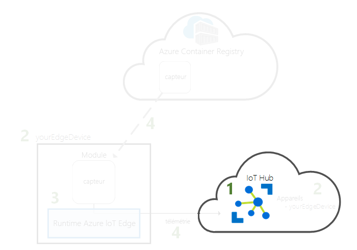
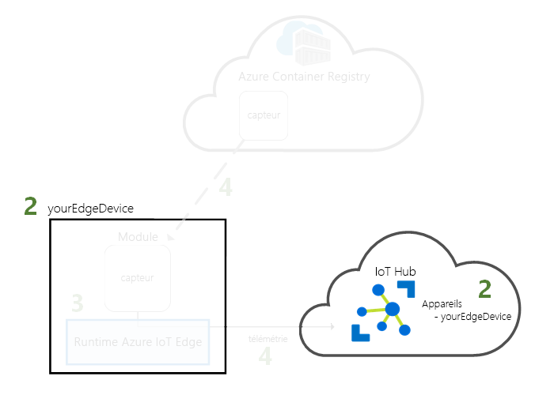
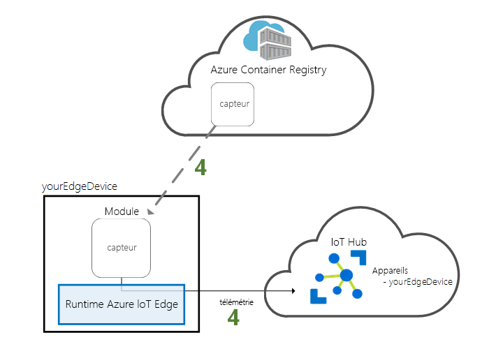

# <a name="quickstart-deploy-your-first-iot-edge-module-from-the-azure-portal-to-a-windows-device---preview"></a>Démarrage rapide : Déployer votre premier module IoT Edge à partir du portail Azure sur un appareil Windows - préversion

Dans ce guide de démarrage rapide, utilisez l'interface de cloud Azure IoT Edge pour déployer à distance un code prédéfini sur un appareil IoT Edge. Pour accomplir cette tâche, utilisez d’abord votre appareil Windows pour simuler un appareil IoT Edge, puis déployez un module sur celui-ci.

Dans ce guide de démarrage rapide, vous apprenez à :

1. Créez un IoT Hub.
2. Inscrivez un appareil IoT Edge dans votre IoT Hub.
3. Installez et démarrez le runtime IoT Edge sur votre appareil.
4. Déployez à distance un module sur un appareil IoT Edge et envoyez les données de télémétrie à IoT Hub.


Le module que vous déployez dans ce guide de démarrage rapide est un capteur simulé qui génère des données de pression, d’humidité et de température. Les autres tutoriels Azure IoT Edge s’appuient sur le travail que vous effectuez ici en déployant des modules qui analysent les données simulées des informations métier.

>[!NOTE]
>Le runtime IoT Edge sur Windows est en [préversion publique](https://azure.microsoft.com/support/legal/preview-supplemental-terms/).

Si vous n’avez pas d’abonnement Azure actif, créez un [compte gratuit](https://azure.microsoft.com/free) avant de commencer.

[!INCLUDE [cloud-shell-try-it.md](../../includes/cloud-shell-try-it.md)]

L’interface Azure CLI vous permet d’effectuer plusieurs étapes de ce démarrage rapide, et Azure IoT dispose d’une extension permettant d’activer des fonctionnalités supplémentaires.

Ajoutez l’extension Azure IoT à l’instance de Cloud Shell.

   ```azurecli-interactive
   az extension add --name azure-cli-iot-ext
   ```

## <a name="prerequisites"></a>Prérequis

Ressources cloud :

* Un groupe de ressources permettant de gérer toutes les ressources que vous utilisez lors de ce démarrage rapide.

   ```azurecli-interactive
   az group create --name IoTEdgeResources --location westus
   ```

Appareil IoT Edge :

* Un ordinateur de Windows ou une machine virtuelle faisant office de périphérique IoT Edge. Utilisez une version prise en charge par Windows :
  * Windows 10 ou IoT Core avec mise à jour d’octobre 2018 (build 17763)
  * Windows Server 2019
* Activer la virtualisation pour que votre appareil puisse héberger des conteneurs
   * Dans le cas d’un ordinateur Windows, activez la fonctionnalité de conteneurs. Dans la barre de démarrage, accédez à **Activer ou désactiver des fonctionnalités Windows** et cochez la case à côté de **Conteneurs**.
   * S’il s’agit d’une machine virtuelle, activez la [virtualisation imbriquée](https://docs.microsoft.com/virtualization/hyper-v-on-windows/user-guide/nested-virtualization) et allouez au moins 2 Go de mémoire.

## <a name="create-an-iot-hub"></a>Créer un hub IoT

Commencez le guide de démarrage rapide en créant un hub IoT avec Azure CLI.



Le niveau gratuit d'IoT Hub fonctionne pour ce démarrage rapide. Si vous avez utilisé IoT Hub par le passé et que vous avez créé gratuitement un hub, vous pouvez utiliser cet IoT Hub. Chaque abonnement peut avoir uniquement un IoT hub gratuit.

Le code suivant crée un hub gratuit **F1** dans le groupe de ressources **IoTEdgeResources**. Remplacez *{hub_name}* par un nom unique pour votre IoT Hub.

   ```azurecli-interactive
   az iot hub create --resource-group IoTEdgeResources --name {hub_name} --sku F1
   ```

   Si vous obtenez une erreur parce qu’un hub gratuit existe déjà dans votre abonnement, remplacez la référence SKU par **S1**. Si vous recevez une erreur indiquant que le nom du hub IoT n’est pas disponible, cela signifie que quelqu’un d’autre a déjà un hub portant ce nom. Essayez avec un autre nom. 

## <a name="register-an-iot-edge-device"></a>Enregistrer un appareil IoT Edge

Inscrivez l’appareil IoT Edge avec votre IoT Hub récemment créé.


Créez une identité d’appareil pour votre appareil simulé afin qu’il puisse communiquer avec votre IoT Hub. L’identité d’appareil se trouve dans le cloud, et une chaîne unique de connexion d’appareil vous permet d’associer un appareil physique à une identité d’appareil.

Étant donné que le comportement et la gestion des appareils IoT Edge peuvent être différents de ceux des appareils IoT standard, déclarez cette identité en indiquant qu’elle est destinée à un appareil IoT Edge avec l’indicateur `--edge-enabled`. 

1. Dans Azure cloud shell, entrez la commande suivante pour créer un appareil nommé **myEdgeDevice** dans votre hub.

   ```azurecli-interactive
   az iot hub device-identity create --device-id myEdgeDevice --hub-name {hub_name} --edge-enabled
   ```

   Si vous recevez une erreur relative aux clés de stratégie iothubowner, vérifiez que votre shell cloud exécute la dernière version de l’extension azure-cli-iot-ext. 

2. Récupérez la chaîne de connexion pour votre appareil, qui lie votre appareil physique à l’aide de son identité dans IoT Hub.

   ```azurecli-interactive
   az iot hub device-identity show-connection-string --device-id myEdgeDevice --hub-name {hub_name}
   ```

3. Copiez la chaîne de connexion à partir de la sortie JSON et enregistrez-la. Vous utiliserez cette valeur pour configurer le runtime IoT Edge dans la section suivante.

   

## <a name="install-and-start-the-iot-edge-runtime"></a>Installer et démarrer le runtime IoT Edge

Installer le runtime Azure IoT Edge sur votre appareil IoT Edge et configurez-le avec une chaîne de connexion d’appareil.


Le runtime IoT Edge est déployé sur tous les appareils IoT Edge. Il comprend trois composants. Le **démon de sécurité IoT Edge** démarre chaque fois qu’un appareil IoT Edge démarre et amorce l’appareil en démarrant l’agent IoT Edge. L’**agent IoT Edge** gère le déploiement et la surveillance des modules sur l’appareil IoT Edge, notamment le hub IoT Edge. Le **hub IoT Edge** traite les communications entre les modules sur l’appareil IoT Edge et celles entre l’appareil et IoT Hub.

Le script d’installation inclut également un moteur de conteneur appelé Moby qui gère les images conteneur sur votre appareil IoT Edge. 

Pendant l’installation du runtime, vous êtes invité à une chaîne de connexion d’appareil. Utilisez la chaîne que vous avez récupérée à partir de Azure CLI. Cette chaîne associe votre appareil physique à l’identité d’appareil IoT Edge dans Azure.

Les instructions de cette section configurent le runtime IoT Edge avec des conteneurs Windows. Si vous souhaitez utiliser des conteneurs Linux, consultez [Installer le runtime Azure IoT Edge sur Windows](how-to-install-iot-edge-windows-with-linux.md) pour connaître les prérequis et les étapes d’installation.

### <a name="connect-to-your-iot-edge-device"></a>Se connecter à votre appareil IoT Edge

Toutes les étapes de cette section sont effectuées sur votre appareil IoT Edge. Si vous utilisez une machine virtuelle ou du matériel secondaire, connectez-vous à cette machine maintenant via SSH ou une connexion Bureau à distance. Si vous utilisez votre propre machine comme appareil IoT Edge, vous pouvez passer à la section suivante. 

### <a name="download-and-install-the-iot-edge-service"></a>Télécharger et installer le service IoT Edge

Utilisez PowerShell pour télécharger et installer le runtime IoT Edge. Utilisez la chaîne de connexion d’appareil que vous avez récupérée à partir d’IoT Hub pour configurer votre appareil.

1. Sur votre appareil IoT Edge, exécutez PowerShell en tant qu’administrateur.

2. Téléchargez et installez le service IoT Edge sur votre appareil.

   ```powershell
   . {Invoke-WebRequest -useb aka.ms/iotedge-win} | Invoke-Expression; `
   Install-SecurityDaemon -Manual -ContainerOs Windows
   ```

3. Lorsque **DeviceConnectionString** vous est demandé, fournissez la chaîne copiée dans la section précédente. N’incluez pas les guillemets autour de la chaîne de connexion.

### <a name="view-the-iot-edge-runtime-status"></a>Afficher l’état du runtime IoT Edge

Vérifiez que le runtime a été correctement installé et configuré.

1. Vérifiez l’état du service IoT Edge.

   ```powershell
   Get-Service iotedge
   ```

2. Si vous avez besoin de résoudre les problèmes du service, récupérez les journaux de ce dernier.

   ```powershell
   # Displays logs from today, newest at the bottom.

   Get-WinEvent -ea SilentlyContinue `
    -FilterHashtable @{ProviderName= "iotedged";
      LogName = "application"; StartTime = [datetime]::Today} |
    select TimeCreated, Message |
    sort-object @{Expression="TimeCreated";Descending=$false} |
    format-table -autosize -wrap
   ```

3. Affichez tous les modules s’exécutant sur votre appareil IoT Edge. Comme le service vient de démarrer pour la première fois, vous devez uniquement voir le module **edgeAgent** en cours d’exécution. Le module edgeAgent s’exécute par défaut et vous aide à installer et démarrer tous les modules supplémentaires que vous déployez sur votre appareil.

   ```powershell
   iotedge list
   ```

   

Votre appareil IoT Edge est maintenant configuré. Il est prêt à exécuter les modules déployés dans le cloud.

## <a name="deploy-a-module"></a>Déployer un module

Gérez votre appareil Azure IoT Edge depuis le cloud pour déployer un module qui transmet des données de télémétrie à IoT Hub.


[!INCLUDE [iot-edge-deploy-module](../../includes/iot-edge-deploy-module.md)]

## <a name="view-generated-data"></a>Afficher les données générées

Dans ce guide de démarrage rapide, vous avez inscrit un appareil IoT Edge et installé dessus le runtime IoT Edge. Puis vous avez utilisé le portail Azure pour déployer un module IoT Edge afin de l’exécuter sur l’appareil sans avoir à apporter des modifications à l’appareil lui-même. 

Dans ce cas, le module que vous avez envoyé (push) crée des exemples de données que vous pouvez utiliser pour les tests. Le module du capteur de température simulé génère des données d’environnement que vous pouvez utiliser plus tard pour les tests. Le capteur simulé surveille à la fois une machine et l’environnement de la machine. Par exemple, ce capteur peut être installé dans une salle de serveurs, dans une usine ou sur une éolienne. Le message inclut la température et l’humidité ambiantes, la température et la pression de la machine ainsi qu’un horodatage. Les tutoriels IoT Edge se servent des données créées par ce module comme données de test pour l’analytique.

Vérifiez que le module déployé à partir du cloud est en cours d’exécution sur votre appareil IoT Edge.

```powershell
iotedge list
```

   

Consultez les messages envoyés du module de capteur de température vers le cloud.

```powershell
iotedge logs SimulatedTemperatureSensor -f
```

   >[!TIP]
   >Les commandes IoT Edge respectent la casse quand vous référencez les noms de module.

   

Vous pouvez également regarder les messages arriver sur votre IoT Hub avec l’[extension Azure IoT Hub Toolkit pour Visual Studio Code](https://marketplace.visualstudio.com/items?itemName=vsciot-vscode.azure-iot-toolkit) (anciennement Azure IoT Toolkit). 


## <a name="clean-up-resources"></a>Supprimer des ressources

Si vous souhaitez poursuivre les didacticiels IoT Edge, vous pouvez utiliser l’appareil que vous avez inscrit et configuré dans ce démarrage rapide. Sinon, vous pouvez supprimer les ressources Azure que vous avez créées, ainsi que le runtime IoT Edge de votre appareil.

### <a name="delete-azure-resources"></a>Supprimer les ressources Azure

Si vous avez créé votre machine virtuelle et un IoT Hub dans un nouveau groupe de ressources, vous pouvez supprimer ce groupe et toutes les ressources associées. Vérifiez le contenu du groupe de ressources pour être certain que vous ne voulez rien en conserver. Si vous ne voulez pas supprimer tout le groupe, vous pouvez supprimer des ressources individuelles.

Supprimez le groupe **IoTEdgeResources**.

   ```azurecli-interactive
   az group delete --name IoTEdgeResources
   ```

### <a name="remove-the-iot-edge-runtime"></a>Supprimer le runtime IoT Edge

Si vous souhaitez supprimer les installations de votre appareil, utilisez les commandes suivantes.  

Supprimez le runtime IoT Edge. Si vous prévoyez de réinstaller IoT Edge, ignorez les paramètres `-DeleteConfig` et `-DeleteMobyDataRoot` pour pouvoir effectuer la nouvelle installation avec la configuration que vous venez de définir.

   ```powershell
   . {Invoke-WebRequest -useb aka.ms/iotedge-win} | Invoke-Expression; `
   Uninstall-SecurityDaemon -DeleteConfig -DeleteMobyDataRoot
   ```

## <a name="next-steps"></a>Étapes suivantes

Dans ce guide de démarrage rapide, vous avez créé un appareil IoT Edge et utilisé l’interface cloud Azure IoT Edge pour déployer du code sur l’appareil. Vous possédez désormais un appareil de test générant des données brutes sur son environnement.

Vous êtes prêt à passer à l’un des autres tutoriels pour savoir comment Azure IoT Edge peut vous aider à transformer ces données en informations métier « at the edge » (« en périphérie»).

> [!div class="nextstepaction"]
> [Filtrer les données de capteur à l’aide d’Azure Function](tutorial-deploy-function.md)
