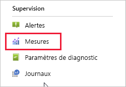
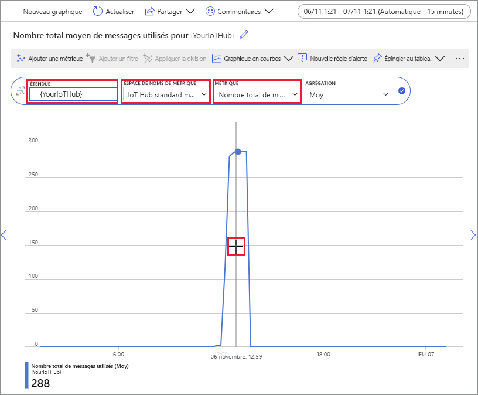

# <a name="quickstart-send-telemetry-from-a-device-to-an-iot-hub-and-monitor-it-with-the-azure-cli"></a>Démarrage rapide : Envoyer des données de télémétrie d’un appareil à un hub IoT et les surveiller avec Azure CLI

[!INCLUDE [iot-hub-quickstarts-1-selector](../../includes/iot-hub-quickstarts-1-selector.md)]

IoT Hub est un service Azure qui vous permet de traiter de gros volumes de données de télémétrie envoyées par vos appareils IoT dans le cloud à des fins de stockage ou de traitement. Dans ce guide de démarrage rapide, vous utilisez Azure CLI pour créer un hub IoT et un appareil simulé, envoyer les données de télémétrie de l’appareil au hub et envoyer un message cloud-à-appareil. Vous utilisez également le portail Azure pour visualiser les métriques des appareils. Il s’agit d’un flux de travail de base pour les développeurs qui utilisent l’interface CLI pour interagir avec une application IoT Hub.

## <a name="prerequisites"></a>Prérequis
- Si vous n’avez pas d’abonnement Azure, [créez-en un gratuitement](https://azure.microsoft.com/free/?WT.mc_id=A261C142F) avant de commencer.
- Azure CLI. Vous pouvez exécuter toutes les commandes dans ce démarrage rapide à l’aide de Azure Cloud Shell, un interpréteur de commandes CLI interactif qui s’exécute dans votre navigateur. Si vous utilisez Cloud Shell, vous n’avez rien à installer. Si vous préférez installer et utiliser l’interface de ligne de commande en local, ce démarrage rapide nécessite au minimum Azure CLI version 2.0.76. Pour déterminer la version, exécutez la commande az--version. Pour installer ou mettre à niveau Azure CLI, consultez [Installer Azure CLI]( /cli/azure/install-azure-cli).

## <a name="sign-in-to-the-azure-portal"></a>Connectez-vous au portail Azure.
Connectez-vous au portail Azure sur https://portal.azure.com.

Que vous exécutiez ou non l’interface CLI localement ou dans Cloud Shell, laissez le portail ouvert dans votre navigateur.  Vous l’utiliserez plus loin dans ce démarrage rapide.

## <a name="launch-the-cloud-shell"></a>Lancer Cloud Shell
Dans cette section, vous lancez une instance de Azure Cloud Shell. Si vous utilisez l’interface CLI localement, passez à la section [Préparer deux sessions CLI](#prepare-two-cli-sessions).

Pour lancer Cloud Shell :

1. Sélectionnez le bouton **Cloud Shell** dans la barre de menus en haut à droite du portail Azure. 

    

    > [!NOTE]
    > S’il s’agit de la première fois que vous utilisez Cloud Shell, vous êtes invité à créer un stockage, requis pour utiliser Cloud Shell.  Sélectionnez un abonnement pour créer un compte de stockage et un partage Microsoft Azure Files. 

2. Sélectionnez votre environnement CLI préféré dans la liste déroulante **Sélectionner l’environnement**. Ce démarrage rapide utilise l’environnement **Bash**. Toutes les commandes CLI suivantes fonctionnent également dans l’environnement PowerShell. 

    

## <a name="prepare-two-cli-sessions"></a>Préparer deux sessions CLI

Dans cette section, vous préparez deux sessions Azure CLI. Si vous utilisez Cloud Shell, vous exécuterez les deux sessions dans des onglets de navigateur distincts. Si vous utilisez un client CLI local, vous exécuterez deux instances CLI distinctes. Vous utiliserez la première session comme appareil simulé et la deuxième session pour surveiller et envoyer des messages. Pour exécuter une commande, sélectionnez **Copier** pour copier un bloc de code dans ce démarrage rapide, collez-le dans votre session d’interpréteur de commandes, puis exécutez-le.

Azure CLI nécessite que vous soyez connecté à votre compte Azure. Toutes les communications entre votre session d’interpréteur de commandes Azure CLI et votre hub IoT sont authentifiées et chiffrées. Par conséquent, ce démarrage rapide n’a pas besoin d’une authentification supplémentaire que vous utiliseriez avec un appareil réel, comme une chaîne de connexion.

*  Exécutez la commande [az extension add](https://docs.microsoft.com/cli/azure/extension?view=azure-cli-latest#az-extension-add) afin d’ajouter l’extension Microsoft Azure IoT pour Azure CLI à votre interpréteur de commandes CLI. L’extension IoT ajoute des commandes IoT Hub, IoT Edge et IoT Device Provisioning Service (DPS) à Azure CLI.

   ```azurecli
   az extension add --name azure-iot
   ```
   
   Après l’installation de l’extension Azure IOT, vous n’avez pas besoin de l’installer à nouveau dans une session Cloud Shell. 

   [!INCLUDE [iot-hub-cli-version-info](../../includes/iot-hub-cli-version-info.md)]

*  Ouvrez une deuxième session CLI.  Si vous utilisez Cloud Shell, sélectionnez **Ouvrir une nouvelle session**. Si vous utilisez l’interface CLI localement, ouvrez une deuxième instance. 

    >[!div class="mx-imgBorder"]
    >

## <a name="create-an-iot-hub"></a>Création d’un IoT Hub
Dans cette section, vous utilisez Azure CLI pour créer un groupe de ressources et un hub IoT.  Un groupe de ressources Azure est un conteneur logique dans lequel les ressources Azure sont déployées et gérées. IoT Hub agit en tant que hub de messages central pour la communication bidirectionnelle entre votre application IoT et les appareils. 

> [!TIP]
> Si vous le souhaitez, vous pouvez créer un groupe de ressources Azure, un hub IoT et d’autres ressources à l’aide du [portail Azure](iot-hub-create-through-portal.md), de [Visual Studio Code](iot-hub-create-use-iot-toolkit.md) ou d’autres méthodes de programmation.  

1. Exécutez la commande [az group create](https://docs.microsoft.com/cli/azure/group?view=azure-cli-latest#az-group-create) pour créer un groupe de ressources. La commande suivante crée un groupe de ressources nommé *MyResourceGroup* à l’emplacement *eastus* : 

    ```azurecli
    az group create --name MyResourceGroup --location eastus
    ```

1. Exécutez la commande [az iot hub create](https://docs.microsoft.com/cli/azure/iot/hub?view=azure-cli-latest#az-iot-hub-create) pour créer un hub IoT. La création de votre hub IoT peut prendre plusieurs minutes. 

    *YourIotHubName*. Remplacez l’espace réservé ci-dessous par le nom que vous avez choisi pour votre hub IoT. Le nom du hub IoT doit être globalement unique dans Azure. Cet espace réservé est utilisé dans le reste de ce démarrage rapide pour représenter le nom de votre hub IoT.

    ```azurecli
    az iot hub create --resource-group MyResourceGroup --name {YourIoTHubName}
    ```

## <a name="create-and-monitor-a-device"></a>Créer et surveiller un appareil
Dans cette section, vous créez un appareil simulé dans la première session CLI. L’appareil simulé envoie les données de télémétrie de l’appareil à votre hub IoT. Dans la deuxième session CLI, vous surveillez les événements et la télémétrie, puis vous envoyez un message cloud-à-appareil à l’appareil simulé.

Créer et démarrer un appareil simulé :
1. Exécutez la commande [az iot hub device-identity create](https://docs.microsoft.com/cli/azure/ext/azure-cli-iot-ext/iot/hub/device-identity?view=azure-cli-latest#ext-azure-cli-iot-ext-az-iot-hub-device-identity-create) dans la première session CLI. Cela crée l’identité de l’appareil simulé. 

    *YourIotHubName*. Remplacez l’espace réservé ci-dessous par le nom que vous avez choisi pour votre hub IoT. 

    *simDevice*. Vous pouvez utiliser ce nom directement pour l’appareil simulé dans le reste de ce démarrage rapide. Vous pouvez aussi utiliser un autre nom. 

    ```azurecli
    az iot hub device-identity create --device-id simDevice --hub-name {YourIoTHubName} 
    ```

1. Exécutez la commande [az iot hub device simulate](https://docs.microsoft.com/cli/azure/ext/azure-cli-iot-ext/iot/device?view=azure-cli-latest#ext-azure-cli-iot-ext-az-iot-device-simulate) dans la première session CLI.  Cela démarre l’appareil simulé. L’appareil envoie des données de télémétrie à votre hub IoT et reçoit des messages de ce dernier.  

    *YourIotHubName*. Remplacez l’espace réservé ci-dessous par le nom que vous avez choisi pour votre hub IoT. 

    ```azurecli
    az iot device simulate -d simDevice -n {YourIoTHubName}
    ```

Pour surveiller un appareil :
1. Dans la deuxième session CLI, exécutez la commande [az iot hub monitor-events](https://docs.microsoft.com/cli/azure/ext/azure-cli-iot-ext/iot/hub?view=azure-cli-latest#ext-azure-cli-iot-ext-az-iot-hub-monitor-events). Cela démarre la surveillance de l’appareil simulé. Le résultat affiche les données de télémétrie que l’appareil simulé envoie à l’hub IoT.

    *YourIotHubName*. Remplacez l’espace réservé ci-dessous par le nom que vous avez choisi pour votre hub IoT. 

    ```azurecli
    az iot hub monitor-events --output table --hub-name {YourIoTHubName}
    ```

    

1. Après avoir surveillé l’appareil simulé dans la deuxième session CLI, appuyez sur Ctrl + C pour arrêter la surveillance. 

## <a name="use-the-cli-to-send-a-message"></a>Utiliser l’interface CLI pour envoyer un message
Dans cette section, vous utilisez la deuxième session CLI pour envoyer un message à l’appareil simulé.

1. Dans la première session CLI, vérifiez que l’appareil simulé est en cours d’exécution. Si l’appareil s’est arrêté, exécutez la commande suivante pour le démarrer :

    *YourIotHubName*. Remplacez l’espace réservé ci-dessous par le nom que vous avez choisi pour votre hub IoT. 

    ```azurecli
    az iot device simulate -d simDevice -n {YourIoTHubName}
    ```

1. Dans la deuxième session CLI, exécutez la commande [az iot device c2d-message send](https://docs.microsoft.com/cli/azure/ext/azure-cli-iot-ext/iot/device/c2d-message?view=azure-cli-latest#ext-azure-cli-iot-ext-az-iot-device-c2d-message-send). Cela envoie un message cloud-à-appareil à partir de votre hub IoT vers l’appareil simulé. Le message comprend une chaîne et deux paires clé-valeur.  

    *YourIotHubName*. Remplacez l’espace réservé ci-dessous par le nom que vous avez choisi pour votre hub IoT. 

    ```azurecli
    az iot device c2d-message send -d simDevice --data "Hello World" --props "key0=value0;key1=value1" -n {YourIoTHubName}
    ```
    Si vous le souhaitez, vous pouvez envoyer des messages cloud-à-appareil à l’aide du portail Azure. Pour ce faire, accédez à la page vue d’ensemble de votre hub IoT, sélectionnez **Appareils IoT**, sélectionnez l’appareil simulé, puis sélectionnez **Message à l’appareil**. 

1. Dans la première session CLI, vérifiez que l’appareil simulé a reçu le message. 

    

1. Après avoir affiché le message, fermez la deuxième session CLI. Gardez la première session CLI ouverte. Vous l’utilisez pour nettoyer les ressources dans une étape ultérieure.

## <a name="view-messaging-metrics-in-the-portal"></a>Afficher les métriques de messagerie dans le portail
Le portail Azure vous permet de gérer tous les aspects de votre hub IoT et de vos appareils. Dans une application IoT Hub classique qui ingère les données de télémétrie à partir d’appareils, vous pouvez surveiller les appareils ou afficher des métriques sur la télémétrie des appareils. 

Pour visualiser les métriques de messagerie dans e portail Azure :
1. Dans le menu gauche du portail, sélectionnez **Toutes les ressources**. Cette liste répertorie toutes les ressources de votre abonnement, y compris l’hub IoT que vous avez créé. 

1. Sélectionnez le lien sur l’hub IoT que vous avez créé. Le portail affiche la page de vue d’ensemble du hub.

1. Sélectionnez **Métriques** dans le volet gauche de votre hub IoT. 

    

1. Entrer le nom de votre hub IoT dans **Étendue**.

2. Sélectionnez *Métriques standard IoT Hub* dans **Espace de noms de la métrique**.

3. Sous *Métrique*, sélectionnez **Nombre total de messages utilisés**. 

4. Placez le pointeur de la souris sur la zone de la chronologie dans laquelle votre appareil a envoyé des messages. Le nombre total de messages à un point dans le temps s’affiche dans l’angle inférieur gauche de la chronologie.

    

5. Si vous le souhaitez, utilisez la liste déroulante **Métrique** pour afficher d’autres métriques sur votre appareil simulé. Par exemple, les *remises de messages C2d terminées* ou le *nombre total d’appareils (préversion)* . 

## <a name="clean-up-resources"></a>Nettoyer les ressources
Si vous n’avez plus besoin des ressources Azure créées dans ce démarrage rapide, vous pouvez utiliser Azure CLI pour les supprimer.

Si vous envisagez de passer à l’article recommandé suivant, vous pouvez conserver et réutiliser les ressources déjà créées. 

> [!IMPORTANT]
> La suppression d’un groupe de ressources est irréversible. Le groupe de ressources et toutes les ressources qu’il contient sont supprimés définitivement. Veillez à ne pas supprimer accidentellement des ressources ou un groupe de ressources incorrects. 

Pour supprimer un groupe de ressources par nom :
1. Exécutez la commande [az group delete](https://docs.microsoft.com/cli/azure/group?view=azure-cli-latest#az-group-delete). Cela supprime le groupe de ressources, le hub IoT et l’inscription de l’appareil que vous avez créée.

    ```azurecli
    az group delete --name MyResourceGroup
    ```
1. Exécutez la commande [az group list](https://docs.microsoft.com/cli/azure/group?view=azure-cli-latest#az-group-list) pour confirmer la suppression du groupe de ressources.  

    ```azurecli
    az group list
    ```

## <a name="next-steps"></a>Étapes suivantes
Dans ce démarrage rapide, vous utilisez Azure CLI pour créer un hub IoT, créer un appareil simulé, envoyer les données de télémétrie, surveiller la télémétrie, envoyer un message cloud-à-appareil et nettoyer les ressources. Vous avez utilisé le portail Azure pour visualiser les métriques de messagerie sur votre appareil.

Si vous êtes un développeur d’appareils, l’étape suivante suggérée est de consulter le guide de démarrage rapide de télémétrie qui utilise le kit de développement logiciel Azure IoT Device SDK for C. Si vous le souhaitez, consultez l’un des articles de démarrage rapide de télémétrie Azure IoT Hub disponibles dans votre langue ou votre kit de développement logiciel (SDK).

> [!div class="nextstepaction"]
> [Démarrage rapide : Envoyer des données de télémétrie d’un appareil à un IoT Hub (C)](quickstart-send-telemetry-c.md)
