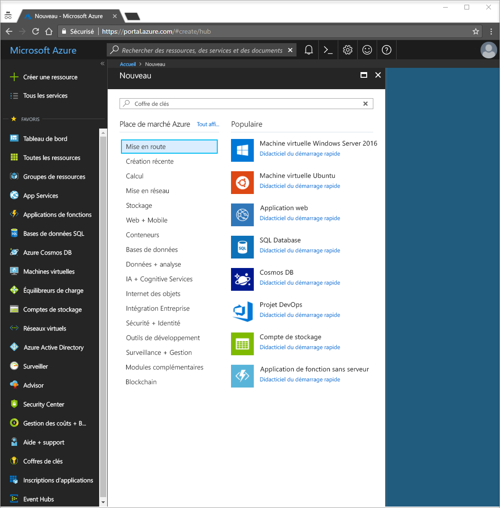
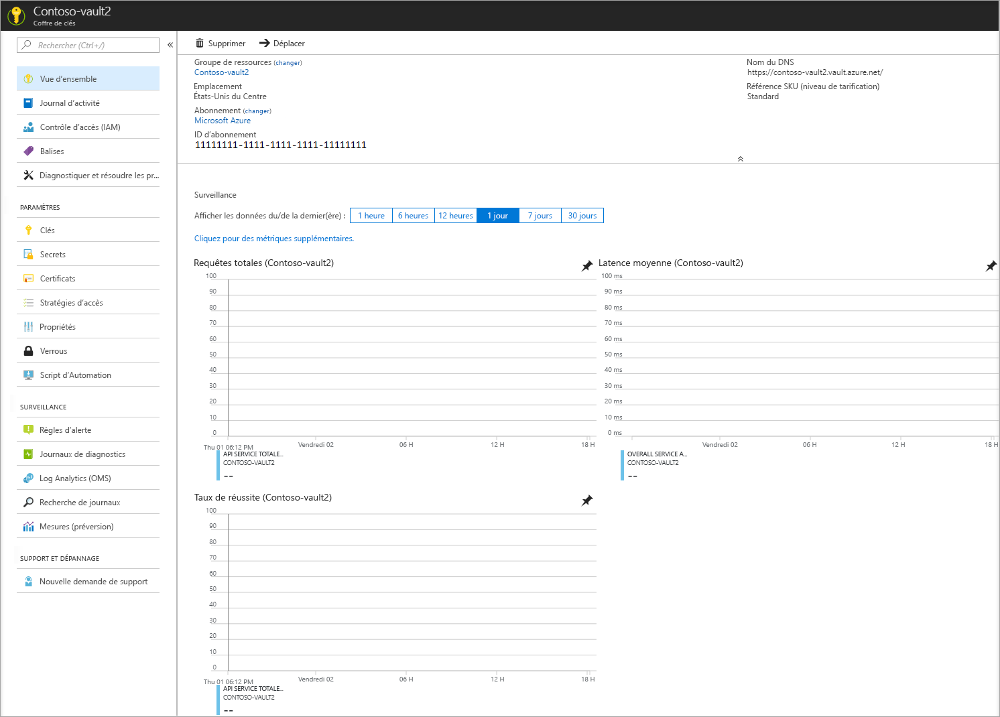

# Démarrage rapide : définir et récupérer un secret depuis Azure Key Vault à l’aide du portail Azure

Azure Key Vault est un service cloud qui fonctionne comme un magasin des secrets sécurisé. Vous pouvez stocker des clés, des mots de passe, des certificats et d’autres secrets en toute sécurité. Pour plus d’informations sur Key Vault, consultez la [présentation](key-vault-overview.md). Vous pouvez créer et gérer des coffres de clés Azure grâce au portail Azure. Dans ce démarrage rapide, vous allez créer un coffre de clés. Ensuite, vous y stockerez un secret.

Si vous n’avez pas d’abonnement Azure, créez un [compte gratuit](https://azure.microsoft.com/free/?WT.mc_id=A261C142F) avant de commencer.

## Se connecter à Azure

Connectez-vous au portail Azure sur http://portal.azure.com.

## Création d'un coffre

1. Sélectionnez l’option **Créer une ressource** dans le coin supérieur gauche du portail Azure.

    
2. Dans la zone de recherche, entrez **Key Vault**.
3. Dans la liste des résultats, choisissez **Key Vault**.
4. Dans la section Key Vault, choisissez **Créer**.
5. Dans la section **Créer un coffre de clés**, renseignez les informations suivantes :
    - **Nom** : pour ce démarrage rapide, nous utilisons **Contoso-vault2**. Vous devez fournir un nom unique dans votre test.
    - **Abonnement** : choisissez l’abonnement que vous allez utiliser pour ce démarrage rapide.
    - Sous **Groupe de ressources**, choisissez **Créer** et entrez le nom du groupe de ressources.
    - Dans le menu déroulant **Emplacement**, choisissez un emplacement.
    - Cochez la case **Épingler au tableau de bord**.
    - Conservez les valeurs par défaut des autres options.
6. Après avoir renseigné les informations ci-dessus, sélectionnez **Créer**.

Notez les deux propriétés ci-dessous :

* **Nom du coffre** : dans l’exemple, il s’agit de **Contoso-Vault2**. Vous allez utiliser ce nom pour les autres étapes.
* **URI du coffre** : dans l’exemple, il s’agit de https://contoso-vault2.vault.azure.net/. Les applications qui utilisent votre coffre via son API REST doivent utiliser cet URI.

À ce stade, votre compte Azure est le seul autorisé à effectuer des opérations sur ce nouveau coffre.

## Ajouter un secret dans Key Vault

Pour ajouter un secret dans le coffre, vous devez effectuer deux autres étapes. Dans ce cas, nous ajoutons un mot de passe qu’une application est susceptible d’utiliser. Le mot de passe est appelé **ExamplePassword** et nous y stockons la valeur **Pa$$w0rd**.

1. Dans la page des propriétés du coffre de clés, sélectionnez **Secrets**.
2. Cliquez sur **Generate/Import (Générer/Importer)**.
3. Dans l’écran **Create a secret (Créer un secret)**, choisissez les options suivantes :
    - **Options de chargement** : Manuel.
    - **Nom** : ExamplePassword.
    - **Valeur** : Pa$$w0rd.
    - Conservez les valeurs par défaut des autres options. Cliquez sur **Créer**.

Lorsque vous recevez le message confirmant la création du secret, cliquez dessus dans la liste. Certaines propriétés s’affichent. Si vous cliquez sur la version actuelle, vous voyez la valeur que vous avez spécifiée à l’étape précédente.

## Supprimer les ressources

D’autres démarrages rapides et didacticiels sur les coffres de clés reposent sur ce démarrage rapide. Si vous prévoyez d’utiliser d’autres démarrages rapides et didacticiels, il peut être utile de conserver ces ressources.
Si vous n’en avez plus besoin, supprimez le groupe de ressources. Ce faisant, vous supprimez le coffre de clés et les ressources associées. Pour supprimer le groupe de ressources à l’aide du portail :

1. Entrez le nom de votre groupe de ressources dans la zone Recherche en haut du portail. Lorsque vous voyez le groupe de ressources utilisé dans ce Démarrage rapide dans les résultats de recherche, sélectionnez-le.
2. Sélectionnez **Supprimer le groupe de ressources**.
3. Dans le champ **TYPE THE RESOURCE GROUP NAME: (TAPER LE NOM DU GROUPE DE RESSOURCES :)**, tapez le nom du groupe de ressources et sélectionnez **Supprimer**.

## Étapes suivantes

Dans ce démarrage rapide, vous avez créé un coffre de clés et y avez stocké un secret. Pour en savoir plus sur Key Vault et sur son utilisation avec vos applications, passez au didacticiel sur les applications web qui utilisent Key Vault.

> [!div class="nextstepaction"]
> Pour apprendre à lire un secret dans Key Vault à partir d’une application web en utilisant des identités de service managé, passez au tutoriel suivant, [Configurer une application web Azure de façon à lire un secret dans Key Vault](tutorial-web-application-keyvault.md).
