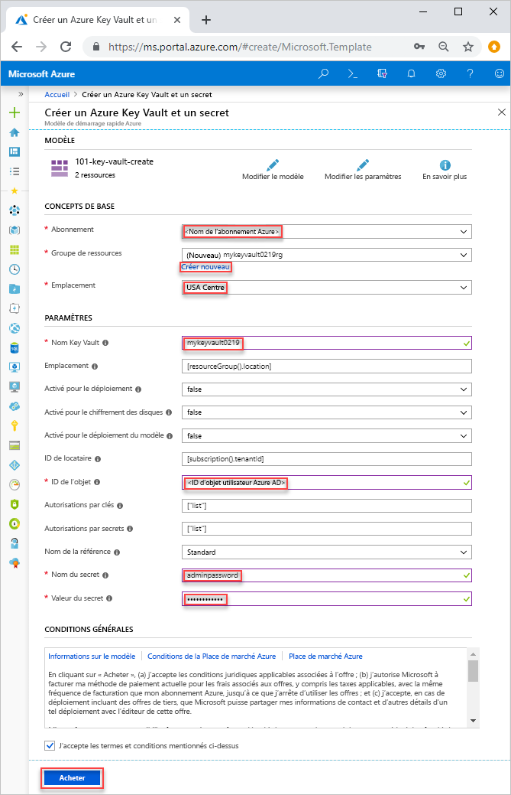
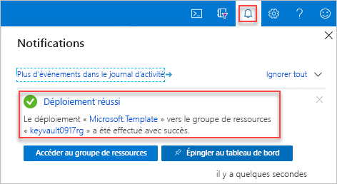

# <a name="quickstart-set-and-retrieve-a-secret-from-azure-key-vault-using-resource-manager-template"></a>Démarrage rapide : Définir et récupérer un secret à partir d’Azure Key Vault à l’aide d’un modèle Resource Manager

[Azure Key Vault](../general/overview.md) est un service cloud qui propose un magasin sécurisé pour les secrets, comme les clés, les mots de passe, les certificats et autres secrets. Ce guide de démarrage rapide porte essentiellement sur le déploiement d’un modèle Resource Manager en vue de créer un coffre de clés et un secret.

[!INCLUDE [About Azure Resource Manager](../../../includes/resource-manager-quickstart-introduction.md)]

Si vous n’avez pas d’abonnement Azure, créez un [compte gratuit](https://azure.microsoft.com/free/?WT.mc_id=A261C142F) avant de commencer.

## <a name="prerequisites"></a>Prérequis

Pour effectuer ce qui est décrit dans cet article, vous avez besoin des éléments suivants :

* Le modèle requiert votre ID objet utilisateur Azure AD pour la configuration des autorisations. La procédure suivante permet d’obtenir l’ID de l’objet (GUID).

    1. Exécutez la commande Azure PowerShell ou Azure CLI ci-dessous en sélectionnant **Essayer**, puis collez le script dans le volet de l’interpréteur de commandes. Pour coller le script, cliquez avec le bouton droit dans l’interpréteur de commandes, puis sélectionnez **Coller**.

        # <a name="cli"></a>[INTERFACE DE LIGNE DE COMMANDE](#tab/CLI)
        ```azurecli-interactive
        echo "Enter your email address that is used to sign in to Azure:" &&
        read upn &&
        az ad user show --id $upn --query "objectId" &&
        echo "Press [ENTER] to continue ..."
        ```

        # <a name="powershell"></a>[PowerShell](#tab/PowerShell)
        ```azurepowershell-interactive
        $upn = Read-Host -Prompt "Enter your email address used to sign in to Azure"
        (Get-AzADUser -UserPrincipalName $upn).Id
        Write-Host "Press [ENTER] to continue..."
        ```

        ---

    2. Notez l’ID de l’objet. Vous en aurez besoin dans la prochaine section de ce guide de démarrage rapide.

## <a name="create-a-vault-and-a-secret"></a>Créer un coffre et un secret

### <a name="review-the-template"></a>Vérifier le modèle

Le modèle utilisé dans ce guide de démarrage rapide est tiré des [modèles de démarrage rapide Azure](https://azure.microsoft.com/resources/templates/101-key-vault-create/).

:::code language="json" source="~/quickstart-templates/101-key-vault-create/azuredeploy.json" range="1-150" highlight="107-148":::

Deux ressources Azure sont définies dans le modèle :

* [**Microsoft.KeyVault/vaults**](/azure/templates/microsoft.keyvault/vaults) : permet de créer un coffre de clés Azure.
* [**Microsoft.KeyVault/vaults/secrets**](/azure/templates/microsoft.keyvault/vaults/secrets) :permet de créer un secret de coffre de clés.

Vous pouvez trouver d’autres exemples de modèles Azure Key Vault [ici](https://azure.microsoft.com/resources/templates/?resourceType=Microsoft.Keyvault).

### <a name="deploy-the-template"></a>Déployer le modèle

1. Cliquez sur l’image ci-après pour vous connecter à Azure et ouvrir un modèle. Le modèle crée un coffre de clés et un secret.

    [](https://portal.azure.com/#create/Microsoft.Template/uri/https%3A%2F%2Fraw.githubusercontent.com%2FAzure%2Fazure-quickstart-templates%2Fmaster%2F101-key-vault-create%2Fazuredeploy.json)

2. Sélectionnez ou entrez les valeurs suivantes.

    

    Sauf si elle est spécifiée, utilisez la valeur par défaut pour créer le coffre de clés et un secret.

    * **Abonnement** : sélectionnez un abonnement Azure.
    * **Groupe de ressources** : sélectionnez **Créer**, entrez un nom unique pour le groupe de ressources, puis cliquez sur **OK**.
    * **Emplacement** : sélectionnez un emplacement.  Par exemple, **USA Centre**.
    * **Nom du coffre de clé** : entrez un nom pour le coffre de clés, qui doit être globalement unique dans l’espace de noms vault.azure.net. Vous avez besoin du nom dans la section suivante quand vous validez le déploiement.
    * **ID de locataire** : la fonction de modèle récupère automatiquement votre ID de locataire.  Ne modifiez pas la valeur par défaut.
    * **ID d’utilisateur Azure Active Directory** : entrez votre ID d’objet utilisateur Azure AD que vous avez récupéré dans [Prérequis](#prerequisites).
    * **Nom du secret** : entrez le nom du secret que vous stocké dans le coffre de clés.  Par exemple, **adminpassword**.
    * **Valeur du secret** : entrez la valeur du secret.  Si vous stockez un mot de passe, il est recommandé d’utiliser le mot de passe généré que vous avez créé dans Prérequis.
    * **J’accepte les termes et conditions mentionnés ci-dessus** : cochez la case.
3. Sélectionnez **Achat**. Une fois que le coffre de clés a été déployé avec succès, vous recevez une notification :

    

Le portail Azure est utilisé pour déployer le modèle. Outre le portail Azure, vous pouvez également utiliser Azure PowerShell, l’interface Azure CLI et l’API REST. Pour découvrir d’autres méthodes de déploiement, consultez [Déployer des modèles](../../azure-resource-manager/templates/deploy-powershell.md).

## <a name="review-deployed-resources"></a>Vérifier les ressources déployées

Vous pouvez soit utiliser le portail Azure pour vérifier le coffre de clés et le secret, soit utiliser le script Azure CLI ou Azure PowerShell ci-dessous pour lister le secret créé.

# <a name="cli"></a>[INTERFACE DE LIGNE DE COMMANDE](#tab/CLI)

```azurecli-interactive
echo "Enter your key vault name:" &&
read keyVaultName &&
az keyvault secret list --vault-name $keyVaultName &&
echo "Press [ENTER] to continue ..."
```

# <a name="powershell"></a>[PowerShell](#tab/PowerShell)

```azurepowershell-interactive
$keyVaultName = Read-Host -Prompt "Enter your key vault name"
Get-AzKeyVaultSecret -vaultName $keyVaultName
Write-Host "Press [ENTER] to continue..."
```

---

Le résultat est similaire à ceci :

# <a name="cli"></a>[INTERFACE DE LIGNE DE COMMANDE](#tab/CLI)


# <a name="powershell"></a>[PowerShell](#tab/PowerShell)


---
## <a name="clean-up-resources"></a>Nettoyer les ressources

D’autres démarrages rapides et didacticiels sur les coffres de clés reposent sur ce démarrage rapide. Si vous prévoyez d’utiliser d’autres démarrages rapides et didacticiels, il peut être utile de conserver ces ressources.
Si vous n’en avez plus besoin, supprimez le groupe de ressources. Ce faisant, vous supprimez le coffre de clés et les ressources associées. Pour supprimer le groupe de ressources avec Azure CLI ou Azure PowerShell :

# <a name="cli"></a>[INTERFACE DE LIGNE DE COMMANDE](#tab/CLI)

```azurecli-interactive
echo "Enter the Resource Group name:" &&
read resourceGroupName &&
az group delete --name $resourceGroupName &&
echo "Press [ENTER] to continue ..."
```

# <a name="powershell"></a>[PowerShell](#tab/PowerShell)

```azurepowershell-interactive
$resourceGroupName = Read-Host -Prompt "Enter the Resource Group name"
Remove-AzResourceGroup -Name $resourceGroupName
Write-Host "Press [ENTER] to continue..."
```

---

## <a name="next-steps"></a>Étapes suivantes

Dans ce guide de démarrage rapide, vous avez créé un coffre de clés et un secret en utilisant un modèle Azure Resource Manager, puis vous avez validé le déploiement. Pour en savoir plus sur Key Vault et Azure Resource Manager, consultez les articles ci-dessous.

- Lire la [vue d’ensemble Azure Key Vault](../general/overview.md)
- En savoir plus sur [Azure Resource Manager](../../azure-resource-manager/management/overview.md)
- Passer en revue les [bonnes pratiques relatives à Azure Key Vault](../general/best-practices.md)
