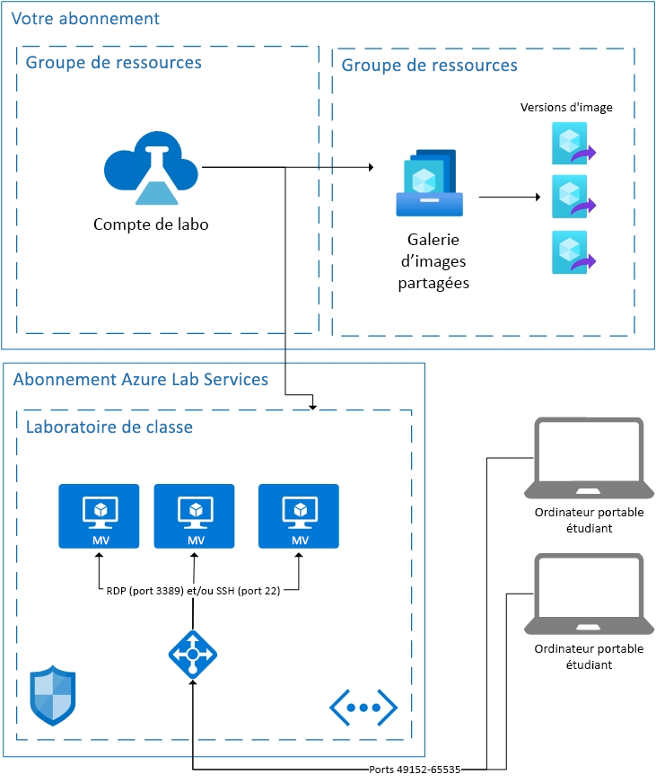

# Notions de base de l’architecture dans Azure Lab Services

Azure Lab Services est une solution SaaS (logiciel en tant que service), ce qui signifie que les ressources nécessaires aux services Lab sont gérées pour vous. Cet article aborde les ressources fondamentales utilisées par les services Lab et l’architecture de base d’un lab.  

Azure Lab Services fournit deux zones qui vous permettent d’utiliser vos propres ressources conjointement avec les services Lab.  Pour plus d’informations sur l’utilisation de machines virtuelles sur votre propre réseau, consultez [peering de réseau virtuel](how-to-connect-peer-virtual-network.md).  Pour réutiliser des images à partir d’une galerie d’images partagées, consultez [attacher une galerie d’images partagées](how-to-attach-detach-shared-image-gallery.md).

Vous trouverez ci-dessous l’architecture de base d’un laboratoire de classe.  Le compte Lab est hébergé dans votre abonnement. Les machines virtuelles des étudiants, ainsi que les ressources nécessaires pour prendre en charge les machines virtuelles, sont hébergées dans un abonnement détenu par les services Lab. Voyons plus en détail ce qui se passe dans les abonnements du service Lab.

## Ressources hébergées

Les ressources nécessaires à l’exécution d’un laboratoire de salle de classe sont hébergées dans un des abonnements Azure gérés par Microsoft.  Les ressources incluent une machine virtuelle modèle pour l’instructeur, une machine virtuelle pour chaque étudiant et des éléments liés au réseau, comme un équilibreur de charge, un réseau virtuel et un groupe de sécurité réseau.  Ces abonnements sont surveillés pour détecter toute activité suspecte.  Il est important de noter que cette analyse est effectuée hors des machines virtuelles par le biais de l’extension de machine virtuelle ou de l’analyse du modèle de réseau.  Si [arrêt lors de la déconnexion](how-to-enable-shutdown-disconnect.md) est activé, une extension de diagnostic est activée sur la machine virtuelle. L’extension permet aux services Lab d’être informés de l’événement de déconnexion de session RDP.

## Réseau virtuel

Chaque laboratoire est isolé par son propre réseau virtuel.  Si le laboratoire possède un [réseau virtuel avec peering](how-to-connect-peer-virtual-network.md), chaque laboratoire est isolé par son propre sous-réseau.  Les élèves se connectent à leur machine virtuelle via un équilibreur de charge.  Aucune machine virtuelle d’étudiant n’a d’adresse IP publique ; elles n’ont qu’une adresse IP privée.  La chaîne de connexion de l’étudiant sera l’adresse IP publique de l’équilibreur de charge et un port aléatoire compris entre 49152 et 65535.  Les règles de trafic entrant sur l’équilibreur de charge transfèrent la connexion, selon le système d’exploitation, vers le port 22 (SSH) ou le port 3389 (RDP) de la machine virtuelle appropriée. Un groupe de sécurité réseau empêche le trafic externe sur tous les autres ports.

## Contrôle d’accès aux machines virtuelles

Les services Lab gèrent la possibilité pour les étudiants d’effectuer des actions telles que Démarrer et Arrêter sur leurs machines virtuelles.  Ils contrôlent également l’accès aux informations de connexion de la machine virtuelle.

Les services Lab gèrent aussi l’inscription des élèves au service. Il existe actuellement deux paramètres d’accès différents : restreint et non restreint. Pour plus d’informations, consultez l’article [Gérer les utilisateurs Lab](how-to-configure-student-usage.md#send-invitations-to-users). L’accès restreint signifie que les services Lab vérifient que les étudiants sont ajoutés en tant qu’utilisateur avant d’autoriser l’accès. Non restreint signifie que tout utilisateur peut s’inscrire tant qu’il dispose du lien d’inscription et qu’il y a de la capacité dans le laboratoire. Non restreint peut être utile pour les événements de type hackathon.

Les machines virtuelles des étudiants hébergées dans le laboratoire de salle de classe ont un nom d’utilisateur et un mot de passe définis par le créateur du laboratoire.  Le créateur du laboratoire peut également permettre aux élèves inscrits de choisir leur propre mot de passe lors de la première connexion.  

## Étapes suivantes

Pour en savoir plus sur les fonctionnalités disponibles dans les services Lab, consultez [Concepts d’Azure Lab Services](classroom-labs-concepts.md) et [Vue d’ensemble d’Azure Lab Services](classroom-labs-overview.md).
