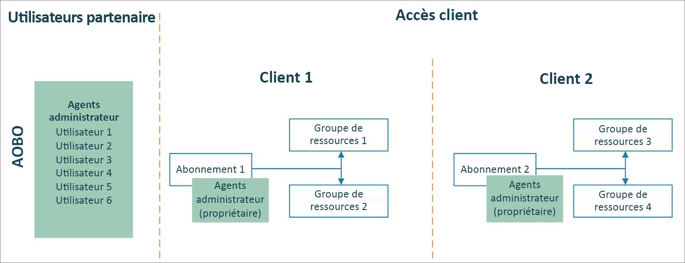
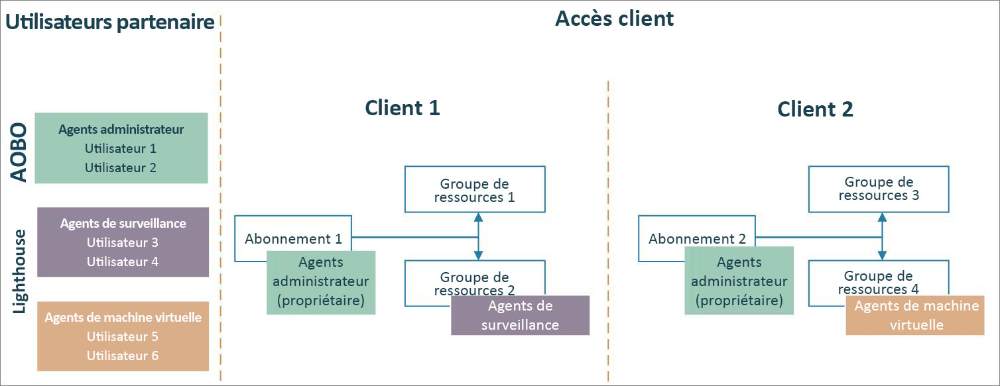

# Azure Lighthouse et le programme Fournisseur de solutions cloud

Si vous êtes un partenaire [Fournisseur de solutions cloud (CSP)](https://docs.microsoft.com/partner-center/csp-overview), vous pouvez déjà accéder aux abonnements Azure créés pour vos clients par le biais du programme Fournisseur de solutions cloud en utilisant la fonctionnalité [Administrer au nom de](https://channel9.msdn.com/Series/cspdev/Module-11-Admin-On-Behalf-Of-AOBO). Cet accès vous permet de prendre en charge, de configurer et de gérer directement les abonnements de vos clients.

Avec Azure Lighthouse, vous pouvez utiliser la gestion des ressources déléguées Azure avec la fonctionnalité Administrer au nom de. Cela contribue à améliorer la sécurité et réduit l’accès inutile en autorisant des autorisations plus granulaires pour vos utilisateurs. Cela permet également une plus grande efficacité et une plus grande scalabilité, car vos utilisateurs peuvent travailler sur plusieurs abonnements client à l’aide d’une seule connexion dans votre locataire.

## Administrer au nom de

Avec le mécanisme Administrer au nom de, tout utilisateur auquel le rôle [Agent d’administration](https://docs.microsoft.com/partner-center/permissions-overview#manage-commercial-transactions-in-partner-center-azure-ad-and-csp-roles) est attribué dans votre locataire dispose d’un accès Administrer au nom de aux abonnements Azure que vous créez via le programme Fournisseur de solutions cloud. Tous les utilisateurs qui ont besoin d’accéder aux abonnements de tous les clients doivent être membres de ce groupe. Le mécanisme Administrer au nom de ne permet pas de créer des groupes distincts fonctionnant avec différents clients, ou d’activer des rôles différents à des groupes ou à des utilisateurs.

## Gestion des ressources déléguées Azure

La gestion des ressources déléguées Azure vous permet d’affecter des groupes différents à différents clients ou rôles, comme illustré dans le diagramme suivant. Étant donné que les utilisateurs disposent du niveau d’accès approprié attribué par le biais de la gestion des ressources déléguées Azure, vous pouvez réduire le nombre d’utilisateurs ayant le rôle Agent d’administration (et disposant ainsi d’un accès Administrer au nom de complet). Cela contribue à améliorer la sécurité en limitant les accès inutiles aux ressources de vos clients. Cela vous offre également une plus grande flexibilité pour gérer plusieurs clients à grande échelle.

L’intégration d’un abonnement que vous avez créé par le biais du programme Fournisseur de solutions cloud suit les étapes décrites dans [Intégrer un abonnement à la gestion des ressources déléguées Azure](../how-to/onboard-customer.md). Tout utilisateur auquel le rôle Agent d’administration est attribué dans votre locataire peut effectuer cette intégration.

## Étapes suivantes

- Découvrez les [Expériences de gestion inter-locataire](cross-tenant-management-experience.md).
- Découvrez comment [intégrer un abonnement dans la gestion des ressources déléguées Azure](../how-to/onboard-customer.md).
- Découvrez le [Programme Fournisseur de solutions cloud](https://docs.microsoft.com/partner-center/csp-overview).
