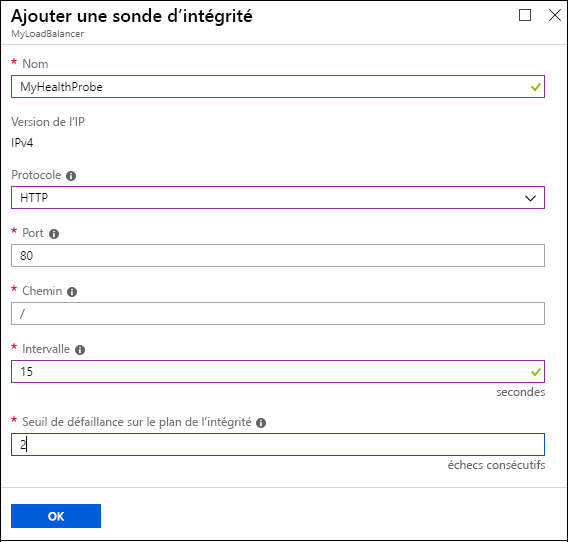
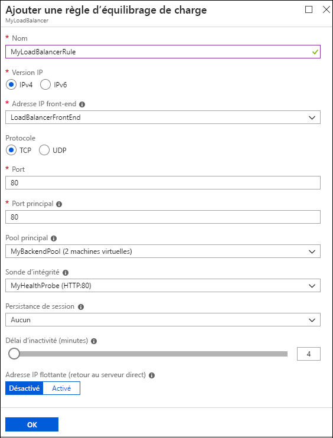

<properties
   pageTitle="Créer un équilibreur de charge accessible sur Internet dans le gestionnaire de ressources à l’aide du portail Azure | Microsoft Azure"
   description="Découvrez comment créer un équilibreur de charge accessible sur Internet dans Resource Manager à l’aide du portail Azure"
   services="load-balancer"
   documentationCenter="na"
   authors="anavinahar"
   manager="narayan"
   editor=""
   tags="azure-resource-manager"
/>
<tags
   ms.service="load-balancer"
   ms.devlang="na"
   ms.topic="article"
   ms.tgt_pltfrm="na"
   ms.workload="infrastructure-services"
   ms.date="09/14/2016"
   ms.author="annahar" />

# Création d’un équilibrage de charge accessible sur Internet à l’aide du portail Azure

[AZURE.INCLUDE [load-balancer-get-started-internet-arm-selectors-include.md](../../includes/load-balancer-get-started-internet-arm-selectors-include.md)]

[AZURE.INCLUDE [load-balancer-get-started-internet-intro-include.md](../../includes/load-balancer-get-started-internet-intro-include.md)]

[AZURE.INCLUDE [azure-arm-classic-important-include](../../includes/azure-arm-classic-important-include.md)] Cet article traite du modèle de déploiement de Resource Manager. Vous pouvez également [découvrir comment créer un équilibreur de charge accessible sur Internet à l'aide du déploiement classique](load-balancer-get-started-internet-classic-portal.md)

[AZURE.INCLUDE [load-balancer-get-started-internet-scenario-include.md](../../includes/load-balancer-get-started-internet-scenario-include.md)]

Nous allons aborder la séquence de tâches individuelles qui doivent être exécutées pour créer un équilibreur de charge et expliquer en détail ce qui est effectué pour atteindre cet objectif.

## Ce qui est nécessaire pour créer un équilibrage de charge accessible sur Internet

Vous devez créer et configurer les objets suivants pour déployer un équilibreur de charge.

- Configuration d’adresses IP frontales : contient les adresses IP publiques pour le trafic réseau entrant.

- Pool d’adresses principales : contient des interfaces réseau (NIC) pour que les machines virtuelles puissent recevoir le trafic réseau de l’équilibrage de charge.

- Règles d’équilibrage de charge : contient des règles de mappage d’un port public situé sur l’équilibrage de charge pour le pool d’adresses principales.

- Règles NAT entrantes : contient des règles de mappage d’un port public situé sur l’équilibrage de charge vers le port d’une machine virtuelle spécifique située dans le pool d’adresses principales.

- Sondes : contient les sondes d’intégrité utilisées pour vérifier la disponibilité des instances de machines virtuelles du pool d’adresses principales.

Pour obtenir plus d’informations sur les composants de l’équilibreur de charge avec Azure Resource Manager, consultez la page [Support Azure Resource Manager pour l’équilibreur de charge](load-balancer-arm.md).

## Configurer un équilibreur de charge dans le portail Azure

> [AZURE.IMPORTANT] Cet exemple suppose que vous disposez d’un réseau virtuel appelé **myVNet**. Pour effectuer cette opération, consultez [Créer un réseau virtuel](../virtual-network/virtual-networks-create-vnet-arm-pportal.md). Il suppose également que vous disposez d’un sous-réseau dans **myVNet** appelé **LB-Subnet-BE** et de deux machines virtuelles appelées **web1** et **web2** respectivement dans le même groupe à haute disponibilité appelé **myAvailSet** dans **myVNet**. Pour créer les machines virtuelles, consultez [ce lien](../virtual-machines/virtual-machines-windows-hero-tutorial.md).

1. Dans un navigateur, accédez au portail Azure : [http://portal.azure.com](http://portal.azure.com) et connectez-vous avec votre compte Azure.

2. Dans l’angle supérieur gauche de l’écran, cliquez sur **Nouveau** > **Mise en réseau** > **Équilibreur de charge.**

3. Dans le panneau **Créer un équilibreur de charge**, tapez le nom de votre équilibreur de charge. Ici, il s’appelle **myLoadBalancer**.

4. Sous **Type**, sélectionnez **Public**.

5. Sous **Adresse IP publique**, créez une nouvelle adresse IP publique appelée **myPublicIP**.

6. Sous Groupe de ressources, sélectionnez **myRG**. Sélectionnez l’**emplacement** approprié, puis cliquez sur **OK**. L’équilibreur de charge commencera ensuite le déploiement, qui prendra plusieurs minutes pour se terminer avec succès.

## Créer un pool d’adresses principal

1. Une fois votre équilibreur de charge déployé avec succès, sélectionnez-le depuis vos ressources. Sous Paramètres, sélectionnez Pools principaux. Saisissez le nom de votre pool principal. Cliquez sur le bouton **Ajouter** en haut du panneau qui s’affiche.

2. Cliquez sur **Ajouter une machine virtuelle** dans le panneau **Ajouter un pool principal**. Sélectionnez **Choisir un groupe à haute disponibilité** sous **Groupe à haute disponibilité**, puis choisissez **myAvailSet**. Sélectionnez **Choisir les machines virtuelles** dans la section Machines virtuelles du panneau, puis cliquez sur **web1** et **web2**, les deux machines virtuelles créées pour l’équilibrage de charge. Assurez-vous des coches bleues apparaissent à gauche de ces deux machines, comme le montre l’image ci-dessous. Cliquez ensuite sur **Sélectionner** dans ce panneau, sur OK dans le panneau **Choisir les machines virtuelles**, puis sur **OK** dans le panneau **Ajouter un pool principal**.

    

3. Vérifiez que la liste déroulante de vos notifications comporte une mise à jour concernant l’enregistrement du pool principal de l’équilibreur de charge en plus de la mise à jour de l’interface réseau pour les deux machines virtuelles **web1** et **web2**.

## Créer une sonde, une règle d’équilibrage de charge et des règles NAT

1. Créer une sonde d’intégrité.

    Dans les paramètres de votre équilibreur de charge, sélectionnez Sondes. Cliquez ensuite sur **Ajouter** en haut du panneau.

    Il existe deux façons de configurer une sonde : HTTP ou TCP. Cet exemple montre HTTP, mais TCP peut être configuré de la même manière. Mettez à jour les informations nécessaires. Comme indiqué, **myLoadBalancer** équilibrera le trafic sur le port 80. Le chemin d’accès sélectionné est HealthProbe.aspx, l’intervalle est de 15 secondes, et le seuil de défaillance est 2. Quand vous avez terminé, cliquez sur **OK** pour créer la sonde.

    Placez le pointeur sur l’icône « i » pour en savoir plus sur ces configurations individuelles et sur la façon de les modifier selon vos besoins.

    

2. Créez une règle d’équilibreur de charge.

    Cliquez sur Règles d’équilibrage de charge dans la section Paramètres de votre équilibreur de charge. Dans le nouveau panneau, cliquez sur **Ajouter**. Nommez votre règle. Ici, HTTP. Choisissez le port frontal et le port principal. Ici, 80 est choisi pour les deux. Choisissez **LB-backend** comme pool principal et l’élément précédemment créé **HealthProbe** comme sonde. D’autres configurations peuvent être définies selon vos besoins. Cliquez ensuite sur OK pour enregistrer la règle d’équilibrage de charge.

    

3. Créer des règles NAT entrantes

    Cliquez sur Règles NAT entrantes dans la section Paramètres de votre équilibreur de charge. Dans le nouveau panneau, cliquez sur **Ajouter**. Nommez ensuite votre règle NAT entrante. Ici, elle s’appelle **inboundNATrule1**. La destination doit être l’adresse IP publique précédemment créée. Sélectionnez Personnalisé sous Service, puis choisissez le protocole que vous souhaitez utiliser. Ici, TCP est sélectionné. Entrez le port 3441 puis le port cible, 3389 dans ce cas. Cliquez ensuite sur OK pour enregistrer cette règle.

    Une fois la première règle créée, répétez cette étape pour la seconde règle NAT entrante appelée inboundNATrule2, du port 3442 vers le port cible 3389.

    

## Supprimer un équilibreur de charge

Pour supprimer un équilibreur de charge, sélectionnez l’équilibreur de charge que vous souhaitez supprimer. Dans le *Équilibreur de charge*, cliquez sur **Supprimer** en fin de panneau. Puis sélectionnez **Oui** à l’invite.

## Étapes suivantes

[Prise en main de la configuration d’un équilibrage de charge interne](load-balancer-get-started-ilb-arm-cli.md)

[Configuration d'un mode de distribution d'équilibrage de charge](load-balancer-distribution-mode.md)

[Configuration des paramètres du délai d’expiration TCP inactif pour votre équilibrage de charge](load-balancer-tcp-idle-timeout.md)

<!---HONumber=AcomDC_0928_2016-->