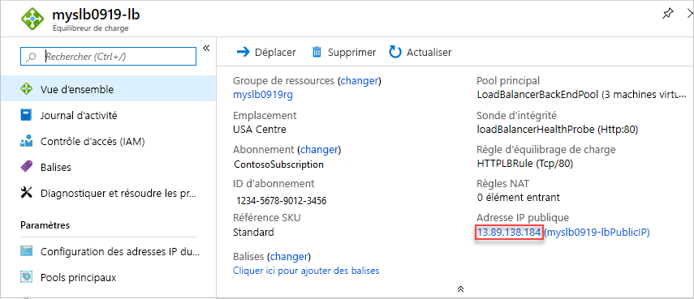

# <a name="quickstart-create-a-load-balancer-to-load-balance-vms-by-using-azure-resource-manager-template"></a>Démarrage rapide : Créer un équilibreur de charge pour équilibrer la charge des machines virtuelles avec un modèle Azure Resource Manager

L’équilibrage de charge offre un niveau plus élevé de disponibilité et d’évolutivité en répartissant les requêtes entrantes sur plusieurs machines virtuelles. Ce guide de démarrage rapide vous montre comment déployer un modèle Azure Resource Manager qui crée un équilibreur de charge standard pour équilibrer la charge des machines virtuelles. L’utilisation du modèle Resource Manager comprend moins d’étapes que les autres méthodes de déploiement.

[!INCLUDE [About Azure Resource Manager](../../includes/resource-manager-quickstart-introduction.md)]

Si vous n’avez pas d’abonnement Azure, créez un [compte gratuit](https://azure.microsoft.com/free/?WT.mc_id=A261C142F) avant de commencer.

## <a name="create-a-load-balancer"></a>Créer un équilibreur de charge

Les références SKU d’équilibreur de charge et d’adresse IP publique doivent correspondre. Lorsque vous créez un équilibreur de charge standard, vous devez également créer une adresse IP publique standard configurée en tant que front-end pour cet équilibreur de charge standard. Si vous souhaitez créer un équilibreur de charge de base, utilisez [ce modèle](https://azure.microsoft.com/resources/templates/201-2-vms-loadbalancer-natrules/). Microsoft recommande d’utiliser la référence SKU Standard pour les charges de travail de production.

### <a name="review-the-template"></a>Vérifier le modèle

Le modèle utilisé dans ce démarrage rapide est tiré des [modèles de démarrage rapide Azure](https://raw.githubusercontent.com/Azure/azure-quickstart-templates/master/101-load-balancer-standard-create/azuredeploy.json).

:::code language="json" source="~/quickstart-templates/101-load-balancer-standard-create/azuredeploy.json" range="1-150" highlight="58-122":::

Plusieurs ressources Azure ont été définies dans le modèle :

- [**Microsoft.Network/loadBalancers**](/azure/templates/microsoft.network/loadbalancers)
- [**Microsoft.Network/publicIPAddresses**](/azure/templates/microsoft.network/publicipaddresses) : pour l’équilibreur de charge et pour chacune des trois machines virtuelles.
- [**Microsoft.Network/networkSecurityGroups**](/azure/templates/microsoft.network/networksecuritygroups)
- [**Microsoft.Network/virtualNetworks**](/azure/templates/microsoft.network/virtualnetworks)
- [**Microsoft.Compute/virutalMachines**](/azure/templates/microsoft.compute/virtualmachines) (3 d’entre elles)
- [**Microsoft.Network/networkInterfaces**](/azure/templates/microsoft.network/networkinterfaces) (3 d’entre elles)
- [**Microsoft.Compute/virtualMachine/extensions**](/azure/templates/microsoft.compute/virtualmachines/extensions) (3 d’entre elles) : à utiliser pour configurer the service IIS et les pages web

Pour rechercher d’autres modèles qui sont liés à l’équilibrage de charge Azure, consultez [Modèles de démarrage rapide Azure](https://azure.microsoft.com/resources/templates/?resourceType=Microsoft.Network&pageNumber=1&sort=Popular).

### <a name="deploy-the-template"></a>Déployer le modèle

1. Sélectionnez **Essayer** à partir du bloc de code suivant pour ouvrir Azure Cloud Shell, puis suivez les instructions pour vous connecter à Azure.

   ```azurepowershell-interactive
   $projectName = Read-Host -Prompt "Enter a project name with 12 or less letters or numbers that is used to generate Azure resource names"
   $location = Read-Host -Prompt "Enter the location (i.e. centralus)"
   $adminUserName = Read-Host -Prompt "Enter the virtual machine administrator account name"
   $adminPassword = Read-Host -Prompt "Enter the virtual machine administrator password" -AsSecureString

   $resourceGroupName = "${projectName}rg"
   $templateUri = "https://raw.githubusercontent.com/Azure/azure-quickstart-templates/master/101-load-balancer-standard-create/azuredeploy.json"

   New-AzResourceGroup -Name $resourceGroupName -Location $location
   New-AzResourceGroupDeployment -ResourceGroupName $resourceGroupName -TemplateUri $templateUri -projectName $projectName -location $location -adminUsername $adminUsername -adminPassword $adminPassword

   Write-Host "Press [ENTER] to continue."
   ```

   Patientez jusqu'à ce que vous voyiez l’invite de la console.

1. Sélectionnez **Copier** dans le bloc de code précédent pour copier le script PowerShell.

1. Cliquez sur le volet de la console shell, puis sélectionnez **Coller**.

1. Entrez les valeurs.

   Le déploiement du modèle crée trois zones de disponibilité. Les zones de disponibilité sont prises en charge uniquement dans [certaines régions](../availability-zones/az-overview.md). Utilisez une des régions prises en charge. Si vous avez des doutes, entrez **centralus**.

   Le nom du groupe de ressources est le nom du projet avec **rg** ajouté. Vous aurez besoin du nom du groupe de ressources dans la section suivante.

Le déploiement du modèle prend environ 10 minutes. Une fois l’opération terminée, le résultat ressemble à ce qui suit :


Azure PowerShell est utilisé pour déployer le modèle. Outre Azure PowerShell, vous pouvez également utiliser le portail Azure, l’interface Azure CLI et l’API REST. Pour découvrir d’autres méthodes de déploiement, consultez [Déployer des modèles](../azure-resource-manager/templates/deploy-portal.md).

## <a name="test-the-load-balancer"></a>Tester l’équilibreur de charge

1. Connectez-vous au [portail Azure](https://portal.azure.com).

1. Sélectionnez **Groupes de ressources** dans le volet gauche.

1. Sélectionnez le groupe de ressources que vous avez créé dans la section précédente. Le nom du groupe de ressources par défaut est le nom du projet avec **rg** ajouté.

1. Sélectionnez l’équilibreur de charge. Son nom par défaut est le nom du projet avec **-lb** ajouté.

1. Copiez uniquement la partie adresse IP de l’adresse IP publique, puis collez cette donnée dans la barre d’adresse de votre navigateur.

   

    Le navigateur affiche la page par défaut du serveur web Internet Information Services (IIS).

   

Pour visualiser la distribution de trafic Load Balancer sur les trois machines virtuelles, vous pouvez forcer l’actualisation de votre navigateur web depuis l’ordinateur client.

## <a name="clean-up-resources"></a>Nettoyer les ressources

Vous pouvez supprimer le groupe de ressources, l’équilibreur de charge et toutes les ressources associées lorsque vous n’en avez plus besoin. Pour ce faire, sélectionnez le groupe de ressources qui contient l’équilibreur de charge dans le portail Azure, puis cliquez sur **Supprimer le groupe de ressources**.

## <a name="next-steps"></a>Étapes suivantes

Dans ce démarrage rapide, vous avez créé un Standard Load Balancer, associé des machines virtuelles à celui-ci, configuré la règle de trafic d’équilibreur de charge, la sonde d’intégrité, puis testé Load Balancer.

Pour en savoir plus, passez aux didacticiels pour l’équilibreur de charge.

> [!div class="nextstepaction"]
> [Didacticiels Azure Load Balancer](tutorial-load-balancer-standard-public-zone-redundant-portal.md)
