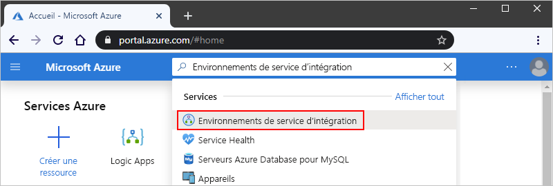

# Gérez votre environnement de service d’intégration dans Azure Logic Apps

Pour vérifier l’intégrité du réseau pour votre [environnement de service d’intégration](../logic-apps/connect-virtual-network-vnet-isolated-environment-overview.md) (ISE, Integration Service Environment) et gérer les applications logiques, les connexions, les comptes d’intégration et les connecteurs de votre environnement ISE, suivez les étapes décrites dans cette rubrique. Pour ajouter ces artefacts à votre environnement ISE, consultez [Ajouter des artefacts à votre environnement de service d’intégration](../logic-apps/add-artifacts-integration-service-environment-ise.md).

## Voir votre environnement ISE

1. Connectez-vous au [Portail Azure](https://portal.azure.com).

1. Dans la zone de recherche du portail, entrez « environnements de service d’intégration », puis sélectionnez **Environnements de service d’intégration**.

   

1. Dans la liste des résultats, sélectionnez votre environnement de service d’intégration.

   

1. Passez aux sections suivantes pour rechercher des applications logiques, des connexions, des connecteurs ou des comptes d’intégration dans votre environnement ISE.

## Vérifier l’intégrité du réseau

Dans le menu de votre environnement ISE, sous **Paramètres**, sélectionnez **Intégrité du réseau**. Ce volet présente l’état d’intégrité de vos sous-réseaux et les dépendances sortantes par rapport à d’autres services.

## Gérer les applications logiques

Vous pouvez voir et gérer les applications logiques qui se trouvent dans votre environnement ISE.

1. Dans le menu de votre environnement ISE, sous **Paramètres**, sélectionnez **Applications logiques**.

   

1. Pour supprimer les applications logiques dont vous n’avez plus besoin dans votre environnement ISE, sélectionnez-les, puis sélectionnez **Supprimer**. Pour confirmer la suppression, sélectionnez **Oui**.

## Gérer les connexions d’API

Vous pouvez afficher et gérer les connexions qui ont été créées par les applications logiques qui s’exécutent dans votre environnement ISE.

1. Dans le menu de votre environnement ISE, sous **Paramètres**, sélectionnez **Connexions d’API**.

   

1. Pour supprimer les connexions dont vous n’avez plus besoin dans votre environnement ISE, sélectionnez-les, puis sélectionnez **Supprimer**. Pour confirmer la suppression, sélectionnez **Oui**.

## Gérer les connecteurs ISE

Vous pouvez voir et gérer les connecteurs d’API qui sont déployés dans votre environnement ISE.

1. Dans le menu de votre environnement ISE, sous **Paramètres**, sélectionnez **Connecteurs managés**.

   

1. Pour supprimer les connecteurs que vous ne souhaitez pas rendre disponibles dans votre environnement ISE, sélectionnez-les, puis sélectionnez **Supprimer**. Pour confirmer la suppression, sélectionnez **Oui**.

## Gérer les connecteurs personnalisés

Vous pouvez voir et gérer les connecteurs personnalisés que vous avez déployés dans votre environnement ISE.

1. Dans le menu de votre environnement ISE, sous **Paramètres**, sélectionnez **Connecteurs personnalisés**.

   

1. Pour supprimer les connecteurs personnalisés dont vous n’avez plus besoin dans votre environnement ISE, sélectionnez-les, puis sélectionnez **Supprimer**. Pour confirmer la suppression, sélectionnez **Oui**.

## Gérer les comptes d’intégration

1. Dans le menu de votre environnement ISE, sous **Paramètres**, sélectionnez **Comptes d’intégration**.

   

1. Pour supprimer des comptes d’intégration de votre environnement ISE quand vous n’en avez plus besoin, sélectionnez-les, puis sélectionnez **Supprimer**.

## Étapes suivantes

* Découvrir comment [se connecter à des réseaux virtuels à partir d’applications logiques isolées](../logic-apps/connect-virtual-network-vnet-isolated-environment.md)
