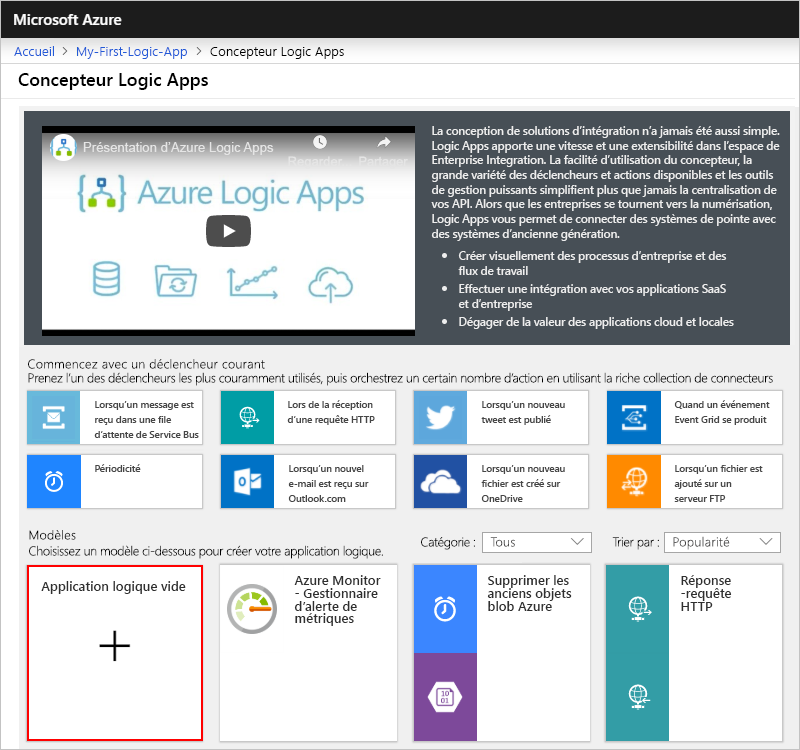
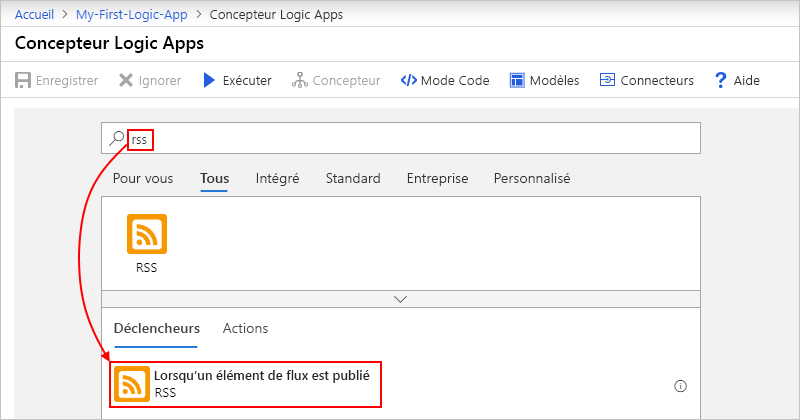
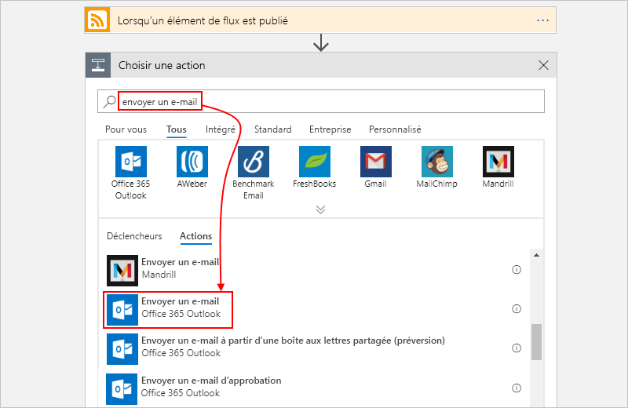
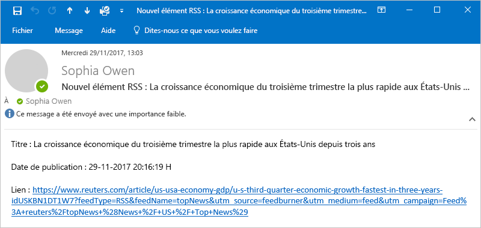
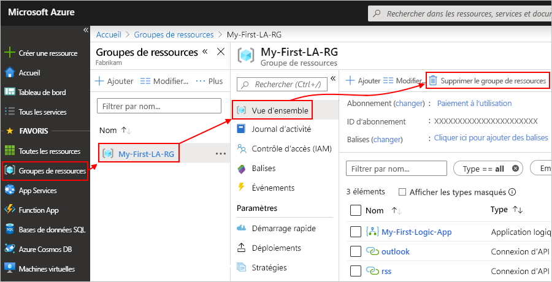
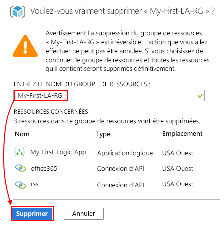

# Démarrage rapide : Créer votre premier workflow à l’aide d’Azure Logic Apps - Portail Azure

Ce démarrage rapide présente les concepts généraux de base de la création de votre premier flux de travail à l’aide d’[Azure Logic Apps](../logic-apps/logic-apps-overview.md), par exemple la création d’une application logique vide, l’ajout d’un déclencheur et d’une action, puis le test de votre application logique. Dans ce démarrage rapide, vous créez une application logique qui vérifie régulièrement le flux RSS d’un site web et recherche de nouveaux éléments. Si de nouveaux éléments existent, l’application logique envoie un e-mail pour chacun d’eux. Lorsque vous avez terminé, votre application logique ressemble au flux de travail suivant à un niveau élevé :

Pour ce scénario, vous devez avoir un abonnement Azure ou [vous inscrire pour obtenir un compte Azure gratuit](https://azure.microsoft.com/free/) et un compte e-mail d’un service pris en charge par Azure Logic Apps, comme Office 365 Outlook, Outlook.com ou Gmail. Pour connaître les autres services de courrier pris en charge, [passez en revue la liste des connecteurs ici](https://docs.microsoft.com/connectors/). Dans cet exemple, l’application logique utilise un compte Office 365 Outlook. Si vous utilisez un autre service de courrier, les étapes générales sont les mêmes, mais votre interface utilisateur peut différer légèrement.

> [!IMPORTANT]
> Si vous souhaitez utiliser le connecteur Gmail, seuls les comptes professionnels G-Suite peuvent utiliser ce connecteur sans restriction dans les applications logiques. Si vous disposez d’un compte de consommateur Gmail, vous pouvez utiliser ce connecteur uniquement avec certains services approuvés par Google, ou vous pouvez [créer une application cliente Google pour servir lors de l’authentification avec votre connecteur Gmail](https://docs.microsoft.com/connectors/gmail/#authentication-and-bring-your-own-application). Pour plus d’informations, consultez [Stratégies de confidentialité et de sécurité des données pour les connecteurs Google dans Azure Logic Apps](../connectors/connectors-google-data-security-privacy-policy.md).

## Connectez-vous au portail Azure.

Connectez-vous au [portail Azure](https://portal.azure.com) avec les informations d’identification de votre compte Azure.

## Créer votre application logique

1. Dans la zone de recherche de la page d’accueil Azure, recherchez et sélectionnez **Logic Apps**.

   

1. Dans la page **Logic Apps**, sélectionnez **Ajouter**.

   

1. Dans le volet **Application logique**, indiquez les détails de votre application logique comme indiqué ici. Sélectionnez **Créer** quand vous avez terminé.

   

   | Propriété | Valeur | Description |
   |----------|-------|-------------|
   | **Nom** | <*logic-app-name*> | Nom de votre application logique, qui peut contenir uniquement des lettres, des chiffres, des traits d’union (`-`) des traits de soulignement (`_`), des parenthèses (`(`, `)`) et des points (`.`). Cet exemple utilise « My-First-Logic-App ». 

**Remarque** : Les noms des applications logiques doivent être uniques d’une région à l’autre. |
   | **Abonnement** | <*Azure-subscription-name*> | Le nom de votre abonnement Azure |
   | **Groupe de ressources** | <*nom-groupe-de-ressources-Azure*> | Nom du [groupe de ressources Azure](../azure-resource-manager/management/overview.md) utilisé pour organiser les ressources connexes. Cet exemple utilise « My-First-LA-RG ». 

**Remarque** : Les noms des groupes de ressources doivent être uniques d’une région à l’autre. |
   | **Lieu** | <*Azure-region*> | Région dans laquelle stocker les informations sur votre application logique. Cet exemple utilise la région « USA Ouest ». |
   | **Log Analytics** | Off | Maintenez le paramètre de journalisation des diagnostics **Désactivé**. |
   ||||

1. Une fois qu’Azure a déployé votre application, dans la barre d’outils Azure, sélectionnez **Notifications** > **Accéder à la ressource** pour votre application logique déployée.

   

   Ou bien, vous pouvez rechercher et sélectionner votre application logique en tapant son nom dans la zone de recherche.

   Le Concepteur d’application logique s’ouvre et affiche une page contenant une vidéo de présentation et les déclencheurs couramment utilisés. Sous **Modèles**, sélectionnez **Application logique vide**.

   

Ensuite, ajoutez un [déclencheur](../logic-apps/logic-apps-overview.md#logic-app-concepts) qui s’active lorsqu’un nouvel élément de flux RSS apparaît. Chaque application logique doit démarrer avec un déclencheur, qui s’active lorsqu’un événement spécifique se produit ou lorsqu’une condition particulière est remplie. Chaque fois que le déclencheur s’active, le moteur Azure Logic Apps crée une instance d’application logique qui démarre et exécute votre flux de travail.

## Ajouter le déclencheur RSS

1. Dans le **Concepteur d’application logique**, sous la zone de recherche, sélectionnez **Tout**.

1. Dans la zone de recherche, entrez `rss` pour rechercher le connecteur RSS. Dans la liste des déclencheurs, sélectionnez le déclencheur **Lors de la publication d’un élément de flux**.

   

1. Fournissez les informations pour votre déclencheur, comme décrit dans le tableau :

   

   | Propriété | Valeur | Description |
   |----------|-------|-------------|
   | **URL du flux RSS** | <*URL-flux-RSS*> | Lien du flux RSS à surperviser. Cet exemple utilise `http://feeds.reuters.com/reuters/topNews`. |
   | **Intervalle** | 1 | Nombre d’intervalles d’attente entre les vérifications. |
   | **Fréquence** | Minute | Unité de temps de chaque intervalle entre les vérifications.  |
   ||||

   Ensemble, l’intervalle et la fréquence définissent la planification du déclencheur de votre application logique. Cette application logique vérifie le flux toutes les minutes.

1. Pour réduire les informations du déclencheur pour le moment, cliquez dans sa barre de titre.

   

1. Enregistrez votre application logique. Dans la barre d’outils du Concepteur, sélectionnez **Enregistrer**.

Votre application logique est à présent en ligne mais elle ne fait rien d’autre que vérifier le flux RSS. Par conséquent, ajoutez une action qui répond à l’activation du déclencheur.

## Ajouter l’action « Envoyer un courrier électronique »

Ajoutez une [action](../logic-apps/logic-apps-overview.md#logic-app-concepts) qui envoie un e-mail lorsqu’un nouvel élément apparaît dans le flux RSS.

1. Sous le déclencheur **Lors de la publication d’un élément de flux**, sélectionnez **Nouvelle étape**.

   

1. Sous **Choisir une action** et la zone de recherche, sélectionnez **Tous**.

1. Dans la zone de recherche, entrez `send an email` pour rechercher les connecteurs qui proposent cette action. Dans la liste d’actions, sélectionnez l’action « envoyer un e-mail » pour le service e-mail de votre choix. Cet exemple utilise le connecteur Office 365 Outlook, qui contient l’action **Envoyer un courrier**.

   

   Pour filtrer la liste d’actions pour un service ou une application spécifique, vous pouvez commencer par sélectionner ce service ou cette application :

   * Pour les comptes Azure professionnels ou scolaires, sélectionnez Office 365 Outlook.
   * Pour les comptes Microsoft personnels, sélectionnez Outlook.com.

1. Si votre connecteur de courrier sélectionné vous invite à authentifier votre identité, effectuez cette étape maintenant pour créer une connexion entre votre application logique et votre service de courrier.

   > [!NOTE]
   > Dans cet exemple, vous authentifiez manuellement votre identité. Toutefois, les connecteurs qui requièrent une authentification se distinguent les uns des autres par les types d’authentification qu’ils prennent en charge. Vous disposez également d’options pour configurer la façon dont vous souhaitez gérer l’authentification. Par exemple, quand vous utilisez des modèles Azure Resource Manager pour déployer, vous pouvez paramétrer et améliorer la sécurité des entrées que vous souhaitez changer souvent ou facilement, comme les informations de connexion. Pour plus d’informations, consultez les rubriques suivantes :
   >
   > * [Paramètres du modèle pour le déploiement](../logic-apps/logic-apps-azure-resource-manager-templates-overview.md#template-parameters)
   > * [Autoriser des connexions OAuth](../logic-apps/logic-apps-deploy-azure-resource-manager-templates.md#authorize-oauth-connections)
   > * [Authentifier l’accès avec des identités managées](../logic-apps/create-managed-service-identity.md)
   > * [Authentifier les connexions pour le déploiement d’applications logiques](../logic-apps/logic-apps-azure-resource-manager-templates-overview.md#authenticate-connections)

1. Dans l’action **Envoyer un e-mail**, spécifiez les données que vous souhaitez inclure dans l’e-mail.

   1. Dans la zone **À**, entrez l’adresse e-mail du destinataire. À des fins de test, vous pouvez utiliser votre adresse e-mail.

      Pour l’instant, ignorez la liste **Ajouter du contenu dynamique** qui s’affiche. Lorsque vous cliquez dans certaines zones d’édition, cette liste apparaît et affiche les paramètres disponibles de l’étape précédente que vous pouvez inclure en tant qu’entrées dans votre flux de travail.

   1. Dans la zone **Objet**, entrez ce texte avec un espace vide de fin : `New RSS item: `.

      

   1. Dans la liste **Ajouter du contenu dynamique**, sélectionnez **Titre du flux** pour inclure le titre de l’élément RSS.

      

      Lorsque vous avez terminé, l’objet de l’e-mail ressemble à l’exemple suivant :

      

      Si une boucle « For Each » s’affiche dans le concepteur, c’est que vous avez sélectionné un jeton qui contient un tableau, par exemple, le jeton **categories-Item**. Pour ces types de jeton, le concepteur ajoute automatiquement cette boucle autour de l’action qui référence ce jeton. De cette façon, votre application logique effectue la même action sur chaque élément du tableau. Pour supprimer la boucle, sélectionnez le bouton **points de suspension** ( **...** ) sur la barre de titre de la boucle, puis **Supprimer**.

   1. Dans la zone **Corps**, entrez ce texte, puis sélectionnez ces jetons pour le corps de l’e-mail. Pour ajouter des lignes vides dans une zone d’édition, appuyez sur Maj + Entrée.

      

      | Propriété | Description |
      |----------|-------------|
      | **Titre du flux** | Titre de l’élément. |
      | **Flux publié le** | Date et heure de publication de l’élément. |
      | **Lien du flux principal** | URL de l’élément. |
      |||

1. Enregistrez votre application logique.

À présent, testez votre application logique.

## Exécuter votre application logique

Pour lancer manuellement votre application logique, sélectionnez **Exécuter** dans la barre d’outils du concepteur. Vous pouvez également attendre que votre application logique vérifie le flux RSS selon la planification que vous avez spécifiée (toutes les minutes). Si le flux RSS a de nouveaux éléments, votre application logique envoie un e-mail pour chaque nouvel élément. Dans le cas contraire, votre application logique attend jusqu’à l’intervalle suivant avant de procéder à une nouvelle vérification. Si vous ne recevez aucun e-mail, vérifiez votre dossier Courrier indésirable.

Par exemple, voici un e-mail classique envoyé par cette application logique.

Techniquement, lorsque le déclencheur vérifie le flux RSS et trouve de nouveaux éléments, le déclencheur s’active et le moteur Azure Logic Apps crée une instance de workflow d’application logique qui exécute les actions dans le workflow. Si le déclencheur ne trouve pas de nouveaux éléments, il ne s’active pas et « ignore » l’instanciation du workflow.

Félicitations, vous avez correctement généré et exécuté votre première application logique avec le portail Azure.

## Nettoyer les ressources

Quand vous n’en avez plus besoin, supprimez le groupe de ressources qui contient votre application logique et les ressources associées.

1. Dans le menu Azure principal, sélectionnez **Groupes de ressources**, puis sélectionnez le groupe de ressources de votre application logique. Dans le volet **Vue d’ensemble**, sélectionnez **Supprimer un groupe de ressources**.

   

1. Dans le volet de confirmation, entrez le nom du groupe de ressources, puis sélectionnez **Supprimer**.

   

> [!NOTE]
> Lorsque vous supprimez une application logique, aucune nouvelle exécution n’est instanciée. Toutes les exécutions en cours et en attente sont annulées. Si vous avez des milliers d’exécutions, l’annulation peut prendre beaucoup de temps.

## Étapes suivantes

Dans ce guide de démarrage rapide, vous avez créé votre première application logique qui vérifie les mises à jour RSS en fonction de la planification que vous avez spécifiée (toutes les minutes) et exécute une action (envoi d’un e-mail) lorsqu’il existe des mises à jour. Pour en savoir plus, poursuivez ce didacticiel qui crée des flux de travail planifiés plus avancés :

> [!div class="nextstepaction"]
> [Contrôler le trafic à l’aide d’une application logique planifiée](../logic-apps/tutorial-build-schedule-recurring-logic-app-workflow.md)
