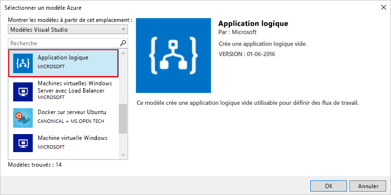
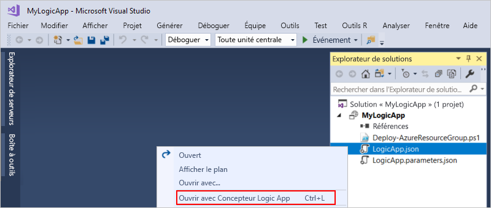
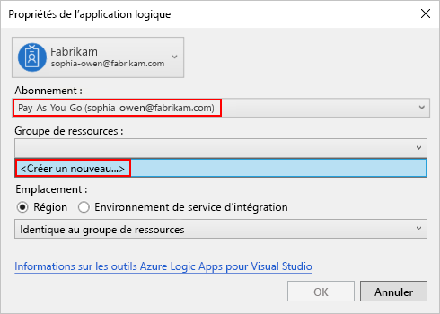
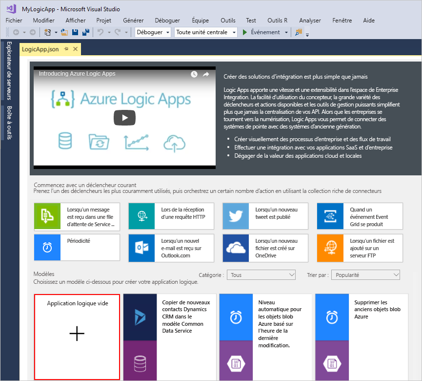
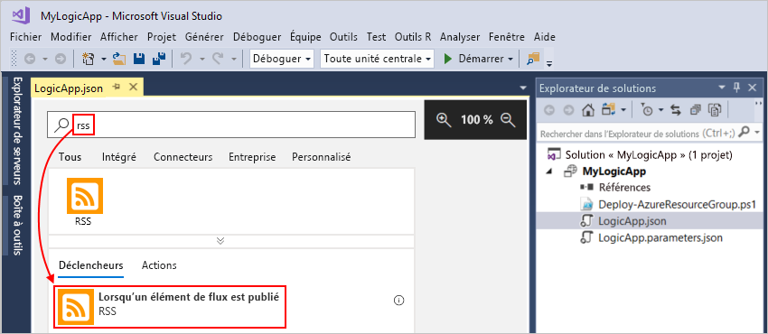
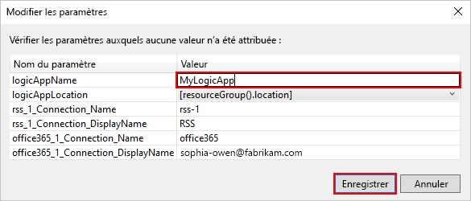
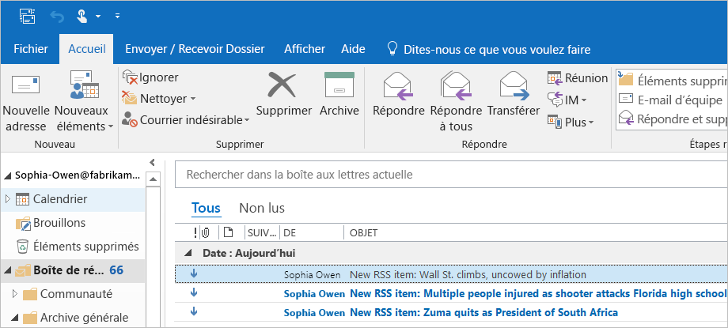
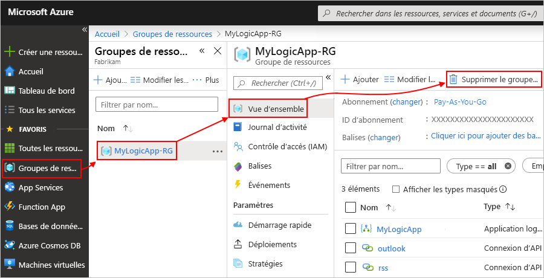

# Démarrage rapide : Créer des tâches, des processus et des workflows automatisés avec Azure Logic Apps - Visual Studio

Avec [Azure Logic Apps](../logic-apps/logic-apps-overview.md) et Visual Studio, vous pouvez créer des workflows pour automatiser des tâches et des processus qui intègrent des applications, des données, des systèmes et des services dans les entreprises et organisations. Ce guide de démarrage rapide montre comment vous pouvez concevoir et générer ces workflows en créant des applications logiques dans Visual Studio et en déployant ces applications sur Azure. Bien que vous puissiez effectuer ces tâches dans le portail Azure, Visual Studio vous permet d’ajouter vos applications logiques pour le contrôle de code source, la publication de différentes versions et la création de modèles Azure Resource Manager pour divers environnements de déploiement.

Si vous êtes débutant avec Azure Logic Apps et si vous souhaitez seulement connaître les concepts de base, essayez le [guide de démarrage rapide pour créer une application logique dans le portail Azure](../logic-apps/quickstart-create-first-logic-app-workflow.md). Le Concepteur d’application logique fonctionne de façon similaire dans le portail Azure et dans Visual Studio.

Dans ce guide de démarrage rapide, vous créez la même application logique avec Visual Studio que dans le guide de démarrage rapide du portail Azure. Cette application logique supervise les flux RSS d’un site web et envoie un e-mail pour chaque nouvel élément dans le flux. Votre application logique terminée ressemble au workflow général suivant :

## Prérequis

* Un abonnement Azure. Si vous n’avez pas d’abonnement Azure, [inscrivez-vous pour bénéficier d’un compte Azure gratuit](https://azure.microsoft.com/free/).

* Téléchargez et installez ces outils, si vous ne les avez pas déjà :

  * [Visual Studio 2019, 2017 ou 2015 - édition Community ou supérieure](https://aka.ms/download-visual-studio). 
  Ce guide de démarrage rapide utilise Visual Studio Community 2017.

    > [!IMPORTANT]
    > Quand vous installez Visual Studio 2019 ou 2017, veillez à sélectionner la charge de travail **Développement Azure**.

  * [Kit de développement logiciel (SDK) Microsoft Azure pour .NET (version 2.9.1 ou ultérieure)](https://azure.microsoft.com/downloads/). 
  En savoir plus sur [Azure SDK pour .NET](https://docs.microsoft.com/dotnet/azure/dotnet-tools?view=azure-dotnet).

  * [Azure PowerShell](https://github.com/Azure/azure-powershell#installation)

  * Outils Azure Logic Apps pour la version Visual Studio souhaitée :

    * [Visual Studio 2019](https://aka.ms/download-azure-logic-apps-tools-visual-studio-2019)

    * [Visual Studio 2017](https://aka.ms/download-azure-logic-apps-tools-visual-studio-2017)

    * [Visual Studio 2015](https://aka.ms/download-azure-logic-apps-tools-visual-studio-2015)
  
    Vous pouvez télécharger et installer les outils Azure Logic Apps directement à partir de Visual Studio Marketplace ou en apprendre davantage sur [l’installation de cette extension dans Visual Studio](https://docs.microsoft.com/visualstudio/ide/finding-and-using-visual-studio-extensions). 
    Veillez à redémarrer Visual Studio après l’installation.

* Accès au web lors de l’utilisation du Concepteur d’application logique intégré

  Le Concepteur a besoin d’une connexion Internet pour créer des ressources dans Azure et pour lire des propriétés et données à partir de connecteurs dans votre application logique. 
  Par exemple, pour les connexions Dynamics CRM Online, le Concepteur recherche les propriétés par défaut et personnalisées dans votre instance CRM.

* Un compte de messagerie pris en charge par Logic Apps, par exemple Office 365 Outlook, Outlook.com ou Gmail. Pour les autres fournisseurs, [passez en revue la liste des connecteurs ici](https://docs.microsoft.com/connectors/). Office 365 Outlook est utilisé dans cet exemple. Si vous utilisez un autre fournisseur, les étapes générales sont identiques, mais votre interface utilisateur peut être légèrement différente.

## Créer un projet de groupe de ressources Azure

Pour commencer, créez un [projet de groupe de ressources Azure](../azure-resource-manager/vs-azure-tools-resource-groups-deployment-projects-create-deploy.md). En savoir plus sur [les ressources et groupes de ressources Azure](../azure-resource-manager/resource-group-overview.md).

1. Démarrez Visual Studio. Connectez-vous à votre compte Azure.

1. Dans le menu **Fichier**, sélectionnez **Nouveau** > **Projet**. (Clavier : Ctrl+Maj+N)

   

1. Sous **Installé**, sélectionnez **Visual C#** ou **Visual Basic**. Sélectionnez **Cloud** > **Groupe de ressources Azure**. Nommez votre projet, par exemple :

   

   > [!NOTE]
   > Si **Cloud** ou **Groupe de ressources Azure** n’apparaît pas, veillez à installer le kit SDK Azure pour Visual Studio.

   Si vous utilisez Visual Studio 2019, effectuez ces étapes :

   1. Dans la boîte de dialogue **Créer un projet**, sélectionnez le projet **Groupe de ressources Azure** pour Visual C# ou Visual Basic. Sélectionnez **Suivant**.

   1. Indiquez un nom pour le groupe de ressources Azure que vous souhaitez utiliser et les autres informations relatives au projet. Cliquez sur **Créer**.

1. Dans la liste des modèles, sélectionnez le modèle **Application logique**. Choisissez **OK**.

   

   Une fois votre projet créé par Visual Studio, l’Explorateur de solutions s’ouvre et affiche votre solution. 
   Dans votre solution, le fichier **LogicApp.json** ne stocke pas seulement la définition de votre application logique, mais est également un modèle Azure Resource Manager que vous pouvez utiliser pour le déploiement.

   

## Créer une application logique vide

Une fois votre projet de groupe de ressources Azure prêt, créez votre application logique avec le modèle **Application logique vide**.

1. Dans l’Explorateur de solutions, ouvrez le menu contextuel du fichier **LogicApp.json**. Sélectionnez **Ouvrir avec le Concepteur d’application logique**. (Clavier : Ctrl+L)

   

   > [!TIP]
   > Si vous n’avez pas cette commande dans Visual Studio 2019, vérifiez que vous avez les dernières mises à jour pour Visual Studio.

   Visual Studio vous invite à indiquer votre abonnement Azure et un groupe de ressources Azure afin de créer et de déployer des ressources pour votre application logique et vos connexions.

1. Pour **Abonnement**, sélectionnez votre abonnement Azure. Pour **Groupe de ressources**, sélectionnez **Créer nouveau**, afin de créer un groupe de ressources Azure.

   

   | Paramètre | Exemple de valeur | Description |
   | ------- | ------------- | ----------- |
   | Liste de profils utilisateur | Contoso   jamalhartnett@contoso.com | Par défaut, le compte que vous avez utilisé pour vous connecter |
   | **Abonnement** | Pay-As-You-Go   (jamalhartnett@contoso.com) | Le nom de votre abonnement Azure et le compte associé |
   | **Groupe de ressources** | MyLogicApp-RG   (USA Ouest) | Le groupe de ressources Azure et l’emplacement de stockage et de déploiement des ressources de votre application logique |
   | **Lieu** | MyLogicApp-RG2   (USA Ouest) | Un autre emplacement si vous ne souhaitez pas utiliser l’emplacement du groupe de ressources |
   ||||

1. Le Concepteur d’application logique ouvre une page qui affiche une vidéo de présentation et les déclencheurs couramment utilisés. Faites défiler la page vers le bas au-delà de la vidéo et des déclencheurs jusqu’à **Modèles**, puis sélectionnez **Application logique vide**.

   

## Générer un workflow d’application logique

Ensuite, ajoutez un [déclencheur](../logic-apps/logic-apps-overview.md#logic-app-concepts) RSS qui s’active quand un nouvel élément de flux apparaît. Chaque application logique commence avec un déclencheur, qui s’active quand des critères spécifiques sont remplis. Chaque fois que le déclencheur est activé, le moteur Logic Apps crée une instance d’application logique qui exécute votre workflow.

1. Dans le Concepteur d’application logique, sous la zone de recherche, choisissez **Tout**.
Dans la zone de recherche, entrez « rss ». Dans la liste des déclencheurs, sélectionnez ce déclencheur : **Quand un élément de flux est publié - RSS**

   

1. Une fois que le déclencheur apparaît dans le concepteur, terminez la génération de l’application logique en suivant les étapes du workflow dans le [guide de démarrage rapide du portail Azure](../logic-apps/quickstart-create-first-logic-app-workflow.md#add-rss-trigger), puis revenez à cet article. Une fois que vous avez terminé, votre application logique ressemble à cet exemple :

   

1. Enregistrez votre solution Visual Studio. (Clavier : Ctrl+S)

## Déployer l’application logique dans Azure

Avant de pouvoir exécuter et tester votre application logique, déployez-la dans Azure à partir de Visual Studio.

1. Dans l’Explorateur de solutions, dans le menu contextuel de votre projet, sélectionnez **Déployer** > **Nouveau**. Si vous y êtes invité, connectez-vous à votre compte Azure.

   

1. Pour ce déploiement, gardez l’abonnement Azure, le groupe de ressources et les autres paramètres par défaut. Choisissez **Déployer**.

   

1. Si la boîte de dialogue **Modifier les paramètres** s’affiche, spécifiez un nom de ressource pour votre application logique. Enregistrez vos paramètres.

   

   Lorsque le déploiement commence, l’état du déploiement de votre application s’affiche dans la fenêtre **Sortie** de Visual Studio. Si l’état n’apparaît pas, ouvrez la liste **Afficher la sortie à partir de** et sélectionnez votre groupe de ressources Azure.

   

   Si vos connecteurs sélectionnés nécessitent une intervention de votre part, une fenêtre PowerShell s’ouvre en arrière-plan et vous demande de taper les mots de passe ou les clés secrètes éventuellement nécessaires. Le déploiement se poursuit dès que vous avez saisi ces informations.

   

   Une fois le déploiement terminé, votre application logique est en ligne dans le portail Azure et s’exécute en fonction de la planification que vous avez spécifiée (chaque minute). Si le déclencheur trouve de nouveaux éléments de flux, il s’active, créant une instance de workflow qui exécute les actions de votre application logique. Votre application logique envoie un e-mail pour chaque nouvel élément. Sinon, si le déclencheur ne trouve pas de nouveaux éléments, il ne s’active pas et « ignore » l’instanciation du workflow. Votre application logique attend jusqu’à l’intervalle suivant avant de procéder à une vérification.

   Voici des e-mails classiques envoyés par cette application logique. 
   Si vous ne recevez aucun e-mail, vérifiez votre dossier Courrier indésirable.

   

Félicitations, vous avez correctement généré et déployé votre application logique avec Visual Studio. Pour gérer votre application logique et examiner son historique des exécutions, consultez [Manage logic apps with Visual Studio](../logic-apps/manage-logic-apps-with-visual-studio.md) (Gérer des applications logiques avec Visual Studio).

## Ajouter une nouvelle application logique

Quand vous avez déjà un projet de groupe de ressources Azure, vous pouvez y ajouter une nouvelle application logique vide à partir de la fenêtre Structure JSON.

1. Dans l’Explorateur de solutions, ouvrez le fichier `<logic-app-name>.json`.

1. Dans le menu **Affichage**, sélectionnez **Autres fenêtres** > **Structure JSON**.

1. Pour ajouter une ressource au fichier de modèle, choisissez **Ajouter une ressource** en haut de la fenêtre Structure JSON. Ou, dans la fenêtre Structure JSON, cliquez avec le bouton droit sur **Ressources**, puis sélectionnez **Ajouter une nouvelle ressource**.

   

1. Dans la boîte de dialogue **Ajouter une ressource**, recherchez et sélectionnez **Application logique**. Donnez un nom à votre application logique, puis choisissez **Ajouter**.

   

## Supprimer des ressources

Quand vous n’avez plus besoin de votre application logique, supprimez le groupe de ressources qui contient celle-ci et les ressources associées.

1. Connectez-vous au [portail Azure](https://portal.azure.com) avec le même compte que celui utilisé pour créer votre application logique.

1. Dans le menu Azure principal, choisissez **Groupes de ressources**.
Sélectionnez le groupe de ressources de votre application logique, puis sélectionnez **Vue d’ensemble**.

1. Dans la page **Vue d’ensemble**, choisissez **Supprimer un groupe de ressources**. Confirmez le nom du groupe de ressources, puis choisissez **Supprimer**.

   

1. Supprimez la solution Visual Studio de votre ordinateur local.

## Étapes suivantes

Dans cet article, vous avez généré, déployé et exécuté votre application logique avec Visual Studio. Pour découvrir la gestion et l’exécution du déploiement avancé des applications logiques avec Visual Studio, consultez l’article suivant :

> [!div class="nextstepaction"]
> * [Gérer des applications logiques avec Visual Studio](../logic-apps/manage-logic-apps-with-visual-studio.md)