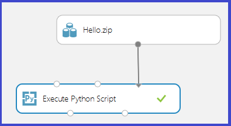
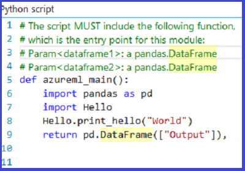
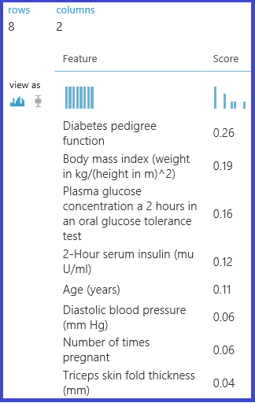

<properties 
	pageTitle="Exécution des scripts Python dans Azure Machine Learning | Azure" 
	description="Décrit les principes sous-jacents de conception de la prise en charge de Python dans Azure Machine Learning, les scénarios d'utilisation, les fonctionnalités et les restrictions de base." 
	services="machine-learning"
	documentationCenter="" 
	authors="garyericson" 
	manager="paulettm" 
	editor="cgronlun"/>

<tags 
	ms.service="machine-learning" 
	ms.workload="data-services" 
	ms.tgt_pltfrm="na" 
	ms.devlang="na" 
	ms.topic="article" 
	ms.date="04/21/2015" 
	ms.author="bradsev;garye" />

# Exécution des scripts de Python dans Azure Machine Learning

## Introduction

Cette rubrique décrit les principes de conception sous-jacents de la prise en charge actuelle de Python dans Azure Machine Learning. Les fonctionnalités principales sont également présentées, y compris la prise en charge de l'importation du code existant, l'exportation des visualisations et, enfin, de certaines restrictions et de certains travaux en cours qui sont abordés.

[Python](https://www.python.org/) est un outil indispensable dans le coffre à outils de nombreux scientifiques de données. Il dispose d'une syntaxe concise et élégante, d'un support interplateforme, d'un large choix de bibliothèques et d'outils de développement très performants. Python est utilisé dans toutes les phases du flux de travail généralement utilisé dans la modélisation de l'apprentissage automatique, de la réception et du traitement de données à la conception des fonctionnalités, en passant par la formation, la validation et le déploiement de modèles.

Azure Machine Learning Studio prend en charge l'intégration des scripts Python dans plusieurs parties d'une expérience d'apprentissage automatique et leur publication de manière transparente en tant que services web évolutifs et opérationnels sur Microsoft Azure.

[AZURE.INCLUDE [machine-learning-free-trial](../includes/machine-learning-free-trial.md)]

## Principes de conception
L'interface principale de Python dans Azure Machine Learning Studio est accessible via le module [Exécuter le script Python][execute-python-script], qui est mentionné dans la Figure 1.

Figure 1 : Module **Exécuter le script Python**

Le module [Exécuter le script Python][execute-python-script] accepte jusqu'à trois entrées et génère jusqu'à deux sorties \(voir ci-dessous\), comme son analogue R, le module [Exécuter le script R][execute-r-script]. Le code Python, qui doit être exécuté, est saisi dans la boîte de paramètres en tant que fonction de point d'entrée spécialement nommée, appelée `azureml_main`. Vous trouverez ici les principes de conception clés utilisés pour implémenter ce module :

1.	*Doit être idiomatique pour les utilisateurs de Python.* La plupart des utilisateurs de Python factorisent leur code en tant que fonctions au sein des modules. De ce fait, le placement de nombreuses instructions exécutables dans un module de niveau supérieur est relativement rare. La boîte de script utilise également une fonction Python spécialement nommée plutôt qu'une séquence d'instructions. Les objets exposés dans la fonction sont des types de bibliothèques standards Python, tels que des trames de données [Pandas](http://pandas.pydata.org/) et des tableaux [NumPy](http://www.numpy.org/).
2.	*Doit disposer d'une haute fidélité entre les exécutions locales et les exécutions du cloud.* Le serveur principal utilisé pour exécuter le code Python est basé sur [Anaconda](https://store.continuum.io/cshop/anaconda/) 2.1, une distribution scientifique interplateforme Python, largement utilisée. Il est fourni avec près de 200 des principaux packages Python. Par conséquent, un scientifique de données peut déboguer et qualifier leur code sur son environnement local Azure Machine Learning compatible Anaconda en utilisant des environnements de développement existants tels que le notebook [IPython](http://ipython.org/) ou [Python Tools for Visual Studio](http://pytools.codeplex.com/), et l'exécuter dans le cadre d'une expérience Azure Machine Learning en toute confiance. De plus, le point d'entrée `azureml_main` est une fonction Python vanille qui peut être créée sans code Azure Machine Learning spécifique ou kit de développement logiciel installé.
3.	*Doit être composé, de manière transparente, d'autres modules Azure Machine Learning.* Le module [Exécuter le script Python][execute-python-script] accepte en tant qu'entrées et sorties, les ensembles de données Azure Machine Learning standard. L'infrastructure sous-jacente établit efficacement et en toute transparence un pont entre les runtimes Azure Machine Learning et Python \(prenant en charge des fonctionnalités telles que des valeurs manquantes\). Python peut donc être utilisé en combinaison avec des flux de travail Azure Machine Learning existants, y compris ceux qui font appel à R et SQLite. Vous pouvez donc envisager des flux de travail qui :
  * utilisent Python et Pandas pour le prétraitement et le nettoyage de données, 
  * alimentent des données pour une transformation SQL, en joignant plusieurs ensembles de données dans le but de former des fonctionnalités, 
  * forment des modèles à l'aide de nombreux algorithmes dans Azure Machine Learning, et 
  * évaluent et post-traitent les résultats à l'aide de R.

## Utilisation de base
Dans cette section, nous examinons certaines utilisations courantes du module [Exécuter le script Python][execute-python-script]. Comme mentionné précédemment, des entrées vers le module Python sont exposées sous forme de trames de données Pandas. Pour en savoir plus sur Pandas et découvrir comment il peut être utilisé pour manipuler efficacement des données dans *Python for Data Analysis* \(Sebastopol, CA. : O'Reilly, 2012\) par W. McKinney. La fonction doit renvoyer une seule image de données Pandas empaquetée dans une [séquence](https://docs.python.org/2/c-api/sequence.html) Python telle qu'un tuple, une liste ou un tableau NumPy. Le premier élément de cette séquence est ensuite renvoyé dans le premier port de sortie du module. Ce schéma est illustré dans la Figure 2.

 Figure 2. Mappage des ports d'entrée vers des paramètres et valeur de renvoi vers le port de sortie.

Les sémantiques plus détaillées qui décrivent la procédure à adopter pour mapper les ports d'entrée vers les paramètres de la fonction `azureml_main` sont mentionnées dans le tableau 1 :

Tableau 1. Mappage des ports d'entrée vers les paramètres de fonction.

Notez que le mappage entre les ports d'entrée et les paramètres de fonction est positionnel, c'est-à-dire que le premier port d'entrée connecté est mappé vers le premier paramètre de la fonction et la seconde entrée \(si celle-ci est connectée\) est mappée vers le deuxième paramètre de la fonction.

## Conversion des types d'entrée et de sortie
Comme expliqué précédemment, les ensembles de données d'entrée dans Azure Machine Learning sont convertis en trames de données dans Pandas et les trames de données de sortie sont reconverties en ensembles de données Azure Machine Learning. Les conversions à exécuter sont les suivantes :

1.	Les colonnes numériques et celles sous forme de chaîne sont converties telles quelles et les valeurs manquantes dans un ensemble de données sont converties en valeurs « NA » dans Pandas. Cette conversion s'effectue également dans l'autre sens \(les valeurs NA dans Pandas sont converties en valeurs manquantes dans Azure Machine Learning\).
2.	Les vecteurs d'index dans Pandas ne sont pas pris en charge dans Azure Machine Learning et toutes les trames de données d'entrée dans la fonction Python bénéficieront toujours d'un index numérique 64 bits compris entre 0 et le nombre de lignes moins 1. 
3.	Les ensembles de données Azure Machine Learning ne peuvent pas comporter de noms de colonnes dupliqués et de noms de colonnes autres que des chaînes. Si une trame de données de sortie contient des colonnes non numériques, l'infrastructure appelle `str` sur les noms de colonnes. De même, les noms de colonnes dupliqués sont automatiquement tronqués pour que chaque nom soit unique. Le suffixe \(2\) est ajouté au premier doublon, le suffixe \(3\) au deuxième, et ainsi de suite.

## Mise en place des scripts Python
Tout module [Exécuter le script Python][execute-python-script] dans une expérience d'évaluation est appelé lorsque celui-ci est publié en tant que service web. Par exemple, la Figure 3 illustre une expérience de notation qui détient le code permettant d'évaluer une seule expression Python.

Figure 3. Service web pour l'évaluation d'une expression Python.

Un service web créé à partir de cette expérience utilise comme entrée une expression Python \(sous forme de chaîne\), l'envoie à l'interpréteur Python et renvoie une table contenant l'expression et le résultat.

## Importation des modules Python existants
De nombreux scientifiques de données intègrent les scripts Python existants dans des expériences Azure Machine Learning. Au lieu de concaténer et de coller tout le code dans une boîte de script unique, le module [Exécuter le script Python][execute-python-script] accepte un troisième port d'entrée auquel un fichier zip contenant les modules Python peut être connecté. Le fichier est ensuite décompressé par le framework d'exécution lors de l'exécution et le contenu est ajouté au chemin de bibliothèque de l'interpréteur Python. La fonction du point d'entrée `azureml_main` peut ensuite importer ces modules directement.

Prenez pour exemple le fichier Hello.py contenant une fonction simple « Hello, World ».

Figure 4. Fonction définie par l'utilisateur

Ensuite, nous pouvons créer un fichier Hello.zip contenant Hello.py :

Figure 5. Fichier zip contenant le code Python défini par l'utilisateur.

Chargez-le ensuite en tant qu'ensemble de données dans Azure Machine Learning Studio. Si nous créons et exécutons ensuite une expérience simple qui utilise le module :

Figure 6. Exemple d'expérience dotée d'un code Python défini par l'utilisateur et chargé en tant que fichier zip.

La sortie du module montre que le fichier zip a été décompressé et que la fonction `print_hello` a effectivement été exécutée. 
 
Figure 7. Fonction définie par l'utilisateur exécutée au sein du module [Exécuter le script Python][execute-python-script].

## Utilisation des visualisations
Les graphiques créés à l'aide de MatplotLib, qui peuvent être visualisés sur le navigateur, peuvent être renvoyés par le module [Exécuter le script Python][execute-python-script]. Mais les graphiques ne sont pas redirigés automatiquement vers des images, comme lorsque vous utilisez R. De ce fait, l'utilisateur doit enregistrer explicitement les graphiques en fichiers PNG s'ils doivent être renvoyés dans Azure Machine Learning

Pour générer des images à partir de MatplotLib, vous devez suivre la procédure suivante :

* basculer le serveur principal sur « AGG » depuis le convertisseur par défaut basé sur Qt. 
* créer un nouvel objet figure 
* obtenir l'axe et générer sur celui-ci tous les graphiques 
* enregistrer la figure dans un fichier PNG 

Ce processus est mentionné dans la Figure 8 ci-dessous, qui crée une matrice de nuages de points à l'aide de la fonction scatter\_matrix dans Pandas.
 

Figure 8. Enregistrement des figures MatplotLib dans des images.

La Figure 9 illustre une expérience qui utilise le script ci-dessus pour renvoyer des graphiques via le second port de sortie.

	 

Figure 9. Visualisation des graphiques générés à partir d'un code Python.

Notez qu'il est possible de renvoyer plusieurs figures en les enregistrant dans différentes images, le runtime Azure Machine Learning récupère toutes les images et les concatène pour la visualisation.

## Exemples avancés
L'environnement Anaconda installé dans Azure Machine Learning contient les packages courants tels que NumPy, SciPy et Scikits-Learn et ceux qui peuvent être utilisés efficacement pour diverses tâches de traitement des données dans un pipeline d'apprentissage automatique type. À titre d'exemple, les expériences et le script suivants illustrent l'utilisation des apprenants d'ensemble dans Scikits-Learn pour calculer les notations d'importance des fonctionnalités d'un ensemble de données. Les notations peuvent ensuite servir à réaliser des fonctionnalités supervisées avant de les alimenter dans un autre modèle d'apprentissage automatique

La fonction Python, permettant de calculer les notations d'importance et de classer des fonctionnalités en fonction de celles-ci, est indiquée ci-dessous :

Figure 10. Fonction permettant de classer les fonctionnalités par notations. L'expérience suivante calcule et renvoie ensuite les notations d'importance des fonctionnalités dans l'ensemble de données « Diabète chez les indiens Pima » dans Azure Machine Learning :

 
	
Figure 11. Expérience permettant de classer des fonctionnalités dans l'ensemble de données du diabète chez les indiens Pima.

## Limites 
Le module [Exécuter le script Python][execute-python-script] présente actuellement les limites suivantes :

1.	*Exécution dans un bac à sable \(sandbox\).* Le runtime Python est actuellement exécuté dans un bac à sable \(sandbox\) et, par conséquent, n'autorise pas l'accès au réseau ou au système de fichiers local de façon permanente. Tous les fichiers enregistrés localement sont isolés et supprimés une fois que le module se termine. Le code Python ne peut pas accéder à la plupart des répertoires sur la machine qui les exécute, excepté le répertoire actuel et ses sous-répertoires.
2.	*Manque de support de développement et de débogage sophistiqué.* Le module Python ne prend pas en charge les fonctionnalités IDE telles que Intellisense et Débogage. En outre, si le module échoue lors de l'exécution, l'arborescence complète des appels de procédure Python est disponible, mais elle doit être affichée dans le journal de sortie du module. Nous recommandons aux utilisateurs de développer et de déboguer leurs scripts Python dans un environnement tel que IPython et d'importer ensuite le code dans le module.
3.	*Sortie de trame de données unique.* Le point d'entrée Python n'est autorisé qu'à renvoyer une trame de données unique en tant que sortie. Il est pour l'instant impossible de renvoyer des objets arbitraires Python tels que les modèles formés directement lors de l'exécution d'Azure Machine Learning. Comme avec [Exécuter le script R][execute-r-script], qui présente les mêmes restrictions, il est toutefois possible, dans de nombreux cas, de stocker des objets dans un tableau d'octets et de les renvoyer ensuite dans une trame de données.
4.	*Personnalisation de l'installation de Python impossible*. L'ajout de modules Python personnalisés n'est, à l'heure actuelle, possible qu'à l'aide du mécanisme de fichiers zip décrit précédemment. Bien que ceci soit faisable pour les petits modules, la procédure est assez lourde pour les gros modules \(notamment ceux constitués de DLL natives\) ou un grand nombre de modules. 

##Conclusions
Le module [Exécuter le script Python][execute-python-script] permet à un scientifique de données d'incorporer des codes Python existants dans les flux de travail d'apprentissage automatique hébergés dans le cloud, dans Azure Machine Learning et de les rendre opérationnels en toute transparence dans le cadre d'un service web. Le module de script Python interagit naturellement avec d'autres modules d'Azure Machine Learning et peut être utilisé pour de nombreuses tâches, de l'exploration au prétraitement de données, en passant par l'extraction de fonctionnalités, l'évaluation et le post-traitement des résultats. Le runtime du serveur principal utilisé pour l'exécution est basé sur Anaconda, une distribution Python bien testée et largement utilisée. Il permet aux utilisateurs d'intégrer plus facilement des éléments de code existants dans le cloud.

Nous prévoyons, dans les mois à venir, de fournir des fonctionnalités supplémentaires pour le module [Exécuter le script Python][execute-python-script] telles que la capacité de former et de rendre opérationnel des modèles dans Python et d'ajouter un meilleur support de développement et de débogage de codes dans Azure Machine Learning Studio.

<!-- Module References -->
[execute-python-script]: https://msdn.microsoft.com/library/azure/cdb56f95-7f4c-404d-bde7-5bb972e6f232/
[execute-r-script]: https://msdn.microsoft.com/library/azure/30806023-392b-42e0-94d6-6b775a6e0fd5/

<!--HONumber=54-->