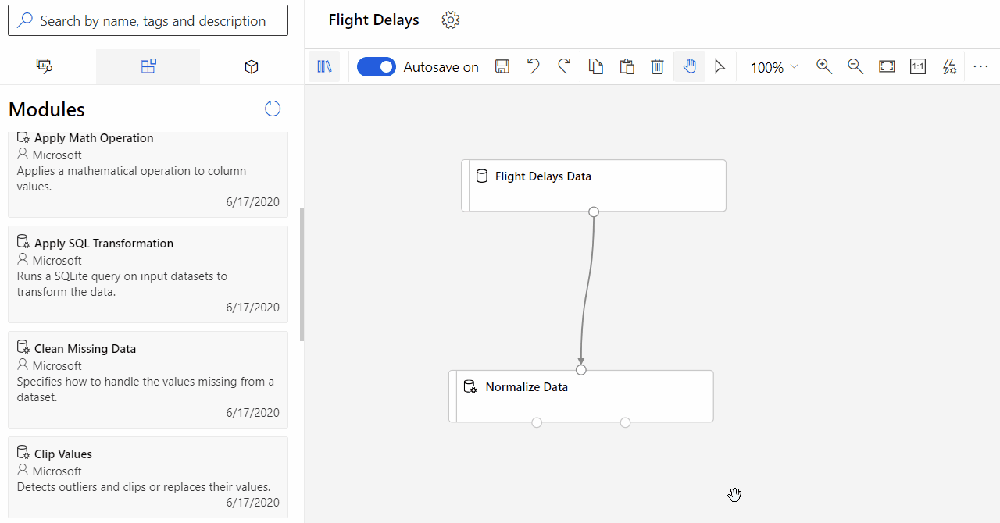

# Différences entre Azure Machine Learning et Machine Learning Studio (classique)

Cet article compare les caractéristiques, les fonctionnalités et l’interface d’Azure Machine Learning à Machine Learning Studio (classique). 

## À propos de Machine Learning Studio (classique)
[Machine Learning Studio (classique)](studio/what-is-ml-studio.md) est un espace de travail visuel collaboratif par glisser-déplacer dans lequel vous pouvez générer, tester et déployer des solutions de machine learning sans avoir à écrire du code. Il s’appuie sur des algorithmes de machine learning et des modules de traitement des données prédéfinis et préconfigurés, mais aussi sur une plateforme de calcul propriétaire.

## À propos d'Azure Machine Learning

[Azure Machine Learning](overview-what-is-azure-ml.md) propose également une interface web appelée le concepteur, **et** plusieurs SDK et une interface CLI pour préparer les données, et entraîner et déployer des modèles Machine Learning rapidement. Avec Azure Machine Learning, vous bénéficiez d’une mise à l’échelle, d’une prise en charge de plusieurs infrastructures, de fonctionnalités de ML avancées, telles que le Machine Learning automatisé et la prise en charge de pipeline.

Le concepteur Azure Machine Learning offre une expérience de glisser-déplacer similaire à Studio (classique). Cependant, contrairement à la plateforme de calcul propriétaire de Studio (classique), le concepteur utilise vos propres ressources de calcul, est évolutif, et est entièrement intégré à Azure Machine Learning.  

> [!TIP]
> Les clients qui utilisent ou évaluent actuellement Machine Learning Studio (classique) sont encouragés à essayer le [concepteur Azure Machine Learning](https://docs.microsoft.com/azure/machine-learning/concept-designer), qui fournit des modules ML par glisser-déposer __plus__ la scalabilité, la gestion de versions et la sécurité d’entreprise.

## Comparaison : Azure Machine Learning et Machine Learning Studio (classique)

Voici une comparaison rapide.

||  Concepteur Azure Machine Learning|Studio (classique) |
|---| --- | --- | 
|Interface de glisser-déposer| Oui | Oui|
|Expérience| Mise à l’échelle avec cible de calcul|Mise à l’échelle (limite de données d’entraînement de 10 Go) | 
|Modules pour l’interface| [Nombreux modules populaires](algorithm-module-reference/module-reference.md) | Divers |
|Cibles de calcul d’entraînement| Calcul AML (GPU/processeur)|Cible de calcul propriétaire, processeur uniquement|
|Inférence des cibles de calcul| Azure Kubernetes Service pour l’inférence en temps réel  Calcul AML pour l’inférence par lot|Format de service web propriétaire, non personnalisable | 
|Pipeline ML| Création de pipeline   Pipeline publié   Point de terminaison de pipeline   [En savoir plus sur le pipeline ML](concept-ml-pipelines.md)|Non pris en charge | 
|Opérations ML| Déploiement configurable, gestion de versions des modèles et pipelines|Gestion et déploiement des modèles de base | 
|Modèle| Format standard, différent, dépend du travail d’entraînement|Format propriétaire non portable.| 
|Entraînement automatisé des modèles|Pas encore dans le concepteur, mais possible via l’interface et les kits SDK.| Non | 

## Prise en main d’Azure Machine Learning

Les ressources suivantes peuvent vous aider dans la prise en main d’Azure Machine Learning

- Lire la [Vue d’ensemble d’Azure Machine Learning](tutorial-first-experiment-automated-ml.md) 

- [Créez votre premier pipeline de concepteur](tutorial-designer-automobile-price-train-score.md) pour prédire des tarifs automatiques.

## Étapes suivantes

En plus des fonctionnalités de glisser-déplacer dans le concepteur, Azure Machine Learning a d’autres outils :  
  + [Utiliser des notebooks Python pour entraîner et déployer des modèles ML](tutorial-1st-experiment-sdk-setup.md)
  + [Utiliser R Markdown pour entraîner et déployer des modèles ML](tutorial-1st-r-experiment.md) 
  + [Utiliser le Machine Learning automatisé pour entraîner et déployer des modèles ML](tutorial-designer-automobile-price-train-score.md) 
  + [Utiliser l’interface CLI Machine Learning pour entraîner et déployer un modèle](tutorial-train-deploy-model-cli.md)

