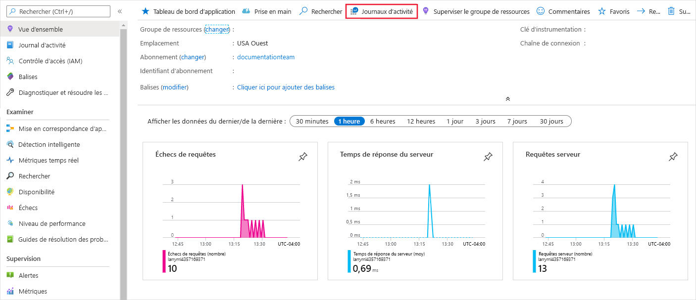
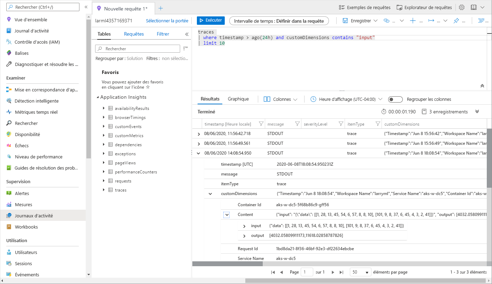

# <a name="monitor-and-collect-data-from-ml-web-service-endpoints"></a>Superviser et collecter des données à partir des points de terminaison de service web Machine Learning
[!INCLUDE [applies-to-skus](../../includes/aml-applies-to-basic-enterprise-sku.md)]

Dans cet article, vous allez apprendre à collecter des données à partir de points de terminaison de service web et à superviser les modèles déployés sur ces points de terminaison dans Azure Kubernetes Service (AKS) ou Azure Container Instances (ACI) en activant Azure Application Insights via 
* [SDK Python Azure Machine Learning](#python)
* [Azure Machine Learning Studio](#studio) sur https://ml.azure.com

En plus de la collecte des données de sortie et des réponses d’un point de terminaison, vous pouvez superviser les éléments suivants :

* Taux de demande, temps de réponse et taux d’échec
* Taux de dépendance, temps de réponse et taux d’échec
* Exceptions

[Découvrez plus en détail Azure Application Insights](../azure-monitor/app/app-insights-overview.md). 


## <a name="prerequisites"></a>Prérequis

* Si vous n’avez pas d’abonnement Azure, créez un compte gratuit avant de commencer. Essayez la [version gratuite ou payante d’Azure Machine Learning](https://aka.ms/AMLFree) dès aujourd’hui

* Un espace de travail Azure Machine Learning, un répertoire local contenant vos scripts, et le SDK Azure Machine Learning pour Python. Pour savoir comment obtenir ces prérequis, consultez [Guide pratique pour configurer un environnement de développement](how-to-configure-environment.md)

* Un modèle de machine learning entraîné à déployer sur Azure Kubernetes Service (AKS) ou Azure Container Instances (ACI). Si vous n’en avez pas, consultez le tutoriel [Effectuer l’apprentissage d’un modèle de classification d’images](tutorial-train-models-with-aml.md).

## <a name="web-service-metadata-and-response-data"></a>Métadonnées de service web et données de réponse

> [!IMPORTANT]
> Azure Application Insights ne journalise que les charges utiles jusqu’à 64 Ko. Si cette limite est atteinte, vous risquez de voir des erreurs de type mémoire insuffisante, ou aucune information ne pourrait être enregistrée.

Pour enregistrer les informations relatives à une demande au service web, ajoutez des instructions `print` à votre fichier score.py. Chaque instruction `print` génère une entrée dans la table de trace dans Application Insights, sous le message `STDOUT`. Le contenu de l’instruction `print` est contenu sous `customDimensions`, puis `Contents` dans la table de trace. Si vous imprimez une chaîne JSON, elle génère une structure de données hiérarchique dans la sortie de trace sous `Contents`.

Vous pouvez interroger Azure Application Insights directement pour accéder à ces données, ou configurer une [exportation continue](https://docs.microsoft.com/azure/azure-monitor/app/export-telemetry) vers un compte de stockage pour une conservation plus longue ou un traitement ultérieur. Les données de modèle peuvent ensuite être utilisées dans le service Azure Machine Learning pour configurer l’étiquetage, le réentraînement, l’explicabilité, l’analyse des données ou toute autre utilisation. 

<a name="python"></a>

## <a name="use-python-sdk-to-configure"></a>Utiliser le kit SDK Python pour la configuration 

### <a name="update-a-deployed-service"></a>Mettre à jour un service déployé

1. Recherchez le service dans votre espace de travail. La valeur de `ws` correspond au nom de votre espace de travail

    ```python
    from azureml.core.webservice import Webservice
    aks_service= Webservice(ws, "my-service-name")
    ```
2. Mettez à jour votre service et activez Azure Application Insights

    ```python
    aks_service.update(enable_app_insights=True)
    ```

### <a name="log-custom-traces-in-your-service"></a>Journaliser des traces personnalisées dans votre service

Si vous voulez journaliser des traces personnalisées, suivez le processus de déploiement standard pour AKS ou ACI dans le document [Comment et où déployer](how-to-deploy-and-where.md). Puis procédez comme suit :

1. Pour envoyer des données à Application Insights pendant l’inférence, mettez à jour le fichier de scoring en ajoutant des instructions print. Pour consigner des informations plus complexes, telles que les données de requête et la réponse, utilisez une structure JSON. L’exemple de fichier score.py suivant enregistre l’heure à laquelle le modèle est initialisé, l’entrée et la sortie pendant l’inférence et le moment où des erreurs se produisent :

    > [!IMPORTANT]
    > Azure Application Insights ne journalise que les charges utiles jusqu’à 64 Ko. Si cette limite est atteinte, vous risquez de voir des erreurs de type mémoire insuffisante, ou aucune information ne pourrait être enregistrée. Si les données que vous souhaitez consigner sont plus volumineuses, vous devez les stocker dans le stockage d’objets BLOB à l’aide des informations contenues dans [Collecter des données pour des modèles en production](how-to-enable-data-collection.md).
    
    ```python
    import pickle
    import json
    import numpy 
    from sklearn.externals import joblib
    from sklearn.linear_model import Ridge
    from azureml.core.model import Model
    import time

    def init():
        global model
        #Print statement for appinsights custom traces:
        print ("model initialized" + time.strftime("%H:%M:%S"))
        
        # note here "sklearn_regression_model.pkl" is the name of the model registered under the workspace
        # this call should return the path to the model.pkl file on the local disk.
        model_path = Model.get_model_path(model_name = 'sklearn_regression_model.pkl')
        
        # deserialize the model file back into a sklearn model
        model = joblib.load(model_path)
    

    # note you can pass in multiple rows for scoring
    def run(raw_data):
        try:
            data = json.loads(raw_data)['data']
            data = numpy.array(data)
            result = model.predict(data)
            # Log the input and output data to appinsights:
            info = {
                "input": raw_data,
                "output": result.tolist()
                }
            print(json.dumps(info))
            # you can return any datatype as long as it is JSON-serializable
            return result.tolist()
        except Exception as e:
            error = str(e)
            print (error + time.strftime("%H:%M:%S"))
            return error
    ```

2. Mettez à jour la configuration du service
    
    ```python
    config = Webservice.deploy_configuration(enable_app_insights=True)
    ```

3. Générez une image et déployez-la sur [AKS ou ACI](how-to-deploy-and-where.md).

### <a name="disable-tracking-in-python"></a>Désactiver le suivi dans Python

Pour désactiver Azure Application Insights, utilisez le code suivant :

```python 
## replace <service_name> with the name of the web service
<service_name>.update(enable_app_insights=False)
```

<a name="studio"></a>

## <a name="use-azure-machine-learning-studio-to-configure"></a>Utiliser Azure Machine Learning Studio pour effectuer la configuration

Vous pouvez également effectuer les étapes suivantes pour activer Azure Application Insights à partir d’Azure Machine Learning Studio quand vous êtes prêt à déployer votre modèle.

1. Connectez-vous à votre espace de travail sur https://ml.azure.com/
1. Accédez à **Modèles**, puis sélectionnez le modèle que vous voulez déployer
1. Sélectionnez **+ Déployer**
1. Renseignez le formulaire **Déployer le modèle**
1. Développez le menu **Avancé**

    
1. Sélectionnez **Activer les diagnostics et la collecte de données Application Insights**

    
## <a name="evaluate-data"></a>Évaluer les données
Les données de votre service sont stockées dans votre compte Azure Application Insights, dans le même groupe de ressources qu’Azure Machine Learning.
Pour l’afficher :

1. Accédez à votre espace de travail Azure Machine Learning dans le [portail Azure](https://ms.portal.azure.com/), puis cliquez sur le lien Application Insights

    [](././media/how-to-enable-app-insights/AppInsightsLoc.png#lightbox)

1. À partir de la **Vue d’ensemble** ou la section __Surveillance__ dans la liste à gauche, sélectionnez __Journaux__.

    [](./media/how-to-enable-app-insights/overview.png#lightbox)

1. Pour afficher les informations consignées dans le fichier score.py, examinez la table __traces__. La requête suivante recherche les journaux dans lesquels la valeur __input__ a été consignée :

    ```kusto
    traces
    | where customDimensions contains "input"
    | limit 10
    ```

   [](././media/how-to-enable-app-insights/model-data-trace.png#lightbox)

Pour plus d’informations sur l’utilisation d’Azure Application Insights, consultez [Présentation d’Application Insights](../azure-monitor/app/app-insights-overview.md).

## <a name="export-data-for-further-processing-and-longer-retention"></a>Exporter des données pour un traitement ultérieur et une plus longue conservation

>[!Important]
> Azure Application Insights ne prend en charge que les exportations vers le Stockage Blob. Les limites supplémentaires de cette fonction d’exportation sont répertoriées dans [Exporter la télémétrie depuis Application Insights](https://docs.microsoft.com/azure/azure-monitor/app/export-telemetry#continuous-export-advanced-storage-configuration).

Vous pouvez utiliser l’[exportation continue](https://docs.microsoft.com/azure/azure-monitor/app/export-telemetry) d’Azure Application Insights pour envoyer des messages à un compte de stockage pris en charge, lorsqu’une conservation plus longue peut être définie. Les données sont stockées au format JSON et peuvent être facilement analysées pour extraire des données de modèle. 

Vous pouvez utiliser Azure Data Factory, les pipelines Azure ML ou d’autres outils de traitement de données pour transformer les données en fonction des besoins. Une fois les données transformées, vous pouvez les inscrire auprès de l’espace de travail d’Azure Machine Learning en tant que jeu de données. Pour cela, consultez [How to create and register datasets](how-to-create-register-datasets.md) (Comment créer et inscrire des jeux de données).

   [](././media/how-to-enable-app-insights/continuous-export-setup.png)


## <a name="example-notebook"></a>Exemple de bloc-notes

Le notebook [enable-app-insights-in-production-service.ipynb](https://github.com/Azure/MachineLearningNotebooks/blob/master/how-to-use-azureml/deployment/enable-app-insights-in-production-service/enable-app-insights-in-production-service.ipynb) illustre les concepts présentés dans cet article. 
 
[!INCLUDE [aml-clone-in-azure-notebook](../../includes/aml-clone-for-examples.md)]

## <a name="next-steps"></a>Étapes suivantes

* Consultez [Déployer un modèle sur un cluster Azure Kubernetes Service](https://docs.microsoft.com/azure/machine-learning/how-to-deploy-azure-kubernetes-service) ou [Déployer un modèle sur Azure Container Instances](https://docs.microsoft.com/azure/machine-learning/how-to-deploy-azure-container-instance) pour déployer vos modèles sur des points de terminaison de service web et permettre à Azure Application Insights de tirer parti de la supervision des points de terminaison et de la collecte de données
* Consultez [MLOps : Déployer, gérer et superviser des modèles avec Azure Machine Learning](https://docs.microsoft.com/azure/machine-learning/concept-model-management-and-deployment) pour en savoir plus sur l’exploitation des données collectées à partir des modèles en production. Ces données peuvent vous aider à améliorer continuellement votre processus de Machine Learning
