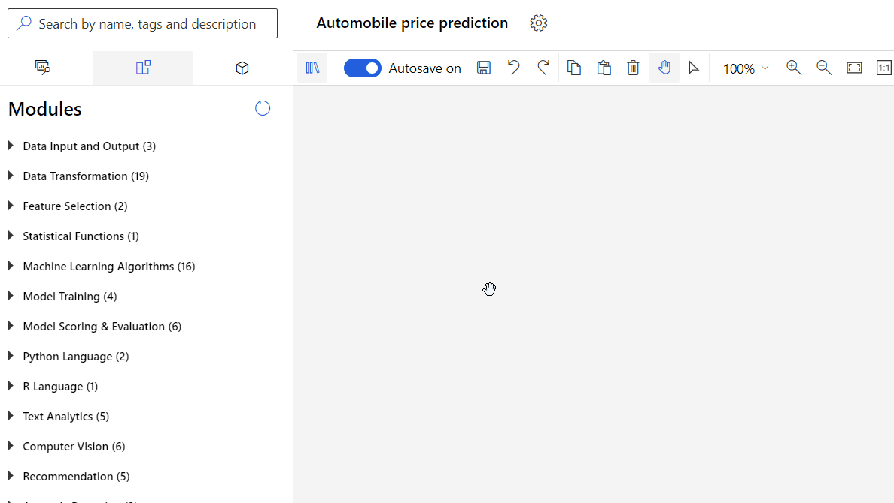
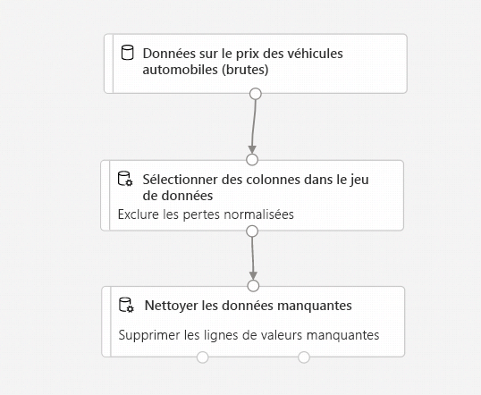
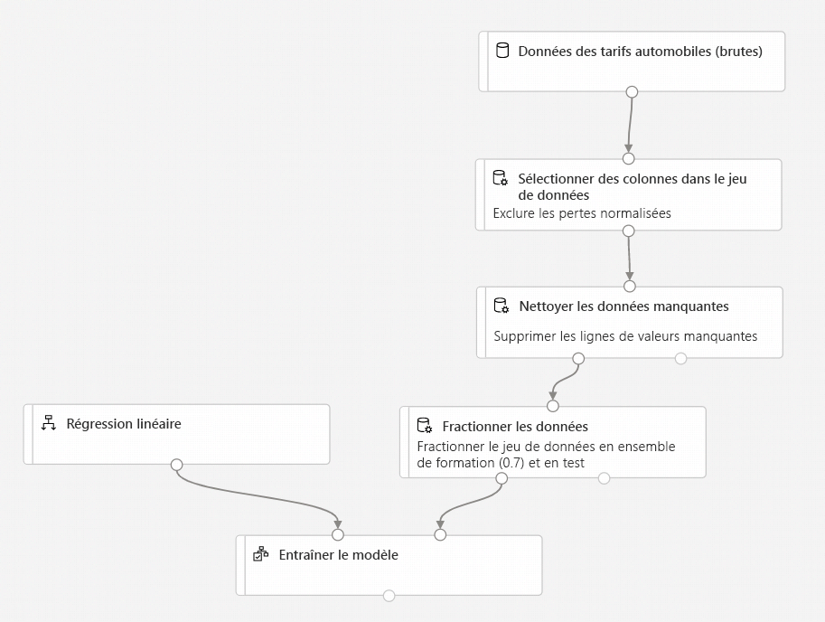
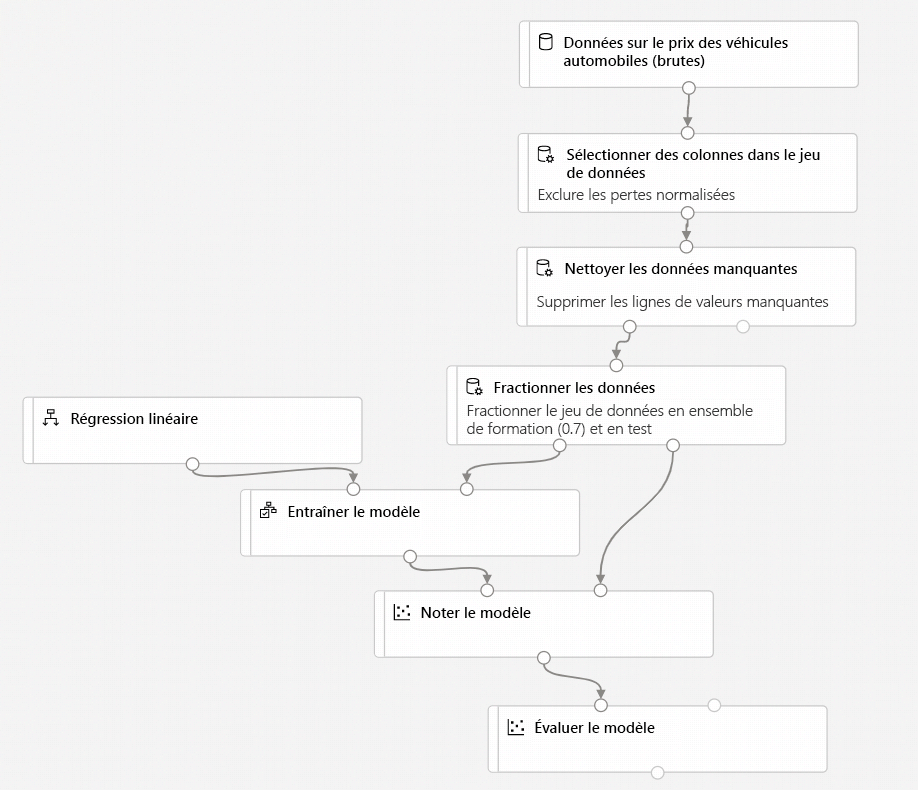
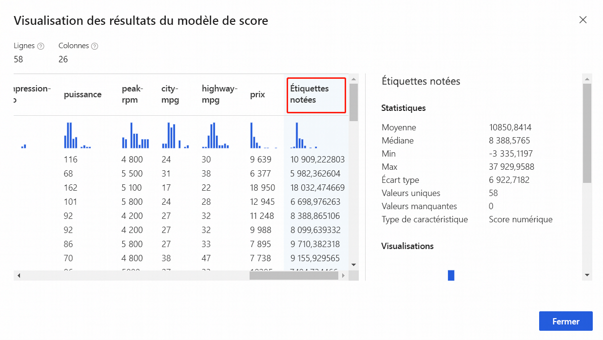

# Tutoriel : Prédire le prix de voitures avec le concepteur (version préliminaire)
[!INCLUDE [applies-to-skus](../../includes/aml-applies-to-enterprise-sku.md)]

Dans ce tutoriel en deux parties, vous découvrez comment utiliser le concepteur d’Azure Machine Learning pour entraîner et déployer un modèle Machine Learning qui prédit le prix des voitures. Le concepteur est un outil de type glisser-déposer avec lequel vous créez des modèles Machine Learning sans écrire une seule ligne de code.

Dans la première partie du tutoriel, vous allez apprendre à :

> [!div class="checklist"]
> * Créer un pipeline
> * Importer des données
> * Préparer les données
> * Entraîner un modèle Machine Learning
> * Évaluer un modèle Machine Learning

Dans la [deuxième partie](tutorial-designer-automobile-price-deploy.md) du tutoriel, vous allez déployer votre modèle en tant que point de terminaison d’inférence en temps réel pour prédire le prix de n’importe quel véhicule en fonction des caractéristiques techniques que vous lui envoyez. 

> [!NOTE]
>Une version complète de ce tutoriel est disponible en tant qu’exemple de pipeline.
>
>Pour le trouver, accédez au concepteur dans votre espace de travail. Dans la section **Nouveau pipeline**, sélectionnez **Exemple 1 - Régression : Prédiction du prix de véhicules automobiles (de base)** .

## Créer un pipeline

Les pipelines Azure Machine Learning organisent plusieurs étapes de machine learning et de traitement de données en une même ressource. Les pipelines vous permettent d’organiser, de gérer et de réutiliser des workflows de Machine Learning complexes entre des projets et des utilisateurs.

Pour créer un pipeline Azure Machine Learning, vous devez disposer d’un espace de travail Azure Machine Learning. Dans cette section, vous découvrez comment créer ces deux ressources.

### Créer un espace de travail

Pour utiliser le concepteur, vous avez d’abord besoin d’un espace de travail Azure Machine Learning. L’espace de travail est la ressource de niveau supérieur pour Azure Machine Learning. Il fournit un emplacement centralisé où vous interagissez avec tous les artefacts que vous créez dans Azure Machine Learning.

Si vous avez un espace de travail Azure Machine Learning édition Entreprise, [passez à la section suivante](#create-the-pipeline).

[!INCLUDE [aml-create-portal](../../includes/aml-create-in-portal-enterprise.md)]

### Créer le pipeline

1. Connectez-vous à <a href="https://ml.azure.com?tabs=jre" target="_blank">ml.azure.com</a>, puis sélectionnez l’espace de travail à utiliser.

1. Sélectionnez **Concepteur**.

    

1. Sélectionnez **Modules prédéfinis faciles à utiliser**.

1. En haut du canevas, sélectionnez le nom de pipeline par défaut **Pipeline-Created-on**. Renommez-le *Automobile price prediction*. Le nom n’a pas besoin d’être unique.

## Définir la cible de calcul par défaut

Un pipeline s’exécute sur une cible de calcul, qui est une ressource de calcul attachée à votre espace de travail. Une fois que vous avez créé une cible de calcul, vous pouvez la réutiliser pour d’autres exécutions ultérieures.

Vous pouvez définir une **cible de calcul par défaut** pour le pipeline entier si vous souhaitez que tous les modules utilisent la même cible de calcul par défaut. Toutefois, vous pouvez définir des cibles de calcul différentes selon les modules.

1. À côté du nom du pipeline, sélectionnez l’**icône d’engrenage**  en haut du canevas pour ouvrir le volet **Paramètres**.

1. Dans le volet **Paramètres** à droite du canevas, sélectionnez **Sélectionner une cible de calcul**.

    Si vous avez déjà une cible de calcul, vous pouvez la sélectionner pour exécuter ce pipeline.

    > [!NOTE]
    > Le concepteur ne peut exécuter des expériences que sur des cibles Capacité de calcul Azure Machine Learning. Les autres cibles de calcul ne sont pas affichées.

1. Entrez un nom pour la ressource de calcul.

1. Sélectionnez **Enregistrer**.

    > [!NOTE]
    > La création d’une ressource de calcul prend environ cinq minutes. Une fois que la ressource a été créée, vous pouvez la réutiliser pour les exécutions ultérieures, ce qui vous évite ce temps d’attente.
    >
    > Afin de réduire vos coûts, la ressource de calcul est automatiquement mise à l’échelle à zéro nœud quand elle est inactive. Quand vous la réutilisez après un temps d’inactivité, vous pourriez encore avoir à attendre environ cinq minutes pendant le scale-up de la ressource de calcul.

## Importer des données

Un certain nombre d’exemples de jeux de données que vous pouvez expérimenter sont inclus dans le concepteur. Pour les besoins de ce tutoriel, vous allez utiliser **Automobile price data (Raw)** (Données sur le prix des véhicules automobiles [brutes]). 

1. Sur la gauche du canevas de pipeline se trouve une palette de jeux de données et de modules. Sélectionnez **Datasets** (Jeux de données), puis affichez la section **Samples** (Exemples) pour voir les exemples de jeux de données disponibles.

1. Sélectionnez le jeu de données **Automobile price data (raw)** (Données sur le prix des automobiles (brut)), puis faites-le glisser vers le canevas.

   

### Visualiser les données

Vous pouvez visualiser les données pour comprendre le jeu de données que vous allez utiliser.

1. Sélectionnez le module **Automobile price data (Raw)** .

1. Dans le volet d’informations du module à droite du canevas, sélectionnez **Outputs** (Sorties).

1. Sélectionnez l’icône de graphique pour visualiser les données.

    

1. Cliquez sur différentes colonnes dans la fenêtre de données pour visualiser des informations les concernant.

    Chaque ligne représente un véhicule automobile et chaque colonne représente une variable associée au véhicule automobile. Ce jeu de données contient 205 lignes et 26 colonnes.

## Préparer les données

Les jeux de données nécessitent généralement un prétraitement avant l’analyse. Vous avez peut-être remarqué qu’il manquait des valeurs durant l’inspection du jeu de données. Ces valeurs manquantes doivent être nettoyées pour que le modèle puisse analyser les données correctement.

### Supprimer une colonne

Quand vous entraînez un modèle, vous devez traiter le problème des données manquantes. Dans ce jeu de données, la colonne **normalized-losses** (pertes normalisées) a de nombreuses valeurs manquantes : vous allez donc l’exclure du modèle.

1. Dans la palette des modules à gauche du canevas, développez la section **Data Transformation** (Transformation des données) et recherchez le module **Select Columns in Dataset** (Sélectionner les colonnes dans le jeu de données).

1. Faites glisser le module **Select Columns in Dataset** vers le canevas. Déposez-le sous le module de jeu de données.

1. Connectez le jeu de données **Automobile price data (Raw)** (Données sur le prix des automobiles (brut)) au module **Select Columns in Dataset**. Faites-le glisser depuis le port de sortie du jeu de données, qui est le petit cercle situé en bas du jeu de données sur le canevas, jusqu’au port d’entrée de **Select Columns in Dataset**, qui est le petit cercle en haut du module.

    > [!TIP]
    > Vous créez un flux de données à travers votre pipeline quand vous connectez le port de sortie d’un module au port d’entrée d’un autre module.
    >

    

1. Sélectionnez le module **Select Columns in Dataset**.

1. Dans le volet d’informations du module à droite du canevas, sélectionnez **Edit column** (Modifier une colonne).

1. Développez la liste déroulante **Column names** (Noms des colonnes) à côté de **Include** (Inclure), puis sélectionnez **All columns** (Toutes les colonnes).

1. Sélectionnez le signe **+** pour ajouter une règle.

1. Dans les menus déroulants, sélectionnez **Exclude** (Exclure) et **Column names** (Noms des colonnes).
    
1. Entrez *normalized-losses* (pertes normalisées) dans la zone de texte.

1. En bas à droite, sélectionnez **Enregistrer** pour fermer le sélecteur de colonne.

    

1. Sélectionnez le module **Select Columns in Dataset**. 

1. Dans le volet d’informations du module à droite du canevas, sélectionnez la zone de texte **Comment** (Commentaire) et entrez *Exclure les pertes normalisées*.

    Les commentaires sont affichés sur le graphe pour vous aider à organiser votre pipeline.

### Nettoyage des données manquantes

Il manque encore des valeurs dans votre jeu de données après la suppression de la colonne **normalized-losses**. Vous pouvez supprimer les données manquantes restantes à l’aide du module **Clean Missing Data** (Nettoyer les données manquantes).

> [!TIP]
> Le nettoyage des valeurs manquantes dans les données d’entrée est un prérequis pour l’utilisation de la plupart des modules dans le concepteur.

1. Dans la palette des modules à gauche du canevas, développez la section **Data Transformation** (Transformation des données) et recherchez le module **Clean Missing Data**.

1. Faites glisser le module **Clean Missing Data** vers le canevas du pipeline. Connectez-le au module **Select Columns in Dataset**. 

1. Sélectionnez le module **Clean Missing Data**.

1. Dans le volet d’informations du module à droite du canevas, sélectionnez **Remove entire row** (Supprimer la ligne entière) sous **Cleaning mode** (Mode de nettoyage).

1. Dans le volet d’informations du module à droite du canevas, sélectionnez la zone de texte **Comment** (Commentaire) et entrez *Supprimer les lignes avec des valeurs manquantes*. 

    Votre pipeline doit maintenant se présenter comme ceci :
    
    

## Entraîner un modèle Machine Learning

Une fois les modules en place pour traiter les données, vous pouvez configurer les modules d’entraînement.

Comme vous voulez prédire un prix, à savoir un nombre, vous pouvez utiliser un algorithme de régression. Pour cet exemple, vous utilisez un modèle de régression linéaire.

### Fractionner les données

Le fractionnement des données est une tâche courante de Machine Learning. Vous allez diviser vos données en deux jeux de données distincts. Un jeu de données entraîne le modèle et l’autre teste les performances du modèle.

1. Dans la palette de modules, développez la section **Data Transformation** et recherchez le module **Split Data** (Fractionner les données).

1. Faites glisser le module **Split Data** vers le canevas du pipeline.

1. Connectez le port de gauche du module **Clean Missing Data** au module **Split Data**.

    > [!IMPORTANT]
    > Vérifiez que le port de sortie de gauche de **Clean Missing Data** est connecté à **Split Data**. Le port de gauche contient les données nettoyées. Le port de droite contient les données ignorées.

1. Sélectionnez le module **Fractionner les données**.

1. Dans le volet d’informations du module à droite du canevas, définissez l’option **Fraction of rows in the first output dataset** (Fraction de lignes dans le premier jeu de données de sortie) à la valeur 0,7.

    Cette option permet de diviser les données afin d’en utiliser 70 % pour entraîner le modèle et 30 % pour tester ce dernier. Le jeu de données comprenant 70 % des données est accessible par le biais du port de sortie de gauche. Les données restantes sont disponibles par le biais du port de sortie de droite.

1. Dans le volet d’informations du module à droite du canevas, sélectionnez la zone de texte **Comment** (Commentaire) et entrez *Diviser le jeu de données en un jeu d’entraînement (0,7) et un jeu de test (0,3)* .

### Effectuer l’apprentissage du modèle

Entraînez le modèle en lui fournissant un jeu de données incluant le prix. L’algorithme construit un modèle qui explique la relation entre les caractéristiques et le prix dans les données d’entraînement.

1. Dans la palette des modules, développez **Machine Learning Algorithms** (Algorithmes Machine Learning).
    
    Cette option affiche plusieurs catégories de module qui vous permettent d’initialiser les algorithmes d’apprentissage.

1. Sélectionnez **Regression** > **Linear Regression** (Régression > Régression linéaire), puis faites glisser le module vers le canevas du pipeline.

1. Recherchez et faites glisser le module **Entraîner le modèle** jusqu’au canevas du pipeline. 

1. Connectez la sortie du module **Linear Regression** (Régression linéaire) à l’entrée gauche du module **Train model** (Entraîner le modèle).

1. Connectez la sortie des données d’entraînement (port de gauche) du module **Fractionner les données** à l’entrée droite du module **Entraîner le modèle**.
    
    > [!IMPORTANT]
    > Vérifiez que le port de sortie de gauche de **Split Data** est connecté à **Train Model**. Le port de gauche contient le jeu d’entraînement. Le port de droite contient le jeu de test.

    

1. Dans la palette des modules, développez la section **Module training** (Entraînement de module), puis faites glisser le module **Train Model** (Entraîner le modèle) vers le canevas.

1. Sélectionnez le module **Entraîner le modèle**.

1. Dans le volet d’informations du module à droite du canevas, sélectionnez **Edit column** (Modifier une colonne).

1. Dans la boîte de dialogue **Label column** (Étiqueter une colonne), développez le menu déroulant, puis sélectionnez **Column names** (Noms de colonnes). 

1. Dans la zone de texte, entrez *price* pour spécifier la valeur que votre modèle va prédire.

    Votre pipeline doit se présenter comme suit :

    

### Ajoutez le module Score Model (Noter le modèle)

Une fois que vous avez entraîné votre modèle à l’aide de 70 % des données, vous pouvez l’utiliser pour attribuer un score aux 30 % de données restants, et vérifier ainsi son bon fonctionnement.

1. Entrez *score model* (score du modèle) dans la zone de recherche pour trouver le module **Score Model**. Faites glisser le module vers le canevas du pipeline. 

1. Connectez la sortie du module **Entraîner le modèle** au port d’entrée de gauche du module **Scorer le modèle**. Connectez la sortie des données de test (port de droite) du module **Fractionner les données** au port d’entrée de droite du module **Scorer le modèle**.

### Ajouter le module Évaluer le modèle

Utilisez le module **Evaluate Model** (Évaluer le modèle) pour évaluer le score attribué par votre modèle au jeu de données de test.

1. Entrez *evaluate* (évaluer) dans la zone de recherche pour trouver le module **Evaluate Model** (Évaluer le modèle). Faites glisser le module vers le canevas du pipeline. 

1. Connectez la sortie du module **Scorer le modèle** à l’entrée de gauche du module **Évaluer le modèle**. 

    Le pipeline final doit maintenant se présenter comme ceci :

    

## Exécuter le pipeline

Quand vous avez terminé la configuration de votre pipeline, vous pouvez lancer son exécution pour entraîner le modèle Machine Learning. Vous pouvez lancer l’exécution d’un pipeline à tout moment quand vous créez des pipelines dans le concepteur. Ceci vous permet de vérifier votre travail au fur et à mesure et de vous assurer que le pipeline fonctionne comme prévu.

1. En haut du canevas, sélectionnez **Run** (Exécuter).

1. Dans la boîte de dialogue **Set up pipeline run** (Configurer l’exécution du pipeline), sélectionnez **+ Nouvelle expérience** pour **Expérience**.

    > [!NOTE]
    > Les expériences regroupent les exécutions de pipeline similaires. Si vous exécutez un pipeline plusieurs fois, vous pouvez sélectionner la même expérience pour les exécutions successives.

    1. Entrez un nom descriptif pour le **Nom d’expérience**.

    1. Sélectionnez **Exécuter**.
    
    Vous pouvez voir l’état et les détails de l’exécution en haut à droite du canevas.

### Afficher les étiquettes de score

Une fois l’exécution terminée, vous pouvez voir les résultats de l’exécution du pipeline. Tout d’abord, examinez les prédictions générées par le modèle de régression.

1. Sélectionnez le module **Score Model** pour afficher sa sortie.

1. Dans le volet d’informations du module à droite du canevas, sélectionnez **Outputs** (Sorties) > icône de graphe  pour voir les résultats.

    Vous pouvez voir ici les prix prédits et les prix réels des données à partir des données de test.

    

### Évaluer les modèles

Utilisez **Evaluate Model** pour voir ce que donne le modèle entraîné sur le jeu de données de test.

1. Sélectionnez le module **Evaluate Model** pour afficher sa sortie.

1. Dans le volet d’informations du module à droite du canevas, sélectionnez **Output** (Sortie) > icône de graphe  pour voir les résultats.

Les statistiques suivantes s’affichent pour votre modèle :

* **Erreur absolue moyenne** : Moyenne des erreurs absolues. Une erreur est la différence entre la valeur prédite et la valeur réelle.
* **Racine carrée de l’erreur quadratique moyenne** : la racine carrée de la moyenne des erreurs carrées des prévisions effectuées sur le jeu de données de test.
* **Erreur absolue relative**: la moyenne des erreurs absolues relative à la différence absolue entre les valeurs réelles et la moyenne de toutes les valeurs réelles.
* **Erreur carrée relative** : la moyenne des erreurs carrées relative à la différence carrée entre les valeurs réelles et la moyenne de toutes les valeurs réelles.
* **Coefficient de détermination** : Également connue sous le nom de valeur R au carré, cette métrique statistique indique dans quelle mesure un modèle correspond aux données.

Pour chacune des statistiques liées aux erreurs, les valeurs les plus petites sont privilégiées. En effet, une valeur plus petite indique que les prédictions sont plus près des valeurs réelles. Plus la valeur du coefficient de détermination est proche de un (1,0), plus les prévisions sont correctes.

## Nettoyer les ressources

Ignorez cette section si vous souhaitez passer à la deuxième partie du tutoriel sur le [déploiement de modèles](tutorial-designer-automobile-price-deploy.md).

[!INCLUDE [aml-ui-cleanup](../../includes/aml-ui-cleanup.md)]

## Étapes suivantes

Dans la deuxième partie, vous allez découvrir comment déployer votre modèle en tant que point de terminaison en temps réel.

> [!div class="nextstepaction"]
> [Continuer avec le déploiement des modèles](tutorial-designer-automobile-price-deploy.md)
