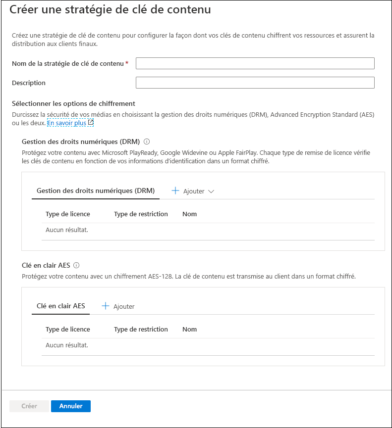
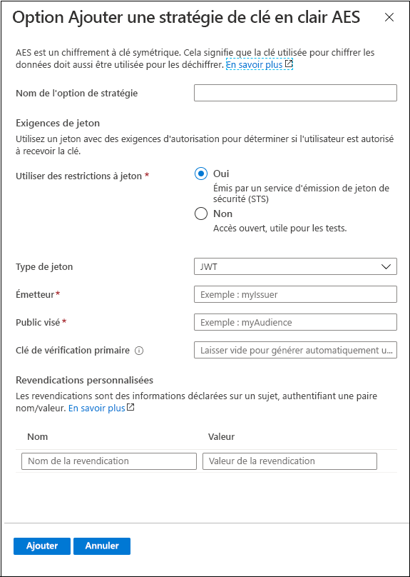
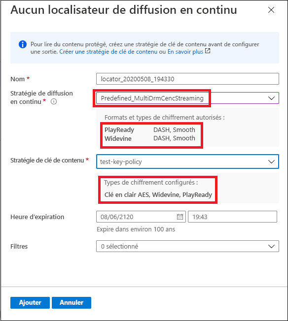

# Démarrage rapide : Utiliser le portail pour chiffrer du contenu

Utilisez Azure Media Services pour sécuriser votre contenu multimédia du moment où il quitte votre ordinateur jusqu’à sa remise, en passant par le stockage et le traitement. Media Services vous permet de transmettre votre contenu dynamique ou à la demande chiffré dynamiquement avec la norme Advanced Encryption Standard (AES-128) ou un des principaux systèmes de gestion des droits numériques (DRM) : Microsoft PlayReady, Google Widevine et Apple FairPlay. Media Services fournit également un service de distribution de clés AES et licences (PlayReady, Widevine et FairPlay) DRM aux clients autorisés. 
 
Pour spécifier les options de chiffrement (le cas échéant) de votre flux, vous devez utiliser une **stratégie de streaming** et l’associer à votre localisateur de streaming. Vous créez la **stratégie de clé de contenu** pour configurer la façon dont la clé de contenu (qui fournit un accès sécurisé à vos **actifs multimédias**) est distribuée aux clients finaux. Vous devez définir les exigences (restrictions) de stratégie de clé de contenu à respecter pour que les clés ayant la configuration spécifiée soient distribuées aux clients. 

> [!NOTE]
> La stratégie de clé de contenu n’est pas nécessaire pour un téléchargement ou un streaming en clair.

Lorsqu’un flux est demandé par un lecteur, Media Services utilise la clé spécifiée pour chiffrer dynamiquement votre contenu à l’aide du chiffrement de clé en clair AES ou DRM. Pour déchiffrer le flux, le lecteur demande la clé au service de remise des clés Media Services, ou au service de remise des clés que vous avez spécifié. Pour déterminer si l’utilisateur est autorisé ou non à obtenir la clé, le service évalue la **stratégie de clé de contenu** que vous avez spécifiée pour la clé.

Ce guide de démarrage rapide vous montre comment créer une stratégie de clé de contenu dans laquelle vous spécifiez le chiffrement à appliquer à votre actif multimédia au moment de son streaming. Le guide de démarrage rapide montre également comment définir le chiffrement configuré pour votre actif multimédia.

### Lecture préalable suggérée

* [Chiffrement dynamique et distribution de clé](content-protection-overview.md)
* [Localisateurs de Streaming](streaming-locators-concept.md)
* [Stratégies de streaming](streaming-policy-concept.md)
* [Stratégies de clé de contenu](content-key-policy-concept.md)

## Prérequis

Chargez et traitez votre contenu comme indiqué dans la rubrique décrivant la [gestion des actifs multimédias dans le portail Azure](manage-assets-quickstart.md)

## Créer une stratégie de clé de contenu

Créez la **stratégie de clé de contenu** pour configurer la façon dont la clé de contenu (qui fournit un accès sécurisé à vos **actifs multimédias**) est distribuée aux clients finaux.

1. Connectez-vous au [portail Azure](https://portal.azure.com/).
1. Recherchez votre compte Media Services, puis cliquez sur celui-ci.
1. Sélectionnez **Stratégies de clé de contenu (nouvelles)** .
1. Appuyez sur **+ Ajouter une stratégie de clé de contenu** en haut de la fenêtre. 

La fenêtre **Créer une stratégie de clé de contenu** apparaît. Dans cette fenêtre, choisissez les options de chiffrement. Vous pouvez choisir de protéger votre contenu multimédia à l’aide de la gestion des droits numériques (DRM), de la norme Advanced Encryption Standard (AES), ou des deux.  

Que vous choisissiez l’une des options DRM ou une option de clé en clair AES-128, il est recommandé de spécifier la façon dont vous souhaitez configurer les restrictions. Vous avez le choix entre utiliser une autorisation sans restriction ou une autorisation dépendant de restrictions basées sur un jeton. Pour des explications détaillées, consultez [Contrôle de l’accès au contenu](content-protection-overview.md#controlling-content-access).

### Ajouter une clé de contenu DRM

Vous pouvez choisir de protéger votre contenu avec Microsoft PlayReady et/ou Google Widevine ou Apple FairPlay. Chaque type de distribution de licence vérifie les clés de contenu en fonction de vos informations d’identification dans un format chiffré.

#### Modèles de licence

Pour plus d’informations sur les modèles de licence, consultez :

* [Modèle de licence Google Widevine](widevine-license-template-overview.md)

    > [!NOTE]
    > Vous pouvez créer un modèle de licence vide sans valeurs, avec simplement "{}". Dans ce cas, un modèle de licence est créé avec les valeurs par défaut. Les valeurs par défaut fonctionnent pour la plupart des cas.
* [Configuration et conditions de licence Apple FairPlay](fairplay-license-overview.md)
* [Modèle de licence PlayReady](playready-license-template-overview.md)

### Ajouter une clé en clair AES

Vous pouvez également ajouter un chiffrement à clé en clair AES-128 à votre contenu. La clé de contenu est transmise au client dans un format non chiffré.

## Créer un localisateur de streaming pour votre actif multimédia

1. Recherchez votre compte Media Services, puis cliquez sur celui-ci.
1. Sélectionnez **Actifs multimédias (nouveaux)** .
1. Dans la liste des actifs multimédias, sélectionnez celui que vous souhaitez chiffrer.  
1. Dans la section **Localisateur de streaming** de l’actif multimédia sélectionné, appuyez sur **+ Ajouter un localisateur de streaming**. 
1. Sélectionnez une **stratégie de streaming** appropriée à la **stratégie de clé de contenu** que vous avez configurée.

    La rubrique [Stratégies de streaming](streaming-policy-concept.md) explique en détail les correspondances entre les stratégies de streaming et les stratégies de clé de contenu.
1. Une fois que vous avez sélectionné la stratégie de streaming appropriée, vous pouvez sélectionner la stratégie de clé de contenu correspondante dans la liste déroulante.
1. Appuyez sur **Ajouter** pour ajouter le localisateur de streaming à votre actif multimédia.

    Cela entraîne la publication de l’actif multimédia et la génération des URL de streaming.

## Nettoyer les ressources

Si vous envisagez d’essayer les autres démarrages rapides, vous devez vous en tenir aux ressources créées. Dans le cas contraire, accédez au Portail Azure et à vos groupes de ressources, sélectionnez le groupe de ressources sous lequel vous avez exécuté ce guide de démarrage rapide, puis supprimez toutes les ressources.

## Étapes suivantes

[Gérer les actifs multimédias](manage-assets-quickstart.md)
