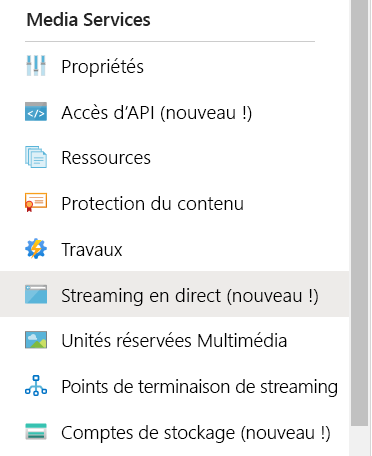
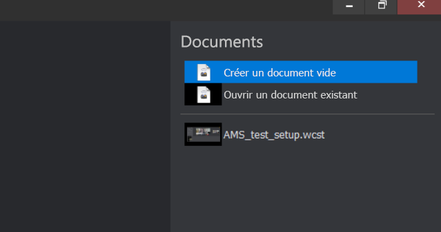
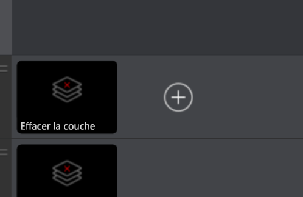
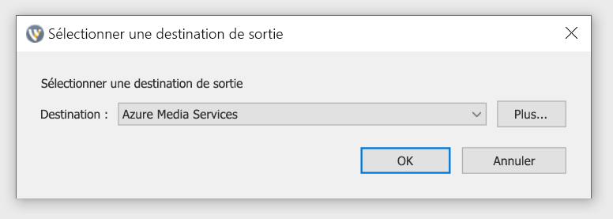
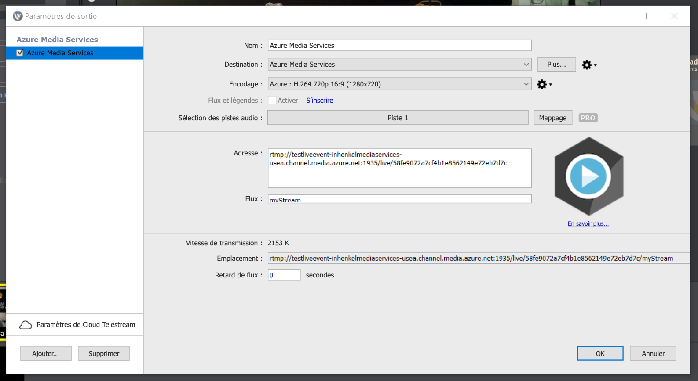
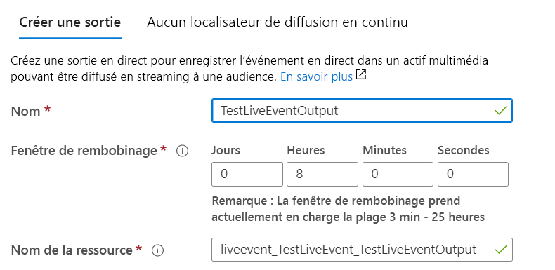
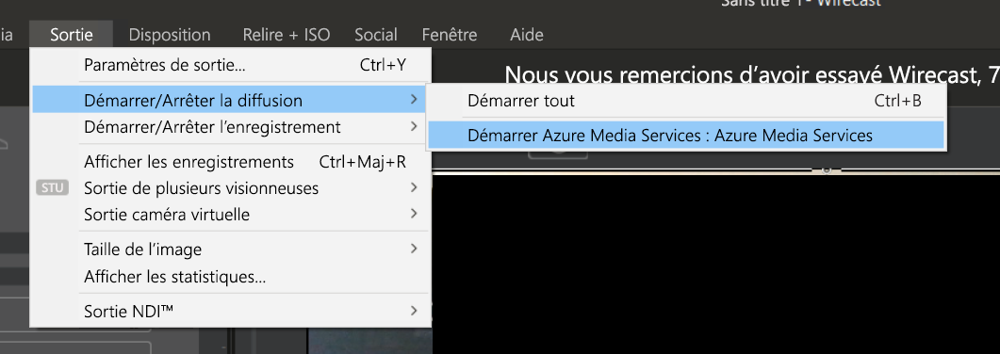
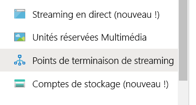

# Créer un stream en direct Azure Media Services avec le portail et Wirecast

Ce guide de démarrage rapide suppose que vous disposez d’un abonnement Azure et que vous avez créé un compte Azure Media Services.

Si vous n’avez pas d’abonnement Azure, créez un compte [gratuit](https://azure.microsoft.com/free/) avant de commencer.

## Se connecter au portail Azure.

Ouvrez votre navigateur web et accédez au [portail Microsoft Azure](https://portal.azure.com/). Entrez vos informations d’identification pour vous connecter au portail. Il s’ouvre par défaut sur le tableau de bord des services.

Dans ce guide de démarrage rapide, nous allons aborder les points suivants :

- Configuration d’un encodeur local avec un essai gratuit de Telestream Wirecast
- Configuration d’un stream en direct
- Configuration de sorties de stream en direct
- Exécution d’un point de terminaison de streaming par défaut
- Utilisation du Lecteur multimédia Azure pour afficher le stream en direct et la sortie à la demande

Pour simplifier les choses, nous allons utiliser un encodage prédéfini pour Azure Media Services dans Wirecast, l’encodage cloud par transfert direct et RTMP.

## Configuration d’un encodeur local avec Wirecast

1. Téléchargez et installez Wirecast pour votre système d’exploitation à l’adresse https://www.telestream.net.
1. Démarrez l’application et utilisez votre adresse e-mail préférée pour inscrire le produit.  Laissez l’application ouverte.
1. Vous allez recevoir un e-mail vous invitant à vérifier votre adresse de messagerie. L’application démarre ensuite la version d’essai gratuit.
1. RECOMMANDÉ : Regardez le tutoriel vidéo dans l’écran d’ouverture de l’application.

## Configuration d’un stream en direct Azure Media Services

1. Une fois que vous avez accédé au compte Azure Media Services dans le portail, sélectionnez **Stream en direct** dans la liste Media Services. 
 
1. Cliquez sur **Ajouter un événement en direct** pour créer un événement de streaming en direct. 
 
1. Entrez un nom pour votre nouvel événement, par exemple *TestLiveEvent*, dans le champ **Nom** de l’événement en direct. 
 
1. Entrez une description facultative de l’événement dans le champ **Description**.
1. Sélectionnez la case d’option **Transfert direct - pas d’encodage cloud**. 

1. Sélectionnez la case d’option **RTMP**.
1. Vérifiez que la case d’option **Non** est sélectionnée pour Démarrer l’événement en direct, afin d’éviter la facturation de l’événement en direct avant qu’il ne soit prêt.  (La facturation commence au démarrage de l’événement en direct.)  
1. Cliquez sur le bouton **Vérifier + créer** pour passer en revue les paramètres.
1. Cliquez sur le bouton **Créer** pour créer l’événement en direct. Vous êtes ensuite redirigé vers la vue de liste des événements en direct.
1. Cliquez sur le **lien vers l’événement en direct** que vous venez de créer. Notez que votre événement est arrêté.
1. Laissez cette page ouverte dans votre navigateur.  Nous y reviendrons plus tard.

## Configuration d’un stream en direct avec Wirecast Studio

1. En supposant que l’application Wirecast est toujours ouverte, sélectionnez **Créer un document vide** dans le menu principal, puis cliquez sur **Continuer**.

1. Pointez sur la première couche dans la zone des couches Wirecast.  Cliquez sur l’icône **Ajouter** qui s’affiche, puis sélectionnez l’entrée vidéo que vous voulez diffuser.  La boîte de dialogue Couche principale 1 s’ouvre. 

1. Sélectionnez **Capture vidéo** dans le menu, puis sélectionnez l’appareil photo que vous voulez utiliser. Si vous sélectionnez un appareil photo, la vue de l’appareil photo s’affiche dans la zone Aperçu.

1. Pointez sur la deuxième couche dans la zone des couches Wirecast. Cliquez sur l’icône **Ajouter** qui s’affiche, puis sélectionnez l’entrée audio que vous voulez diffuser en stream.  La boîte de dialogue Couche principale 2 s’ouvre.
1. Sélectionnez **Capture audio** dans le menu, puis sélectionnez l’entrée audio que vous voulez utiliser.

1. Dans le menu principal, sélectionnez **Paramètres de sortie**.  La boîte de dialogue Sortie s’affiche.
1. Sélectionnez **Azure Media Services** dans la liste déroulante de sortie.  Le paramètre de sortie pour Azure Media Services remplit automatiquement *la plupart* des paramètres de sortie. 

1. Dans la section suivante, vous allez revenir à Azure Media Services dans votre navigateur pour copier l’*URL d’entrée* à entrer dans les paramètres de sortie.

### Copier et coller l’URL d’entrée

1. De retour dans la page Azure Media Services du portail, cliquez sur **Démarrer** pour démarrer l’événement de stream en direct. (La facturation commence maintenant.) 

2. Cliquez sur le bouton bascule **Sécurisé/Non sécurisé** pour le définir sur **Non sécurisé**.  Cela définit le protocole sur RTMP au lieu de RTMPS.
3. Copiez l’**URL d’entrée** dans votre Presse-papiers.

4. Basculez vers l’application Wirecast, puis collez l’**URL d’entrée** dans le champ **Adresse** dans les paramètres de sortie. 

5. Cliquez sur **OK**.

## Configuration des sorties

Cette partie configure vos sorties et vous permet d’enregistrer un enregistrement de votre stream en direct.  

> [!NOTE]
> Pour diffuser cette sortie, le point de terminaison de streaming doit être en cours d’exécution.  Consultez la section Exécution du point de terminaison de streaming par défaut, ci-dessous.

1. Cliquez sur le lien **Créer des sorties** sous la visionneuse de vidéo des sorties.
1. Si vous le souhaitez, remplacez le nom de la sortie dans le champ **Nom** par un nom plus convivial afin qu’il soit facile à rechercher ultérieurement.

1. Ne remplissez aucun des autres champs pour le moment.
1. Cliquez sur **Suivant** pour ajouter un localisateur de streaming.
1. Si vous le souhaitez, remplacez le nom du localisateur par un nom plus convivial.

1. Ne changez rien d’autre sur cet écran pour le moment.
1. Cliquez sur **Créer**.

## Démarrage la diffusion

1. Dans Wirecast, sélectionnez **Sortie > Démarrer/arrêter la diffusion > Démarrer Azure Media Services : Azure Media Services** dans le menu principal.  Quand le flux a été envoyé à l’événement en direct, la fenêtre dynamique dans Wirecast s’affiche dans le lecteur vidéo d’événement en direct dans la page des événements en direct dans Azure Media Services.

   

1. Cliquez sur le bouton **Accéder** sous la fenêtre d’aperçu pour commencer la diffusion de la vidéo et de l’audio que vous avez sélectionnés pour les couches Wirecast.

   

   > [!TIP]
   > En cas d’erreur, essayez de recharger le lecteur en cliquant sur le lien Recharger le lecteur situé au-dessus du lecteur.

## Exécution du point de terminaison de streaming par défaut

1. Vérifiez que votre point de terminaison de streaming est en cours d’exécution en sélectionnant **Points de terminaison de streaming** dans la liste Media Services. Vous êtes dirigé vers la page des points de terminaison de streaming. 

1. Si l’état du point de terminaison de streaming par défaut est Arrêté, cliquez sur le point de terminaison de streaming **par défaut**. Cela vous amène à la page de ce point de terminaison.
1. Cliquez sur **Start**.  Cette action démarre le point de terminaison de streaming. 

## Lire la diffusion de la sortie avec le Lecteur multimédia Azure

1. Copiez l’**URL de streaming** sous le lecteur vidéo de sortie.
1. Dans un navigateur web, ouvrez la démonstration du Lecteur multimédia Azure https://ampdemo.azureedge.net/azuremediaplayer.html
1. Collez l’**URL de streaming** dans le champ d’URL du Lecteur multimédia Azure.
1. Cliquez sur le bouton **Mettre à jour**.
1. Cliquez sur l’icône **Lire** sur la vidéo pour voir votre stream en direct.

## Arrêt de la diffusion

Quand vous pensez que vous avez diffusé suffisamment de contenu, arrêtez la diffusion.

1. Dans Wirecast, cliquez sur le bouton **Diffuser**.  Cette action arrête la diffusion à partir de Wirecast.
1. Dans le portail, cliquez sur **Arrêter**. Un message d’avertissement s’affiche, indiquant que le stream en direct s’arrête, mais la sortie devient alors un élément multimédia à la demande.
1. Cliquez sur **Arrêter** dans le message d’avertissement. Le Lecteur multimédia Azure affiche également désormais une erreur, car le stream en direct n’est plus disponible.

## Lire la sortie à la demande avec le Lecteur multimédia Azure

La sortie que vous avez créée est désormais disponible pour le streaming à la demande tant que votre point de terminaison de streaming est en cours d’exécution.

1. Accédez à la liste Media Services, puis sélectionnez **Élément multimédia**.
1. Recherchez la sortie d’événement que vous avez créée précédemment, puis cliquez sur le **lien vers l’élément multimédia**. La page de sortie de l’élément multimédia s’ouvre.
1. Copiez l’**URL de streaming** sous le lecteur vidéo de l’élément multimédia.
1. Revenez au Lecteur multimédia Azure dans le navigateur, puis collez l’**URL de streaming** dans le champ d’URL du Lecteur multimédia Azure.
1. Cliquez sur **Mettre à jour le lecteur**.
1. Cliquez sur l’icône **Lire** sur la vidéo pour afficher l’élément multimédia à la demande.

## Nettoyer les ressources

> [!IMPORTANT]
> Arrêtez les services ! Une fois que vous avez effectué les étapes de ce guide de démarrage rapide, veillez à arrêter l’événement en direct et le point de terminaison de streaming, sans quoi vous continuerez à être facturé pour la durée pendant laquelle leur exécution se poursuit. Pour arrêter l’événement en direct, consultez les étapes 2 et 3 de la section Arrêt de la diffusion, ci-dessus.

### Arrêt du point de terminaison de streaming

1. Dans la liste Media Services, sélectionnez **Points de terminaison de streaming**.
2. Cliquez sur le point de terminaison de streaming **par défaut** que vous avez démarré précédemment. Cette action ouvre la page du point de terminaison.
3. Cliquez sur **Arrêter**.  Cette action arrête le point de terminaison de streaming.

> [!TIP]
> Si vous ne voulez pas conserver les éléments multimédias de cet événement, veillez à les supprimer afin d’éviter d’être facturés pour le stockage.

## Étapes suivantes
> [!div class="nextstepaction"]
> [Quel est le prochain article de la séquence](./live-events-outputs-concept.md)
