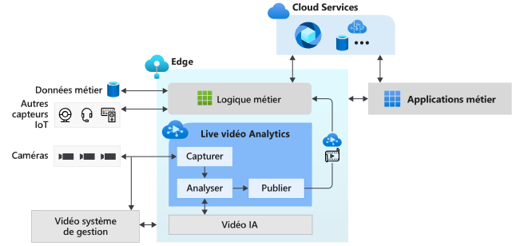

# Qu’est-ce que Live Video Analytics sur IoT Edge ? (préversion)

Live Video Analytics sur IoT Edge fournit une plateforme pour créer des applications vidéo intelligentes qui s’étendent à la périphérie et au cloud. Cette plateforme offre la possibilité de capturer, d’enregistrer et d’analyser des vidéos en direct, ainsi que de publier les résultats (vidéo et/ou analytique vidéo) sur des services Azure (dans le cloud et/ou la périphérie). La plateforme peut être utilisée pour améliorer les solutions IoT avec analyse vidéo. Live Video Analytics sur la fonctionnalité IoT Edge peut être associé à d’autres modules Azure IoT Edge, tels que Stream Analytics sur IoT Edge, Cognitive Services sur IoT Edge, ainsi que les services Azure dans le cloud, tels que Media Services, Event Hub, Cognitive Services, etc. pour créer des applicables hybrides efficaces (par exemple, edge + cloud).

Live Video Analytics sur IoT Edge est conçue pour être une plateforme extensible. Elle vous permet de connecter différents modules de périphérie d’analyse vidéo (par exemple, des conteneurs Cognitive Services, des modules de périphérie personnalisés que vous avez générés avec des modèles Machine Learning open source ou des modèles personnalisés entraînés avec vos propres données) et de les utiliser pour analyser la vidéo en direct sans vous soucier de la complexité liée à la création et à l’exécution d’un pipeline vidéo en direct.

## Accélérer le développement de solutions IoT 

Les solutions IoT qui combinent l’analytique vidéo avec des signaux d’autres capteurs IoT et/ou des données métier peuvent vous aider à automatiser ou semi-automatiser des décisions métier, et ainsi améliorer la productivité. Live Video Analytics sur IoT Edge vous permet de développer des solutions de ce type plus rapidement. Vous pouvez vous concentrer sur la création des modules d’analyse vidéo et de la logique propre à votre entreprise, et laisser le soin à la plateforme de masquer les complexités liées à la gestion et à l’exécution d’un pipeline vidéo.

Avec Live Video Analytics sur IoT Edge, vous pouvez continuer à utiliser vos [caméras de télésurveillance](https://en.wikipedia.org/wiki/Closed-circuit_television_camera) avec vos [systèmes de gestion vidéo existants](https://en.wikipedia.org/wiki/Video_management_system), et créer des applications d’analytique vidéo de manière indépendante. Vous pouvez utiliser Live Video Analytics sur IoT Edge conjointement avec les kits de ressources et les SDK Vision par ordinateur pour créer des solutions IoT de pointe. Le diagramme ci-dessous illustre ceci.

## Environnements pris en charge

Les environnements Linux AMD64 et X64 sont pris en charge.

## Bien démarrer

Lisez les articles conceptuels suivants, puis essayez un démarrage rapide pour exécuter la détection de mouvement sur un flux vidéo en direct.

### Concepts

* [Graphe multimédia](media-graph-concept.md)
* [Enregistrement de vidéo](video-recording-concept.md)
* [Lecture de vidéo](video-playback-concept.md)
* [Enregistrement de vidéo continu](continuous-video-recording-concept.md)
* [Enregistrement de vidéo basé sur les événements](event-based-video-recording-concept.md)
* [Live Video Analytics sans enregistrement de vidéo](analyze-live-video-concept.md)

## Étapes suivantes

* Suivez le tutoriel [Démarrage rapide : Exécutez Live Video Analytics avec votre propre article ](use-your-model-quickstart.md)de modèle pour voir comment vous pouvez exécuter la détection de mouvement sur un flux vidéo en direct.
* Passer en revue la [terminologie](terminology.md)
* Découvrez [le matériel open source Live Video Analytics](https://github.com/Azure/live-video-analytics)

