<properties linkid="develop-mobile-tutorials-dotnet-backend-get-started-with-data-wp8" urlDisplayName="Get Started with Data" pageTitle="Get started with data (Windows Phone) | Mobile Dev Center" metaKeywords="" description="Learn how to get started using Mobile Services to leverage data in your Windows Phone app." metaCanonical="" services="" documentationCenter="Mobile" title="Get started with data in Mobile Services" authors="wesmc" solutions="" manager="" editor="" />

Prise en main des données dans Mobile Services
==============================================

[Windows Store C\#](/fr-fr/documentation/articles/mobile-services-dotnet-backend-windows-store-dotnet-get-started-data/ "Windows Store C#") [Windows Store JavaScript](/fr-fr/documentation/articles/mobile-services-dotnet-backend-windows-store-javascript-get-started-data/ "Windows Store JavaScript") [Windows Phone](/fr-fr/documentation/articles/mobile-services-dotnet-backend-windows-phone-get-started-data/ "Windows Phone")
[.NET backend](/fr-fr/documentation/articles/mobile-services-dotnet-backend-windows-phone-get-started-data/ ".NET backend") | [JavaScript backend](/fr-fr/documentation/articles/mobile-services-windows-phone-get-started-data/ "JavaScript backend")

Cette rubrique montre comment utiliser Azure Mobile Services en tant que source de données principale pour une application Windows Phone 8. Dans ce didacticiel, vous allez télécharger un projet Visual Studio 2012 pour une application qui stocke les données en mémoire, créer un service mobile, intégrer le service mobile à l'application, puis afficher les modifications apportées aux données lors de l'exécution de l'application.

Le service mobile que vous allez créer dans ce didacticiel prendra en charge le runtime .NET dans le service mobile. Vous pourrez ainsi utiliser les langages .NET et Visual Studio pour la logique métier côté serveur dans le service mobile. Pour créer un service mobile vous permettant d'écrire votre logique métier côté serveur en JavaScript, consultez la [version principale JavaScript](/en-us/develop/mobile/tutorials/get-started-with-data-wp8) de cette rubrique.

Ce didacticiel vous familiarise avec ces étapes de base :

1.  [Téléchargement du projet d'application Windows Phone 8](#download-app)
2.  [Création d'un service mobile](#create-service)
3.  [Téléchargement du service mobile en local](#download-the-service-locally)
4.  [Mise à jour de l'application Windows Phone pour utiliser le service mobile](#update-app)
5.  [Test de l'application Windows Phone sur le service hébergé localement](#test-locally-hosted)
6.  [Publication du service mobile sur Azure](#publish-mobile-service)
7.  [Test de l'application Windows Phone sur le service hébergé sous Azure](#test-azure-hosted)

Ce didacticiel requiert que Visual Studio 2012 et le [Kit de développement logiciel (SDK) Windows Phone 8](http://go.microsoft.com/fwlink/p/?linkid=268374) soient exécutés sous Windows 8.

**Remarque**

Pour suivre ce didacticiel, vous devez également disposer d'un compte Azure. Si vous ne possédez pas de compte, vous pouvez créer un compte d'évaluation gratuit en quelques minutes. Pour plus d'informations, consultez la page [Version d'évaluation gratuite d'Azure](http://www.windowsazure.com/fr-fr/pricing/free-trial/?WT.mc_id=AE564AB28&returnurl=http%3A%2F%2Fwww.windowsazure.com%2Fen-us%2Fdocumentation%2Farticles%2Fmobile-services-dotnet-backend-windows-store-dotnet-get-started-data%2F).

Téléchargement du projetTéléchargement du projet GetStartedWithData
-------------------------------------------------------------------

Ce didacticiel est basé sur l'[application GetStartedWithMobileServices](http://go.microsoft.com/fwlink/p/?linkid=271146) qui correspond à un projet d'application Windows Phone 8 de Visual Studio 2012. L'interface utilisateur de cette application est semblable à l'application générée par le démarrage rapide de Mobile Services, mais les éléments ajoutés sont ici stockés en local dans la mémoire.

1.  Téléchargez la version C\# de l'exemple d'application GetStartedWithMobileServices sur le [site d'exemples de code développeur](http://go.microsoft.com/fwlink/p/?linkid=271146).

	![][1]

2.  Exécutez Visual Studio 2012 avec des privilèges d'administration : cliquez avec le bouton droit sur Visual Studio, puis cliquez sur **Exécuter en tant qu'administrateur**.

3.  Dans Visual Studio 2012, ouvrez le projet téléchargé et examinez le fichier MainPage.xaml.cs.

	Notez que les objets **TodoItem** ajoutés sont stockés dans un **ObservableCollection<TodoItem>** en mémoire.

4.  Dans Visual Studio, choisissez une cible de déploiement pour l'application. Vous pouvez procéder au déploiement sur un appareil Windows Phone ou sur un des émulateurs fournis avec le Kit de développement logiciel (SDK) Windows Phone. Ce didacticiel montre comment procéder à un déploiement sur un émulateur.

    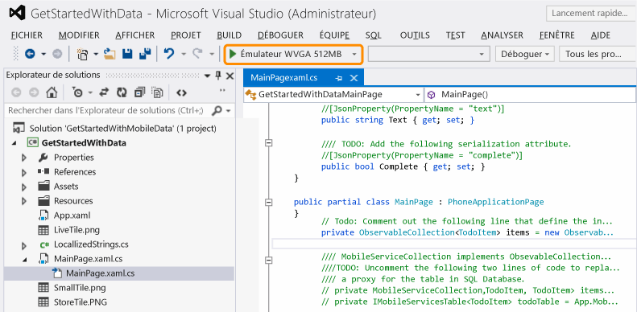

5.  Appuyez sur la touche **F5**. L'application est ainsi générée, déployée et démarrée pour le débogage.

6.  Dans l'application, tapez un texte dans la zone de texte, puis cliquez sur **Enregistrer** pour enregistrer quelques éléments en mémoire dans l'application.

	![][0]  

	Notez que le texte de chaque `TodoItem` apparaît sous le bouton d'actualisation, de même qu'une case à cocher qui vous permet de marquer l'élément terminé.

Création d'un service mobile Création d'un service mobile
---------------------------------------------------------

[WACOM.INCLUDE [mobile-services-dotnet-backend-create-new-service](../includes/mobile-services-dotnet-backend-create-new-service.md)]

Téléchargement du service localementTéléchargement du projet de service mobile et ajout de celui-ci à la solution
-----------------------------------------------------------------------------------------------------------------

1.  Dans le [portail de gestion Azure](https://manage.windowsazure.com/), cliquez sur votre nouveau service mobile ou sur son onglet d'icône cloud pour accéder à la page de présentation.

    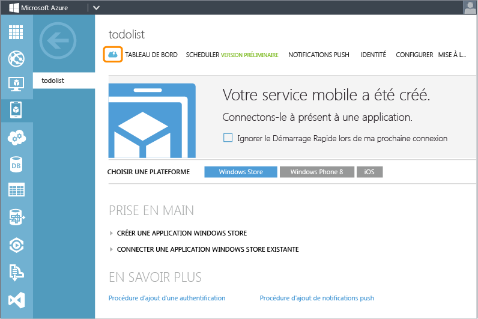

2.  Cliquez sur la plateforme **Windows Phone 8**. Sous la section **Get Started**, développez **Connecter une application Windows Phone 8 existante**, puis cliquez sur le bouton **Télécharger** afin de télécharger un projet de démarrage personnalisé pour le service mobile.

    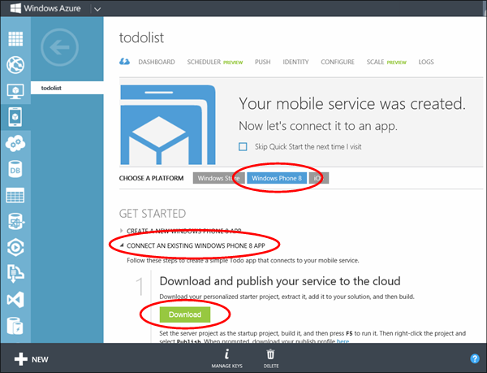

3.  Sous cette section, cliquez également sur le lien présenté dans la capture d'écran ci-dessous afin de télécharger un fichier de profil de publication pour le service mobile que vous venez de télécharger.

    > [WACOM.NOTE] Enregistrez le fichier en lieu sûr, car il contient des informations sensibles sur votre compte Azure. Vous supprimerez ce fichier après la publication du service mobile, comme expliqué plus loin dans ce didacticiel.

    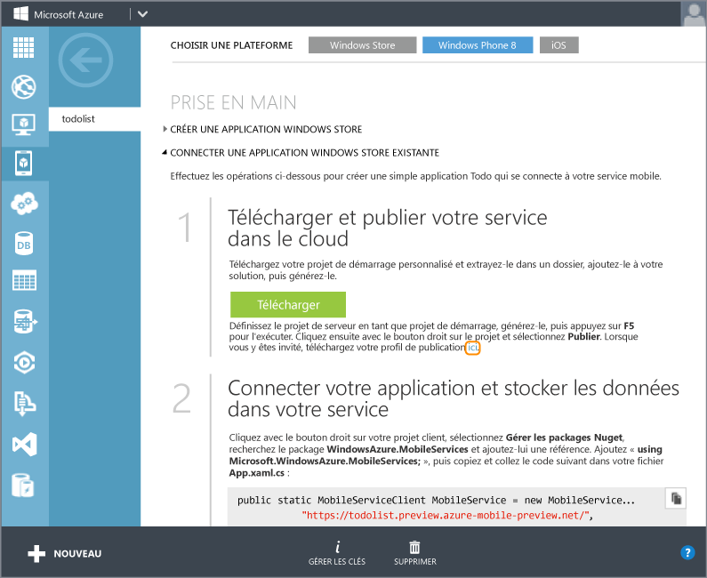

4.  Décompressez le projet de démarrage de service personnalisé que vous avez téléchargé. Copiez les dossiers que contenait le fichier .zip dans le même répertoire **C\#** que le fichier solution Prise en main des données (.sln). Cela permet au gestionnaire de package NuGet d'assurer plus facilement la synchronisation de tous les packages.

    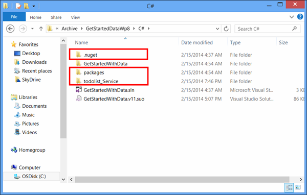

5.  Dans l'Explorateur de solutions de Visual Studio, cliquez avec le bouton droit sur la solution de votre application Windows Store Prise en main des données. Cliquez sur **Ajouter**, puis sur **Projet existant**.

    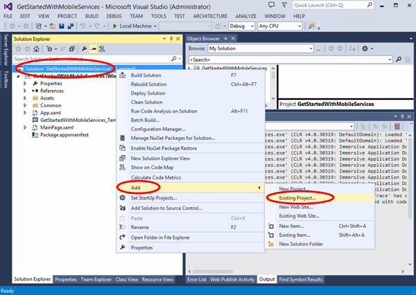

6.  Dans la boîte de dialogue Ajouter un projet existant, accédez au dossier du projet de service mobile que vous avez déplacé vers le répertoire **C\#**. Sélectionnez le fichier du projet C\# (.csproj) dans le sous-répertoire du service. Cliquez sur **Ouvrir** pour ajouter le projet à votre solution.

    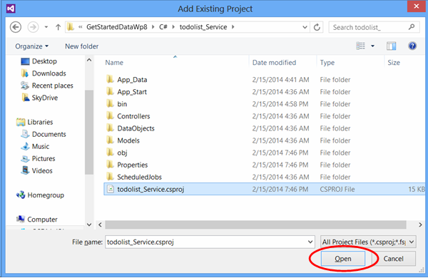

7.  Dans l'Explorateur de solutions de Visual Studio, cliquez avec le bouton droit sur le projet de service que vous venez d'ajouter, puis cliquez sur **Générer** pour vérifier qu'il est généré sans erreur. Pendant la génération, il se peut que le gestionnaire de package NuGet ait besoin de restaurer des packages NuGet référencés dans le projet.

    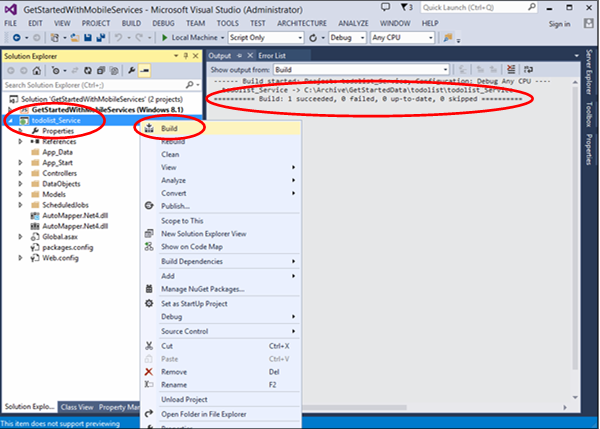

8.  Cliquez de nouveau sur le projet de service avec le bouton droit. Cette fois, cliquez sur **Démarrer une nouvelle instance** sous le menu contextuel **Déboguer**.

    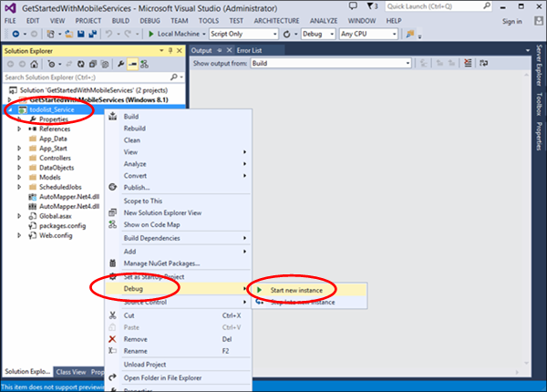

    Visual Studio ouvre la page Web par défaut de votre service. Vous pouvez cliquer sur **try it now** pour tester les méthodes dans votre service mobile à partir de la page Web par défaut.

    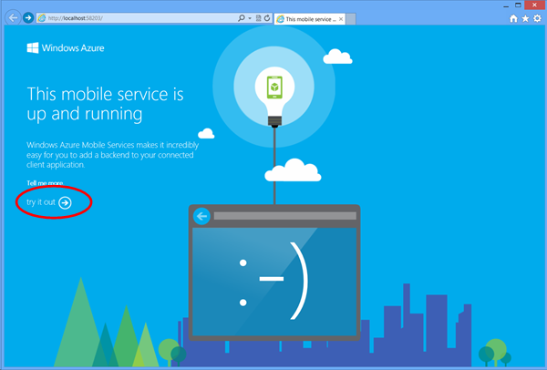

    Par défaut, Visual Studio a hébergé votre service mobile localement dans IIS Express. Pour vous en assurer, cliquez avec le bouton droit sur l'icône de barre d'état système d'IIS Express sur votre barre des tâches.

    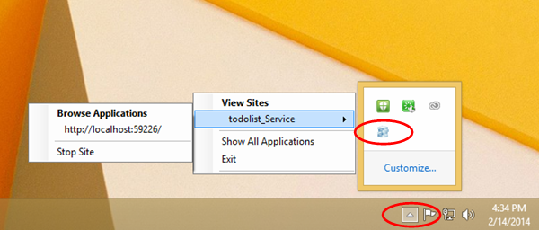

Mise à jour de l'application Windows PhoneMise à jour de l'application Windows Phone pour utiliser le service mobile
--------------------------------------------------------------------------------------------------------------------

Dans cette section, vous allez mettre à jour l'application Windows Phone pour utiliser le service mobile en tant que service principal de l'application.

1.  Dans l'Explorateur de solutions de Visual Studio, cliquez avec le bouton droit sur le projet d'application Windows Phone, puis cliquez sur **Gérer les packages NuGet**.

    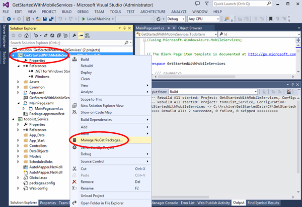

2.  À partir de la boîte de dialogue Gérer les packages NuGet, recherchez **WindowsAzure.MobileServices** dans la collection de packages en ligne et cliquez pour installer le package NuGet Azure Mobile Services. Fermez ensuite la boîte de dialogue.

    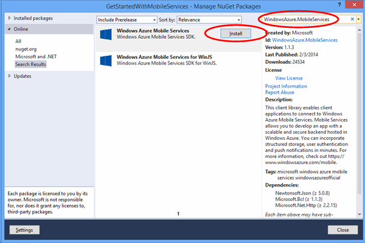

3.  De retour dans le portail de gestion Azure, repérez l'étape intitulée **Connecter votre application et stocker les données dans votre service**. Copiez l'extrait de code qui permet de créer la connexion `MobileServiceClient`.

    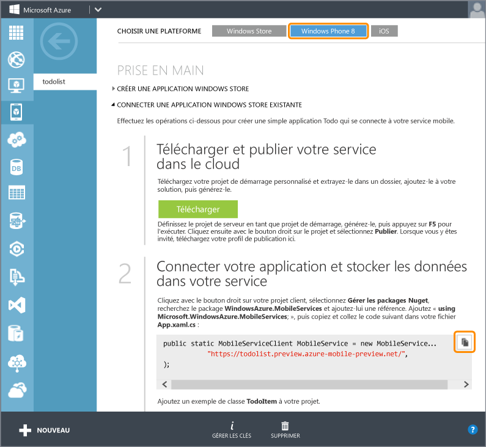

4.  Dans Visual Studio, ouvrez App.xaml.cs. Collez l'extrait de code au début de la définition de la classe `App`. Ajoutez également l'instruction `using` suivante en haut du fichier et enregistrez celui-ci.

        using Microsoft.WindowsAzure.MobileServices;

    

5.  Dans Visual Studio, ouvrez le fichier MainPage.xaml.cs et ajoutez l'instruction « using » en haut de celui-ci :

        using Microsoft.WindowsAzure.MobileServices;

6.  Dans Visual Studio, ouvrez le fichier MainPage.xaml.cs, remplacez la définition de la classe `MainPage` par la définition suivante et enregistrez le fichier.

    Ce code utilise le Kit de développement logiciel (SDK) Mobile Services pour permettre à l'application de stocker ses données dans une table fournie par le service au lieu de les stocker localement en mémoire. Les trois principales méthodes sont les suivantes : `InsertTodoItem`, `RefreshTodoItems` et `UpdateCheckedTodoItem`. Elles vous permettent d'insérer, d'interroger et de mettre à jour de manière asynchrone votre collection de données dans une table d'Azure.

         public sealed partial class MainPage : PhoneApplicationPage
         {
             private MobileServiceCollection<TodoItem, TodoItem> items;
             private IMobileServiceTable<TodoItem> todoTable = 
                 App.MobileService.GetTable<TodoItem>();            
             public MainPage()
             {
                 this.InitializeComponent();
             }
             private async void InsertTodoItem(TodoItem todoItem)
             {
                 await todoTable.InsertAsync(todoItem); 
                 items.Add(todoItem);
             }
             private async void RefreshTodoItems()
             {
                 items = await todoTable 
                     .ToCollectionAsync(); 
                 ListItems.ItemsSource = items;
             }
             private async void UpdateCheckedTodoItem(TodoItem item)
             {
                 await todoTable.UpdateAsync(item);      
             }
             private void ButtonRefresh_Click(object sender, RoutedEventArgs e)
             {
                 RefreshTodoItems();
             }
             private void ButtonSave_Click(object sender, RoutedEventArgs e)
             {
                 var todoItem = new TodoItem { Text = InputText.Text };
                 InsertTodoItem(todoItem);
             }
             private void CheckBoxComplete_Checked(object sender, RoutedEventArgs e)
             {
                 CheckBox cb = (CheckBox)sender;
                 TodoItem item = cb.DataContext as TodoItem;
                 item.Complete = (bool)cb.IsChecked;
                 UpdateCheckedTodoItem(item);
             }
             protected override void OnNavigatedTo(NavigationEventArgs e)
             {
                 RefreshTodoItems();
             }
         }

Test de l'application Windows Phone localementTest de l'application Windows Phone avec le service hébergé localement
--------------------------------------------------------------------------------------------------------------------

Dans cette section, vous allez utiliser Visual Studio pour tester l'application et le service mobile localement sur votre station de travail de développement. Pour tester le service mobile hébergé localement dans IIS Express à partir d'un appareil Windows Phone ou d'un des émulateurs Windows Phone, vous devez configurer IIS Express et la station de travail pour autoriser les connexions à l'adresse IP et au port de la station de travail. Les appareils et émulateurs Windows Phone se connectent en tant que clients réseau non locaux.

#### Configuration d'IIS Express pour autoriser les connexions à distance

[WACOM.INCLUDE [mobile-services-how-to-configure-iis-express](../includes/mobile-services-how-to-configure-iis-express.md)]

#### Test de l'application avec le service mobile d'IIS Express

1.  Dans Visual Studio, ouvrez le fichier App.xaml.cs et placez en commentaire la définition `MobileService` que vous venez de coller dans le fichier. Ajoutez une nouvelle définition pour établir la connexion en fonction de l'adresse IP et du port que vous avez configurés sur la station de travail. Enregistrez ensuite le fichier. Votre code doit être semblable au code suivant :

         public static MobileServiceClient MobileService = new MobileServiceClient(
             "http://192.168.137.72:58203");

         //public static MobileServiceClient MobileService = new MobileServiceClient(
         //    "https://todolist.preview.azure-mobile-preview.net/",
         //    "XXXXXXXXXXXXXXXXXXXXXXXXXXXXXXXX"
         //);        

2.  Dans Visual Studio, appuyez sur la touche F7 ou cliquez sur **Générer la solution** dans le menu Générer pour générer l'application Windows Phone et le service mobile. Vérifiez que les deux projets ont été générés sans erreurs dans la fenêtre Sortie de Visual Studio

    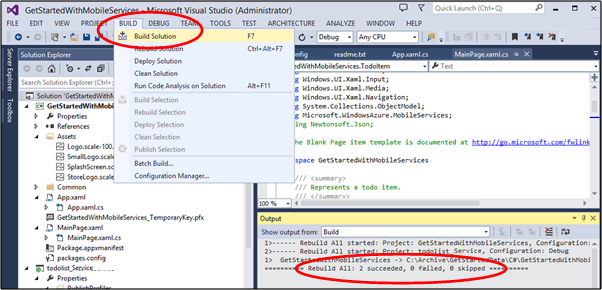

3.  Dans Visual Studio, appuyez sur la touche F5 ou cliquez sur **Démarrer le débogage** dans le menu Déboguer pour exécuter l'application et héberger le service mobile localement dans IIS Express.

    > [WACOM.NOTE] Vérifiez que vous avez bien exécuté Visual Studio avec l'option **Exécuter en tant qu'administrateur**. Sinon, IIS Express risque de ne pas charger les modifications que vous avez apportées au fichier applicationhost.config.

    

4.  Entrez un texte pour le nouvel élément todoitem. Cliquez ensuite sur **Enregistrer**. Un nouvel élément TodoItem est inséré dans la base de données créée par le service mobile hébergé localement dans IIS Express. Activez la case à cocher d'un des éléments pour le marquer comme terminé.

    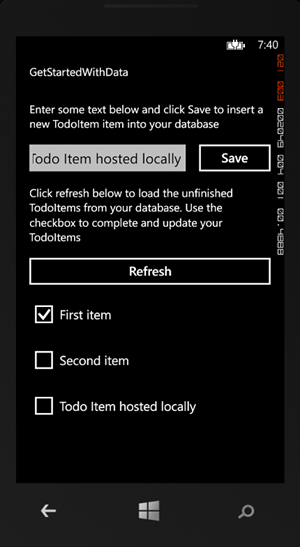

5.  Dans Visual Studio, arrêtez le débogage de l'application. Vous pouvez consulter les modifications dans la base de données créée pour le service principal en ouvrant l'Explorateur de serveurs et en développant les Connexions de données. Cliquez avec le bouton droit sur la table TodoItems située sous **MS\_TableConnectionString** et cliquez sur **Afficher les données de la table.**

    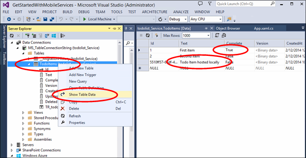

6.  À l'issue du test de votre service mobile hébergé localement, supprimez la règle du Pare-feu Windows que vous avez créée pour ouvrir le port sur votre station de travail.

Publication du service mobile sur AzurePublication du service mobile sur Azure
------------------------------------------------------------------------------

[WACOM.INCLUDE [mobile-services-dotnet-backend-publish-service](../includes/mobile-services-dotnet-backend-publish-service.md)]

Test du service mobile sur AzureTest du service mobile publié sur Azure
-----------------------------------------------------------------------

1.  Dans Visual Studio, ouvrez App.xaml.cs. Placez en commentaire le code permettant de créer le client `MobileServiceClient` qui se connecte au service mobile hébergé localement. Annulez le commentaire du code permettant de créer le client `MobileServiceClient` qui se connecte à votre service sous Azure. Enregistrez vos modifications dans le fichier.

         sealed partial class App : Application
         {
             //public static MobileServiceClient MobileService = new MobileServiceClient(
             //          "http://192.168.137.72:58203");

             // Utilisez ce constructeur après la publication sur le cloud
             public static MobileServiceClient MobileService = new MobileServiceClient(
                  "https://todolist.preview.azure-mobile-preview.net/",
                  "XXXXXXXXXXXXXXXXXXXXXXXXXXXXXXXX"
             );        
             ....

2.  Dans Visual Studio, appuyez sur la touche F5 ou cliquez sur **Démarrer le débogage** dans le menu Déboguer. L'application est alors régénérée conformément à la précédente modification avant d'être exécutée pour se connecter au service mobile hébergé à distance sous Azure.

    

3.  Entrez quelques nouveaux éléments todoitem et cliquez sur **Enregistrer** pour chacun d'eux. Activez la case à cocher pour valider certains de ces nouveaux éléments. Chaque nouvel élément todoItem est stocké et mis à jour dans la base de données SQL que vous avez configurée précédemment pour votre service mobile dans le portail de gestion Azure.

    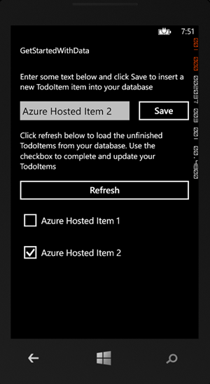

    Vous pouvez redémarrer l'application pour vous assurer que les modifications ont été conservées dans la base de données sous Azure. Vous pouvez également examiner la base de données à l'aide du portail de gestion Azure ou de l'Explorateur d'objets SQL Server de Visual Studio. Au cours des deux prochaines étapes, vous allez utiliser le portail de gestion Azure pour consulter les modifications dans votre base de données.

4.  Dans le portail de gestion Azure, cliquez sur Gérer pour la base de données associée à votre service mobile.

    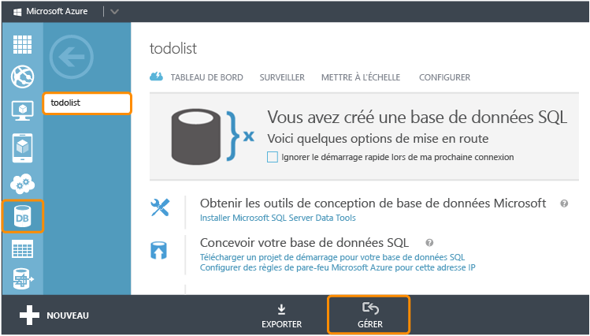

5.  Dans le portail de gestion, exécutez une requête pour afficher les modifications apportées par l'application. Votre requête sera semblable à la requête suivante mais le nom de votre base de données sera utilisé à la place de `todolist`.

         SELECT * FROM [todolist].[todoitems]

    

Vous voici parvenu à la fin du didacticiel **Prise en main des données**.

Étapes suivantes
----------------

Ce didacticiel a présenté les bases de l'activation d'une application Windows Phone 8 pour utiliser les données générées à l'aide du runtime .Net dans Mobile Services. Ensuite, pensez à suivre l'un des didacticiels suivants basés sur l'application GetStartedWithData que vous avez créée dans ce didacticiel :

-   [Validation et modification des données avec des scripts](/en-us/develop/mobile/tutorials/validate-modify-and-augment-data-wp8)
    En savoir plus sur l'utilisation des scripts serveur dans Mobile Services pour valider et modifier les données envoyées à partir de votre application.

-   [Affinage des requêtes à la pagination](/en-us/develop/mobile/tutorials/add-paging-to-data-wp8)
    En savoir plus sur l'utilisation de la pagination dans les requêtes pour contrôler la quantité de données traitées dans une seule requête.

Une fois que vous avez terminé les séries de données, essayez l'un de ces autres didacticiels :

-   [Prise en main de l'authentification](/fr-fr/documentation/articles/mobile-services-dotnet-backend-windows-phone-get-started-users/)
    En savoir plus sur l'authentification des utilisateurs de votre application.

-   [Guide de fonctionnement Mobile Services .NET](/en-us/develop/mobile/how-to-guides/work-with-net-client-library)
    En savoir plus sur l'utilisation de Mobile Services avec .NET.

<!-- Anchors. -->

[Download the Windows Phone 8 app project]: #download-app
[Create a new mobile service]: #create-service
[Download the mobile service locally]: #download-the-service-locally
[Update the Windows Phone app to use the Mobile Service]: #update-app
[Test the Windows Phone App against the service hosted locally]: #test-locally-hosted
[Publish the mobile service to Azure]: #publish-mobile-service
[Test the Windows Phone App against the service hosted in Azure]: #test-azure-hosted
[Next Steps]:#next-steps

<!-- Images. -->
[0]: ./media/mobile-services-dotnet-backend-windows-phone-get-started-data/app-view.png
[1]: ./media/mobile-services-dotnet-backend-windows-phone-get-started-data/mobile-data-sample-download-wp8-vs12.png
[2]: ./media/mobile-services-dotnet-backend-windows-phone-get-started-data/mobile-service-overview-page.png
[3]: ./media/mobile-services-dotnet-backend-windows-phone-get-started-data/download-service-project.png
[4]: ./media/mobile-services-dotnet-backend-windows-phone-get-started-data/add-service-project-to-solution.png
[5]: ./media/mobile-services-dotnet-backend-windows-phone-get-started-data/download-publishing-profile.png
[6]: ./media/mobile-services-dotnet-backend-windows-phone-get-started-data/add-existing-project-dialog.png
[7]: ./media/mobile-services-dotnet-backend-windows-phone-get-started-data/vs-manage-nuget-packages.png
[8]: ./media/mobile-services-dotnet-backend-windows-phone-get-started-data/manage-nuget-packages.png
[9]: ./media/mobile-services-dotnet-backend-windows-phone-get-started-data/copy-mobileserviceclient-snippet.png
[10]: ./media/mobile-services-dotnet-backend-windows-phone-get-started-data/vs-pasted-mobileserviceclient.png
[11]: ./media/mobile-services-dotnet-backend-windows-phone-get-started-data/vs-build-solution.png
[12]: ./media/mobile-services-dotnet-backend-windows-phone-get-started-data/vs-run-solution.png
[13]: ./media/mobile-services-dotnet-backend-windows-phone-get-started-data/new-local-todoitem.png
[14]: ./media/mobile-services-dotnet-backend-windows-phone-get-started-data/vs-show-local-table-data.png
[15]: ./media/mobile-services-dotnet-backend-windows-phone-get-started-data/local-item-checked.png
[16]: ./media/mobile-services-dotnet-backend-windows-phone-get-started-data/azure-items.png
[17]: ./media/mobile-services-dotnet-backend-windows-phone-get-started-data/manage-sql-azure-database.png
[18]: ./media/mobile-services-dotnet-backend-windows-phone-get-started-data/sql-azure-query.png
[19]: ./media/mobile-services-dotnet-backend-windows-phone-get-started-data/vs-deployment-target.png
[20]: ./media/mobile-services-dotnet-backend-windows-phone-get-started-data/vs-build-service-project.png
[21]: ./media/mobile-services-dotnet-backend-windows-phone-get-started-data/vs-start-debug-service-project.png
[22]: ./media/mobile-services-dotnet-backend-windows-phone-get-started-data/service-welcome-page.png
[23]: ./media/mobile-services-dotnet-backend-windows-phone-get-started-data/iis-express-tray.png
[26]: ./media/mobile-services-dotnet-backend-windows-phone-get-started-data/copy-service-and-packages-folder.png

<!-- URLs. -->
[Validate and modify data with scripts]: /en-us/develop/mobile/tutorials/validate-modify-and-augment-data-wp8
[Refine queries with paging]: /en-us/develop/mobile/tutorials/add-paging-to-data-wp8
[Get started with Mobile Services]: /fr-fr/documentation/articles/mobile-services-dotnet-backend-windows-phone-get-started/
[Get started with data]: /fr-fr/documentation/articles/mobile-services-dotnet-backend-windows-phone-get-started-data/
[Get started with authentication]: /fr-fr/documentation/articles/mobile-services-dotnet-backend-windows-phone-get-started-users/
[Get started with push notifications]: /fr-fr/documentation/articles/mobile-services-dotnet-backend-windows-phone-get-started-push/
[JavaScript and HTML]: /en-us/develop/mobile/tutorials/get-started-with-data-js
[JavaScript backend version]: /en-us/develop/mobile/tutorials/get-started-with-data-wp8

[Windows Phone 8 SDK]: http://go.microsoft.com/fwlink/p/?linkid=268374
[Azure Management Portal]: https://manage.windowsazure.com/
[Management Portal]: https://manage.windowsazure.com/
[Mobile Services SDK]: http://go.microsoft.com/fwlink/p/?LinkId=257545
[Developer Code Samples site]:  http://go.microsoft.com/fwlink/p/?linkid=271146
[Mobile Services .NET How-to Conceptual Reference]: /en-us/develop/mobile/how-to-guides/work-with-net-client-library
[MobileServiceClient class]: http://go.microsoft.com/fwlink/p/?LinkId=302030
[How to add a new Windows Firewall port rule]:  http://go.microsoft.com/fwlink/?LinkId=392240