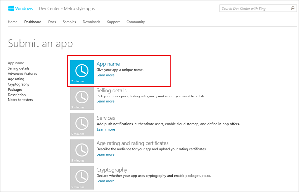
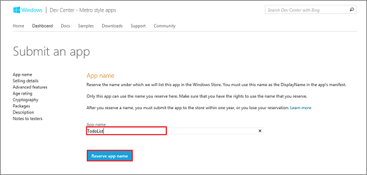
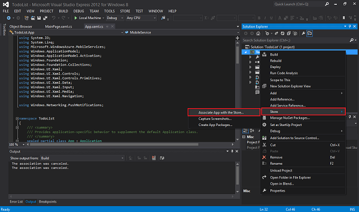
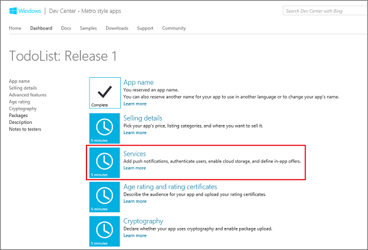
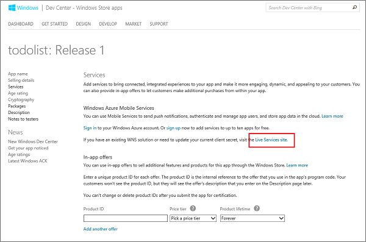
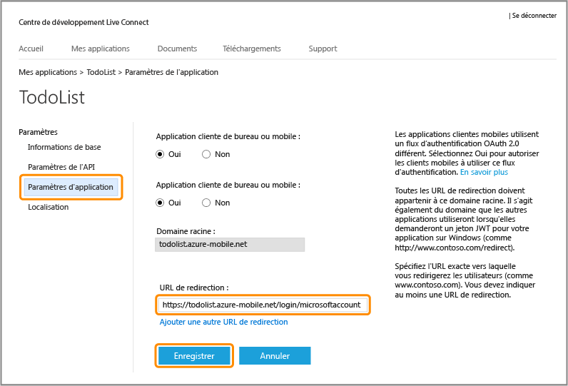
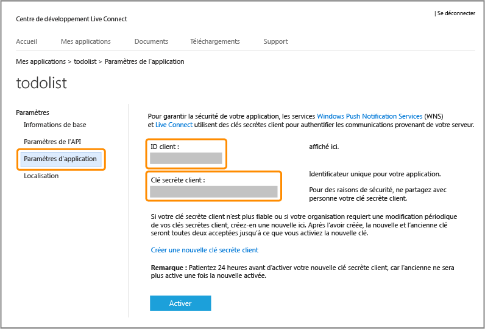
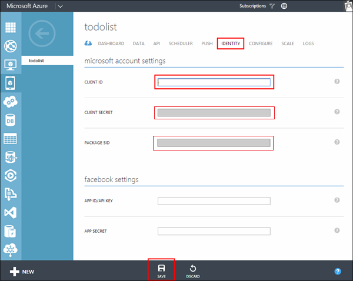

<properties 
	pageTitle="Inscription pour l'authentification Microsoft - Mobile Services" 
	description="Découvrez comment vous inscrire pour l'authentification Microsoft dans votre application Azure Mobile Services." 
	authors="ggailey777" 
	services="mobile-services" 
	documentationCenter="Mobile" 
	manager="dwrede" 
	editor=""/>

<tags 
	ms.service="mobile-services" 
	ms.workload="mobile" 
	ms.tgt_pltfrm="NA" 
	ms.devlang="multiple" 
	ms.topic="article" 
	ms.date="05/07/2015" 
	ms.author="glenga"/>

# Inscription de votre application pour utiliser un compte Microsoft pour l'authentification

Cette rubrique montre comment inscrire votre application mobile afin d'utiliser un compte Microsoft comme fournisseur d'identité avec Azure Mobile Services. Les mêmes étapes s'appliquent pour l'authentification dirigée par le service et l'authentification dirigée par le client à l'aide du Kit de développement logiciel (SDK) Live.

##Inscription de votre application du Windows Store auprès du Centre de développement Windows

Les applications du Windows Store doivent d'abord être enregistrées auprès du Centre de développement Windows.

>[AZURE.NOTE]Les applications Windows Phone 8, Silverlight Windows Phone 8.1 et non-Windows ne sont pas concernées par cette section.

1. Si vous n'avez pas déjà inscrit votre application, accédez à la page [Soumettre une application] du Centre de développement pour les applications Windows Store, connectez-vous à votre compte Microsoft, puis cliquez sur le **Nom de l'application**.

   	

2. Sélectionnez **Créer une application en réservant un nom unique**, cliquez sur **Continuer**, tapez un nom pour votre application dans **Nom de l'application**, cliquez sur **Réserver le nom d'application**, puis cliquez sur **Enregistrer**.

   	

   	La nouvelle inscription de votre application au Windows Store est créée.

3. Dans Visual Studio, ouvrez le projet que vous avez créé lorsque vous avez suivi le didacticiel [Prise en main de Mobile Services].

4. Dans l'Explorateur de solutions, cliquez avec le bouton droit sur le projet d'application Windows Store, cliquez sur **Store**, puis sur **Associer l'application au Windows Store...**.

  	

   	L'Assistant **Associer votre application au Windows Store** s'affiche.

5. Dans l'Assistant, cliquez sur **Se connecter**, connectez-vous avec votre compte Microsoft, sélectionnez le nom de l'application que vous avez réservé à l'étape 2, cliquez sur **Suivant**, puis cliquez sur **Associer**.

   	Les informations d'inscription au Windows Store requises sont ajoutées au manifeste de l'application.

6. (Facultatif) Pour une application Windows universelle, répétez les étapes 4 et 5 pour le projet Windows Phone Store.

6. De retour sur la page du Centre de développement Windows pour la nouvelle application, cliquez sur **Services**.

   	

7. Sur la page Services, cliquez sur **Site des services Microsoft Live** sous **Azure Mobile Services**.

	

La page du compte Microsoft de votre application s'affiche.

## Configuration de l'enregistrement de votre compte Microsoft et connexion à Mobile Services

La première étape de cette section s'applique uniquement aux applications Windows Phone 8, Silverlight Windows Phone 8.1 et non-Windows Store. Pour ces applications, vous pouvez également ignorer l'identificateur de sécurité de package (SID), qui est uniquement disponible pour les applications du Windows Store.

1. Pour une application non-Windows Store, accédez à la page <a href="http://go.microsoft.com/fwlink/p/?LinkId=262039" target="_blank">Mes applications</a> dans le Centre des développeurs de compte Microsoft, connectez-vous avec votre compte Microsoft (si nécessaire), cliquez sur **Créer une application**, puis tapez le **Nom de l'application** et cliquez sur **J'accepte**.

   	Une fois cette opération effectuée, le nom de votre application est réservé avec un compte Microsoft et la page du compte Microsoft de votre application s'affiche.

2. Sur la page du compte Microsoft de votre application, cliquez sur **Paramètres de l'API**, sélectionnez **Application cliente mobile ou de bureau**, définissez l'URL du service mobile en tant que **Domaine cible**, fournissez une valeur de `https://<mobile_service>.azure-mobile.net/login/microsoftaccount/` dans **URL de redirection**, puis cliquez sur **Enregistrer**.

	 >[AZURE.NOTE]Pour un service mobile de backend .NET publié sur Azure avec Visual Studio, l'URL de redirection est l'URL de votre service mobile, suivie du chemin _signin-microsoft_ de votre service mobile en tant que service .NET, par exemple `https://todolist.azure-mobile.net/signin-microsoft`.

    

	Le **Domaine racine** doit être renseigné automatiquement.

4. Cliquez sur **Paramètres d'application** et notez les valeurs de l'**ID du client**, de la **Clé secrète client** et du **SID du package**.

   	

    > [AZURE.NOTE]La clé secrète client est une information d'identification de sécurité importante. Ne la partagez avec personne et ne la distribuez pas avec votre application. Seules les inscriptions d'application du Windows Store affichent un champ SID du package.

4. Dans le [portail de gestion Azure], cliquez sur l'onglet **Identité** du service mobile, entrez l'ID du client, la clé secrète client et le SID du package obtenus auprès de votre fournisseur d'identité, puis cliquez sur **Enregistrer**.

 	
	
	>[AZURE.NOTE]Il est inutile de fournir une valeur de SID du package pour une application Windows Phone 8, Silverlight Windows Phone Store 8.1 ou une application non-Windows.
	
Votre service mobile et votre application sont désormais configurés pour utiliser le compte Microsoft.

<!-- Anchors. -->

<!-- Images. -->

<!-- URLs. -->

[Soumettre une application]: http://go.microsoft.com/fwlink/p/?LinkID=266582
[My Applications]: http://go.microsoft.com/fwlink/p/?LinkId=262039

[portail de gestion Azure]: https://manage.windowsazure.com/

<!--HONumber=54-->