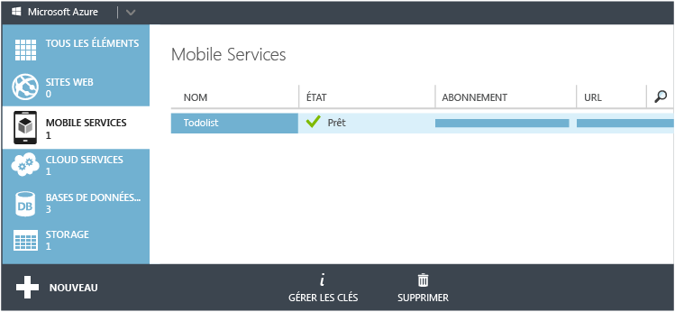
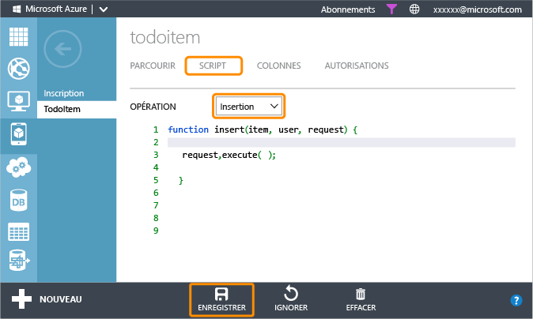

<properties pageTitle="Prise en main des notifications Push (Android JavaScript) | Centre de développement mobile" description="Découvrez comment utiliser Azure Mobile Services pour envoyer des notifications Push à votre application Android JavaScript." services="mobile-services, notification-hubs" documentationCenter="android" authors="RickSaling" writer="ricksal" manager="dwrede" editor=""/>

<tags ms.service="mobile-services" ms.workload="mobile" ms.tgt_pltfrm="Mobile-Android" ms.devlang="Java" ms.topic="article" ms.date="10/16/2014" ms.author="ricksal"/>

# Ajout de notifications push à votre application Mobile Services

[AZURE.INCLUDE [mobile-services-selector-get-started-push](../includes/mobile-services-selector-get-started-push.md)]

Cette rubrique montre comment utiliser Azure Mobile Services pour envoyer des notifications Push à une application Android à l'aide de Google Cloud Messaging (GCM). Dans ce didacticiel, vous allez activer des notifications Push dans le projet de démarrage rapide à l'aide d'Azure Notification Hubs. Une fois la procédure terminée, votre service mobile envoie une notification Push chaque fois qu'un enregistrement est inséré.

Ce didacticiel vous familiarise avec les étapes de base permettant d'activer les notifications Push :

1. [Activation de Google Cloud Messaging](#register)
2. [Configuration de Mobile Services](#configure)
3. [Ajout de notifications push à votre application](#add-push)
4. [Mise à jour des scripts pour l'envoi de notifications Push](#update-scripts)
5. [Insertion de données pour recevoir des notifications](#test)

>[AZURE.NOTE] Pour consulter le code source de l'application terminée, cliquez <a href="https://github.com/RickSaling/mobile-services-samples/tree/futures/GettingStartedWithPush/Android" target="_blank">ici</a>.

##Conditions préalables

[AZURE.INCLUDE [mobile-services-android-prerequisites](../includes/mobile-services-android-prerequisites.md)]

##Activation de Google Cloud Messaging

>[AZURE.NOTE]Pour effectuer cette procédure, vous devez disposer d'un compte Google avec une adresse électronique vérifiée. Pour créer un compte Google, consultez la page <a href="http://go.microsoft.com/fwlink/p/?LinkId=268302" target="_blank">accounts.google.com</a>.

[AZURE.INCLUDE [Enable GCM](../includes/mobile-services-enable-Google-cloud-messaging.md)]

Ensuite, vous allez utiliser cette valeur de clé API afin d'activer Mobile Services pour l'authentification avec GCM et l'envoi des notifications Push au nom de votre application.

##Configuration de Mobile Services pour l'envoi de demandes push

1. Connectez-vous au [portail de gestion Azure], puis cliquez sur **Mobile Services** et sur l'application.

   	

2. Cliquez sur l'onglet **Push**, entrez la valeur de **API Key** fournie par GCM dans la procédure précédente, puis cliquez sur **Save**.

	>[AZURE.NOTE]Quand vous suivez ce didacticiel avec un service mobile plus ancien, vous êtes susceptible de voir un lien dans le bas de l'onglet **Notifications Push** avec le texte **Activer la transmission push améliorée**. Cliquez sur ce lien pour mettre à niveau votre service mobile et l'intégrer avec Notification Hubs. Cette modification est irréversible. Pour plus d'informations sur l'activation des notifications Push améliorées dans un service mobile de production, consultez <a href="http://go.microsoft.com/fwlink/p/?LinkId=391951">ce guide</a>.

   	

	> [AZURE.IMPORTANT]Lorsque vous définissez vos informations d'identification GCM pour les notifications Push améliorées dans l'onglet Push du portail, celles-ci sont partagées avec Notification Hubs pour configurer le concentrateur de notification avec votre application.

Votre service mobile et votre application sont désormais configurés pour fonctionner avec GCM et Notification Hubs.

##Ajout de notifications push à votre application

###Vérification de la version du Kit de développement logiciel (SDK) Android

[AZURE.INCLUDE [Verify SDK](../includes/mobile-services-verify-android-sdk-version.md)]

L'étape suivante consiste à installer les services Google Play. Google Cloud Messaging a des spécifications requises d'API minimales pour le développement et les tests, auxquelles la propriété **minSdkVersion** du manifeste doit se conformer. 

Si vous envisagez de procéder à un test avec un appareil ancien, consultez la rubrique [Configuration du Kit de développement logiciel (SDK) des services Google Play] pour déterminer comment définir cette valeur et définissez-la correctement.

###Ajout de services Google Play au projet

[AZURE.INCLUDE [Add Play Services](../includes/mobile-services-add-Google-play-services.md)]

###Ajout de code

[AZURE.INCLUDE [mobile-services-android-getting-started-with-push](../includes/mobile-services-android-getting-started-with-push.md)]

##Mise à jour du script d'insertion inscrit dans le portail de gestion

1. Dans le portail de gestion, cliquez sur l'onglet **Data**, puis sur la table **TodoItem**. 

   	

2. Dans **TodoItem**, cliquez sur l'onglet **Script** et sélectionnez **Insérer**.
   
  	

   	La fonction appelée lors d'une insertion dans la table **TodoItem** s'affiche.

3. Remplacez la fonction insert par le code suivant, puis cliquez sur **Save** (Enregistrer) :

		function insert(item, user, request) {
		// Define a payload for the Google Cloud Messaging toast notification.
		var payload = {
		    data: {
		        message: item.text 
		    }
		};		
		request.execute({
		    success: function() {
		        // If the insert succeeds, send a notification.
		        push.gcm.send(null, payload, {
		            success: function(pushResponse) {
		                console.log("Sent push:", pushResponse, payload);
		                request.respond();
		                },              
		            error: function (pushResponse) {
		                console.log("Error Sending push:", pushResponse);
		                request.respond(500, { error: pushResponse });
		                }
		            });
		        },
		    error: function(err) {
		        console.log("request.execute error", err)
		        request.respond();
		    }
		  });
		}

   	Cela enregistre un nouveau script d'insertion qui utilise l'[objet gcm] pour envoyer une notification Push à tous les appareils enregistrés après l'insertion. 

##Test des notifications Push dans votre application

Vous pouvez tester l'application en connectant directement un téléphone Android via un câble USB, ou en utilisant un appareil virtuel dans l'émulateur.

###Configuration de l'émulateur pour le test

Lorsque vous exécutez cette application dans l'émulateur, veillez à utiliser un AVD (appareil virtuel Android) qui prend en charge les API Google.

1. Redémarrez Eclipse, puis dans l'Explorateur de package, cliquez avec le bouton droit sur le projet, cliquez sur **Propriétés** et sur **Android**, activez **API Google** et cliquez sur **OK**.

	

  	Cela permet de cibler le projet pour les API Google.

2. Dans **Fenêtre**, sélectionnez **Gestionnaire d'appareil virtuel Android**, choisissez votre appareil, puis cliquez sur **Modifier**.

	

3. Sélectionnez **API Google** dans **Cible**, puis cliquez sur OK.

   	

	Cela permet de cibler l'AVD pour utiliser les API Google.

###Exécution du test

1. Dans le menu **Exécuter** d'Eclipse, cliquez sur **Exécuter** pour démarrer l'application.

2. Dans l'application, tapez un texte explicite, comme _Nouvelle tâche Mobile Services_ puis cliquez sur le bouton **Ajouter**.

  	

3. Faites glisser votre doigt du haut vers le bas de l'écran pour ouvrir le centre de notifications de l'appareil et afficher la notification.

Vous avez terminé ce didacticiel.

## Étapes suivantes

<!---Ce didacticiel a présenté les bases de l'activation d'une application Android pour utiliser Mobile Services et Notification Hubs afin d'envoyer des notifications Push. Vous pouvez ensuite envisager de consulter le didacticiel suivant, [Envoi de notifications Push aux utilisateurs authentifiés], qui explique comment utiliser des balises pour envoyer des notifications Push depuis un service mobile vers des utilisateurs authentifiés uniquement.

+ [Envoi de notifications Push aux utilisateurs authentifiés]
	 En savoir plus sur l'utilisation de balises pour envoyer des notifications Push depuis un service mobile uniquement à un utilisateur authentifié.

+ [Envoi de notifications diffusées aux abonnés]
	 En savoir plus sur l'inscription des utilisateurs et la réception des notifications Push pour les catégories qui les intéressent.

+ [Envoi de notifications basées sur un modèle aux abonnés]
	 En savoir plus sur l'utilisation de modèles pour envoyer des notifications Push depuis un service mobile, sans avoir à gérer des charges utiles propres à la plateforme sur votre serveur principal.
-->

Découvrez Mobile Services et Notification Hubs dans les rubriques suivantes :

* [Prise en main des données]
   En savoir plus sur le stockage et l'interrogation des données à l'aide de Mobile Services.

* [Prise en main de l'authentification]
   En savoir plus sur l'authentification des utilisateurs de votre application avec des types de comptes différents utilisant des services mobiles.

* [Présentation de Notification Hubs]
   Découvrez comment Notification Hubs opère pour envoyer des notifications à vos applications sur toutes les principales plateformes clientes.

* [Débogage des applications Notification Hubs](http://go.microsoft.com/fwlink/p/?linkid=386630)
   Obtenez des conseils sur le dépannage et le débogage des solutions Notification Hubs. 

* [Utilisation de la bibliothèque cliente Android pour Mobile Services]
   En savoir plus sur l'utilisation de Mobile Services avec Android.

* [Référence de script serveur Mobile Services]
   En savoir plus sur l'implémentation de logique métier dans votre service mobile.

<!-- Anchors. -->
[Inscription de votre application pour les notifications Push et configuration de Mobile Services]: #register
[Mise à jour du code de notification Push]: #update-scripts
[Insertion de données pour recevoir des notifications]: #test
[Étapes suivantes]:#next-steps

<!-- Images. -->
[13]: ./media/mobile-services-windows-store-javascript-get-started-push/mobile-quickstart-push1.png
[14]: ./media/mobile-services-windows-store-javascript-get-started-push/mobile-quickstart-push2.png

<!-- URLs. -->
[Page Soumette une application]: http://go.microsoft.com/fwlink/p/?LinkID=266582
[Mes Applications]: http://go.microsoft.com/fwlink/p/?LinkId=262039
[Kit de développement logiciel (SDK) Live pour Windows]: http://go.microsoft.com/fwlink/p/?LinkId=262253
[Prise en main de Mobile Services]: /fr-fr/documentation/articles/mobile-services-android-get-started/
[Prise en main des données]: /fr-fr/documentation/articles/mobile-services-android-get-started-data/
[Prise en main de l'authentification]: /fr-fr/documentation/articles/mobile-services-android-get-started-users
[Prise en main des notifications Push]: /fr-fr/develop/mobile/tutorials/get-started-with-push-js
[Notifications Push pour les utilisateurs de l'application]: /fr-fr/develop/mobile/tutorials/push-notifications-to-users-js
[Autorisation des utilisateurs avec des scripts]: /fr-fr/develop/mobile/tutorials/authorize-users-in-scripts-js
[JavaScript et HTML]: /fr-fr/develop/mobile/tutorials/get-started-with-push-js
[Configuration du Kit de développement logiciel (SDK) des services Google Play]: http://go.microsoft.com/fwlink/?LinkId=389801
[Portail de gestion Azure]: https://manage.windowsazure.com/
[Utilisation de la bibliothèque cliente Android pour Mobile Services]: /fr-fr/documentation/articles/mobile-services-android-how-to-use-client-library

[objet gcm]: http://go.microsoft.com/fwlink/p/?LinkId=282645

[Référence de script serveur Mobile Services]: http://go.microsoft.com/fwlink/?LinkId=262293

[Envoi de notifications Push aux utilisateurs authentifiés]: /fr-fr/documentation/articles/mobile-services-javascript-backend-android-push-notifications-app-users/

[Présentation de Notification Hubs]: /fr-fr/documentation/articles/notification-hubs-overview/
[Envoi de notifications diffusées aux abonnés]: /fr-fr/documentation/articles/notification-hubs-android-send-breaking-news/
[Envoi de notifications basées sur un modèle aux abonnés]: /fr-fr/documentation/articles/notification-hubs-android-send-localized-breaking-news/

<!--HONumber=42-->
