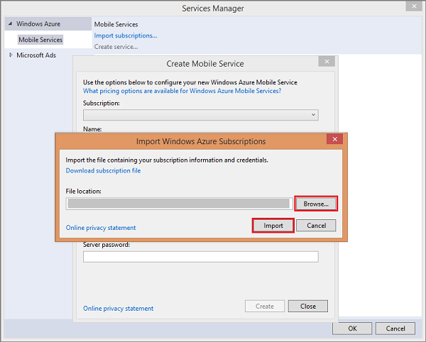

<properties urlDisplayName="Import your subscription publish settings file in Visual Studio 2013" pageTitle="Importation du fichier de paramètres de publication dans Visual Studio 2013 | Mobile Services" metaKeywords="Azure import publishsettings, mobile services" description="Learn how to import a subscription publish settings file for your Azure Mobile Services application in Visual Studio 2013." title="Import your subscription publish settings file in Visual Studio 2013" documentationCenter="Mobile" services="mobile-services" solutions="" manager="dwrede" editor="" videoId="" scriptId="" authors="glenga" />

<tags ms.service="mobile-services" ms.workload="mobile" ms.tgt_pltfrm="mobile-multiple" ms.devlang="multiple" ms.topic="article" ms.date="11/21/2014" ms.author="glenga" />

# Importation du fichier de paramètres de publication de votre abonnement dans Visual Studio 2013

Avant de créer le service mobile, vous devez importer le fichier de paramètres de publication de votre abonnement Azure dans Visual Studio. Cela permet à Visual Studio de se connecter à Azure en votre nom.  

>[WACOM.NOTE]Depuis Visual Studio 2013 Update 2, aucun fichier de paramètres de publication n'est requis. Visual Studio est en mesure de se connecter directement à Azure à l'aide des informations d'identification que vous indiquez.

1. Dans Visual Studio 2013, ouvrez l'Explorateur de solutions, cliquez avec le bouton droit sur le projet, cliquez sur **Ajouter**, puis sur **Service connecté...**. 

	

2. Dans la boîte de dialogue Gestionnaire de services, cliquez sur **Créer un service...**, puis sélectionnez **&lt;Importer...&gt;** dans **Abonnement** dans la boîte de dialogue Créer un service mobile.  

	

3. Dans Importer les abonnements Azure, cliquez sur **Télécharger le fichier d'abonnement**, connectez-vous à votre compte Azure (le cas échéant), cliquez sur **Enregistrer** lorsque le navigateur vous invite à enregistrer le fichier.

	

	
<strong>Remarque</strong> 
La fenêtre de connexion s'affiche dans le navigateur qui peut se trouver derrière la fenêtre Visual Studio. N'oubliez pas de noter l'emplacement où vous avez enregistré le fichier .publishsettings téléchargé. Vous pouvez ignorer cette étape si votre projet est déjà connecté à votre abonnement Azure.

 

4. Cliquez sur **Parcourir**, recherchez l'emplacement où vous avez enregistré le fichier .publishsettings, sélectionnez ce dernier, puis cliquez sur **Ouvrir** et sur **Importer**. 

	

	Visual Studio importe les données nécessaires pour se connecter à votre abonnement Azure. Si votre abonnement dispose déjà d'un ou plusieurs services mobiles, leur nom s'affiche. 

	
<strong>Remarque relative à la sécurité</strong> 
Après l'importation des paramètres de publication, pensez à supprimer le fichier .publishsettings téléchargé, car il contient des informations pouvant être utilisées par d'autres personnes pour accéder à votre compte. Mettez le fichier en lieu sûr si vous souhaitez le conserver afin de l'utiliser pour d'autres projets d'applications connectées.

<!-- Anchors. -->

<!-- Images. -->
[1]: ./media/mobile-services-how-to-register-microsoft-authentication/mobile-services-live-connect-add-app.png
[2]: ./media/mobile-services-how-to-register-microsoft-authentication/mobile-live-connect-app-api-settings.png
<!-- URLs. -->
[Authentification unique pour les applications Windows Store à l'aide de Live Connect]: /fr-fr/develop/mobile/how-to-guides/register-for-single-sign-on/
[Page Soumette une application]: http://go.microsoft.com/fwlink/p/?LinkID=266582
[Mes applications]: http://go.microsoft.com/fwlink/p/?LinkId=262039
[Prise en main de Mobile Services]: /fr-fr/develop/mobile/tutorials/get-started/
[Prise en main de l'authentification]: /fr-fr/develop/mobile/tutorials/get-started-with-users-dotnet/
[Prise en main des notifications Push]: /fr-fr/develop/mobile/tutorials/get-started-with-push-dotnet/
[Autorisation des utilisateurs avec des scripts]: /fr-fr/develop/mobile/tutorials/authorize-users-in-scripts-dotnet/
[JavaScript et HTML]: /fr-fr/develop/mobile/tutorials/get-started-with-users-js/

[Portail de gestion Azure]: https://manage.windowsazure.com/

<!--HONumber=35_1-->
