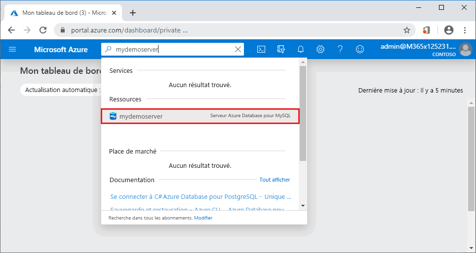
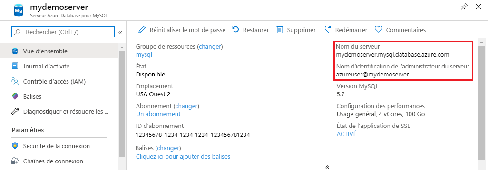

# <a name="quickstart-use-python-to-connect-and-query-data-in-azure-database-for-mysql"></a>Démarrage rapide : Utiliser Python pour se connecter et interroger des données dans Azure Database pour MySQL

Dans ce guide de démarrage rapide, vous vous connectez à Azure Database pour MySQL en utilisant Python. Vous utilisez ensuite des instructions SQL pour interroger, insérer, mettre à jour et supprimer des données dans la base de données depuis des plateformes Mac, Ubuntu Linux et Windows. 

Cette rubrique part du principe que vous connaissez les bases du développement avec Python, mais que vous commencez juste à utiliser Azure Database pour MySQL.

## <a name="prerequisites"></a>Prérequis

- Compte Azure avec un abonnement actif. [Créez un compte gratuitement](https://azure.microsoft.com/free/?ref=microsoft.com&utm_source=microsoft.com&utm_medium=docs&utm_campaign=visualstudio).
- Un serveur Azure Database pour MySQL. [Créer un serveur Azure Database pour MySQL avec le portail Azure](quickstart-create-mysql-server-database-using-azure-portal.md) ou [Créer un serveur Azure Database pour MySQL avec Azure CLI](quickstart-create-mysql-server-database-using-azure-cli.md).

> [!IMPORTANT] 
> Vérifiez que l’adresse IP à partir de laquelle vous vous connectez a été ajoutée aux règles de pare-feu du serveur à l’aide du [portail Azure](./howto-manage-firewall-using-portal.md) ou [d’Azure CLI](./howto-manage-firewall-using-cli.md)

## <a name="install-python-and-the-mysql-connector"></a>Installer Python et le connecteur MySQL

Effectuez les étapes suivantes pour installer Python et le connecteur MySQL pour Python sur votre ordinateur : 

> [!NOTE]
> Ce guide de démarrage rapide utilise une approche de requêtes SQL brutes pour se connecter à MySQL. Si vous utilisez un framework web, utilisez le connecteur recommandé pour le framework, par exemple [mysqlclient](https://pypi.org/project/mysqlclient/) pour Django.

1. Téléchargez et installez [Python 3.7 ou ultérieur](https://www.python.org/downloads/) pour votre système d’exploitation. Veillez à ajouter Python à votre `PATH`, car le connecteur MySQL en a besoin.
   
1. Ouvrez une invite de commandes ou un interpréteur de commandes `bash`, puis vérifiez votre version de Python en exécutant `python -V` avec le commutateur V majuscule.
   
1. Le programme d’installation de package `pip` est inclus dans les dernières versions de Python. Exécutez `pip install -U pip` pour mettre à jour `pip` avec la dernière version. 
   
   Si `pip` n’est pas installé, vous pouvez le télécharger et l’installer avec `get-pip.py`. Pour plus d’informations, consultez [Installation](https://pip.pypa.io/en/stable/installing/). 
   
1. Utilisez `pip` pour installer le connecteur MySQL pour Python et ses dépendances :
   
   ```bash
   pip install mysql-connector-python
   ```
   
   Vous pouvez également installer le connecteur Python pour MySQL à partir de [mysql.com](https://dev.mysql.com/downloads/connector/python/). Pour plus d’informations sur le connecteur MySQL pour Python, consultez le [guide de développement pour MySQL Connector/Python](https://dev.mysql.com/doc/connector-python/en/). 

## <a name="get-connection-information"></a>Obtenir des informations de connexion

Obtenez les informations dont vous avez besoin pour vous connecter à Azure Database pour MySQL dans le portail Azure. Vous devez disposer du nom du serveur, du nom de la base de données et des informations d’identification de connexion.

1. Connectez-vous au [portail Azure](https://portal.azure.com/).
   
1. Dans la barre de recherche du portail, recherchez et sélectionnez le serveur Azure Database pour MySQL que vous avez créé, par exemple **mydemoserver**.
   
   
   
1. Dans la page **Vue d’ensemble** du serveur, notez le **nom du serveur** et le **nom de connexion de l’administrateur du serveur**. Si vous oubliez votre mot de passe, vous pouvez également le réinitialiser dans cette page.
   
   

## <a name="run-the-python-examples"></a>Exécuter les exemples Python

Pour chaque exemple de code dans cet article :

1. Créez un fichier dans un éditeur de texte.
1. Ajoutez l’exemple de code au fichier. Dans le code, remplacez les espaces réservés `<mydemoserver>`, `<myadmin>`, `<mypassword>` et `<mydatabase>` par les valeurs de votre serveur et de votre base de données MySQL.
1. Enregistrez le fichier dans un dossier de projet avec une extension *.py*, par exemple *C:\pythonmysql\createtable.py* ou */home/username/pythonmysql/createtable.py*.
1. Pour exécuter le code, ouvrez une invite de commandes ou un interpréteur de commandes `bash`, puis changez de répertoire dans votre dossier de projet (par exemple, `cd pythonmysql`). Tapez la commande `python` suivie du nom de fichier, par exemple `python createtable.py`, puis appuyez sur Entrée. 
   
   > [!NOTE]
   > Sur Windows, si *python.exe* est introuvable, vous devrez peut-être fournir le chemin de Python à votre variable d’environnement PATH ou fournir le chemin complet à *python.exe* (par exemple, `C:\python27\python.exe createtable.py`).

## <a name="create-a-table-and-insert-data"></a>Créer une table et insérer des données

Utilisez le code suivant pour vous connecter au serveur et à la base de données, créer une table et charger les données à l’aide d’une instruction SQL **INSERT**. 

Le code importe la bibliothèque mysql.connector et utilise la fonction [connect()](https://dev.mysql.com/doc/connector-python/en/connector-python-api-mysql-connector-connect.html) pour se connecter à Azure Database pour MySQL à l’aide des [arguments](https://dev.mysql.com/doc/connector-python/en/connector-python-connectargs.html) dans la collection de configurations. Le code utilise un curseur sur la connexion, et la méthode [cursor.execute()](https://dev.mysql.com/doc/connector-python/en/connector-python-api-mysqlcursor-execute.html) exécute la requête SQL sur la base de données MySQL. 

```python
import mysql.connector
from mysql.connector import errorcode

# Obtain connection string information from the portal
config = {
  'host':'<mydemoserver>.mysql.database.azure.com',
  'user':'<myadmin>@<mydemoserver>',
  'password':'<mypassword>',
  'database':'<mydatabase>'
}

# Construct connection string
try:
   conn = mysql.connector.connect(**config)
   print("Connection established")
except mysql.connector.Error as err:
  if err.errno == errorcode.ER_ACCESS_DENIED_ERROR:
    print("Something is wrong with the user name or password")
  elif err.errno == errorcode.ER_BAD_DB_ERROR:
    print("Database does not exist")
  else:
    print(err)
else:
  cursor = conn.cursor()

  # Drop previous table of same name if one exists
  cursor.execute("DROP TABLE IF EXISTS inventory;")
  print("Finished dropping table (if existed).")

  # Create table
  cursor.execute("CREATE TABLE inventory (id serial PRIMARY KEY, name VARCHAR(50), quantity INTEGER);")
  print("Finished creating table.")

  # Insert some data into table
  cursor.execute("INSERT INTO inventory (name, quantity) VALUES (%s, %s);", ("banana", 150))
  print("Inserted",cursor.rowcount,"row(s) of data.")
  cursor.execute("INSERT INTO inventory (name, quantity) VALUES (%s, %s);", ("orange", 154))
  print("Inserted",cursor.rowcount,"row(s) of data.")
  cursor.execute("INSERT INTO inventory (name, quantity) VALUES (%s, %s);", ("apple", 100))
  print("Inserted",cursor.rowcount,"row(s) of data.")

  # Cleanup
  conn.commit()
  cursor.close()
  conn.close()
  print("Done.")
```

## <a name="read-data"></a>Lire les données

Utilisez le code suivant pour vous connecter et lire des données à l’aide d’une instruction SQL **SELECT**. 

Le code importe la bibliothèque mysql.connector et utilise la fonction [connect()](https://dev.mysql.com/doc/connector-python/en/connector-python-api-mysql-connector-connect.html) pour se connecter à Azure Database pour MySQL à l’aide des [arguments](https://dev.mysql.com/doc/connector-python/en/connector-python-connectargs.html) dans la collection de configurations. Le code utilise un curseur sur la connexion, et la méthode [cursor.execute()](https://dev.mysql.com/doc/connector-python/en/connector-python-api-mysqlcursor-execute.html) exécute la requête SQL sur la base de données MySQL. 

Le code lit les lignes de données à l’aide de la méthode [fetchall()](https://dev.mysql.com/doc/connector-python/en/connector-python-api-mysqlcursor-fetchall.html), conserve le jeu de résultats dans une ligne de collection et utilise un itérateur `for` pour exécuter les lignes en boucle.

```python
import mysql.connector
from mysql.connector import errorcode

# Obtain connection string information from the portal
config = {
  'host':'<mydemoserver>.mysql.database.azure.com',
  'user':'<myadmin>@<mydemoserver>',
  'password':'<mypassword>',
  'database':'<mydatabase>'
}

# Construct connection string
try:
   conn = mysql.connector.connect(**config)
   print("Connection established")
except mysql.connector.Error as err:
  if err.errno == errorcode.ER_ACCESS_DENIED_ERROR:
    print("Something is wrong with the user name or password")
  elif err.errno == errorcode.ER_BAD_DB_ERROR:
    print("Database does not exist")
  else:
    print(err)
else:
  cursor = conn.cursor()

  # Read data
  cursor.execute("SELECT * FROM inventory;")
  rows = cursor.fetchall()
  print("Read",cursor.rowcount,"row(s) of data.")

  # Print all rows
  for row in rows:
    print("Data row = (%s, %s, %s)" %(str(row[0]), str(row[1]), str(row[2])))

  # Cleanup
  conn.commit()
  cursor.close()
  conn.close()
  print("Done.")
```

## <a name="update-data"></a>Mettre à jour des données

Utilisez le code suivant pour vous connecter et mettre à jour les données à l’aide d’une instruction SQL **UPDATE**. 

Le code importe la bibliothèque mysql.connector et utilise la fonction [connect()](https://dev.mysql.com/doc/connector-python/en/connector-python-api-mysql-connector-connect.html) pour se connecter à Azure Database pour MySQL à l’aide des [arguments](https://dev.mysql.com/doc/connector-python/en/connector-python-connectargs.html) dans la collection de configurations. Le code utilise un curseur sur la connexion, et la méthode [cursor.execute()](https://dev.mysql.com/doc/connector-python/en/connector-python-api-mysqlcursor-execute.html) exécute la requête SQL sur la base de données MySQL. 

```python
import mysql.connector
from mysql.connector import errorcode

# Obtain connection string information from the portal
config = {
  'host':'<mydemoserver>.mysql.database.azure.com',
  'user':'<myadmin>@<mydemoserver>',
  'password':'<mypassword>',
  'database':'<mydatabase>'
}

# Construct connection string
try:
   conn = mysql.connector.connect(**config)
   print("Connection established")
except mysql.connector.Error as err:
  if err.errno == errorcode.ER_ACCESS_DENIED_ERROR:
    print("Something is wrong with the user name or password")
  elif err.errno == errorcode.ER_BAD_DB_ERROR:
    print("Database does not exist")
  else:
    print(err)
else:
  cursor = conn.cursor()

  # Update a data row in the table
  cursor.execute("UPDATE inventory SET quantity = %s WHERE name = %s;", (200, "banana"))
  print("Updated",cursor.rowcount,"row(s) of data.")

  # Cleanup
  conn.commit()
  cursor.close()
  conn.close()
  print("Done.")
```

## <a name="delete-data"></a>Suppression de données

Utilisez le code suivant pour vous connecter et supprimer des données à l’aide d’une instruction SQL **DELETE**. 

Le code importe la bibliothèque mysql.connector et utilise la fonction [connect()](https://dev.mysql.com/doc/connector-python/en/connector-python-api-mysql-connector-connect.html) pour se connecter à Azure Database pour MySQL à l’aide des [arguments](https://dev.mysql.com/doc/connector-python/en/connector-python-connectargs.html) dans la collection de configurations. Le code utilise un curseur sur la connexion, et la méthode [cursor.execute()](https://dev.mysql.com/doc/connector-python/en/connector-python-api-mysqlcursor-execute.html) exécute la requête SQL sur la base de données MySQL. 

```python
import mysql.connector
from mysql.connector import errorcode

# Obtain connection string information from the portal
config = {
  'host':'<mydemoserver>.mysql.database.azure.com',
  'user':'<myadmin>@<mydemoserver>',
  'password':'<mypassword>',
  'database':'<mydatabase>'
}

# Construct connection string
try:
   conn = mysql.connector.connect(**config)
   print("Connection established.")
except mysql.connector.Error as err:
  if err.errno == errorcode.ER_ACCESS_DENIED_ERROR:
    print("Something is wrong with the user name or password.")
  elif err.errno == errorcode.ER_BAD_DB_ERROR:
    print("Database does not exist.")
  else:
    print(err)
else:
  cursor = conn.cursor()

  # Delete a data row in the table
  cursor.execute("DELETE FROM inventory WHERE name=%(param1)s;", {'param1':"orange"})
  print("Deleted",cursor.rowcount,"row(s) of data.")

  # Cleanup
  conn.commit()
  cursor.close()
  conn.close()
  print("Done.")
```

## <a name="next-steps"></a>Étapes suivantes

> [!div class="nextstepaction"]
> [Migration de votre base de données PostgreSQL par exportation et importation](./concepts-migrate-import-export.md)
