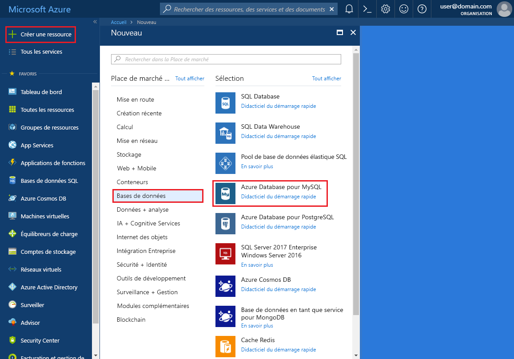

# <a name="infrastructure-double-encryption-for-azure-database-for-mysql"></a>Chiffrement double d’infrastructure - Azure Database pour MySQL

Découvrez comment configurer et gérer le chiffrement double d’infrastructure pour votre Azure Database pour MySQL.

## <a name="prerequisites"></a>Prérequis

* Vous devez avoir un abonnement Azure et être un administrateur de cet abonnement.

## <a name="create-an-azure-database-for-mysql-server-with-infrastructure-double-encryption---portal"></a>Créer un serveur Azure Database pour MySQL avec un chiffrement double d’infrastructure - Portail

Procédez comme suit pour créer un serveur Azure Database pour MySQL avec le chiffrement double d’infrastructure à partir de Portail Azure :

1. Sélectionnez **Créer une ressource** (+) dans l’angle supérieur gauche du portail.

2. Sélectionnez **Bases de données** > **Azure Database pour MySQL**. Vous pouvez également entrer **MySQL** dans la zone de recherche pour localiser le service.

   

3. Fournissez les informations basiques du serveur. Sélectionnez **Paramètres supplémentaires** et cochez la case **chiffrement double d’infrastructure** pour activer le paramètre.

    

4. Sélectionnez **Vérifier + créer** pour provisionner le serveur.

    

5. Une fois le serveur créé, vous pouvez valider le double chiffrement d’infrastructure en vérifiant l’état dans le panneau **Chiffrement des données**.

    

## <a name="create-an-azure-database-for-mysql-server-with-infrastructure-double-encryption---cli"></a>Créer un serveur Azure Database pour MySQL avec un chiffrement double d’infrastructure - CLI

Procédez comme suit pour créer un serveur Azure Database pour MySQL avec le chiffrement double d’infrastructure à partir de l’interface de ligne de commande :

Cet exemple crée un groupe de ressources nommé `myresourcegroup` à l’emplacement `westus`.

```azurecli-interactive
az group create --name myresourcegroup --location westus
```
L’exemple suivant crée un serveur MySQL 5.7 dans la région USA Ouest, nommé `mydemoserver`, dans votre groupe de ressources `myresourcegroup` avec l’identifiant d’administrateur du serveur `myadmin`. Il s’agit d’un serveur à **usage général**, de **4e génération** avec **2 vCores**. Cela activera également le double chiffrement d’infrastructure pour le serveur créé. Remplacez `<server_admin_password>` par votre propre valeur.

```azurecli-interactive
az mysql server create --resource-group myresourcegroup --name mydemoserver  --location westus --admin-user myadmin --admin-password <server_admin_password> --sku-name GP_Gen5_2 --version 5.7 --infrastructure-encryption <Enabled/Disabled>
```

## <a name="next-steps"></a>Étapes suivantes

 Pour en savoir plus sur le chiffrement des données, consultez [Chiffrement double d’infrastructure des données Azure Database pour MySQL](concepts-Infrastructure-double-encryption.md).
