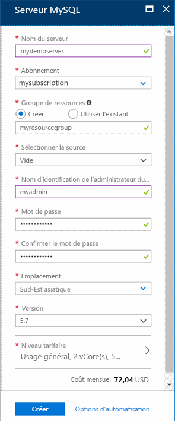
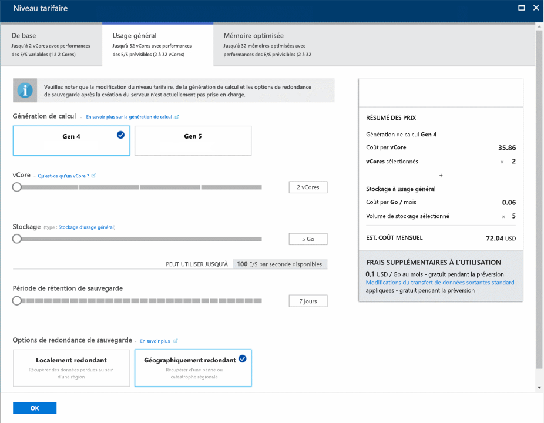
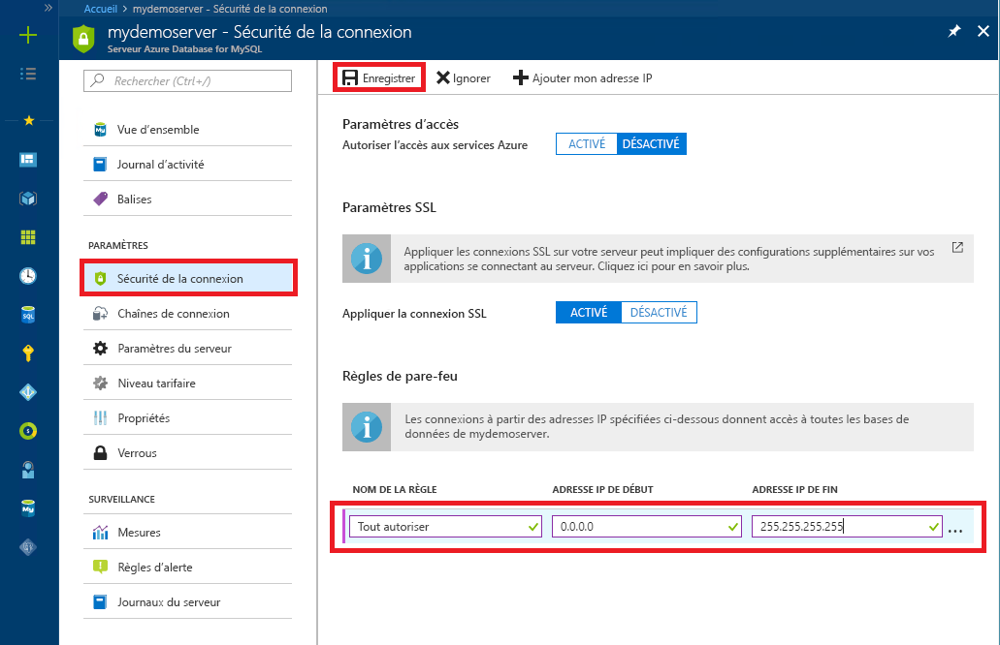

# <a name="tutorial-design-an-azure-database-for-mysql-database-using-the-azure-portal"></a>Didacticiel : Créer une base de données Azure Database pour MySQL à l’aide du portail Azure
Base de données Azure pour MySQL est un service géré qui vous permet d’exécuter, de gérer et de mettre à l’échelle des bases de données MySQL hautement disponibles dans le cloud. À l’aide du portail Azure, vous pouvez facilement gérer votre serveur et concevoir une base de données.

Ce didacticiel vous montre comment utiliser le portail Azure pour :

> [!div class="checklist"]
> * Créer une base de données Azure pour MySQL
> * Configurer le pare-feu du serveur
> * Utiliser l’outil en ligne de commande mysql pour créer une base de données
> * Charger les exemples de données
> * Données de requête
> * Mettre à jour des données
> * Restaurer des données

Si vous n’avez pas d’abonnement Azure, créez un [compte Azure gratuit](https://azure.microsoft.com/free/) avant de commencer.

## <a name="sign-in-to-the-azure-portal"></a>Connectez-vous au portail Azure.
Ouvrez votre navigateur web préféré et rendez-vous sur le [portail Microsoft Azure](https://portal.azure.com/). Entrez vos informations d’identification pour vous connecter au portail. Il s’ouvre par défaut sur le tableau de bord des services.

## <a name="create-an-azure-database-for-mysql-server"></a>Création d’un serveur Azure Database pour MySQL
Un serveur de base de données Azure pour MySQL est créé avec un ensemble défini de [ressources de calcul et de stockage](./concepts-compute-unit-and-storage.md). Ce serveur est créé dans un [groupe de ressources Azure](https://docs.microsoft.com/azure/azure-resource-manager/resource-group-overview).

1. Accédez à **Bases de données** > **Base de données Azure pour MySQL**. Si vous ne trouvez pas MySQL Server sous **Bases de données**, cliquez sur **Tout afficher** pour afficher tous les services de base de données disponibles. Vous pouvez également taper **Base de données Azure pour MySQL** dans la zone de recherche pour localiser rapidement le service.
   
   

2. Cliquez sur la vignette **Base de données Azure pour MySQL**, puis sur **Créer**. Remplissez le formulaire Azure Database pour MySQL.
   
   

    **Paramètre** | **Valeur suggérée** | **Description du champ** 
    ---|---|---
    Nom du serveur | Nom de serveur unique | Choisissez un nom unique qui identifie votre serveur de base de données Azure pour MySQL. Par exemple, mydemoserver. Le nom de domaine *.mysql.database.azure.com* est ajouté au nom de serveur que vous fournissez. Le nom de serveur ne peut contenir que des lettres minuscules, des chiffres et le caractère de trait d’union (-). Il doit inclure entre 3 et 63 caractères.
    Abonnement | Votre abonnement | Sélectionnez l’abonnement Azure que vous souhaitez utiliser pour votre serveur. Si vous avez plusieurs abonnements, sélectionnez l’abonnement dans lequel la ressource est facturée.
    Groupe de ressources | *myresourcegroup* | Spécifiez un nom de groupe de ressources nouveau ou existant.
    Sélectionner une source | *Vide* | Sélectionnez *Vide* pour créer un nouveau serveur à partir de zéro. (Vous sélectionnez *Sauvegarde* si vous créez un serveur à partir d’une sauvegarde géographique d’un serveur Azure Database pour MySQL existant).
    Connexion d’administrateur serveur | myadmin | Un compte de connexion à utiliser lors de la connexion au serveur. Le nom de connexion d’administrateur ne doit pas être **azure_superuser**, **admin**, **administrator**, **root**, **guest** ou **public**.
    Mot de passe | *Votre choix* | Spécifiez un mot de passe pour le compte Administrateur du serveur. Il doit inclure entre 8 et 128 caractères. Votre mot de passe doit contenir des caractères de trois des catégories suivantes : Lettres majuscules, lettres minuscules, chiffres (0-9) et caractères non alphanumériques (comme !, $, #, %, etc.).
    Confirmer le mot de passe | *Votre choix*| Confirmez le mot de passe du compte d’administrateur.
    Lieu | *La région la plus proche de vos utilisateurs*| Choisissez l’emplacement le plus proche de vos utilisateurs ou de vos autres applications Azure.
    Version | *La version la plus récente*| La version la plus récente (sauf si vous avez des exigences spécifiques).
    Niveau tarifaire | **Usage général**, **Gen 5**, **2 vCores**, **5 Go**, **7 jours**, **Géoredondant** | Les configurations de calcul, de stockage et de sauvegarde pour votre nouveau serveur. Sélectionnez **Niveau tarifaire**. Ensuite, sélectionnez l’onglet **Usage général**. *Gen 5*, *2 vCores*, *5 Go* et *7 jours* sont les valeurs par défaut pour **Génération de calcul**, **vCore**, **Stockage** et la **Période de conservation des sauvegardes**. Vous pouvez laisser ces curseurs en l’état. Pour activer les sauvegardes de votre serveur dans le stockage géo-redondant, sélectionnez **Géographiquement redondant** dans les **Options de redondance de sauvegarde**. Pour enregistrer cette sélection du niveau tarifaire, sélectionnez **OK**. La capture d’écran suivante capture ces sélections.
    
   

   > [!TIP]
   > Lorsque la **croissance automatique** est activée, votre serveur augmente le stockage quand vous vous approchez de la limite allouée, sans impacter votre charge de travail.

3. Cliquez sur **Créer**. En une minute ou deux, un nouveau serveur de base de données Azure pour MySQL s’exécute dans le cloud. Dans la barre d’outils, cliquez sur le bouton **Notifications** pour surveiller le processus de déploiement.

## <a name="configure-firewall"></a>Configurer le pare-feu
Les bases de données Azure pour MySQL sont protégées par un pare-feu. Par défaut, toutes les connexions au serveur et aux bases de données du serveur sont rejetées. Avant de vous connecter pour la première fois à la base de données Azure pour MySQL, configurez le pare-feu pour ajouter l’adresse IP du réseau public de l’ordinateur client (ou une plage d’adresses IP).

1. Cliquez sur le serveur qui vient d’être créé, puis sur **Sécurité de la connexion**.
   
   
2. Vous pouvez choisir **Ajouter mon adresse IP** ou configurer les règles de pare-feu ici. N’oubliez pas de cliquer sur **Enregistrer** après avoir créé les règles.
Vous pouvez maintenant vous connecter au serveur en utilisant l’outil en ligne de commande mysql ou l’interface graphique utilisateur MySQL Workbench.

> [!TIP]
> Le serveur de base de données Azure pour MySQL communique sur le port 3306. Si vous essayez de vous connecter à partir d’un réseau d’entreprise, le trafic sortant sur le port 3306 peut ne pas être autorisé par le pare-feu de votre réseau. Dans ce cas, vous ne pouvez pas vous connecter à votre serveur Azure MySQL, sauf si votre service informatique ouvre le port 3306.

## <a name="get-connection-information"></a>Obtenir des informations de connexion
Obtenez le **nom du serveur** et le **nom de connexion d’administrateur du serveur** complets pour votre serveur de base de données Azure pour MySQL à partir du portail Azure. Vous utilisez le nom de serveur complet pour vous connecter à votre serveur avec l’outil en ligne de commande mysql. 

1. Dans le [portail Azure](https://portal.azure.com/), cliquez sur **Toutes les ressources** dans le menu de gauche, tapez le nom et recherchez votre serveur de base de données Azure pour MySQL. Sélectionnez le nom du serveur pour afficher les détails.

2. Dans la page **Vue d’ensemble**, notez le **Nom du serveur** et le **Nom de connexion d’administrateur du serveur**. Vous pouvez cliquer sur le bouton de copie en regard de chaque champ pour les copier dans le Presse-papiers.
   

Dans cet exemple, le nom du serveur est *mydemoserver.mysql.database.azure.com*, et la connexion d’administrateur du serveur est *myadmin\@mydemoserver*.

## <a name="connect-to-the-server-using-mysql"></a>Se connecter au serveur à l’aide de mysql
Utilisez [l’outil de ligne de commande mysql](https://dev.mysql.com/doc/refman/5.7/en/mysql.html) pour établir une connexion à votre serveur de base de données Azure pour MySQL. Vous pouvez exécuter l’outil en ligne de commande mysql depuis Azure Cloud Shell dans le navigateur ou depuis votre propre ordinateur à l’aide des outils mysql installés localement. Pour lancer Azure Cloud Shell, cliquez sur le bouton `Try It` dans un bloc de code de cet article, ou visitez le portail Azure et cliquez sur l’icône `>_` dans la barre d’outils en haut à droite. 

Saisissez cette commande pour vous connecter :
```azurecli-interactive
mysql -h mydemoserver.mysql.database.azure.com -u myadmin@mydemoserver -p
```

## <a name="create-a-blank-database"></a>Créer une base de données vide
Une fois que vous êtes connecté au serveur, créez une base de données vide sur laquelle travailler.
```sql
CREATE DATABASE mysampledb;
```

À l’invite, exécutez la commande suivante pour basculer la connexion sur la base de données nouvellement créée :
```sql
USE mysampledb;
```

## <a name="create-tables-in-the-database"></a>Créer des tables dans la base de données
Maintenant que vous savez comment vous connecter à la base de données Azure Database pour MySQL, vous pouvez effectuez certaines tâches de base :

Tout d’abord, créez une table et chargez-y des données. Nous allons créer une table qui stocke des données d’inventaire.
```sql
CREATE TABLE inventory (
    id serial PRIMARY KEY, 
    name VARCHAR(50), 
    quantity INTEGER
);
```

## <a name="load-data-into-the-tables"></a>Charger des données dans les tables
Maintenant que vous disposez d’une table, insérez-y des données. Dans la fenêtre d’invite de commandes ouverte, exécutez la requête suivante pour insérer des lignes de données.
```sql
INSERT INTO inventory (id, name, quantity) VALUES (1, 'banana', 150); 
INSERT INTO inventory (id, name, quantity) VALUES (2, 'orange', 154);
```

Vous avez maintenant chargé deux lignes de données dans la table que vous avez créée précédemment.

## <a name="query-and-update-the-data-in-the-tables"></a>Interroger et mettre à jour les données des tables
Exécutez la requête suivante pour récupérer des informations à partir de la table de base de données.
```sql
SELECT * FROM inventory;
```

Vous pouvez également mettre à jour les données des tables.
```sql
UPDATE inventory SET quantity = 200 WHERE name = 'banana';
```

La ligne est mise à jour en conséquence lorsque vous récupérez les données.
```sql
SELECT * FROM inventory;
```

## <a name="restore-a-database-to-a-previous-point-in-time"></a>Restaurer une version antérieure d’une base de données
Imaginez que vous avez accidentellement supprimé une table de base de données importante et que vous ne pouvez pas récupérer les données facilement. La base de données Azure pour MySQL vous permet de restaurer le serveur à un point dans le temps, créant une copie des bases de données dans le nouveau serveur. Vous pouvez alors utiliser ce nouveau serveur pour récupérer les données supprimées. Les étapes suivantes restaurent le serveur à l’état dans lequel il était avant l’ajout de la table.

1. Dans le portail Azure, recherchez votre base de données Azure pour MySQL. Sur la page **Vue d’ensemble**, cliquez sur **Restaurer** dans la barre d’outils. La page Restaurer s’ouvre.

   

2. Remplissez le formulaire **Restaurer** avec les informations requises.
   
   
   
   - **Point de restauration** : sélectionnez un point dans le temps vers lequel vous souhaitez effectuer une restauration, dans la période listée. Veillez à convertir votre fuseau horaire local vers le fuseau horaire UTC.
   - **Restaurer sur un nouveau serveur** : indiquez le nom du nouveau serveur sur lequel vous souhaitez effectuer la restauration.
   - **Emplacement** : la région est identique à celle du serveur source et ne peut pas être changée.
   - **Niveau tarifaire** : le niveau tarifaire est identique à celui du serveur source et ne peut pas être changé.
   
3. Cliquez sur **OK** pour restaurer le serveur [à un point dans le temps](./howto-restore-server-portal.md) avant la suppression de la table. La restauration d’un serveur crée une copie du serveur à partir du point dans le temps que vous spécifiez. 

## <a name="next-steps"></a>Étapes suivantes
Ce didacticiel vous montre comment utiliser le portail Azure pour :

> [!div class="checklist"]
> * Créer une base de données Azure pour MySQL
> * Configurer le pare-feu du serveur
> * Utiliser l’outil en ligne de commande mysql pour créer une base de données
> * Charger les exemples de données
> * Données de requête
> * Mettre à jour des données
> * Restaurer des données

> [!div class="nextstepaction"]
> [Connexion d’applications à la base de données Azure pour MySQL](./howto-connection-string.md)
