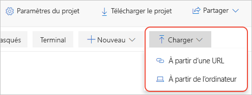

# Démarrage rapide : Migrer un notebook Jupyter local dans Azure Notebooks (préversion)

[!INCLUDE [notebooks-status](../../includes/notebooks-status.md)]

Dans ce guide de démarrage rapide, vous migrez un notebook Jupyter à partir de votre ordinateur local ou d’une autre URL de fichier accessible vers Azure Notebooks. 

Les notebooks Jupyter sur votre propre ordinateur ne sont accessibles que par vous. Vous pouvez partager vos fichiers, mais les destinataires auront alors leurs propres copies locales du notebook, et il sera difficile d’incorporer leurs changements. Même si vous stockez des notebooks sur un dépôt en ligne partagé comme GitHub, chaque collaborateur doit avoir une installation Jupyter locale configurée comme la vôtre.

En migrant vos notebooks locaux ou situés dans un dépôt vers Azure Notebooks, vous pouvez les partager instantanément avec vos collaborateurs, qui ont seulement besoin d’un navigateur pour voir et exécuter vos notebooks. S’ils se connectent à Azure Notebooks, ils peuvent aussi apporter des changements.

## Prérequis

- Un [notebook Jupyter](https://jupyter-notebook.readthedocs.io) sur votre ordinateur local ou sur une autre URL de fichier accessible. 

## Créer un projet sur Azure Notebooks

Ce guide de démarrage rapide illustre la migration d’un notebook à partir de votre ordinateur local ou d’une autre URL de fichier accessible. Pour migrer des notebooks à partir d’un dépôt GitHub, consultez [Démarrage rapide : Cloner un notebook](quickstart-clone-jupyter-notebook.md).

1. Accédez à [Azure Notebooks](https://notebooks.azure.com) et connectez-vous. (Pour plus d’informations, consultez la rubrique [Démarrage rapide sur la connexion à Azure Notebooks](quickstart-sign-in-azure-notebooks.md).)

1. En haut de votre page de profil public, sélectionnez **Mes projets** :

    

1. Dans la page **Mes projets**, sélectionnez **Nouveau projet** (raccourci clavier : n). Le bouton peut apparaître uniquement sous forme de **+** si la fenêtre du navigateur est étroite :

    

1. Dans la fenêtre contextuelle **Créer un projet** qui s’affiche, entrez les valeurs appropriées pour le notebook que vous migrez dans les champs **Nom du projet** et **ID du projet**, désactivez les options pour **Projet public** et **Créer un fichier README.md**, puis sélectionnez **Créer**.

## Charger le notebook local

1. Dans la page de projet, sélectionnez **Charger** (qui peut apparaître comme une flèche haut uniquement si la fenêtre de votre navigateur est petite), puis sélectionnez 1. Dans la fenêtre contextuelle qui s’affiche, sélectionnez **À partir de l’ordinateur** si votre notebook se trouve sur votre système de fichiers local, ou **À partir de l’URL** si votre notebook se trouve en ligne :

    

   Là encore, si votre notebook est stocké dans un dépôt GitHub, suivez les étapes dans [Démarrage rapide : Cloner un notebook](quickstart-clone-jupyter-notebook.md) à la place.

   - Si vous utilisez **À partir de l’ordinateur**, faites glisser les fichiers *.ipynb* dans la fenêtre contextuelle ou sélectionnez **Choisir des fichiers**, puis recherchez et sélectionnez les fichiers à importer. Puis sélectionnez **Upload** (Charger). Les fichiers chargés reçoivent le même nom que les fichiers locaux. Vous n’avez pas besoin de charger le contenu des dossiers *.ipynb_checkpoints*.

     

   - Si vous utilisez **À partir de l’URL**, entrez l’adresse source dans le champ **URL du fichier** ainsi que le nom de fichier à affecter au notebook de votre projet dans le champ **Nom de fichier**. Puis sélectionnez **Upload** (Charger). Si vous avez plusieurs fichiers avec des URL distinctes, utilisez la commande **Ajouter un fichier** pour vérifier la première URL que vous avez entrée, après quoi la fenêtre contextuelle fournit de nouveaux champs pour un autre fichier.

     

1. Ouvrez et exécutez votre notebook qui vient d’être chargé pour vérifier son contenu et son fonctionnement. Quand vous avez terminé, sélectionnez **Fichier** > **Fermer et arrêter** pour fermer le notebook.

1. Pour partager un lien vers votre notebook chargé, cliquez avec le bouton droit sur le fichier dans le projet, sélectionnez **Copier le lien** (raccourci clavier : y), puis collez ce lien dans le message approprié. Vous pouvez également partager le projet dans son intégralité en utilisant le contrôle **Partager** dans la page de projet.

1. Pour modifier des fichiers autres que des notebooks, cliquez avec le bouton droit sur le fichier dans le projet et sélectionnez **Modifier le fichier** (raccourci clavier : i). L’action par défaut, **Exécuter** (raccourci clavier : r), affiche uniquement le contenu du fichier et ne permet pas de le modifier.

## Étapes suivantes

> [!div class="nextstepaction"]
> [Tutoriel : Créer et exécuter un notebook Jupyter pour effectuer une régression linéaire](tutorial-create-run-jupyter-notebook.md)
