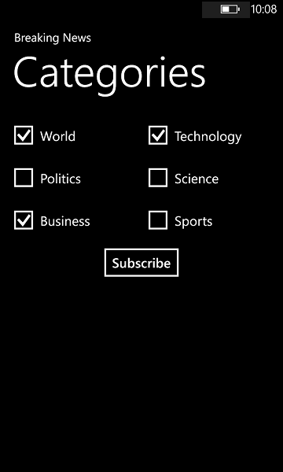
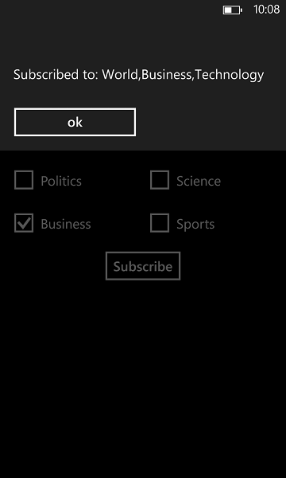
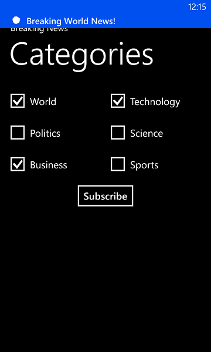

<properties linkid="manage-services-web-sites-operating-system-functionality-available-to-applications" urlDisplayName="Operating System Functionality Available to Applications on Azure Web Sites" pageTitle="Operating System Functionality Available to Applications on Azure Web Sites" metaKeywords="" description="Learn about the common baseline operating system functionality that is available to all applications running on Azure Web Sites, including file access, network access, and registry access." metaCanonical="" services="notification-hubs" documentationCenter="" title="Use Notification Hubs to send breaking news" authors="glenga" solutions="" manager="" editor="" />

Utilisation de Notification Hubs pour envoyer les dernières nouvelles
=====================================================================

[Windows Store C\#](/en-us/manage/services/notification-hubs/breaking-news-dotnet "Windows Store C#")[Windows Phone](/en-us/manage/services/notification-hubs/breaking-news-wp8 "Windows Phone")[iOS](/en-us/manage/services/notification-hubs/breaking-news-ios "iOS")

Cette rubrique montre comment utiliser Azure Notification Hubs pour diffuser des notifications relatives aux dernières nouvelles vers une application Windows Phone. Lorsque vous aurez terminé, vous pourrez vous inscrire aux catégories de dernières nouvelles qui vous intéressent et recevoir uniquement des notifications Push pour ces catégories. Ce scénario est un modèle courant pour de nombreuses applications pour lesquelles des notifications doivent être envoyées à des groupes d'utilisateurs qui ont signalé antérieurement un intérêt, par exemple, lecteur RSS, applications pour fans de musique, etc.

Les scénarios de diffusion sont activés en incluant une ou plusieurs *balises* lors de la création d'une inscription dans le concentrateur de notification. Lorsque des notifications sont envoyées à une balise, tous les appareils pour lesquels cette balise est inscrite reçoivent la notification. Les balises étant de simples chaînes, il n'est pas nécessaire de les approvisionner à l'avance. Pour plus d'informations sur les balises, consultez la page [Recommandations relatives à Notification Hubs](http://msdn.microsoft.com/en-us/library/jj927170.aspx).

Ce didacticiel vous familiarise avec les étapes de base pour activer ce scénario :

1.  [Ajout d'une sélection de catégories à l'application](#adding-categories)
2.  [Inscription à des notifications](#register)
3.  [Envoi de notifications à partir de votre serveur principal](#send)
4.  [Exécution de l'application et génération de notifications](#test-app)

Cette rubrique s'appuie sur l'application que vous avez créée dans [Prise en main de Notification Hubs](/en-us/manage/services/notification-hubs/get-started-notification-hubs-wp8/). Avant de commencer ce didacticiel, vous devez suivre celui intitulé [Prise en main de Notification Hubs](/en-us/manage/services/notification-hubs/get-started-notification-hubs-wp8/).

Ajout d'une sélection de catégories à l'application
---------------------------------------------------

La première étape consiste à ajouter des éléments de l'interface utilisateur à votre page principale existante qui permettent à l'utilisateur de sélectionner des catégories auxquelles s'inscrire. Les catégories sélectionnées par un utilisateur sont stockées sur l'appareil. Lorsque l'application démarre, une inscription d'appareil est créée dans votre concentrateur de notification avec les catégories sélectionnées sous forme de balises.

1.  Ouvrez le fichier de projet MainPage.xaml, puis remplacez les éléments **Grid** `TitlePanel` et `ContentPanel` par le code suivant :

         <StackPanel x:Name="TitlePanel" Grid.Row="0" Margin="12,17,0,28">
             <TextBlock Text="Breaking News" Style="{StaticResource PhoneTextNormalStyle}" Margin="12,0"/>
             <TextBlock Text="Categories" Margin="9,-7,0,0" Style="{StaticResource PhoneTextTitle1Style}"/>
         </StackPanel>

         <Grid Name="ContentPanel" Grid.Row="1" Margin="12,0,12,0">
             <Grid.RowDefinitions>
                 <RowDefinition Height="auto"/>
                 <RowDefinition Height="auto"/>
                 <RowDefinition Height="auto"/>
                 <RowDefinition Height="auto"/>
             </Grid.RowDefinitions>
             <Grid.ColumnDefinitions>
                 <ColumnDefinition />
                 <ColumnDefinition />
             </Grid.ColumnDefinitions>
             <CheckBox Name="WorldCheckBox" Grid.Row="0" Grid.Column="0">World</CheckBox>
             <CheckBox Name="PoliticsCheckBox" Grid.Row="1" Grid.Column="0">Politics</CheckBox>
             <CheckBox Name="BusinessCheckBox" Grid.Row="2" Grid.Column="0">Business</CheckBox>
             <CheckBox Name="TechnologyCheckBox" Grid.Row="0" Grid.Column="1">Technology</CheckBox>
             <CheckBox Name="ScienceCheckBox" Grid.Row="1" Grid.Column="1">Science</CheckBox>
             <CheckBox Name="SportsCheckBox" Grid.Row="2" Grid.Column="1">Sports</CheckBox>
             <Button Name="SubscribeButton" Content="Subscribe" HorizontalAlignment="Center" Grid.Row="3" Grid.Column="0" Grid.ColumnSpan="2" Click="SubscribeButton_Click" />
         </Grid>

2.  Dans le projet, créez une classe nommée **Notifications**, ajoutez le modificateur **public** à la définition de classe, puis ajoutez les instructions **using** suivantes au nouveau fichier de code :

         using Microsoft.Phone.Notification;
         using Microsoft.WindowsAzure.Messaging;
         using System.IO.IsolatedStorage;

3.  Ajoutez le code suivant dans la nouvelle classe **Notifications** :

         private NotificationHub hub;

         public Notifications()
         {
             hub = new NotificationHub("<hub name>", "<connection string with listen access>");
         }
            
         public async Task StoreCategoriesAndSubscribe(IEnumerable<string> categories)
         {
             var categoriesAsString = string.Join(",", categories);
             var settings = IsolatedStorageSettings.ApplicationSettings;
             if (!settings.Contains("categories"))
             {
                 settings.Add("categories", categoriesAsString);
             }
             else
             {
                 settings["categories"] = categoriesAsString;
             }
             settings.Save();
            
             await SubscribeToCategories(categories);
         }
            
         public async Task SubscribeToCategories(IEnumerable<string> categories)
         {
             var channel = HttpNotificationChannel.Find("MyPushChannel");
            
             if (channel == null)
             {
                 channel = new HttpNotificationChannel("MyPushChannel");
                 channel.Open();
                 channel.BindToShellToast();
             }
            
             await hub.RegisterNativeAsync(channel.ChannelUri.ToString(), categories);
         }

    Cette classe utilise le stockage local pour stocker les catégories de nouvelles que cet appareil doit recevoir. Elle comporte également des méthodes pour s'inscrire à ces catégories.

4.  Dans le code ci-dessus, remplacez les espaces réservés `<hub name>` et `<connection string with listen access>` par le nom du concentrateur de notification et la chaîne de connexion pour *DefaultListenSharedAccessSignature* obtenue précédemment.

    **Remarque**

    Les informations d'identification distribuées avec une application cliente n'étant généralement pas sécurisées, vous ne devez distribuer que la clé d'accès d'écoute avec votre application cliente. L'accès d'écoute permet à votre application de s'inscrire à des notifications, mais les inscriptions existantes ne peuvent pas être modifiées et les notifications ne peuvent pas être envoyées. La clé d'accès complet est utilisée dans un service de serveur principal sécurisé pour l'envoi de notifications et la modification d'inscriptions existantes.

5.  Dans le fichier projet App.xaml.cs, ajoutez la propriété suivante à la classe **App** :

         public Notifications notifications = new Notifications();

    Cette propriété sert à créer l'instance **Notifications** et à y accéder.

6.  Dans MainPage.xaml.cs, ajoutez la ligne suivante :

         using Windows.UI.Popups;

7.  Dans le fichier projet MainPage.xaml.cs, ajoutez la méthode suivante :

         private async void SubscribeButton_Click(object sender, RoutedEventArgs e)
         {
             var categories = new HashSet<string>();
             if (WorldCheckBox.IsChecked == true) categories.Add("World");
             if (PoliticsCheckBox.IsChecked == true) categories.Add("Politics");
             if (BusinessCheckBox.IsChecked == true) categories.Add("Business");
             if (TechnologyCheckBox.IsChecked == true) categories.Add("Technology");
             if (ScienceCheckBox.IsChecked == true) categories.Add("Science");
             if (SportsCheckBox.IsChecked == true) categories.Add("Sports");
            
             await ((App)Application.Current).notifications.StoreCategoriesAndSubscribe(categories);
            
             MessageBox.Show("Subscribed to: " + string.Join(",", categories));
         }

    Cette méthode crée une liste de catégories et utilise la classe **Notifications** pour stocker la liste dans le stockage local et inscrire les balises correspondantes auprès du concentrateur de notification. Lorsque des catégories sont modifiées, l'inscription est à nouveau créée avec les nouvelles catégories.

Votre application peut désormais stocker un ensemble de catégories dans le stockage local sur l'appareil et s'inscrire auprès du concentrateur de notification lorsque l'utilisateur modifie la sélection des catégories.

Inscription à des notifications
-------------------------------

Les étapes suivantes permettent l'inscription auprès du concentrateur de notification au démarrage en utilisant les catégories qui ont été stockées dans le stockage local.

**Remarque**

L'URI de canal attribué par le service de notification Push Microsoft (MPNS) pouvant changer à n'importe quel moment, vous devez vous inscrire fréquemment aux notifications afin d'éviter les défaillances de notification. Cet exemple s'inscrit aux notifications chaque fois que l'application démarre. Pour les applications exécutées fréquemment, plus d'une fois par jour, vous pouvez probablement ignorer l'inscription afin de préserver la bande passante si moins d'un jour s'est écoulé depuis l'inscription précédente.

1.  Ajoutez le code suivant à la classe **Notifications** :

         public IEnumerable<string> RetrieveCategories()
         {
             var categories = (string)IsolatedStorageSettings.ApplicationSettings["categories"];
             return categories != null ? categories.Split(','): new string[0];
         }

    Ainsi, les catégories définies dans la classe sont renvoyées.

2.  Ouvrez le fichier App.xaml.cs et ajoutez le modificateur **async** à la méthode **Application\_Launching**.

3.  Dans la méthode **Application\_Launching**, localisez et remplacez le code d'inscription Notification Hubs que vous avez ajouté dans le cadre du didacticiel [Prise en main de Notification Hubs](/en-us/manage/services/notification-hubs/get-started-notification-hubs-wp8/) par la ligne de code suivante :

         await notifications.SubscribeToCategories(notifications.RetrieveCategories());

    Cette opération garantit que chaque fois que l'application démarre, elle récupère les catégories du stockage local et demande une inscription pour ces catégories.

4.  Dans le fichier projet MainPage.xaml.cs, ajoutez le code suivant, qui implémente la méthode **OnNavigatedTo** :

         protected override void OnNavigatedTo(NavigationEventArgs e)
         {
             var categories = ((App)Application.Current).notifications.RetrieveCategories();
            
             if (categories.Contains("World")) WorldCheckBox.IsChecked = true;
             if (categories.Contains("Politics")) PoliticsCheckBox.IsChecked = true;
             if (categories.Contains("Business")) BusinessCheckBox.IsChecked = true;
             if (categories.Contains("Technology")) TechnologyCheckBox.IsChecked = true;
             if (categories.Contains("Science")) ScienceCheckBox.IsChecked = true;
             if (categories.Contains("Sports")) SportsCheckBox.IsChecked = true;
         }

    Cette opération met la page principale à jour selon le statut des catégories enregistrées précédemment.

L'application est désormais terminée et peut stocker un ensemble de catégories dans le stockage local de l'appareil utilisé pour s'inscrire auprès du concentrateur de notification lorsque l'utilisateur modifie la sélection des catégories. Ensuite, nous allons définir un serveur principal qui peut envoyer des notifications de catégorie à cette application.

Envoi de notificationsEnvoi de notifications à partir de votre serveur principal
--------------------------------------------------------------------------------

[WACOM.INCLUDE [notification-hubs-back-end](../includes/notification-hubs-back-end.md)]

Exécution de l'application et génération de notifications
---------------------------------------------------------

1.  Dans Visual Studio, appuyez sur la touche F5 pour compiler et démarrer l'application.

    

    Notez que l'interface utilisateur de l'application fournit un ensemble de bascules qui vous permet de choisir les catégories auxquelles vous abonner.

2.  Activez une ou plusieurs bascules de catégories, puis cliquez sur **S'abonner**.

    L'application convertit les catégories sélectionnées en balises et demande une nouvelle inscription de l'appareil pour les balises sélectionnées depuis le concentrateur de notification. Les catégories inscrites sont renvoyées et affichées dans une boîte de dialogue.

    

3.  Envoyez une nouvelle notification depuis le serveur principal de l'une des manières suivantes :

    -   **Application console :** démarrez l'application console.

    -   **Mobile Services :** cliquez sur l'onglet **Scheduler**, sur la tâche, puis sur **Exécuter une fois**.

    Les notifications pour les catégories sélectionnées apparaissent comme notifications toast.

    

Vous avez terminé cette rubrique.

