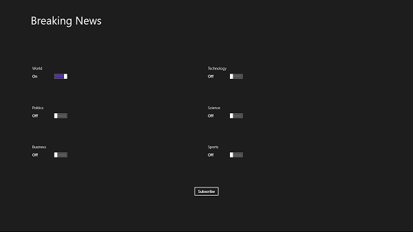
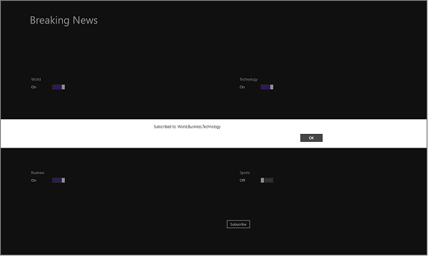
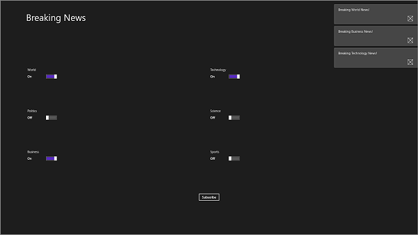

<properties linkid="develop-notificationhubs-tutorials-send-breaking-news-windowsdotnet" urlDisplayName="Breaking News" pageTitle="Notification Hubs Breaking News Tutorial" metaKeywords="" description="Learn how to use Azure Service Bus Notification Hubs to send breaking news notifications." metaCanonical="" services="mobile-services,notification-hubs" documentationCenter="" title="Use Notification Hubs to send breaking news" authors="ricksal" solutions="" manager="" editor="" />

Utilisation des Notification Hubs pour diffuser les dernières nouvelles
=======================================================================

[Windows Store C\#](/en-us/manage/services/notification-hubs/breaking-news-dotnet "Windows Store C#")[Windows Phone](/en-us/manage/services/notification-hubs/breaking-news-wp8 "Windows Phone")[iOS](/en-us/manage/services/notification-hubs/breaking-news-ios "iOS")

Cette rubrique montre comment utiliser Azure Notification Hubs pour diffuser des notifications relatives aux dernières nouvelles vers une application Windows Store. Lorsque vous aurez terminé, vous pourrez vous inscrire aux catégories de dernières nouvelles qui vous intéressent et recevoir uniquement des notifications Push pour ces catégories. Ce scénario est un modèle courant pour de nombreuses applications pour lesquelles des notifications doivent être envoyées à des groupes d'utilisateurs qui ont signalé antérieurement un intérêt, par exemple, lecteur RSS, applications pour fans de musique, etc.

Les scénarios de diffusion sont activés en incluant une ou plusieurs *balises* lors de la création d'une inscription dans le Notification Hub. Lorsque des notifications sont envoyées à une balise, tous les appareils pour lesquels cette balise est inscrite reçoivent la notification. Les balises étant de simples chaînes, il n'est pas nécessaire de les mettre en service à l'avance. Pour plus d'informations sur les balises, consultez la page [Recommandations relatives à Notification Hubs](http://msdn.microsoft.com/en-us/library/jj927170.aspx).

Ce didacticiel vous familiarise avec les étapes de base pour activer ce scénario :

1.  [Ajout d'une sélection de catégories à l'application](#adding-categories)
2.  [Inscription à des notifications](#register)
3.  [Envoi de notifications à partir de votre serveur principal](#send)
4.  [Exécution de l'application et génération de notifications](#test-app)

Cette rubrique s'appuie sur l'application que vous avez créée dans [Prise en main de Notification Hubs](/en-us/manage/services/notification-hubs/getting-started-windows-dotnet/). Avant de commencer ce didacticiel, vous devez suivre celui intitulé [Prise en main de Notification Hubs](/en-us/manage/services/notification-hubs/getting-started-windows-dotnet/).

Ajout d'une sélection de catégories à l'application
---------------------------------------------------

La première étape consiste à ajouter des éléments de l'interface utilisateur à votre page principale existante qui permettent à l'utilisateur de sélectionner des catégories auxquelles s'inscrire. Les catégories sélectionnées par un utilisateur sont stockées sur l'appareil. Lorsque l'application démarre, une inscription d'appareil est créée dans votre Notification Hub avec les catégories sélectionnées sous forme de balises.

1.  Ouvrez le fichier projet MainPage.xaml, puis copiez le code suivant dans l'élément **Grid** :

         <Grid Margin="120, 58, 120, 80" >
             <Grid.RowDefinitions>
                 <RowDefinition />
                 <RowDefinition />
                 <RowDefinition />
                 <RowDefinition />
                 <RowDefinition />
             </Grid.RowDefinitions>
             <Grid.ColumnDefinitions>
                 <ColumnDefinition />
                 <ColumnDefinition />
             </Grid.ColumnDefinitions>
             <TextBlock Grid.Row="0" Grid.Column="0" Grid.ColumnSpan="2"  TextWrapping="Wrap" Text="Dernières nouvelles" FontSize="42" VerticalAlignment="Top"/>
             <ToggleSwitch Header="Monde" Name="WorldToggle" Grid.Row="1" Grid.Column="0"/>
             <ToggleSwitch Header="Politique" Name="PoliticsToggle" Grid.Row="2" Grid.Column="0"/>
             <ToggleSwitch Header="Économie" Name="BusinessToggle" Grid.Row="3" Grid.Column="0"/>
             <ToggleSwitch Header="Technologie" Name="TechnologyToggle" Grid.Row="1" Grid.Column="1"/>
             <ToggleSwitch Header="Science" Name="ScienceToggle" Grid.Row="2" Grid.Column="1"/>
             <ToggleSwitch Header="Sports" Name="SportsToggle" Grid.Row="3" Grid.Column="1"/>
             <Button Name="SubscribeButton" Content="Subscribe" HorizontalAlignment="Center" Grid.Row="4" Grid.Column="0" Grid.ColumnSpan="2" Click="SubscribeButton_Click" />
         </Grid>

2.  Dans le projet, créez une classe nommée **Notifications**, ajoutez le modificateur **public** à la définition de classe, puis ajoutez les instructions **using** suivantes au nouveau fichier de code :

         using Windows.Networking.PushNotifications;
         using Microsoft.WindowsAzure.Messaging;
         using Windows.Storage;

3.  Ajoutez le code suivant dans la nouvelle classe **Notifications** :

         private NotificationHub hub;

         public Notifications()
         {
             hub = new NotificationHub("<hub name>", "<connection string with listen access>");
         }

         public async Task StoreCategoriesAndSubscribe(IEnumerable<string> categories)
         {
             ApplicationData.Current.LocalSettings.Values["categories"] = string.Join(",", categories);
             await SubscribeToCategories(categories);
         }

         public async Task SubscribeToCategories(IEnumerable<string> categories)
         {
             var channel = await PushNotificationChannelManager.CreatePushNotificationChannelForApplicationAsync();
             await hub.RegisterNativeAsync(channel.Uri, categories);
         }

    Cette classe utilise le stockage local pour stocker les catégories de nouvelles que cet appareil doit recevoir. Elle comporte également des méthodes pour s'inscrire à ces catégories.

4.  Dans le code ci-dessus, remplacez les espaces réservés `<hub name>` et `<connection string with listen access>` par le nom du Notification Hub et la chaîne de connexion pour *DefaultListenSharedAccessSignature* obtenue précédemment.

    **Remarque**

    Les informations d'identification distribuées avec une application cliente n'étant généralement pas sécurisées, vous ne devez distribuer que la clé d'accès d'écoute avec votre application cliente. L'accès d'écoute permet à votre application de s'inscrire à des notifications, mais les inscriptions existantes ne peuvent pas être modifiées et les notifications ne peuvent pas être envoyées. La clé d'accès complet est utilisée dans un service de serveur principal sécurisé pour l'envoi de notifications et la modification d'inscriptions existantes.

5.  Dans le fichier projet App.xaml.cs, ajoutez la propriété suivante à la classe **App** :

         public Notifications notifications = new Notifications();

    Cette propriété sert à créer l'instance **Notifications** et à y accéder.

6.  Dans MainPage.xaml.cs, ajoutez la ligne suivante :

         using Windows.UI.Popups;

7.  Dans le fichier projet MainPage.xaml.cs, ajoutez la méthode suivante :

         private async void SubscribeButton_Click(object sender, RoutedEventArgs e)
         {
             var categories = new HashSet<string>();
             if (WorldToggle.IsOn) categories.Add("Monde");
             if (PoliticsToggle.IsOn) categories.Add("Politique");
             if (BusinessToggle.IsOn) categories.Add("Économie");
             if (TechnologyToggle.IsOn) categories.Add("Technologie");
             if (ScienceToggle.IsOn) categories.Add("Science");
             if (SportsToggle.IsOn) categories.Add("Sports");

             await ((App)Application.Current).notifications.StoreCategoriesAndSubscribe(categories);

             var dialog = new MessageDialog("Inscrit à : " + string.Join(",", categories));
             dialog.Commands.Add(new UICommand("OK"));
             await dialog.ShowAsync();
         }

    Cette méthode crée une liste de catégories et utilise la classe **Notifications** pour stocker la liste dans le stockage local et inscrire les balises correspondantes auprès du Notification Hub. Lorsque des catégories sont modifiées, l'inscription est à nouveau créée avec les nouvelles catégories.

Votre application peut désormais stocker un ensemble de catégories dans le stockage local sur l'appareil et s'inscrire auprès du Notification Hub lorsque l'utilisateur modifie la sélection des catégories.

Inscription à des notifications
-------------------------------

Les étapes suivantes permettent l'inscription auprès du Notification Hub au démarrage en utilisant les catégories qui ont été stockées dans le stockage local.

**Remarque**

L'URI de canal attribué par le Service de notifications Push Windows (WNS) pouvant changer à n'importe quel moment, vous devez vous inscrire fréquemment aux notifications afin d'éviter les défaillances de notification. Cet exemple s'inscrit aux notifications chaque fois que l'application démarre. Pour les applications exécutées fréquemment, plus d'une fois par jour, vous pouvez probablement ignorer l'inscription afin de préserver la bande passante si moins d'un jour s'est écoulé depuis l'inscription précédente.

1.  Ajoutez le code suivant à la classe **Notifications** :

         public IEnumerable<string> RetrieveCategories()
         {
             var categories = (string) ApplicationData.Current.LocalSettings.Values["categories"];
             return categories != null 
         categories.Split(','): new string[0];
         }

    Ainsi, les catégories définies dans la classe sont renvoyées.

2.  Ouvrez le fichier App.xaml.cs et ajoutez le modificateur **async** à la méthode **OnLaunched**.

3.  Dans la méthode **OnLaunched**, localisez et remplacez l'appel existant à la méthode **InitNotificationsAsync** par la ligne de code suivante :

         await notifications.SubscribeToCategories(notifications.RetrieveCategories());

    Cette opération garantit que chaque fois que l'application démarre, elle récupère les catégories du stockage local et demande une inscription pour ces catégories. La méthode **InitNotificationsAsync** a été créée dans le cadre du didacticiel [Prise en main de Notification Hubs] mais n'est pas nécessaire dans cette rubrique.

4.  Dans le fichier projet MainPage.xaml.cs, ajoutez le code suivant dans la méthode *OnNavigatedTo* :

         var categories = ((App)Application.Current).notifications.RetrieveCategories();

         if (categories.Contains("Monde")) WorldToggle.IsOn = true;
         if (categories.Contains("Politique")) PoliticsToggle.IsOn = true;
         if (categories.Contains("Économie")) BusinessToggle.IsOn = true;
         if (categories.Contains("Technologie")) TechnologyToggle.IsOn = true;
         if (categories.Contains("Science")) ScienceToggle.IsOn = true;
         if (categories.Contains("Sports")) SportsToggle.IsOn = true;

    Cette opération met la page principale à jour selon le statut des catégories enregistrées précédemment.

L'application est désormais terminée et peut stocker un ensemble de catégories dans le stockage local de l'appareil utilisé pour s'inscrire auprès du Notification Hub lorsque l'utilisateur modifie la sélection des catégories. Ensuite, nous allons définir un serveur principal qui peut envoyer des notifications de catégorie à cette application.

Envoi de notificationsEnvoi de notifications à partir de votre serveur principal
--------------------------------------------------------------------------------

[WACOM.INCLUDE [notification-hubs-back-end](../includes/notification-hubs-back-end.md)]

Exécution de l'application et génération de notifications
---------------------------------------------------------

1.  Dans Visual Studio, appuyez sur la touche F5 pour compiler et démarrer l'application.

    

    Notez que l'interface utilisateur de l'application fournit un ensemble de bascules qui vous permet de choisir les catégories auxquelles vous abonner.

2.  Activez une ou plusieurs bascules de catégories, puis cliquez sur **S'abonner**.

    L'application convertit les catégories sélectionnées en balises et demande une nouvelle inscription de l'appareil pour les balises sélectionnées depuis le Notification Hub. Les catégories inscrites sont renvoyées et affichées dans une boîte de dialogue.

    

3.  Envoyez une nouvelle notification depuis le serveur principal de l'une des manières suivantes :

    -   **Application console :** démarrez l'application console.

    -   **Mobile Services :** cliquez sur l'onglet **Scheduler**, sur la tâche, puis sur **Exécuter une fois**.

    Les notifications pour les catégories sélectionnées apparaissent comme notifications toast.

    

Étapes suivantes
----------------

Dans ce didacticiel, nous avons appris à diffuser les dernières nouvelles par catégorie. Envisagez de suivre un des didacticiels suivants qui soulignent d'autres scénarios avancés Notification Hubs :

-   [Utilisation des Notification Hubs pour diffuser les dernières nouvelles localisées](/en-us/manage/services/notification-hubs/breaking-news-localized-dotnet/)

    Apprenez à développer l'application relative aux dernières nouvelles pour permettre l'envoi de notifications localisées.

-   [Notification des utilisateurs avec Notification Hubs](/en-us/manage/services/notification-hubs/notify-users)

    Apprenez comment transmettre des notifications à des utilisateurs authentifiés spécifiques. Il s'agit d'une solution appropriée pour l'envoi de notifications uniquement vers des utilisateurs spécifiques.

