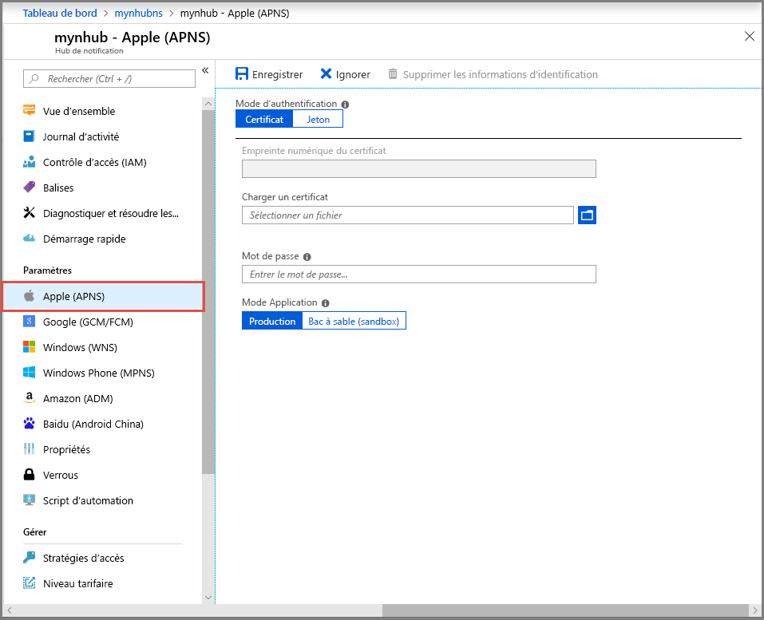

# Configurer les notifications Push dans un hub de notification sur le portail Azure

Azure Notification Hubs propose un moteur Push facile à utiliser et à mettre à l’échelle horizontalement (« scale-out »). Utilisez Notification Hubs pour envoyer des notifications à n’importe quelle plateforme (iOS, Android, Windows, Kindle, Baidu) et à partir de n’importe quel back-end (cloud ou local). Pour plus d’informations, consultez [Présentation d’Azure Notification Hubs](notification-hubs-push-notification-overview.md).

Dans ce guide de démarrage rapide, vous allez utiliser les paramètres PNS (Platform Notification System) de Notification Hubs pour configurer des notifications Push sur plusieurs plateformes. Le guide de démarrage rapide vous montre les étapes à suivre sur le portail Azure.

Si vous n’avez pas déjà créé de hub de notification, créez-en un maintenant. Pour plus d’informations, consultez [Créer un hub de notification Azure dans le portail Azure](create-notification-hub-portal.md). 

## Apple Push Notification Service

Pour configurer Apple Push Notification Service (APNS) :

1. Dans le portail Azure, dans la page **Hub de notification**, sélectionnez **Apple (APNS)** dans le menu de gauche.

1. Pour **Mode d’authentification**, sélectionnez **Certificat** ou **Jeton**.

   a. Si vous sélectionnez **Certificat** :
   * Sélectionnez l’icône de fichier, puis sélectionnez le fichier *.p12* que vous voulez charger.
   * Entrez un mot de passe.
   * Sélectionnez le mode **Bac à sable**. Ou bien, pour envoyer des notifications Push aux utilisateurs qui ont acheté votre application sur le Store, sélectionnez le mode **Production**.

     

   b. Si vous sélectionnez **Jeton** :

   * Entrez les valeurs pour **ID de clé**, **ID d’offre groupée**, **ID de l’équipe** et **Jeton**.
   * Sélectionnez le mode **Bac à sable**. Ou bien, pour envoyer des notifications Push aux utilisateurs qui ont acheté votre application sur le Store, sélectionnez le mode **Production**.

     

Pour plus d’informations, consultez [Notifications Push vers iOS avec Azure Notification Hubs](notification-hubs-ios-apple-push-notification-apns-get-started.md).

## Google Firebase Cloud Messaging

Pour configurer des notifications Push pour Google Firebase Cloud Messaging (FCM) :

1. Dans la page **Hub de notification** du portail Azure, sélectionnez **Google (GCM/FCM)** dans le menu de gauche. 
2. Collez la **Clé API** pour le projet FCM que vous avez enregistré précédemment. 
3. Sélectionnez **Enregistrer**. 

   

Une fois ces étapes terminées, une alerte indique que le hub de notification a été correctement mis à jour. Le bouton **Enregistrer** est désactivé. 

Pour plus d’informations, consultez [Notifications Push vers des appareils Android avec Notification Hubs et Google FM](notification-hubs-android-push-notification-google-fcm-get-started.md).

## Services de notifications Push Windows

Pour configurer les services de notifications Push Windows (WNS) :

1. Dans la page **Hub de notification** du portail Azure, sélectionnez **Windows (WNS)** dans le menu de gauche.
2. Entrez des valeurs pour **SID de package** et **Clé de sécurité**.
3. Sélectionnez **Enregistrer**.

   

Pour plus d’informations, consultez [Envoyer des notifications vers des applications UWP avec Azure Notification Hubs](notification-hubs-windows-store-dotnet-get-started-wns-push-notification.md).

## Services de notifications Push Microsoft pour Windows Phone

Pour configurer les services de notifications Push Microsoft (MPNS) pour Windows Phone : 

1. Dans la page **Hub de notification** du portail Azure, sélectionnez **Windows Phone (MPNS)** dans le menu de gauche.
1. Activez les notifications Push authentifiées ou non authentifiées :

   a. Pour activer les notifications Push non authentifiées, sélectionnez **Activer les notifications Push non authentifiées** > **Enregistrer**.

      

   b. Pour activer les notifications Push authentifiées :
      * Dans la barre d’outils, sélectionnez **Charger le certificat**.
      * Sélectionnez l’icône de fichier, puis le fichier de certificat.
      * Entrez le mot de passe du certificat.
      * Sélectionnez **OK**.
      * Dans la page **Windows Phone (MPNS)**, sélectionnez **Enregistrer**.

Pour plus d’informations, consultez [Notifications Push vers des applications Windows Phone avec Azure Notification Hubs](notification-hubs-windows-mobile-push-notifications-mpns.md).
      
## Amazon Device Messaging

Pour configurer des notifications Push pour Amazon Device Messaging (ADM) :

1. Dans la page **Hub de notification** du portail Azure, sélectionnez **Amazon (ADM)** dans le menu de gauche.
2. Entrez des valeurs pour **ID client** et **Secret client**.
3. Sélectionnez **Enregistrer**.
    
   

Pour plus d’informations, consultez [Prendre en main Notification Hubs pour les applications Kindle](notification-hubs-kindle-amazon-adm-push-notification.md).

## Baidu (Android China)

Pour configurer des notifications Push pour Baidu :

1. Dans la page **Hub de notification** du portail Azure, sélectionnez **Baidu (Android China)** dans le menu de gauche. 
2. Entrez la **Clé API** que vous avez obtenue à partir de la console Baidu du projet Push cloud Baidu. 
3. Entrez la **Clé secrète** que vous avez obtenue à partir de la console Baidu du projet Push cloud Baidu. 
4. Sélectionnez **Enregistrer**. 

    

Une fois ces étapes terminées, une alerte indique que le hub de notification a été correctement mis à jour. Le bouton **Enregistrer** est désactivé. 

Pour plus d’informations, consultez [Prendre en main Notification Hubs à l’aide de Baidu](notification-hubs-baidu-china-android-notifications-get-started.md).

## Étapes suivantes
Dans ce démarrage rapide, vous avez appris à configurer les paramètres PNS (Platform Notification System) pour un hub de notification sur le portail Azure. 

Pour en savoir plus sur l’envoi de notifications Push vers différentes plateformes, consultez ces tutoriels :

- [Notifications Push vers des appareils iOS avec Notification Hubs et APNS](notification-hubs-ios-apple-push-notification-apns-get-started.md)
- [Notifications Push vers des appareils Android avec Notification Hubs et Google FCM](notification-hubs-android-push-notification-google-fcm-get-started.md)
- [Notifications Push vers une application UWP sur un appareil Windows](notification-hubs-windows-store-dotnet-get-started-wns-push-notification.md)
- [Notifications Push vers une application Windows Phone 8 avec MPNS](notification-hubs-windows-mobile-push-notifications-mpns.md)
- [Notifications Push vers une application Kindle](notification-hubs-kindle-amazon-adm-push-notification.md)
- [Notifications Push avec Notification Hubs et le push cloud Baidu](notification-hubs-baidu-china-android-notifications-get-started.md)
