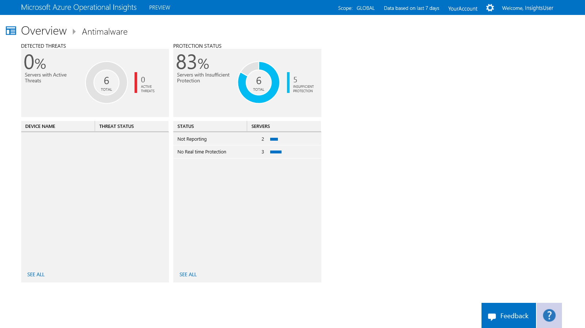

<properties 
   pageTitle="Protection des serveurs contre les programmes malveillants"
   description="Utilisez un logiciel anti-programme malveillant pour protéger les serveurs de votre infrastructure contre les programmes malveillants"
   services="operational-insights"
   documentationCenter=""
   authors="bandersmsft"
   manager="jwhit"
   editor="tysonn" />
<tags 
   ms.service="operational-insights"
   ms.devlang="na"
   ms.topic="article"
   ms.tgt_pltfrm="na"
   ms.workload="na"
   ms.date="03/20/2015"
   ms.author="banders" />

# Protection des serveurs contre les programmes malveillants

Vous pouvez utiliser le pack d'analyse décisionnelle anti-programme malveillant de Microsoft Azure Operational Insights pour protéger les serveurs de votre infrastructure contre les programmes malveillants. Installez le pack d'analyse décisionnelle pour mettre à jour l'agent Operations Manager et le module de configuration de base pour Operational Insights. L'état de la protection contre les programmes malveillants et les menaces potentielles sur les serveurs analysés sont lus, puis les données sont envoyées au service cloud Operational Insights pour traitement. Une logique est appliquée aux données reçues et le service cloud enregistre les données. Si une protection insuffisante est décelée, les serveurs présentant des menaces actives et une protection insuffisante figurent dans le tableau de bord **Logiciel anti-programme malveillant**. Les informations du tableau de bord **Logiciel anti-programme malveillant** vous permettent de développer un plan de protection pour les serveurs qui en ont besoin.

## Utilisation de logiciel anti-programme malveillant

Avant de pouvoir utiliser un logiciel anti-programme malveillant dans Microsoft Azure Operational Insights, vous devez installer un pack d'analyse décisionnelle. Pour plus d'informations sur l'installation de packs d'analyse décisionnelle, consultez la rubrique [Utilisation de la galerie pour ajouter ou supprimer des packs d'analyse décisionnelle](operational-insights-add-intelligence-packs.md). 

Une fois le pack installé, vous pouvez afficher une évaluation des programmes malveillants de vos serveurs à l'aide de la vignette **Évaluation de programmes malveillants** du tableau de bord **Vue d'ensemble** d'Operational Insights. 

La vignette ouvre la page **Logiciel anti-programme malveillant** où vous pouvez afficher un résumé d'ensemble des menaces et de l'état de protection. La page comprend les catégories suivantes :

- Menaces détectées, qui indique l'état de l'appareil et des menaces.

- État de protection, qui indique l'état et le nombre de serveurs qui ne sont pas totalement protégés.

### Pour effectuer une évaluation de programmes malveillants

1. Sur la page **Vue d'ensemble**, cliquez sur la vignette **Évaluation de programmes malveillants**.

2. Dans le tableau de bord **Logiciel anti-programme malveillant**, choisissez une catégorie.

3. Cliquez sur un élément pour en afficher les informations détaillées sur la page de **recherche**.

4. À l'aide des informations obtenues, vous pouvez créer un plan d'application des logiciels anti-programmes malveillants ou d'autres mesures correctives pour protéger vos serveurs.

<!--HONumber=52-->