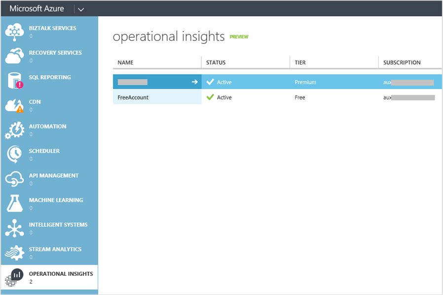
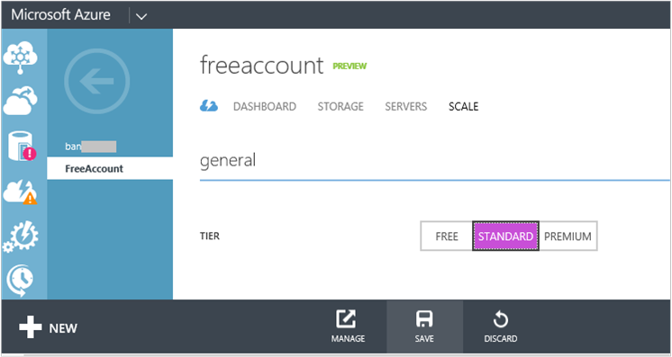
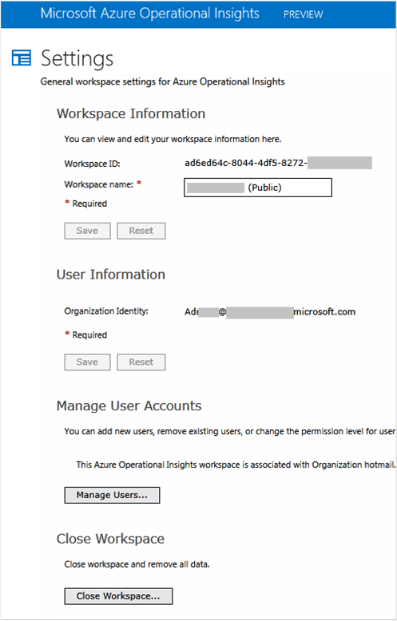
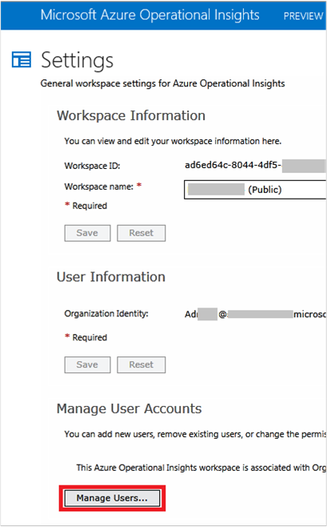
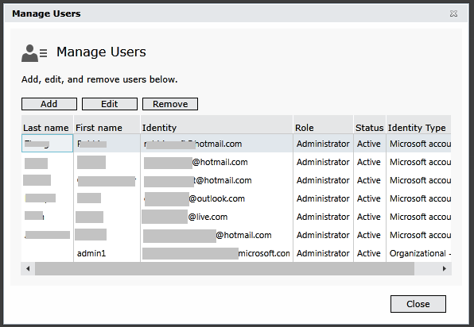
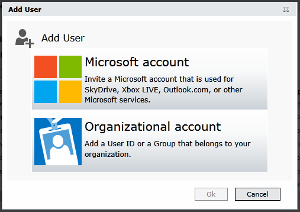

<properties 
    pageTitle="Configuration de votre espace de travail et gestion des paramètres" 
    description="Découvrez comment configurer votre espace de travail et gérer les paramètres de Microsoft Azure Operational Insights" 
    services="operational-insights" 
    documentationCenter="" 
    authors="bandersmsft" 
    manager="jwhit" 
    editor=""/>

<tags 
    ms.service="operational-insights" 
    ms.workload="operational-insights" 
    ms.tgt_pltfrm="na" 
    ms.devlang="na" 
    ms.topic="article" 
    ms.date="04/30/2015" 
    ms.author="banders"/>

# Configuration de votre espace de travail et gestion des paramètres 

[AZURE.INCLUDE [operational-insights-note-moms](../includes/operational-insights-note-moms.md)]

Pour créer un nouvel espace de travail Microsoft Azure Operational Insights, vous choisissez un nom d’espace de travail et l’associez à votre compte, puis vous choisissez un emplacement géographique. Un espace de travail Operational Insights est en fait un conteneur qui inclut des informations de compte et des informations de configuration simple pour le compte. Vous ou d’autres membres de votre organisation peuvent utiliser plusieurs espaces de travail Operational Insights pour gérer différents ensembles de données provenant de l’ensemble ou de certaines parties de votre infrastructure informatique.

Après la création de l’espace de travail, vous pouvez effectuer d’autres tâches à l’aide de l’espace de travail, comme la gestion d’Operational Insights, la visualisation de vos données d’utilisation dans le tableau de bord, la sélection des comptes de stockage, la connexion directe des agents ou la connexion à System Center Operations Manager. Vous pouvez également gérer les paramètres de chaque espace de travail.

Pour en savoir plus sur la création d’un espace de travail à l’aide d’Azure, regardez la vidéo suivante :

> [AZURE.VIDEO creating-a-workspace-for-azure-customers-opinsights]

## De combien d’espaces de travail ai-je besoin ?
Un espace de travail est considéré comme une ressource Azure dans le portail de gestion Azure.

Vous pouvez créer un espace de travail ou créer un lien vers un espace de travail d’aperçu existant, ouvert précédemment pour une utilisation avec System Center Operations Manager, mais pas encore associé à un abonnement Azure \(nécessaire pour la facturation\). Un espace de travail représente le niveau auquel les données sont collectées, agrégées, analysées et présentées dans le portail Operational Insights. Vous pouvez choisir plusieurs espaces de travail pour séparer les données de différents environnements et systèmes ; chaque groupe d’administration Operations Manager \(et tous ses agents\) ou des machines virtuelles/agents ne peuvent être connectés qu’avec un seul espace de travail.

Chaque espace de travail peut être associé à plusieurs comptes utilisateur et chaque compte utilisateur \(compte Microsoft ou compte professionnel\) peut également avoir accès à plusieurs espaces de travail Operational Insights. Par défaut, le compte Microsoft ou le compte professionnel utilisé pour créer l’espace de travail devient l’administrateur de l’espace de travail. L’administrateur peut ensuite inviter d’autres comptes Microsoft ou choisir les utilisateurs à partir de son Azure Active Directory.

##Liaison d’un espace de travail existant à un abonnement Azure

Il est possible de créer un espace de travail à partir de [opinsights.azure.com](http://opinsights.azure.com). Toutefois, ces espaces de travail disposent de certaines limites, la plus notable étant celle de 500 Mo de téléchargement de données par jour si vous utilisez un compte gratuit. Pour apporter des modifications à cet espace de travail, vous devez **lier votre espace de travail existant à un abonnement Azure**.

>[AZURE.IMPORTANT]Pour lier un espace de travail, votre compte Azure doit déjà avoir accès à l’espace de travail que vous souhaitez lier. En d’autres termes, le compte que vous utilisez pour accéder au portail Azure doit être **le même** que le compte que vous utilisez pour accéder à votre espace de travail Operational Insights. Si ce n’est pas le cas, consultez [Ajout d’un utilisateur à un espace de travail existant](#addusertoexistingworkspace).

1. Connectez-vous au portail de gestion Azure.
2. Cliquez sur **+ Nouveau** dans le coin inférieur gauche du portail.
3. Cliquez sur **App Services**, accédez à **Operational Insights** et sélectionnez-le.
4. Cliquez sur **Create**.
5. Sur la liste des **Comptes**, vous devez voir une liste de vos espaces de travail existants qui n’ont *pas encore* été liés à votre abonnement Azure. Sélectionnez un compte.

	>[AZURE.NOTE][Ajout d’un utilisateur à un espace de travail existant](#addusertoexistingworkspace)

6. Renseignez les champs restants, puis sélectionnez **Créer un espace de travail**.

## Mise à niveau de l’espace de travail vers un plan payant

Il existe trois types de plan d’espace de travail pour Operational Insights : **Gratuit**, **Standard** et **Premium**. Si vous utilisez un plan *gratuit*, vous avez peut-être atteint votre plafond de données de 500 Mo. Vous devez mettre à niveau votre espace de travail vers un « \*\*plan avec paiement à l’utilisation\*\* » afin de collecter des données au-delà de cette limite. Vous pouvez convertir votre type de plan à tout moment. Pour plus d’informations sur la tarification d’Operational Insights, consultez la page [Tarification](http://azure.microsoft.com/pricing/operational-insights/).

>[AZURE.IMPORTANT]Les plans d’espace de travail peuvent uniquement être modifiés s’ils sont *liés* à un abonnement Azure. Si vous avez créé votre espace de travail dans Azure ou si vous avez *déjà* lié votre espace de travail, vous pouvez ignorer ce message. Si vous avez créé votre espace de travail à partir de [opinsights.azure.com](http://opinsights.azure.com), vous devez suivre les étapes de [Liaison d’un espace de travail existant à un abonnement Azure](#linkworkspace).

### Modification du type de plan

Dans le portail de gestion Azure, accédez à l’espace de travail Operational Insights vers lequel vous souhaitez effectuer une mise à niveau niveau :

Sélectionnez cet espace de travail et sélectionnez **MISE À L’ÉCHELLE** dans les onglets en haut de l’écran

Enfin, sélectionnez le plan que vous souhaitez mettre à niveau, puis cliquez sur **ENREGISTRER**. Les modifications sont reflétées dans le portail et vous pouvez désormais collecter des données au-delà du plafond de données du plan « gratuit ».

## Modification du nom de l’espace de travail

Si vous êtes l’administrateur d’un espace de travail Microsoft Azure Operational Insights, vous pouvez modifier le nom de l’espace de travail.

###Pour modifier le nom de l’espace de travail

1. Cliquez sur le nom de votre espace de travail. 
  

2. Cliquez sur l’icône de configuration. 
  

3. Sur la page **Paramètres** d’Operational Insights, dans la section **Gérer les comptes utilisateur**, cliquez sur **Gérer les utilisateurs**. 
  

4. Dans le portail Operational Insights, sur la page **Paramètres**, entrez le nouveau nom dans le champ **Nom de l’espace de travail**.

5. Cliquez sur **Save**.

## Modification des informations utilisateur

Vous pouvez modifier le nom associé à un utilisateur Operational Insights, mais vous ne pouvez pas modifier le nom du compte Microsoft associé à cet utilisateur.

Les utilisateurs disposant d’un compte Microsoft peuvent également modifier les paramètres de notification. Si vous avez utilisé un compte professionnel via Azure Active Directory, vous ne pouvez actuellement pas utiliser la fonctionnalité **Notifications** d’Operational Insights.

### Pour modifier les informations utilisateur
1. Sur la page **Paramètres** d’Operational Insights, dans la section **Informations utilisateur**, entrez le nom dans les champs **Prénom** et **Nom**.

2. Modifiez les paramètres de notification pour les utilisateurs de comptes Microsoft. Par défaut, tous les utilisateurs de compte sont avertis lorsqu’une alerte est générée. Si vous souhaitez que les utilisateurs ne reçoivent plus ces notifications, désactivez l’option **Recevoir des notifications par courrier électronique des nouvelles alertes Operational Insights**.

3. Cliquez sur **Save**.

## Modification des paramètres de notification

Par défaut, tous les utilisateurs associés à un espace de travail Operational Insights reçoivent un courrier électronique qui récapitule les alertes d’évaluation de configuration générées au cours des sept derniers jours. Sur la page **Paramètres**, les utilisateurs peuvent choisir de recevoir ou non ces notifications par courrier électronique.

>[AZURE.NOTE]Les notifications sont uniquement disponibles pour les utilisateurs disposant d’un compte Microsoft. Si vous avez utilisé un compte professionnel via Azure Active Directory, vous ne pouvez actuellement pas utiliser la fonctionnalité **Notifications** d’Operational Insights.

Vous devriez voir des courriers électroniques mais ce n’est pas le cas ? Vérifiez vos filtres anti-spam. Assurez-vous que les courriers électroniques provenant de *operationalinsights@opinsights.azure.com* ne sont pas filtrés.

1. Sur la page **Paramètres** d’Operational Insights, dans la section **Informations utilisateur**, désactivez l’option **Recevoir des notifications par courrier électronique des nouvelles alertes Operational Insights**.

2. Cliquez sur **Save**.

##Ajout d’un utilisateur à un espace de travail existant

Procédez comme suit pour ajouter un utilisateur ou un groupe à un espace de travail Operational Insights. L’utilisateur ou le groupe sera en mesure d’afficher et d’agir sur toutes les alertes associées à cet espace de travail.

>[AZURE.NOTE]Si vous souhaitez ajouter un utilisateur ou un groupe à partir de votre compte professionnel Azure Active Directory, vous devez vous assurer que vous avez associé votre compte Operational Insights à votre domaine Active Directory. Voir [Ajout d’une organisation Azure Active Directory à un espace de travail existant](#).

### Pour ajouter un utilisateur à un espace de travail existant
1. Cliquez sur le nom de votre espace de travail.
2. Cliquez sur l’icône de configuration.
3. Sur la page **Paramètres** d’Operational Insights, dans la section **Gérer les comptes utilisateur**, cliquez sur **Gérer les utilisateurs**. 
  

4. Dans la fenêtre **Gérer les utilisateurs**, cliquez sur **Ajouter**. 
  

5. Si votre compte Operational Insights est associé à Azure Active Directory, spécifiez **Compte professionnel**.

    >[AZURE.NOTE]

6. Entrez les nouvelles informations utilisateur pour le compte Microsoft ou le compte d’organisation. Si vous ajoutez un compte professionnel, vous pouvez entrer une partie du nom d’utilisateur ou du groupe ou l’alias de messagerie, puis cliquez sur **Vérifier les noms** pour rechercher l’utilisateur ou le groupe spécifique.
 
    >[AZURE.NOTE]Pour de meilleurs résultats, limitez à deux le nombre de groupes Active Directory associés à un seul compte Operational Insights : un pour les administrateurs et un pour les utilisateurs. L’utilisation de plusieurs groupes peut avoir une incidence sur les performances d’Operational Insights.

7. Sélectionnez le rôle de ce nouvel utilisateur : **Administrateur** ou **Utilisateur**. 
  

8. Cliquez sur **OK**.
    
    Si vous ajoutez un compte Microsoft, une invitation à joindre votre compte est envoyée à l’adresse électronique que vous avez fournie. Une fois que l’utilisateur a suivi les instructions de l’invitation à rejoindre Operational Insights, l’utilisateur peut afficher les alertes et les informations de compte pour ce compte Operational Insights et vous serez en mesure d’afficher les informations utilisateur dans la fenêtre **Gérer les utilisateurs**.
 
    Si vous ajoutez un compte professionnel, l’utilisateur pourra accéder à Operational Insights immédiatement. 
  

## Ajout d’une organisation Azure Active Directory à un espace de travail existant

Vous pouvez associer votre espace de travail Operational Insights à un domaine Azure Active Directory. Vous pouvez ainsi ajouter des utilisateurs à partir d’Active Directory directement à votre espace de travail Operational Insights, sans compte Microsoft distinct.

### Pour ajouter une organisation Azure Active Directory à un espace de travail existant

1. Dans la page Paramètres d’Operational Insights, cliquez sur **Ajouter une organisation**. 
  

2. Consultez les informations sur les comptes d’organisation, puis cliquez sur **Suivant**.

3. Entrez les informations d’identité de l’administrateur de votre domaine Azure Active Directory, puis cliquez sur **Se connecter**.

4. Cliquez sur **Autoriser l’accès** pour permettre à Operational Insights d’utiliser les informations d’identité de votre domaine Active Directory. 
 

## Modification d’un compte d’utilisateur existant

Vous pouvez modifier le rôle de compte pour un utilisateur associé à votre compte Operational Insights. Vous pouvez choisir parmi les rôles suivants :

 - *Administrateur* : peut gérer les utilisateurs, afficher et agir sur toutes les alertes, ainsi qu’ajouter et supprimer des serveurs

 - *Utilisateur* : peut afficher et agir sur toutes les alertes, ainsi qu’ajouter et supprimer des serveurs

### Pour modifier un compte
1. Sur la page **Paramètres** d’Operational Insights, dans la section **Gérer les comptes utilisateur**, cliquez sur **Gérer les utilisateurs**.

2. Dans la fenêtre **Gérer les utilisateurs**, sélectionnez le nom de l’utilisateur que vous souhaitez modifier, puis cliquez sur **Modifier l’utilisateur**.

3. Sélectionnez le rôle de cet utilisateur : **Administrateur** ou **Utilisateur**.

4. Cliquez sur **OK**.

## Suppression d’un utilisateur d’un espace de travail Operational Insights

Procédez comme suit pour supprimer un utilisateur d’un espace de travail Operational Insights. Notez que cela ne ferme pas l’espace de travail de l’utilisateur. Au lieu de cela, cela supprime l’association entre cet utilisateur et l’espace de travail. Si un utilisateur est associé à plusieurs espaces de travail, il reste en mesure de se connecter à Operational Insights.

### Pour supprimer un utilisateur d’un espace de travail

1. Sur la page **Paramètres** d’Operational Insights, dans la section **Gérer les comptes utilisateur**, cliquez sur **Gérer les utilisateurs**.

2. Dans la fenêtre **Gérer les utilisateurs**, cliquez sur le nom de l’utilisateur que vous souhaitez supprimer, puis cliquez sur **Supprimer l’utilisateur**.

3. Cliquez sur **OK** pour confirmer que vous souhaitez supprimer l’utilisateur.

## Fermeture de votre espace de travail Operational Insights

Lorsque vous fermez un espace de travail Operational Insights, toutes les données relatives à votre espace de travail sont supprimées du service Operational Insights dans les 30 jours suivant la fermeture de l’espace de travail.

Si vous êtes administrateur et que plusieurs utilisateurs sont associés à l’espace de travail, l’association entre les utilisateurs et l’espace de travail est rompue. Si les utilisateurs sont associés à d’autres espaces de travail, ils peuvent continuer à utiliser Operational Insights avec ces autres espaces de travail. Toutefois, s’ils ne sont pas associés à des espaces de travail, ils devront créer un espace de travail pour utiliser Operational Insights.

### Pour fermer un espace de travail Operational Insights

1. Sur la page **Paramètres** d’Operational Insights, dans la section **Fermer l’espace de travail**, cliquez sur **Fermer l’espace de travail**.

2. Sélectionnez un des motifs de fermeture de votre espace de travail ou saisissez une autre raison dans la zone de texte.

3. Cliquez sur **Fermer l’espace de travail**.

<!--HONumber=54-->