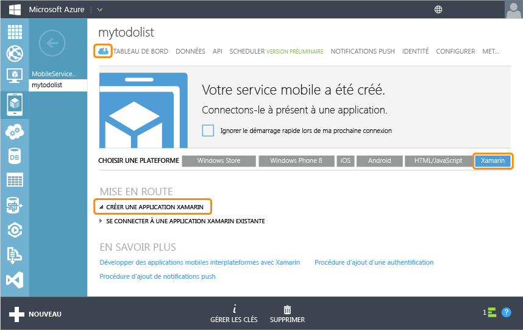
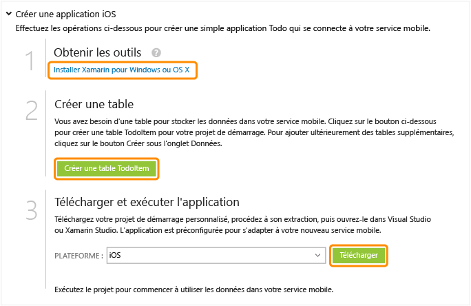
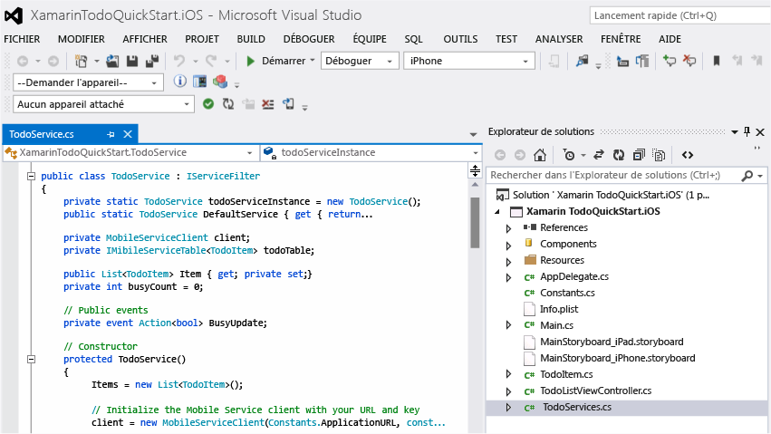
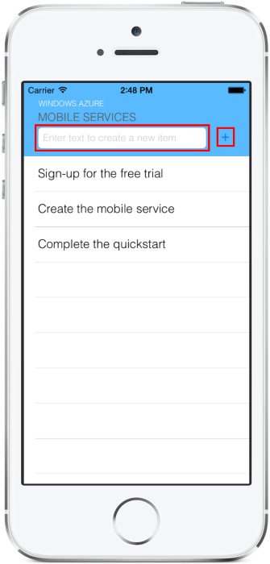

<properties pageTitle="Get Started with Mobile Services for Xamarin iOS apps" metaKeywords="" description="Follow this tutorial to get started using Azure Mobile Services for Xamarin iOS development." metaCanonical="" services="mobile" documentationCenter="Mobile" title="Get started with Mobile Services" authors="craigd" solutions="" manager="" editor="" />

Prise en main de Mobile Services
================================

[Windows Store](/en-us/documentation/articles/mobile-services-windows-store-get-started "Windows Store") [Windows Phone](/en-us/documentation/articles/mobile-services-windows-phone-get-started "Windows Phone") [iOS](/en-us/documentation/articles/mobile-services-ios-get-started "iOS") [Android](/en-us/documentation/articles/mobile-services-android-get-started "Android") [HTML](/en-us/documentation/articles/mobile-services-html-get-started "HTML") [Xamarin.iOS](/en-us/documentation/articles/partner-xamarin-mobile-services-ios-get-started "Xamarin.iOS") [Xamarin.Android](/en-us/documentation/articles/partner-xamarin-mobile-services-android-get-started "Xamarin.Android") [Sencha](/en-us/documentation/articles/partner-sencha-mobile-services-get-started/ "Sencha") [PhoneGap](/en-us/documentation/articles/mobile-services-javascript-backend-phonegap-get-started/ "PhoneGap")

Ce didacticiel vous montre comment ajouter un service principal cloud à une application Xamarin.iOS en utilisant Azure Mobile Services. Dans ce didacticiel, vous allez créer un service mobile et une simple application *To do list* qui stocke les données d'application dans le nouveau service mobile.

Si vous préférez regarder une vidéo, le clip sur la droite suit la même procédure que ce didacticiel.

[regarder le didacticiel](http://channel9.msdn.com/Series/Windows-Azure-Mobile-Services/Getting-Started-with-Xamarin-and-Windows-Azure-Mobile-Services) [Lire la vidéo](http://channel9.msdn.com/Series/Windows-Azure-Mobile-Services/Getting-Started-with-Xamarin-and-Windows-Azure-Mobile-Services) 10:05:00

Voici une capture d'écran de l'application terminée :

Pour suivre ce didacticiel, vous avez besoin de XCode 4.5 et d'iOS 5.0 (ou versions ultérieures), ainsi que de [Xamarin Studio](http://xamarin.com/download) pour OS X ou du plug-in Xamarin Visual Studio pour Visual Studio sous Windows.

**Remarque**

Pour effectuer ce didacticiel, vous avez besoin d'un compte Azure. Si vous ne possédez pas de compte, vous pouvez créer un compte d'évaluation gratuit en quelques minutes. Pour plus d'informations, consultez la page [Version d'évaluation gratuite d'Azure](http://www.windowsazure.com/en-us/pricing/free-trial/?WT.mc_id=A643EE910&returnurl=http%3A%2F%2Fwww.windowsazure.com%2Fen-us%2Fdevelop%2Fmobile%2Ftutorials%2Fget-started-xamarin-ios%2F).

Création d'un service mobile
----------------------------

[WACOM.INCLUDE [mobile-services-create-new-service](../includes/mobile-services-create-new-service.md)]

Création d'une application Création d'une application Xamarin.iOS
-----------------------------------------------------------------

Après avoir créé votre service mobile, vous pouvez suivre un démarrage rapide facile dans le portail de gestion pour créer une application ou modifier une application existante afin de vous connecter au service mobile.

Dans cette section, vous allez créer une application Xamarin.iOS connectée à votre service mobile.

1.  Dans le portail de gestion, cliquez sur **Mobile Services**, puis sur le service mobile que vous venez de créer.

2.  Sous l'onglet de démarrage rapide, cliquez sur **Xamarin.iOS** sous **Choisissez une plateforme** et développez **Créer une application Xamarin.iOS**.

    

    Les trois étapes permettant de créer une application Xamarin.iOS connectée à votre service mobile s'affichent.

   

1.  Si vous ne l'avez pas déjà fait, téléchargez et installez [Xcode] v4.4 ou une version ultérieure et [Xamarin Studio](http://xamarin.com/download).

2.  Cliquez sur **Create TodoItems table** pour créer une table permettant de stocker les données d'application.

3.  Sous **Download and run app**, cliquez sur **Télécharger**.

    Cette action permet de télécharger le projet de l'exemple d'application *To do list* qui est connecté à votre service mobile et référence le composant Azure Mobile Services pour Xamarin.iOS. Enregistrez le fichier projet compressé sur votre ordinateur local, et notez son emplacement.

Exécution de votre applicationExécution de votre nouvelle application Xamarin.iOS
---------------------------------------------------------------------------------

La dernière étape de ce didacticiel consiste à générer et à exécuter votre nouvelle application.

1.  Accédez à l'emplacement où vous avez enregistré les fichiers projet compressés, développez les fichiers sur votre ordinateur et ouvrez le fichier solution **XamarinTodoQuickStart.iOS.sln** dans Xamarin Studio ou Visual Studio.

    

    

2.  Appuyez sur le bouton **Exécuter** pour générer le projet et démarrer l'application dans l'émulateur iPhone (configuration par défaut pour ce projet).

3.  Dans l'application, tapez un texte explicite, comme *Suivre le didacticiel*, puis cliquez sur l'icône plus (**+**).

    

    Ceci envoie une demande POST vers le nouveau service mobile hébergé dans Azure. Les données de la requête sont insérées dans la table TodoItem. Les éléments stockés dans la table sont renvoyés par le service mobile et les données sont affichées dans la liste.

    **Remarque**

    Vous pouvez vérifier le code qui se trouve dans le fichier TodoService.cs C\# et permet d'accéder au service mobile pour exécuter une requête et insérer des données.

4.  De retour dans le portail de gestion, cliquez sur l'onglet **Données**, puis sur la table **TodoItems**.

    

    Cela vous permet de parcourir les données insérées par l'application dans la table.

    

Étapes suivantes
----------------

Maintenant que vous avez effectué le démarrage rapide, découvrez comment exécuter d'autres tâches importantes dans Mobile Services :

-   [Prise en main des données](/en-us/develop/mobile/tutorials/get-started-with-data-xamarin-ios)
    
    En savoir plus sur le stockage et l'interrogation des données à l'aide de Mobile Services.

-   [Prise en main de l'authentification](/en-us/develop/mobile/tutorials/get-started-with-users-xamarin-ios)
    
    En savoir plus sur l'authentification des utilisateurs de votre application avec un fournisseur d'identité.

-   [Prise en main des notifications Push](/en-us/develop/mobile/tutorials/get-started-with-push-xamarin-ios)
    
    En savoir plus sur l'envoi d'une notification Push très basique sur votre application.

