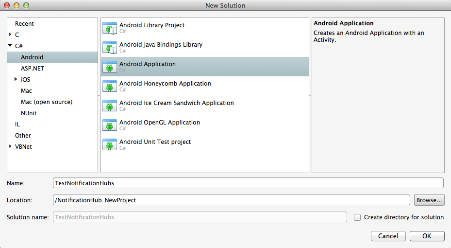
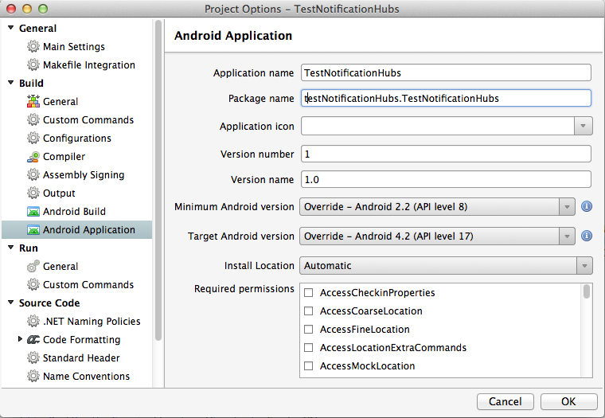
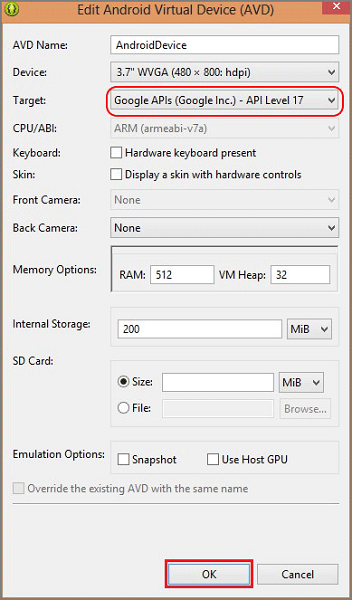
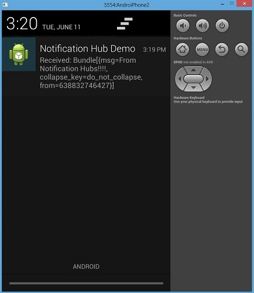
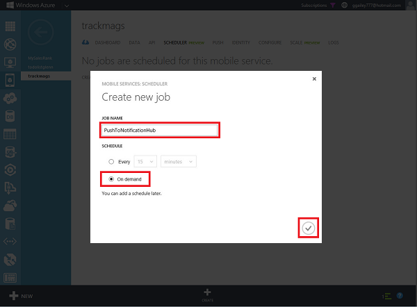

<properties linkid="" urlDisplayName="" pageTitle="Get started with Notification Hubs for Xamarin.Android apps" metaKeywords="" description="Learn how to use Azure Notification Hubs to send push notifications to a Xamarin Android application." metaCanonical="" authors="elioda" solutions="" manager="" editor="" services="mobile-services,notification-hubs" documentationCenter="" title="Get started with Notification Hubs" />

Prise en main de Notification Hubs
==================================

[Windows Store C\#](/en-us/manage/services/notification-hubs/getting-started-windows-dotnet "Windows Store C#")[Windows Phone](/en-us/documentation/articles/notification-hubs-windows-phone-get-started/ "Windows Phone")[iOS](/en-us/documentation/articles/notification-hubs-ios-get-started/ "iOS")[Android](/en-us/documentation/articles/notification-hubs-android-get-started/ "Android")[Kindle](/en-us/documentation/articles/notification-hubs-kindle-get-started/ "Kindle")[Xamarin.iOS](/en-us/documentation/articles/partner-xamarin-notification-hubs-ios-get-started/ "Xamarin.iOS")[Xamarin.Android](/en-us/documentation/articles/partner-xamarin-notification-hubs-android-get-started/ "Xamarin.Android")

Cette rubrique montre comment utiliser Azure Notification Hubs pour envoyer des notifications Push vers une application Xamarin.Android. Dans ce didacticiel, vous allez créer une application Xamarin.Android vierge qui reçoit des notifications Push à l'aide de Google Cloud Messaging (GCM). Une fois la création terminée, vous pouvez diffuser des notifications Push sur tous les appareils sur lesquels votre application est installée au moyen de votre concentrateur de notification. Le code finalisé est disponible dans l'exemple [Application NotificationHubs](http://go.microsoft.com/fwlink/p/?LinkId=331329).

Ce didacticiel vous familiarise avec les étapes de base pour activer les notifications Push :

1.  [Activation de Google Cloud Messaging](#register)
2.  [Configuration de votre concentrateur de notification](#configure-hub)
3.  [Connexion de votre application au concentrateur de notification](#connecting-app)
4.  [Exécution de votre application avec l'émulateur](#run-app)
5.  [Envoi de notifications à partir de votre serveur principal](#send)

Ce didacticiel présente un scénario de diffusion simple utilisant Notification Hubs. Ce didacticiel requiert les éléments suivants :

-   Xamarin.Android
-   Un compte Google actif

Vous devez suivre ce didacticiel avant de pouvoir suivre tous les autres didacticiels Notification Hubs pour les applications Android.
**Remarque**

Pour suivre ce didacticiel, vous avez besoin d'un compte Azure actif. Si vous ne possédez pas de compte, vous pouvez créer un compte d'évaluation gratuit en quelques minutes. Pour plus d'informations, consultez la page [Version d'évaluation gratuite d'Azure](http://www.windowsazure.com/en-us/pricing/free-trial/?WT.mc_id=A9C9624B5&returnurl=http%3A%2F%2Fwww.windowsazure.com%2Fen-us%2Fmanage%2Fservices%2Fnotification-hubs%2Fgetting-started-xamarin-android%2F).

Activation de Google Cloud MessagingActivation de Google Cloud Messaging
------------------------------------------------------------------------

**Remarque**

Pour effectuer la procédure décrite dans cette rubrique, vous devez disposer d'un compte Google avec une adresse électronique vérifiée. Pour créer un compte Google, consultez la page [accounts.google.com](http://go.microsoft.com/fwlink/p/?LinkId=268302).

1.  Rendez-vous sur le site Web [API Google](http://go.microsoft.com/fwlink/p/?LinkId=268303), connectez-vous avec votre compte Google, puis cliquez sur **Create project...**.

         

    **Remarque**

    Si vous disposez déjà d'un projet en cours, vous êtes redirigé vers la page **Dashboard** une fois la connexion établie. Pour créer un projet depuis le tableau de bord, développez **API Project**, cliquez sur **Create...** sous **Other projects**, puis entrez un nom de projet et cliquez sur **Create project**.

2.  Cliquez sur **Overview** dans la colonne de gauche et notez le numéro de projet dans la section **Dashboard**.

    Plus loin dans le didacticiel, vous allez définir cette valeur en tant que variable PROJECT\_ID dans le client.

3.  Sur la page [Google apis](http://go.microsoft.com/fwlink/p/?LinkId=268303), cliquez sur **Services**, puis sur la touche bascule pour activer **Google Cloud Messaging for Android** et accepter les conditions de service.

4.  Cliquez sur **API Access**, puis sur **Create new Server key...**.

      

5.  Sous **Configure Server Key for API Project**, cliquez sur **Create**.

      

6.  Prenez note de la valeur de **API key**.

      

Ensuite, vous allez utiliser cette valeur de clé API afin d'activer Notification Hubs pour l'authentification avec GCM et l'envoi de notifications Push au nom de votre application.

Configuration de votre concentrateur de notificationConfiguration de votre concentrateur de notification
--------------------------------------------------------------------------------------------------------

1.  Connectez-vous au [portail de gestion Azure](https://manage.windowsazure.com/) et cliquez sur **+NEW** en bas de l'écran.

2.  Cliquez sur **Services d'application**, puis sur **Service Bus**, **Concentrateur de notification**, **Création rapide**.

      

3.  Tapez un nom pour votre concentrateur de notification, sélectionnez la région souhaitée, puis cliquez sur **Créer un concentrateur de notification**.

      

4.  Cliquez sur l'espace de noms que vous venez de créer (en général ***nom du concentrateur de notification*-ns**), puis cliquez sur l'onglet **Configure** en haut.

     

5.  Cliquez sur l'onglet **Concentrateurs de notification** en haut de la page, puis cliquez sur celui que vous venez de créer.

      

6.  Cliquez sur l'onglet **Configure** dans la partie supérieure, saisissez la valeur **API Key** obtenue à la section précédente, puis cliquez sur **Save**.

      

7.  Sélectionnez l'onglet **Dashboard** en haut, puis cliquez sur **Connection Information**. Notez les deux chaînes de connexion.

      

Votre concentrateur de notification est configuré pour GCM, et vous disposez des chaînes de connexion pour inscrire votre application et envoyer des notifications Push.

Connexion de votre applicationConnexion de votre application au concentrateur de notification
---------------------------------------------------------------------------------------------

### Création d'un projet

1.  Dans Xamarin Studio (ou Visual Studio), créez un projet Android (File, New, Solution, Android Application).

         
      

2.  Ouvrez les propriétés du projet en cliquant avec le bouton droit sur votre nouveau projet dans la vue Solution et en choisissant **Options**. Sélectionnez l'élément **Android Application** dans la section **Build**.

      

3.  Définissez **Minimum Android version** sur API Level 8.

4.  Définissez **Target Android version** sur la version d'API que vous voulez cibler (niveau d'API 8 ou supérieur).

5.  Assurez-vous que la première lettre de votre nom de package (**Package name**) est en minuscule.

    **Remarque**

    La première lettre du nom du package doit être une minuscule. Sinon, vous recevrez des erreurs du manifeste d'application lors de l'inscription de vos  **BroadcastReceiver*\* et **IntentFilter*\* pour les notifications Push ci-dessous.

### Ajout de PushSharp à votre projet

1.  Nous allons maintenant ajouter **PushSharp** en tant que référence dans notre projet. Pour ce faire, nous devons compiler la dernière version de PushSharp et ajouter la DLL compilée comme référence pointant vers notre projet Xamarin.Android.

2.  Accédez à la page [PushSharp Github](https://github.com/Redth/PushSharp) et téléchargez la dernière version. Une fois que vous avez extrait l'ensemble de fichiers, accédez à l'exemple de dossier de projet suivant :

    **/Client.Samples/PushSharp.ClientSample.MonoForAndroid/PushSharp.ClientSample.MonoForAndroid.Gcm/**

    .. et ouvrez le fichier projet suivant dans Xamarin Studio (ou Visual Studio) :

    **PushSharp.ClientSample.MonoForAndroid.Gcm.csproj*\*

3.  Générez l'exemple de client MonoForAndroid PushSharp en mode **Release**.

4.  Créez un dossier **\_external** dans votre dossier de projet Xamarin.Android.

5.  Copiez le fichier suivant depuis l'exemple de client MonoForAndroid PushSharp dans le dossier **\_external** nouvellement créé de votre dossier de projet Xamarin.Android :

    **\\bin\\Release\\PushSharp.Client.MonoForAndroid.dll**

6.  Ouvrez votre projet Xamarin.Android dans Xamarin Studio (ou Visual Studio).

7.  Cliquez avec le bouton droit sur le dossier **References** du projet et choisissez **Edit References...**

8.  Ouvrez l'onglet **.Net Assembly**, accédez au dossier **\_external** de votre projet, sélectionnez le fichier **PushSharp.Client.MonoForAndroid.dll** que nous avons généré précédemment et cliquez sur **Add**. Cliquez sur OK pour fermer la boîte de dialogue.

### Ajout de Xamarin.NotificationHub à votre projet

1.  Nous devons à présent ajouter des bibliothèques pour prendre en charge la classe NotificationHub. Accédez à la page [Xamarin.NotificationHub Github](https://github.com/SaschaDittmann/Xamarin.NotificationHub), téléchargez et créez le dossier source.

2.  Copiez le fichier DLL compilé **ByteSmith.WindowsAzure.Messaging.Android.dll** dans votre dossier **\_external** à l'intérieur de votre dossier de projet Xamarin.Android.

3.  Ouvrez votre projet Xamarin.Android dans Xamarin Studio (ou Visual Studio).

4.  Cliquez avec le bouton droit sur le dossier **References** du projet et choisissez **Edit References...**

5.  Ouvrez l'onglet **.Net Assembly**, accédez au dossier **\_external** de votre projet, sélectionnez le fichier **ByteSmith.WindowsAzure.Messaging.Android.dll** que nous avons généré précédemment et cliquez sur **Add**. Cliquez sur OK pour fermer la boîte de dialogue.

### Configuration de Notification Hubs dans votre projet

1.  Créez une classe **Constants.cs** et définissez les valeurs constantes suivantes (en remplaçant les espaces réservés par des valeurs) :

         public const string SenderID = "<GoogleProjectNumber>"; // Numéro de projet de l'API Google

         // Chaîne de connexion propre à l'application Azure et chemin d'accès au concentrateur
         public const string ConnectionString = "<Azure connection string>"";
         public const string NotificationHubPath = "<hub path>";

2.  Ajoutez les instructions using suivantes à **MainActivity.cs** :

         using ByteSmith.WindowsAzure.Messaging;
         using PushSharp.Client;

3.  Ajoutez la méthode suivante dans la classe **MainActivity** :

         private void RegisterWithGCM()
         {
             // Vérifiez que la configuration a été correctement effectuée dans son intégralité
             PushClient.CheckDevice(this);
             PushClient.CheckManifest(this);

             // Inscrivez-vous pour recevoir des notifications Push
             System.Diagnostics.Debug.WriteLine("Registering...");
             PushClient.Register(this, Constants.SenderID);
         }

4.  Créez une classe **MyBroadcastReceiver**.

    **Remarque**

    Nous allons décrire la procédure à suivre pour créer un **BroadcastReceiver** à partir de zéro. Il existe cependant une alternative à la création manuelle du **MyBroadcastReceiver.cs** ci-dessous, qui consiste à se reporter au fichier **PushService.cs** présent dans l'exemple de projet Xamarin.Android PushSharp sur GitHub. Dupliquer **PushService.cs** et changer les noms des classes peut être un excellent point de départ.

5.  Ajoutez les instructions using suivantes à **MyBroadcastReceiver.cs** :

         using ByteSmith.WindowsAzure.Messaging;
         using PushSharp.Client;

6.  Ajoutez les demandes d'autorisation suivantes entre les instructions **using** et la déclaration **namespace** :

         [assembly: Permission(Name = "@PACKAGE_NAME@.permission.C2D_MESSAGE")]
         [assembly: UsesPermission(Name = "@PACKAGE_NAME@.permission.C2D_MESSAGE")]
         [assembly: UsesPermission(Name = "com.google.android.c2dm.permission.RECEIVE")]

         //GET_ACCOUNTS n'est requis que pour la version 4.0.3 et les versions antérieures d'android
         [assembly: UsesPermission(Name = "android.permission.GET_ACCOUNTS")]
         [assembly: UsesPermission(Name = "android.permission.INTERNET")]
         [assembly: UsesPermission(Name = "android.permission.WAKE_LOCK")]

7.  Dans **MyBroadcastReceiver.cs**, changez la classe **MyBroadcastReceiver** comme suit :

         [BroadcastReceiver(Permission=GCMConstants.PERMISSION\_GCM\_INTENTS)]
         [IntentFilter(new string[] { GCMConstants.INTENT_FROM_GCM_MESSAGE }, Categories = new string[] { "@PACKAGE_NAME@" })]
         [IntentFilter(new string[] { GCMConstants.INTENT_FROM_GCM_REGISTRATION_CALLBACK }, Categories = new string[] { "@PACKAGE_NAME@" })]
         [IntentFilter(new string[] { GCMConstants.INTENT_FROM_GCM_LIBRARY_RETRY }, Categories = new string[] { "@PACKAGE_NAME@" })]
         public class MyBroadcastReceiver : PushHandlerBroadcastReceiverBase<PushHandlerService>
         {
             public static string[] SENDER_IDS = new string[] { Constants.SenderID };

             public const string TAG = "MyBroadcastReceiver-GCM";
         }

8.  Ajoutez dans **MyBroadcastReceiver.cs** une classe nommée **PushHandlerService** qui dérive de **PushHandlerServiceBase**. Veillez à utiliser la directive **Service** sur la classe :

        [Service] //Doit utiliser le PushHandlerService de la classe publique de balises de service : PushHandlerServiceBase {
        public static string RegistrationID { get; private set; }
            private NotificationHub Hub { get; set; }

            public PushHandlerService() : base(Constants.SenderID) 
                {
                Log.Info(MyBroadcastReceiver.TAG, "PushHandlerService() constructor"); 
            }

    }

9.  **PushHandlerServiceBase** met en œuvre les méthodes **OnRegistered()**, **OnUnRegistered()**, **OnMessage()**, **OnRecoverableError()** et **OnError()**. Notre classe d'implémentation **PushHandlerService** doit remplacer ces méthodes, et ces méthodes se déclencheront en réponse à l'interaction avec le concentrateur de notification.

10. Remplacez la méthode **OnRegistered()** dans **PushHandlerService** par le code suivant :

         protected override async void OnRegistered(Context context, string registrationId)
         {
             Log.Verbose(MyBroadcastReceiver.TAG, "GCM Registered: " + registrationId);
             RegistrationID = registrationId;

             createNotification("PushHandlerService-GCM Registered...", "The device has been Registered, Tap to View!");

             Hub = new NotificationHub(Constants.NotificationHubPath, Constants.ConnectionString);
             try
             {
                 await Hub.UnregisterAllAsync(registrationId);
             }
             catch (Exception ex)
             {
                 Debug.WriteLine(ex.Message);
                 Debugger.Break();
             }

             var tags = new List<string>() { "falcons" }; // create tags if you want

             try
             {
                 var hubRegistration = await Hub.RegisterNativeAsync(registrationId, tags);
             }
             catch (Exception ex)
             {
                 Debug.WriteLine(ex.Message); 
                 Debugger.Break();
             }
         }

    **Remarque**

    Dans le code **OnRegistered()** ci-dessus, notez qu'il est possible de spécifier des balises pour l'enregistrement de canaux de messagerie spécifiques.

11. Remplacez la méthode **OnMessage** dans **PushHandlerService** par le code suivant :

        protected override void OnMessage(Context context, Intent intent)
        {
            Log.Info(MyBroadcastReceiver.TAG, "GCM Message Received!");

            var msg = new StringBuilder();

            if (intent != null && intent.Extras != null)
            {
                foreach (var key in intent.Extras.KeySet())
                    msg.AppendLine(key + "=" + intent.Extras.Get(key).ToString());
            }

            string messageText = intent.Extras.GetString("msg");
            if (!string.IsNullOrEmpty(messageText))
            {
                createNotification("New hub message!", messageText);
                return;
            }

            createNotification("Unknown message details", msg.ToString());
        }

12. Ajoutez la méthode **createNotification** suivante à **PushHandlerService** pour avertir les utilisateurs comme cela a été fait plus haut :

        void createNotification(string title, string desc)
        {
            //Créez une notification
            var notificationManager = GetSystemService(Context.NotificationService) as NotificationManager;

            //Créez une intention d'afficher l'interface utilisateur
            var uiIntent = new Intent(this, typeof(MainActivity));

            //Créez la notification
            var notification = new Notification(Android.Resource.Drawable.SymActionEmail, title);

            //AutoCancel supprimera la notification lorsque l'utilisateur la touchera
            notification.Flags = NotificationFlags.AutoCancel;

            //Définissez les informations de la notification
            //Nous utilisons l'intention en attente, en transmettant notre intention d'interface utilisateur qui sera appelée
            //lorsque l'utilisateur appuiera sur la notification.
            notification.SetLatestEventInfo(this, title, desc, PendingIntent.GetActivity(this, 0, uiIntent, 0));

            //Affichez la notification
            notificationManager.Notify(1, notification);
        }

13. Remplacez les membres abstraits **OnUnRegistered()**, **OnRecoverableError()** et **OnError()** de manière à ce que votre code puisse être compilé.

Exécution de votre applicationExécution de votre application dans l'émulateur
-----------------------------------------------------------------------------

Lorsque vous exécutez cette application dans l'émulateur, veillez à utiliser un AVD (appareil virtuel Android) qui prend en charge les API Google.

1.  Dans **Outils**, cliquez sur **Open Android Emulator Manager**, sélectionnez votre appareil, puis cliquez sur **Modifier**.

      

2.  Sélectionnez **API Google** dans **Cible**, puis cliquez sur **OK**.

      

3.  Dans la barre d'outils supérieure, cliquez sur **Exécuter**, puis sélectionnez votre application. L'émulateur démarre et l'application est exécutée.

4.  L'application extrait le *registrationId* de GCM et s'inscrit auprès du concentrateur de notification.

    **Remarque**

    Afin de recevoir des notifications Push, vous devez configurer un compte Google sur votre appareil virtuel Android (dans l'émulateur, accédez à **Paramètres**, puis cliquez sur **Ajouter un compte**). Assurez-vous également que l'émulateur est connecté à Internet.

Envoi de notificationsEnvoi de notifications à partir de votre serveur principal
--------------------------------------------------------------------------------

Vous pouvez envoyer des notifications en utilisant Notification Hubs à partir de tous les serveurs principaux à l'aide de l'[interface REST](http://msdn.microsoft.com/en-us/library/windowsazure/dn223264.aspx). Dans ce didacticiel, vous envoyez des notifications avec une application console .NET et un Mobile Service à l'aide d'un script Node.

Pour envoyer des notifications en utilisant une application .NET :

1.  Créez une application console Visual C\# :

      

2.  Ajoutez une référence au Kit de développement logiciel (SDK) Azure Service Bus à l'aide du [package NuGet WindowsAzure.ServiceBus](http://nuget.org/packages/WindowsAzure.ServiceBus/). Dans le menu principal de Visual Studio, cliquez sur **Outils**, sur **Library Package Manager**, puis sur **Console du Gestionnaire de package**. Dans la fenêtre de la console, tapez :

         Install-Package WindowsAzure.ServiceBus

    et appuyez sur Entrée.

3.  Ouvrez le fichier Program.cs et ajoutez l'instruction using suivante :

         using Microsoft.ServiceBus.Notifications;

4.  Dans votre classe `Program`, ajoutez la méthode suivante :

         private static async void SendNotificationAsync()
         {
             NotificationHubClient hub = NotificationHubClient.CreateClientFromConnectionString("<connection string with full access>", "<hub name>");
             await hub.SendGcmNativeNotificationAsync("{ \"data\" : {\"msg\":\"Hello d'Azure !\"}}");
         }

5.  Ajoutez ensuite les lignes suivantes dans votre méthode Main :

          SendNotificationAsync();
          Console.ReadLine();

6.  Appuyez sur la touche F5 pour exécuter l'application. Vous devez recevoir une notification toast.

      

Pour envoyer une notification en utilisant un service mobile, suivez les instructions de la rubrique [Prise en main de Mobile Services](/en-us/develop/mobile/tutorials/get-started-xamarin-android/#create-new-service), puis :

1.  Connectez-vous au [portail de gestion Azure](https://manage.windowsazure.com/) et sélectionnez votre service mobile.

2.  Sélectionnez l'onglet **Scheduler** dans la partie supérieure.

      

3.  Créez un travail planifié, insérez un nom, puis sélectionnez **On demand**.

      

4.  Lorsque le travail est créé, cliquez sur son nom. Cliquez ensuite sur l'onglet **Script** dans la barre supérieure.

5.  Insérez le script suivant dans votre fonction Scheduler. Remplacez les espaces réservés par le nom de votre concentrateur de notification et la chaîne de connexion pour *DefaultFullSharedAccessSignature* obtenue précédemment. Cliquez sur **Enregistrer**.

         var azure = require('azure');
         var notificationHubService = azure.createNotificationHubService('<hub name>', '<connection string>');
         notificationHubService.gcm.send(null,'{"data":{"msg" : "Hello de Mobile Services !"}}',
          function(error)
          {
            if (!error) {
               console.warn("Notification successful");
             }
             else
             {
               console.warn("Notification en échec" + error);
             }
           }
         );

6.  Cliquez sur **Exécuter une fois** sur la barre inférieure. Vous devez recevoir une notification toast.

Étapes suivantes
----------------

Dans cet exemple simple, vous avez envoyé des notifications à tous vos appareils Android. Afin de cibler des utilisateurs spécifiques, consultez le didacticiel [Utilisation de Notification Hubs pour envoyer des notifications Push aux utilisateurs](/en-us/manage/services/notification-hubs/notify-users-aspnet), et, si vous souhaitez segmenter vos utilisateurs par groupes d'intérêt, vous pouvez lire [Utilisation de Notification Hubs pour envoyer les dernières nouvelles](/en-us/manage/services/notification-hubs/breaking-news-dotnet). Pour plus d'informations sur l'utilisation de Notification Hubs, consultez les pages [Vue d'ensemble des concentrateurs de notification](http://msdn.microsoft.com/en-us/library/jj927170.aspx) et [Procédures Notification Hubs pour Android](http://msdn.microsoft.com/en-us/library/dn282661.aspx).

<!-- Anchors. -->
[Enable Google Cloud Messaging]: #register
[Configure your Notification Hub]: #configure-hub
[Connecting your app to the Notification Hub]: #connecting-app
[Run your app with the emulator]: #run-app
[Send notifications from your back-end]: #send
[Next Steps]:#next-steps

<!-- Images. -->
[1]: ./media/partner-xamarin-notification-hubs-android-get-started/mobile-services-google-developers.png
[2]: ./media/partner-xamarin-notification-hubs-android-get-started/mobile-services-google-create-server.png
[3]: ./media/partner-xamarin-notification-hubs-android-get-started/mobile-services-google-create-server2.png
[4]: ./media/partner-xamarin-notification-hubs-android-get-started/mobile-services-google-create-server3.png

[7]: ./media/partner-xamarin-notification-hubs-android-get-started/notification-hub-create-from-portal.png
[8]: ./media/partner-xamarin-notification-hubs-android-get-started/notification-hub-create-from-portal2.png
[9]: ./media/partner-xamarin-notification-hubs-android-get-started/notification-hub-select-from-portal.png
[10]: ./media/partner-xamarin-notification-hubs-android-get-started/notification-hub-select-from-portal2.png
[11]: ./media/partner-xamarin-notification-hubs-android-get-started/notification-hub-configure-android.png
[12]: ./media/partner-xamarin-notification-hubs-android-get-started/notification-hub-connection-strings.png

[13]: ./media/partner-xamarin-notification-hubs-android-get-started/notification-hub-create-xamarin-android-app1.png
[14]: ./media/partner-xamarin-notification-hubs-android-get-started/notification-hub-create-xamarin-android-app2.png
[15]: ./media/partner-xamarin-notification-hubs-android-get-started/notification-hub-create-xamarin-android-app3.png

[18]: ./media/partner-xamarin-notification-hubs-android-get-started/notification-hub-create-android-app7.png
[19]: ./media/partner-xamarin-notification-hubs-android-get-started/notification-hub-create-android-app8.png

[20]: ./media/partner-xamarin-notification-hubs-android-get-started/notification-hub-create-console-app.png
[21]: ./media/partner-xamarin-notification-hubs-android-get-started/notification-hub-android-toast.png
[22]: ./media/partner-xamarin-notification-hubs-android-get-started/notification-hub-scheduler1.png
[23]: ./media/partner-xamarin-notification-hubs-android-get-started/notification-hub-scheduler2.png

<!-- URLs. -->
[Submit an app page]: http://go.microsoft.com/fwlink/p/?LinkID=266582
[My Applications]: http://go.microsoft.com/fwlink/p/?LinkId=262039
[Live SDK for Windows]: http://go.microsoft.com/fwlink/p/?LinkId=262253
[Get started with Mobile Services]: /en-us/develop/mobile/tutorials/get-started-xamarin-android/#create-new-service
[JavaScript and HTML]: /en-us/develop/mobile/tutorials/get-started-with-push-js

[Azure Management Portal]: https://manage.windowsazure.com/
[wns object]: http://go.microsoft.com/fwlink/p/?LinkId=260591
[Notification Hubs Guidance]: http://msdn.microsoft.com/en-us/library/jj927170.aspx
[Notification Hubs How-To for Android]: http://msdn.microsoft.com/en-us/library/dn282661.aspx

[Use Notification Hubs to push notifications to users]: /en-us/manage/services/notification-hubs/notify-users-aspnet
[Use Notification Hubs to send breaking news]: /en-us/manage/services/notification-hubs/breaking-news-dotnet
[PushSharp Github page]: https://github.com/Redth/PushSharp
[Xamarin.NotificationHub Github page]: https://github.com/SaschaDittmann/Xamarin.NotificationHub
[GitHub]: http://go.microsoft.com/fwlink/p/?LinkId=331329