<properties linkid="develop-notificationhubs-tutorials-get-started-xamarin-ios" urlDisplayName="Get Started" pageTitle="Get Started with Notification Hubs for Xamarin iOS apps" metaKeywords="" description="Learn how to use Azure Notification Hubs to send push notifications to a Xamarin iOS application." metaCanonical="" disqusComments="0" umbracoNaviHide="1" services="mobile-services,notification-hubs" documentationCenter="" title="Get started with Notification Hubs" authors="" />

Prise en main de Notification Hubs
==================================

[Windows Store C\#](/en-us/manage/services/notification-hubs/getting-started-windows-dotnet "Windows Store C#")[Windows Phone](/fr-fr/documentation/articles/notification-hubs-windows-phone-get-started/ "Windows Phone")[iOS](/fr-fr/documentation/articles/notification-hubs-ios-get-started/ "iOS")[Android](/fr-fr/documentation/articles/notification-hubs-android-get-started/ "Android")[Kindle](/fr-fr/documentation/articles/notification-hubs-kindle-get-started/ "Kindle")[Xamarin.iOS](/fr-fr/documentation/articles/partner-xamarin-notification-hubs-ios-get-started/ "Xamarin.iOS")[Xamarin.Android](/fr-fr/documentation/articles/partner-xamarin-notification-hubs-android-get-started/ "Xamarin.Android")

Cette rubrique montre comment utiliser Azure Notification Hubs pour envoyer des notifications Push vers une application iOS. Le didacticiel vous apprend à créer une application iOS vide qui reçoit des notifications Push à l'aide du service de notification Push Apple (APN, Apple Push Notification). Une fois la création terminée, vous pouvez diffuser des notifications Push sur tous les appareils sur lesquels votre application est installée au moyen de votre concentrateur de notification. Le code finalisé est disponible dans l'exemple [Application NotificationHubs](http://go.microsoft.com/fwlink/p/?LinkId=331329).

Ce didacticiel vous familiarise avec les étapes de base permettant d'activer les notifications Push :

1.  [Génération de la demande de signature de certificat](#certificates)
2.  [Inscription de votre application et activation des notifications Push](#register)
3.  [Création d'un profil de mise en service pour l'application](#profile)
4.  [Configuration de votre concentrateur de notification](#configure-hub)
5.  [Connexion de votre application au concentrateur de notification](#connecting-app)
6.  [Envoi de notifications à partir de votre serveur principal](#send)

Ce didacticiel présente un scénario de diffusion simple utilisant les concentrateurs de notification. Ce didacticiel requiert les composants requis suivants :

-   [XCode 5.0](https://go.microsoft.com/fwLink/p/?LinkID=266532)
-   Un appareil compatible iOS 5.0 (ou version ultérieure)
-   Un abonnement au programme pour développeurs iOS
-   [Xamarin.iOS]
-   [Composant Azure Mobile Services](http://components.xamarin.com/view/azure-mobile-services/)

    **Remarque**

    En raison de la configuration requise pour les notifications Push, vous devez déployer et tester les notifications Push sur un appareil compatible iOS (iPhone ou iPad) au lieu d'un émulateur.

Vous devez accomplir ce didacticiel avant de pouvoir suivre tous les autres didacticiels Notification Hubs pour les applications iOS.

**Remarque**

Pour suivre ce didacticiel, vous avez besoin d'un compte Azure actif. Si vous ne possédez pas de compte, vous pouvez créer un compte d'évaluation gratuit en quelques minutes. Pour plus d'informations, consultez la page [Version d'évaluation gratuite d'Azure](http://www.windowsazure.com/fr-fr/pricing/free-trial/?WT.mc_id=A643EE910&returnurl=http%3A%2F%2Fwww.windowsazure.com%2Fen-us%2Fmanage%2Fservices%2Fnotification-hubs%2Fgetting-started-xamarin-ios%2F).

Le service de notification Push Apple (APNS) utilise des certificats pour authentifier votre service mobile. Suivez ces instructions pour créer les certificats requis et les télécharger dans votre service mobile. Pour obtenir la documentation complète des fonctionnalités APNS, consultez la page [Service de notification Push Apple](http://go.microsoft.com/fwlink/p/?LinkId=272584).

Génération d'un fichier CSRGénération d'un fichier de demande de signature de certificat (CSR)
----------------------------------------------------------------------------------------------

Vous devez d'abord générer le fichier de demande de signature de certificat (CSR, Certificate Signing Request), qu'Apple utilise pour générer un certificat signé.

1.  Dans le dossier Utilitaires, exécutez l'outil Trousseaux d'accès.

2.  Cliquez sur **Trousseaux d'accès**, développez **Assistant de certification**, puis cliquez sur **Demander un certificat à une autorité de certification**.

  

1.  Sélectionnez **Adresse électronique de l'utilisateur**, entrez les valeurs **Nom commun** et **Adresse électronique de l'AC**, vérifiez que la case à cocher **Enregistrée sur disque** est activée, puis cliquez sur **Continuer**.

  

1.  Entrez un nom pour le fichier de demande de signature de certificat dans **Enregistrer sous**, sélectionnez l'emplacement dans **Où**, puis cliquez sur **Enregistrer**.

   

 Ceci enregistre le fichier de demande de signature de certificat dans l'emplacement sélectionné, l'emplacement par défaut étant situé sur le Bureau. Notez l'emplacement sélectionné pour ce fichier.

Ensuite, inscrivez votre application auprès d'Apple, activez les notifications Push, puis téléchargez ce fichier de demande de signature de certificat exporté pour créer un certificat Push.

Inscription de votre applicationInscription de votre application pour les notifications Push
--------------------------------------------------------------------------------------------

Pour pouvoir envoyer des notifications Push vers une application iOS à partir des services mobiles, vous devez inscrire votre application auprès d'Apple, ainsi qu'aux notifications Push.

1.  Si vous n'avez pas déjà inscrit votre application, accédez au [Portail de mise en service iOS](http://go.microsoft.com/fwlink/p/?LinkId=272456) du centre de développement Apple, connectez-vous avec votre ID Apple, cliquez sur **Identifiers**, sur **App IDs**, puis sur le signe **+** pour inscrire une nouvelle application.

      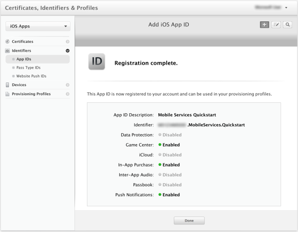 

2.  Entrez le nom de votre application dans **Description**, entrez une valeur dans **Bundle Identifier**, activez l'option « Push Notifications » dans la section « App Services », puis cliquez sur **Continue**.

      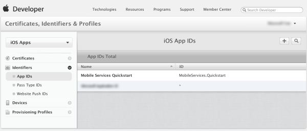

      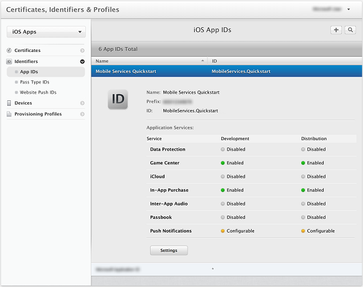 

      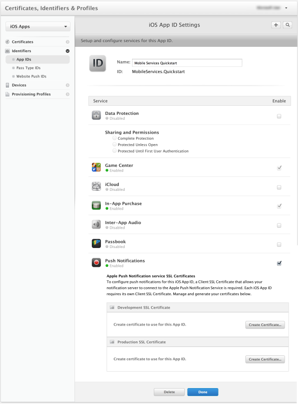

    Ceci génère l'ID de votre application et vous demande d'envoyer les informations. Cliquez sur **Submit**.

      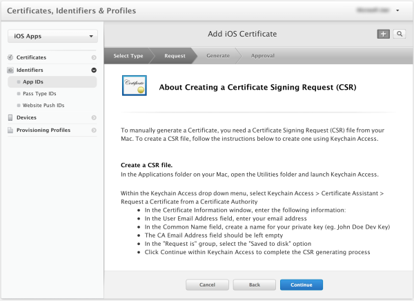 

    Lorsque vous avez cliqué sur **Submit**, le message **Registration complete** s'affiche, comme montré ci-dessous. Cliquez sur **Done**.

      

    **Remarque**

    Si vous choisissez d'entrer une valeur **Bundle Identifier** autre que **MobileServices.Quickstart**, vous devez également mettre à jour la valeur d'identificateur de lot dans votre projet Xcode.

3.  Recherchez l'ID de l'application que vous venez de créer, puis cliquez sur sa ligne.

      

    Le fait de cliquer sur l'ID de l'application affiche les informations détaillées de cette application et de l'ID d'application.

      
           
      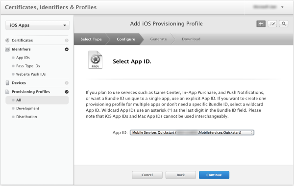

4.  Cliquez sur **Edit**, faites défiler jusqu'au bas de l'écran, puis cliquez sur le bouton **Create Certificate…** sous la section **Development Push SSL Certificate**.

       

    Ceci affiche l'Assistant « Add iOS Certificate ».

      

    **Remarque**

    Ce didacticiel utilise un certificat de développement. Le même processus est utilisé lors de l'inscription d'un certificat de production. Assurez-vous simplement que vous avez défini le même type de certificat lorsque vous avez téléchargé le certificat vers Mobile Services.

5.  Cliquez sur **Choose File**, accédez à l'emplacement où vous avez enregistré le fichier de demande de signature de certificat que vous avez créé lors de la première tâche, puis cliquez **Generate**.

  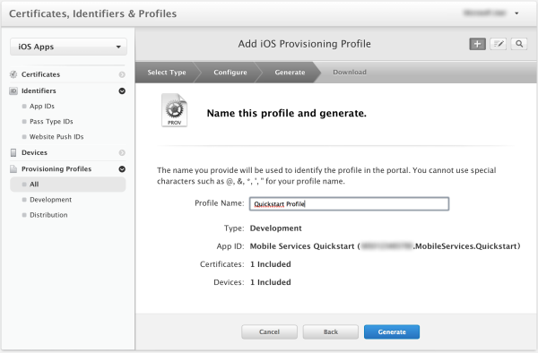

1.  Une fois le certificat créé par le portail, cliquez sur le bouton **Download**, puis sur **Done**.

  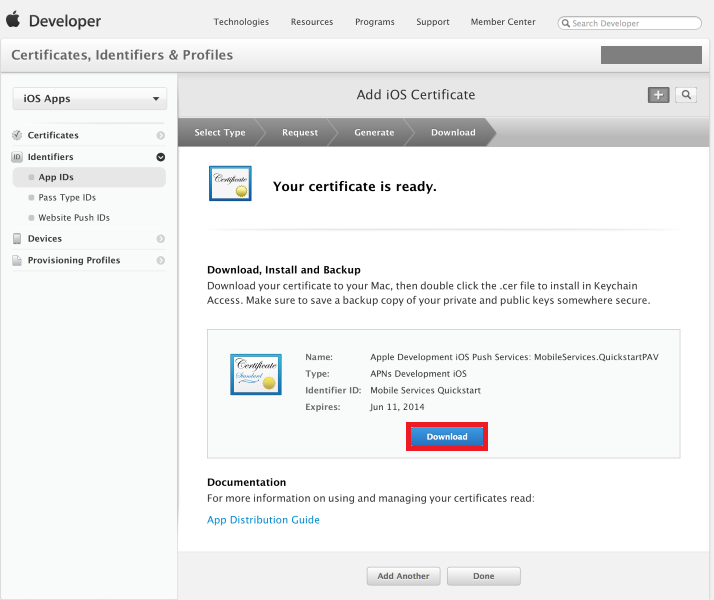 

  

 Ceci entraîne le téléchargement du certificat de signature et l'enregistre sur votre ordinateur dans le dossier **Téléchargements**. 

    
<b>Remarque</b>
    
Par défaut, le certificat de développement du fichier téléchargé est nommé <strong>aps_development.cer</strong>.

    

1.  Double-cliquez sur le certificat Push téléchargé **aps\_development.cer**.

    Ceci installe le nouveau certificat dans le Trousseau d'accès, comme indiqué ci-dessous :

      

    > [WACOM.NOTE] Le nom de votre certificat peut être différent, il aura tout de même le préfixe **Apple Development iOS Push Notification Services:**.

    Plus tard, vous devrez utiliser ce certificat pour générer un fichier .p12 et le télécharger sur votre concentrateur de notification pour activer les notifications Push avec APNS.

Mise en service de l'applicationCréation du profil de mise en service de l'application
--------------------------------------------------------------------------------------

1.  Une fois de retour sur le [Portail de mise en service iOS](http://go.microsoft.com/fwlink/p/?LinkId=272456), sélectionnez **Provisioning Profiles**, **All**, puis cliquez sur le signe **+** pour créer un profil. Ainsi, l'Assistant **Add iOS Provisioning Profile** s'affiche.

      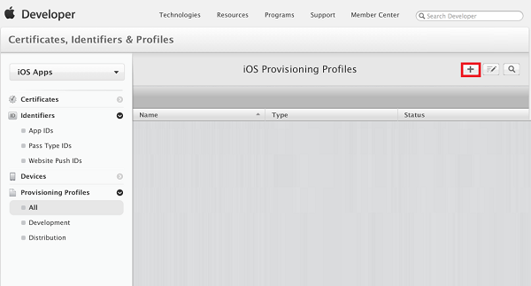

2.  Sélectionnez **iOS App Development** sous **Development** en tant que type de profil de mise en service, puis cliquez sur **Continue**.

      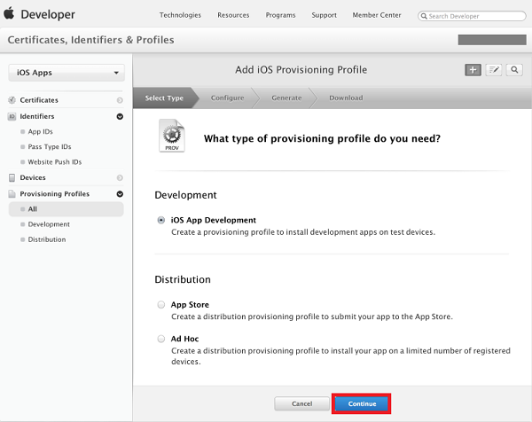

3.  Ensuite, sélectionnez l'ID de l'application de démarrage rapide Mobile Services dans la liste déroulante **App ID**, puis cliquez sur **Continue**.

      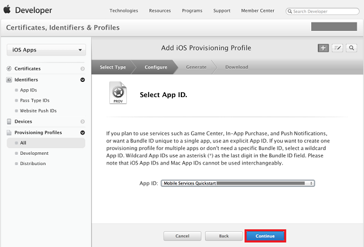

4.  Dans l'écran **Select certificates**, sélectionnez le certificat créé plus tôt, puis cliquez sur **Continue**.

      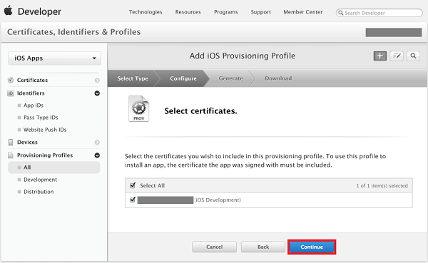

5.  Ensuite, sélectionnez les appareils (**Devices**) à utiliser pour le test, puis cliquez sur **Continue**.

      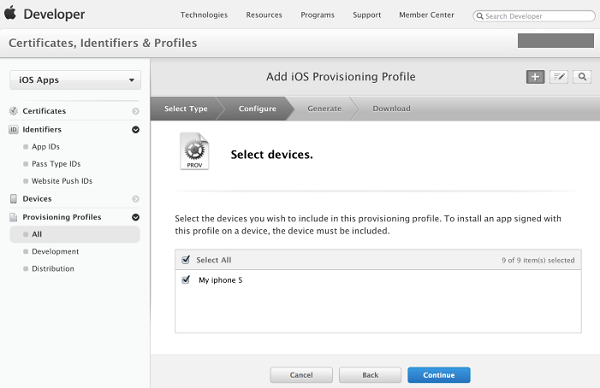

6.  Enfin, sélectionnez un nom pour le profil dans **Profile Name**, cliquez sur **Generate**, puis sur **Done**.

      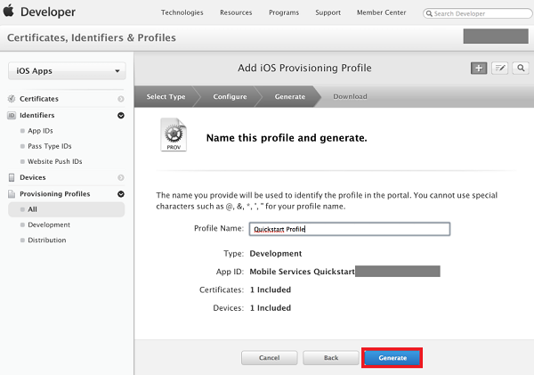
           
      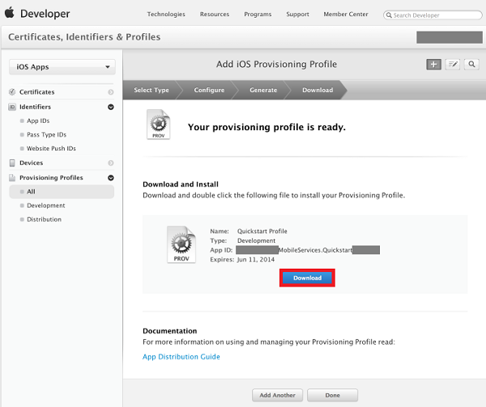

  Ceci entraîne la création d'un profil de mise en service.

1.  Dans Xcode, ouvrez l'Organisateur, sélectionnez la vue Devices, puis **Provisioning Profiles** dans la section **Library** du volet de gauche et importez le profil de mise en service que vous venez de créer.

2.  Sur la gauche, sélectionnez votre appareil et importez à nouveau le profil de mise en service.

3.  Dans Trousseaux d'accès, cliquez avec le bouton droit sur le nouveau certificat, cliquez sur **Exporter**, tapez un nom pour votre certificat, sélectionnez le format **.p12**, puis cliquez sur **Enregistrer**.

      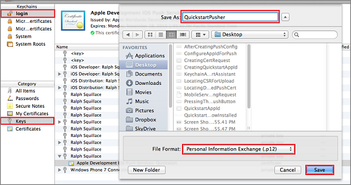

  Notez le nom du fichier et l'emplacement du certificat exporté.

Ceci vérifie que le projet Xcode utilise le nouveau profil pour la signature du code. Ensuite, vous devez télécharger le certificat vers votre concentrateur de notification.

Configuration de votre concentrateur de notificationConfiguration de votre concentrateur de notification
--------------------------------------------------------------------------------------------------------

1.  Connectez-vous au [portail de gestion Azure](https://manage.windowsazure.com/) et cliquez sur **+NEW** en bas de l'écran.

2.  Cliquez sur **Services d'application**, puis sur **Service Bus**, **Concentrateur de notification**, **Création rapide**.

      

3.  Tapez un nom pour votre concentrateur de notification, sélectionnez la région souhaitée, puis cliquez sur **Créer un concentrateur de notification**.

      

4.  Cliquez sur l'espace de noms que vous venez de créer (en général ***nom du concentrateur de notification*-ns**), puis cliquez sur l'onglet **Configurer** en haut.

      

5.  Cliquez sur l'onglet **Concentrateurs de notification** en haut de la page, puis cliquez sur celui que vous venez de créer.

      

6.  Cliquez sur l'onglet **Configurer** en haut de la page, puis cliquez sur **Télécharger** dans les paramètres de notification d'Apple. Sélectionnez ensuite le certificat **.p12** exporté précédemment ainsi que le mot de passe du certificat. Assurez-vous de choisir si vous souhaitez utiliser la **Production** (si vous souhaitez envoyer des notifications Push aux utilisateurs qui ont acheté votre application depuis le store) ou le service Push **Bac à sable (sandbox)** (au cours du développement).

      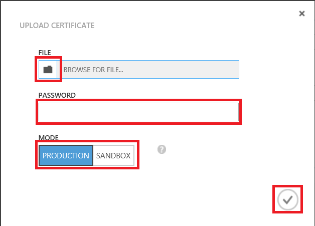

7.  Cliquez sur l'onglet **Tableau de bord** dans la partie supérieure, puis cliquez sur **Informations de connexion**. Notez les deux chaînes de connexion.

      

Votre Notification Hub est configuré pour APNS, et vous disposez des chaînes de connexion pour inscrire votre application et envoyer des notifications.

Connexion de votre applicationConnexion de votre application au concentrateur de notification
---------------------------------------------------------------------------------------------

1.  Dans Xamarin Studio, créez un projet iOS et sélectionnez le modèle **Single View Application**.

      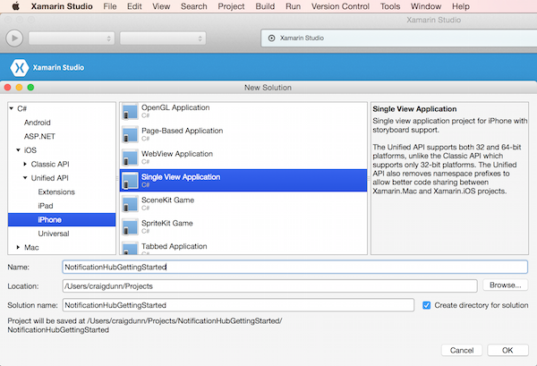

2.  Nous devons à présent ajouter une référence au composant Azure Mobile Services. Dans la vue Solution, cliquez avec le bouton droit sur le dossier **Components** de votre projet, puis choisissez **Get More Components**. Recherchez le composant **Azure Mobile Services** et ajoutez-le à votre projet.

3.  Dans **AppDelegate.cs**, ajoutez l'instruction using suivante :

         using WindowsAzure.Messaging;

4.  Déclarez une instance de **SBNotificationHub** :

         private SBNotificationHub Hub { get; set; }

5.  Créez une classe **Constants.cs** avec les variables suivantes :

         // Chaîne de connexion propre à l'application Azure et chemin d'accès au concentrateur
         public const string ConnectionString = "<Azure connection string>";
         public const string NotificationHubPath = "<Azure hub path>";

6.  Dans **AppDelegate.cs**, mettez à jour **FinishedLaunching()** afin qu'il corresponde à ce qui suit :

         public override bool FinishedLaunching(UIApplication application, NSDictionary launchOptions)
         {
             // REMARQUE : ne pas appeler l'implémentation de base sur une classe de modèle
             // consulter http://docs.xamarin.com/guides/ios/application_fundamentals/delegates,_protocols,_and_events 

             UIRemoteNotificationType notificationTypes = UIRemoteNotificationType.Alert | 
                 UIRemoteNotificationType.Badge | UIRemoteNotificationType.Sound;
             UIApplication.SharedApplication.RegisterForRemoteNotificationTypes(notificationTypes); 

             return true;
         }

7.  Remplacez la méthode **RegisteredForRemoteNotifications()** dans **AppDelegate.cs** :

         public override void RegisteredForRemoteNotifications(UIApplication application, NSData deviceToken)
         {
             // REMARQUE : ne pas appeler l'implémentation de base sur une classe de modèle
             // consulter http://docs.xamarin.com/guides/ios/application_fundamentals/delegates,_protocols,_and_events 

             Hub = new SBNotificationHub(Constants.ConnectionString, Constants.NotificationHubPath);

             Hub.UnregisterAllAsync (deviceToken, (error) => {
                 if (error != null) 
                 {
                     Console.WriteLine("Error calling Unregister: {0}", error.ToString());
                     return;
                 } 

                 NSSet tags = null; // créer des balises si nécessaire
                 Hub.RegisterNativeAsync(deviceToken, tags, (errorCallback) => {
                     if (errorCallback != null)
                         Console.WriteLine("RegisterNativeAsync error: " + errorCallback.ToString());
                 });
             });
         }

8.  Remplacez la méthode **ReceivedRemoteNotification()** dans **AppDelegate.cs** :

         public override void ReceivedRemoteNotification(UIApplication application, NSDictionary userInfo)
         {
             ProcessNotification(userInfo, false);
         }

9.  Créez la méthode **ProcessNotification()** suivante dans **AppDelegate.cs** :

         void ProcessNotification(NSDictionary options, bool fromFinishedLaunching)
         {
             // Vérifiez si le dictionnaire possède la clé de l'application.  Il s'agit de la charge utile de notification que vous auriez envoyée.
             if (null != options && options.ContainsKey(new NSString("aps")))
             {
                 //Obtenir le dictionnaire de l'application
                 NSDictionary aps = options.ObjectForKey(new NSString("aps")) as NSDictionary;

                 string alert = string.Empty;

                 //Extraire le texte de l'alerte
                 //REMARQUE : si vous utilisez l'alerte simple en spécifiant simplement "  aps:{alert:"alert msg here"}  "
                 //Cela fonctionnera correctement.  Mais si vous utilisez une alerte complexe avec des clés de localisation, etc., 
                 //votre objet « alert » du dictionnaire de l'application sera un autre NSDictionary... En fait, 
                 //json est vidé dans NSDictionary, pensez-y.
                 if (aps.ContainsKey(new NSString("alert")))
                     alert = (aps [new NSString("alert")] as NSString).ToString();

                 //Si cela provenait de ReceivedRemoteNotification tandis que l'application était en cours d'exécution,
                 // nous devrions naturellement traiter manuellement les éléments tels que le son, le badge et l'alerte.
                 if (!fromFinishedLaunching)
                 {
                     //Afficher manuellement une alerte
                     if (!string.IsNullOrEmpty(alert))
                     {
                         UIAlertView avAlert = new UIAlertView("Notification", alert, null, "OK", null);
                         avAlert.Show();
                     }
                 }           
             }
         }

    **Remarque**

    Vous pouvez choisir de remplacer **FailedToRegisterForRemoteNotifications()** afin de gérer les situations impliquant une absence de connexion réseau, etc.

10. Exécutez l'application sur votre appareil.

Envoi de notificationsEnvoi de notifications à partir de votre serveur principal
--------------------------------------------------------------------------------

Vous pouvez envoyer des notifications en utilisant Notification Hubs à partir de tous les serveurs principaux à l'aide de l'[interface REST](http://msdn.microsoft.com/fr-fr/library/windowsazure/dn223264.aspx). Dans ce didacticiel, vous envoyez des notifications avec une application console .NET et un Mobile Service à l'aide d'un script Node.

Pour envoyer des notifications en utilisant une application .NET :

1.  Créez une application console Visual C\# :

      

2.  Ajoutez une référence au Kit de développement logiciel (SDK) Azure Service Bus à l'aide du [package NuGet WindowsAzure.ServiceBus](http://nuget.org/packages/WindowsAzure.ServiceBus/). Dans le menu principal de Visual Studio, cliquez sur **Outils**, sur **Library Package Manager**, puis sur **Console du Gestionnaire de package**. Dans la fenêtre de la console, tapez :

         Install-Package WindowsAzure.ServiceBus and press Enter.

3.  Ouvrez le fichier Program.cs et ajoutez l'instruction using suivante :

         using Microsoft.ServiceBus.Notifications;

4.  Dans votre classe `Program`, ajoutez la méthode suivante :

         private static async void SendNotificationAsync()
         {
             NotificationHubClient hub = NotificationHubClient.CreateClientFromConnectionString("<connection string with full access>", "<hub name>");
             var alert = "{\"aps\":{\"alert\":\"Hello from .NET!\"}}";
             await hub.SendAppleNativeNotificationAsync(alert);
         }

5.  Ajoutez ensuite la ligne suivante dans votre méthode `Main` :

          SendNotificationAsync();
          Console.ReadLine();

6.  Appuyez sur la touche F5 pour exécuter l'application. Vous devez recevoir une alerte sur votre appareil. Si vous utilisez le Wi-Fi, assurez-vous que votre connexion fonctionne.

Vous trouverez toutes les charges utiles possibles dans le [Guide de programmation des notifications locales et Push](http://developer.apple.com/library/mac/#documentation/NetworkingInternet/Conceptual/RemoteNotificationsPG/Chapters/ApplePushService.html#//apple_ref/doc/uid/TP40008194-CH100-SW1) d'Apple.

Pour envoyer une notification en utilisant un service mobile, suivez les instructions de la rubrique [Prise en main de Mobile Services](/en-us/develop/mobile/tutorials/get-started-xamarin-ios), puis :

1.  Connectez-vous au [portail de gestion Azure](https://manage.windowsazure.com/) et sélectionnez votre service mobile.

2.  Sélectionnez l'onglet **Scheduler** dans la partie supérieure.

      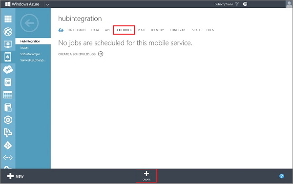

3.  Créez un travail planifié, insérez un nom, puis sélectionnez **On demand**.

      

4.  Lorsque le travail est créé, cliquez sur son nom. Cliquez ensuite sur l'onglet **Script** dans la barre supérieure.

5.  Insérez le script suivant dans votre fonction Scheduler. Remplacez les espaces réservés par le nom de votre concentrateur de notification et la chaîne de connexion pour *DefaultFullSharedAccessSignature* obtenue précédemment. Cliquez sur **Enregistrer**.

         var azure = require('azure');
         var notificationHubService = azure.createNotificationHubService('<Hubname>', '<SAS Full access >');
         notificationHubService.apns.send(
            null,
            {"aps":
                 {
                "alert": "Hello de Mobile Services !"
                }
            },
            function (error) 
            {
                if (!error) {
                    console.warn("Notification successful");
                 }
             }
         );

6.  Cliquez sur **Exécuter une fois** sur la barre inférieure. Vous devez recevoir une alerte sur votre appareil.

Étapes suivantes
----------------

Dans cet exemple simple, vous avez envoyé des notifications à tous vos appareils iOS. Afin de cibler des utilisateurs spécifiques, consultez le didacticiel [Utilisation de Notification Hubs pour envoyer des notifications Push aux utilisateurs](/en-us/manage/services/notification-hubs/notify-users-aspnet), et, si vous souhaitez segmenter vos utilisateurs par groupes d'intérêt, vous pouvez lire [Utilisation de Notification Hubs pour envoyer les dernières nouvelles](/en-us/manage/services/notification-hubs/breaking-news-dotnet). Pour plus d'informations sur l'utilisation de Notification Hubs, consultez les pages [Vue d'ensemble des concentrateurs de notification](http://msdn.microsoft.com/fr-fr/library/jj927170.aspx) et [Procédures Notification Hubs pour iOS](http://msdn.microsoft.com/fr-fr/library/jj927168.aspx).

