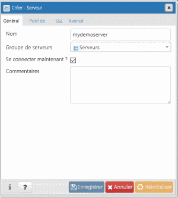
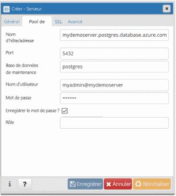
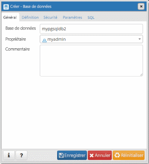

# <a name="quickstart-create-an-azure-database-for-postgresql-using-the-azure-cli"></a>Démarrage rapide : Créer une instance d’Azure Database pour PostgreSQL à l’aide d’Azure CLI
Base de données Azure pour PostgreSQL est un service géré qui vous permet d’exécuter, de gérer et de mettre à l’échelle des bases de données PostgreSQL hautement disponibles dans le cloud. L’interface de ligne de commande (CLI) Azure permet de créer et gérer des ressources Azure à partir de la ligne de commande ou dans les scripts. Ce guide de démarrage rapide vous montre comment créer un serveur Azure Database pour PostgreSQL dans un [groupe de ressources Azure](https://docs.microsoft.com/azure/azure-resource-manager/resource-group-overview) avec la CLI Azure.

Si vous n’avez pas d’abonnement Azure, créez un compte [gratuit](https://azure.microsoft.com/free/) avant de commencer.

[!INCLUDE [cloud-shell-try-it](../../includes/cloud-shell-try-it.md)]

Si vous choisissez d’installer et d’utiliser l’interface de ligne de commande localement, vous devez exécuter Azure CLI version 2.0 ou une version ultérieure pour poursuivre la procédure décrite dans cet article. Pour afficher la version installée, exécutez la commande `az --version`. Si vous devez installer ou mettre à niveau, consultez [Installation d’Azure CLI 2.0]( /cli/azure/install-azure-cli). 

Si vous exécutez l’interface CLI localement, vous devrez vous connecter à votre compte à l’aide de la commande [az login](/cli/azure/authenticate-azure-cli?view=interactive-log-in). Notez la propriété **id** depuis la sortie de commande pour le nom d’abonnement correspondant.
```azurecli-interactive
az login
```

Si vous avez plusieurs abonnements, sélectionnez l’abonnement approprié dans lequel la ressource doit être facturée. Sélectionnez l’ID d’abonnement spécifique sous votre compte à l’aide de la commande [az account set](/cli/azure/account#az_account_set). Remplacez la propriété **id** provenant de la sortie **az login** de votre abonnement dans l’espace réservé d’id d’abonnement.
```azurecli-interactive
az account set --subscription <subscription id>
```

## <a name="create-a-resource-group"></a>Créer un groupe de ressources

Créez un [groupe de ressources Azure](../azure-resource-manager/resource-group-overview.md) avec la commande [az group create](/cli/azure/group#az_group_create). Un groupe de ressources est un conteneur logique dans lequel les ressources Azure sont déployées et gérées en tant que groupe. Vous devez fournir un nom unique. L’exemple suivant crée un groupe de ressources nommé `myresourcegroup` à l’emplacement `westus`.
```azurecli-interactive
az group create --name myresourcegroup --location westus
```

## <a name="create-an-azure-database-for-postgresql-server"></a>Créer un serveur Azure Database pour PostgreSQL

Créez un [serveur Azure Database pour PostgreSQL](overview.md) avec la commande [az sql server create](/cli/azure/postgres/server#az_postgres_server_create). Un serveur contient un groupe de bases de données gérées en tant que groupe. 

L’exemple suivant crée un serveur dans la région Ouest des États-Unis, nommé `mydemoserver`, dans votre groupe de ressources `myresourcegroup` avec l’identifiant d’administrateur serveur `myadmin`. Il s’agit d’un serveur à **usage général**, de **4e génération** avec 2 **vCores**. Le nom du serveur correspond au nom DNS et doit ainsi être globalement unique dans Azure. Remplacez `<server_admin_password>` par votre propre valeur.
```azurecli-interactive
az postgres server create --resource-group myresourcegroup --name mydemoserver  --location westus --admin-user myadmin --admin-password <server_admin_password> --sku-name GP_Gen4_2 --version 9.6
```

> [!IMPORTANT]
> La connexion d’administrateur serveur et le mot de passe que vous spécifiez ici seront requis plus loin dans ce guide de démarrage rapide pour la connexion au serveur et à ses bases de données. Retenez ou enregistrez ces informations pour une utilisation ultérieure.

Par défaut, la base de données **postgres** est créée sous le serveur. La base de données [postgres](https://www.postgresql.org/docs/9.6/static/app-initdb.html) est une base de données par défaut destinée aux utilisateurs, utilitaires et applications tierces. 


## <a name="configure-a-server-level-firewall-rule"></a>Configurer une règle de pare-feu au niveau du serveur

Créez une règle de pare-feu au niveau du serveur Azure PostgreSQL avec la commande [az postgres server firewall-rule create](/cli/azure/postgres/server/firewall-rule#az_postgres_server_firewall_rule_create). Une règle de pare-feu au niveau du serveur permet à une application externe, comme [psql](https://www.postgresql.org/docs/9.2/static/app-psql.html) ou [PgAdmin](https://www.pgadmin.org/), de se connecter à votre serveur via le pare-feu du service Azure PostgreSQL. 

Vous pouvez définir une règle de pare-feu qui couvre une plage d’adresses IP pour pouvoir vous connecter à partir de votre réseau. L’exemple suivant utilise [az postgres server firewall-rule create](/cli/azure/postgres/server/firewall-rule#az_postgres_server_firewall_rule_create) pour créer une règle de pare-feu `AllowAllIps` pour une plage d’adresses IP. Pour ouvrir toutes les adresses IP, utilisez 0.0.0.0 comme adresse IP de début et 255.255.255.255 comme adresse de fin.
```azurecli-interactive
az postgres server firewall-rule create --resource-group myresourcegroup --server mydemoserver --name AllowAllIps --start-ip-address 0.0.0.0 --end-ip-address 255.255.255.255
```

> [!NOTE]
> Le serveur Azure PostgreSQL communique sur le port 5432. Lorsque vous vous connectez à partir d’un réseau d’entreprise, le trafic sortant sur le port 5432 peut être bloqué par le pare-feu de votre réseau. Pour vous connecter à votre serveur Azure PostgreSQL, demandez à votre service informatique d’ouvrir le port 5432.

## <a name="get-the-connection-information"></a>Obtenir les informations de connexion

Pour vous connecter à votre serveur, vous devez fournir des informations sur l’hôte et des informations d’identification pour l’accès.
```azurecli-interactive
az postgres server show --resource-group myresourcegroup --name mydemoserver
```

Le résultat est au format JSON. Prenez note du **administratorLogin** et du **fullyQualifiedDomainName**.
```json
{
  "administratorLogin": "myadmin",
  "earliestRestoreDate": null,
  "fullyQualifiedDomainName": "mydemoserver.postgres.database.azure.com",
  "id": "/subscriptions/00000000-0000-0000-0000-000000000000/resourceGroups/myresourcegroup/providers/Microsoft.DBforPostgreSQL/servers/mydemoserver",
  "location": "westus",
  "name": "mydemoserver",
  "resourceGroup": "myresourcegroup",
  "sku": {
    "capacity": 2,
    "family": "Gen4",
    "name": "GP_Gen4_2",
    "size": null,
    "tier": "GeneralPurpose"
  },
  "sslEnforcement": "Enabled",
  "storageProfile": {
    "backupRetentionDays": 7,
    "geoRedundantBackup": "Disabled",
    "storageMb": 5120
  },
  "tags": null,
  "type": "Microsoft.DBforPostgreSQL/servers",
  "userVisibleState": "Ready",
  "version": "9.6"
}
```

## <a name="connect-to-postgresql-database-using-psql"></a>Se connecter à la base de données PostgreSQL avec psql

Si votre ordinateur client a PostgreSQL installé, vous pouvez utiliser une instance locale de [psql](https://www.postgresql.org/docs/9.6/static/app-psql.html) pour vous connecter à un serveur Azure PostgreSQL. Nous allons maintenant utiliser l’utilitaire de ligne de commande psql pour nous connecter au serveur Azure pour PostgreSQL.

1. Exécutez la commande psql suivante pour vous connecter à un serveur Azure Database pour PostgreSQL
```azurecli-interactive
psql --host=<servername> --port=<port> --username=<user@servername> --dbname=<dbname>
```

  Par exemple, la commande suivante se connecte à la base de données par défaut appelée **postgres** sur votre serveur PostgreSQL **mydemoserver.postgres.database.azure.com** à l’aide des informations d’identification d’accès. Saisissez le `<server_admin_password>` que vous avez choisi à l’invite de mot de passe.
  
  ```azurecli-interactive
psql --host=mydemoserver.postgres.database.azure.com --port=5432 --username=myadmin@mydemoserver --dbname=postgres
```

2.  Une fois que vous êtes connecté au serveur, créez une base de données vide à l’invite.
```sql
CREATE DATABASE mypgsqldb;
```

3.  À l’invite, exécutez la commande suivante pour basculer la connexion sur la base de données **mypgsqldb** nouvellement créée :
```sql
\c mypgsqldb
```

## <a name="connect-to-the-postgresql-server-using-pgadmin"></a>Se connecter au serveur PostgreSQL à l’aide de pgAdmin

pgAdmin est un outil open source utilisé avec PostgreSQL. Vous pouvez installer pgAdmin à partir du [site web pgadmin](http://www.pgadmin.org/). La version pgAdmin que vous utilisez peut être différente de celle utilisée dans ce démarrage rapide. Lisez la documentation pgAdmin si vous souhaitez obtenir des conseils supplémentaires.

1. Ouvrez l’application pgAdmin sur votre ordinateur client.

2. Dans la barre d’outils, accédez à **Objet**, placez le curseur sur **Créer**, puis sélectionnez **Serveur**.

3. Dans l’onglet **Général** de la boîte de dialogue **Créer - Serveur**, entrez un nom convivial unique pour le serveur, par exemple **mydemoserver**.

   

4. Dans l’onglet **Connexion** de la boîte de dialogue **Créer - Serveur**, remplissez le tableau Paramètres.

   

    Paramètre pgAdmin |Valeur|Description
    ---|---|---
    Nom/adresse de l’hôte | Nom du serveur | La valeur de nom de serveur utilisée lorsque vous avez créé le serveur Azure Database pour PostgreSQL. L’exemple de serveur utilisé ici est **mydemoserver.postgres.database.azure.com.** Utilisez le nom de domaine complet (**\*.postgres.database.azure.com**), comme indiqué dans l’exemple. Si vous ne vous souvenez pas du nom de votre serveur, suivez les instructions de la section précédente pour obtenir les informations de connexion. 
    Port | 5432 | Le port à utiliser lorsque vous vous connectez au serveur Azure Database pour PostgreSQL. 
    Base de données de maintenance | *postgres* | Le nom de base de données par défaut généré par le système.
    Nom d’utilisateur | Nom de connexion de l’administrateur du serveur | Le nom d’utilisateur servant à la connexion de l’administrateur du serveur que vous avez fourni lorsque vous avez créé le serveur Azure Database pour PostgreSQL. Si vous ne vous souvenez pas du nom d’utilisateur, suivez les instructions de la section précédente pour obtenir les informations de connexion. Le format correct est *username@servername*.
    Mot de passe | Votre mot de passe d’administrateur | Le mot de passe que vous avez choisi lorsque vous avez créé le serveur précédemment dans ce guide de démarrage rapide.
    Rôle | Laisser vide | Il est inutile de fournir un nom de rôle à ce stade. Laissez le champ vide.
    Mode SSL | *Exiger* | Vous pouvez définir le mode SSL dans l’onglet SSL de pgAdmin. Par défaut, tous les serveurs Azure Database pour PostgreSQL sont créés avec l’application du protocole SSL activée. Pour désactiver l’application du SSL, consultez [Application du SSL](./concepts-ssl-connection-security.md).
    
5. Sélectionnez **Enregistrer**.

6. Dans la partie gauche du volet **Navigateur**, développez le nœud **Serveurs**. Sélectionnez votre serveur, par exemple, **mydemoserver**. Cliquez pour vous connecter à celui-ci.

7. Développez le nœud serveur, puis **Bases de données** situé en-dessous. La liste doit inclure votre base de données *postgres* existante ainsi que les autres bases de données que vous avez créé. Vous pouvez créer plusieurs bases de données par serveur avec Azure Database pour PostgreSQL.

8. Faites un clic droit sur **Bases de données**, choisissez le menu **Créer**, puis sélectionnez **Base de données**.

9. Tapez le nom de base de données de votre choix dans le champ **Base de données**, par exemple **mypgsqldb2**.

10. Sélectionnez le **Propriétaire** de la base de données dans la zone de liste. Choisissez le nom de connexion de l’administrateur du serveur, par exemple **myadmin**.

   

11. Sélectionnez **Enregistrer** pour créer une base de données vide.

12. Dans le volet **Navigateur**, vous pouvez remarquer la présence de la base de données que vous venez de créer dans la liste des bases de données qui se trouvent sous votre nom de serveur.


## <a name="clean-up-resources"></a>Supprimer des ressources

Nettoyez toutes les ressources vous avez créées au cours de ce démarrage rapide en supprimant le [groupe de ressources Azure](../azure-resource-manager/resource-group-overview.md).

> [!TIP]
> Les autres démarrages rapides de cette collection reposent sur ce démarrage rapide. Si vous souhaitez continuer à utiliser d’autres démarrages rapides, ne nettoyez pas les ressources créées au cours de ce démarrage rapide. Sinon, procédez comme suit pour supprimer toutes les ressources créées par ce démarrage rapide dans la CLI Azure.

```azurecli-interactive
az group delete --name myresourcegroup
```

Si vous souhaitez simplement supprimer le serveur nouvellement créé, vous pouvez exécuter la commande [az postgres server delete](/cli/azure/postgres/server#az_postgres_server_delete).
```azurecli-interactive
az postgres server delete --resource-group myresourcegroup --name mydemoserver
```

## <a name="next-steps"></a>Étapes suivantes
> [!div class="nextstepaction"]
> [Migration de votre base de données PostgreSQL par exportation et importation](./howto-migrate-using-export-and-import.md)

