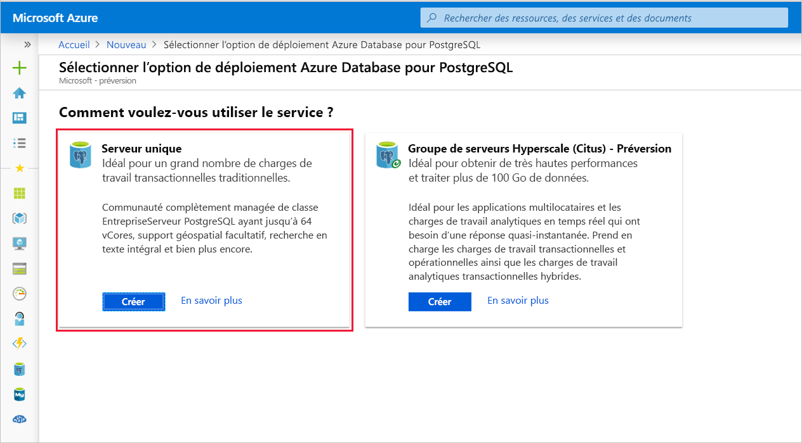
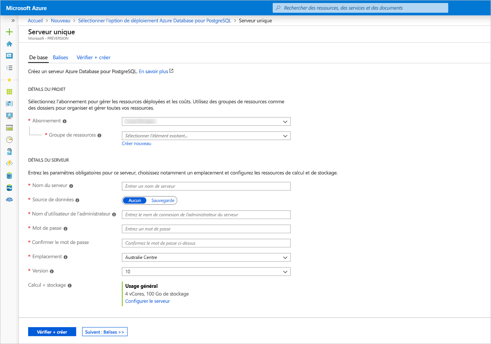

# <a name="quickstart-create-an-azure-database-for-postgresql-server-in-the-azure-portal"></a>Démarrage rapide : Créer un serveur Azure Database pour PostgreSQL dans le portail Azure

Azure Database pour PostgreSQL est un service administré que vous utilisez pour exécuter, gérer et mettre à l’échelle des bases de données PostgreSQL hautement disponibles dans le cloud. Ce démarrage rapide vous montre comment créer en quelques minutes un serveur Azure Database pour PostgreSQL à l’aide du portail Azure.

Si vous n’avez pas d’abonnement Azure, créez un [compte Azure gratuit](https://azure.microsoft.com/free/) avant de commencer.

## <a name="sign-in-to-the-azure-portal"></a>Connectez-vous au portail Azure.
Ouvrez votre navigateur web et accédez au [portail](https://portal.azure.com/). Entrez vos informations d’identification pour vous connecter au portail. Il s’ouvre par défaut sur le tableau de bord des services.

## <a name="create-an-azure-database-for-postgresql-server"></a>Créer un serveur Azure Database pour PostgreSQL

Un serveur Azure Database pour PostgreSQL est créé. Il contient un ensemble configuré de [ressources de calcul et de stockage](./concepts-pricing-tiers.md). Ce serveur est créé dans un [groupe de ressources Azure](../azure-resource-manager/management/overview.md).

Pour créer un serveur Azure Database pour PostgreSQL, suivez ces étapes :
1. Sélectionnez **Créer une ressource** (+) dans l’angle supérieur gauche du portail.

2. Sélectionnez **Bases de données** > **Azure Database pour PostgreSQL**.

   > [!div class="mx-imgBorder"]
   > 

3. Sélectionnez l’option de déploiement **Serveur unique**.

   > [!div class="mx-imgBorder"]
   > 

4. Remplissez le formulaire **Informations de base** avec les informations suivantes :

   > [!div class="mx-imgBorder"]
   > 

   Paramètre|Valeur suggérée|Description
   ---|---|---
   Abonnement|Votre nom d’abonnement|Abonnement Azure que vous souhaitez utiliser pour votre serveur. Si vous avez plusieurs abonnements, sélectionnez l’abonnement dans lequel la ressource est facturée.
   Resource group|*myresourcegroup*| Un nouveau nom de groupe de ressources ou un nom de groupe existant dans votre abonnement.
   Nom du serveur |*mydemoserver*|Un nom unique qui identifie votre serveur Azure Database pour PostgreSQL. Le nom de domaine *postgres.database.azure.com* est ajouté au nom de serveur que vous fournissez. Le serveur ne peut contenir que des lettres minuscules, des chiffres et le caractère de trait d’union (-). Il doit contenir entre 3 et 63 caractères.
   Source de données | *Aucun* | Sélectionnez *Aucun* pour créer un serveur en partant de zéro. (Vous sélectionneriez *Sauvegarde* si vous créiez un serveur à partir d’une sauvegarde géographique d’un serveur Azure Database pour PostgreSQL existant).
   Nom d’utilisateur administrateur |*myadmin*| Votre propre compte de connexion en tant que compte à utiliser lorsque vous vous connectez au serveur. Le nom de connexion de l’administrateur ne doit pas être **azure_superuser**, **azure_pg_admin**, **admin**, **administrator**, **root**, **guest** ou **public**. Il ne peut pas commencer par **pg_** .
   Mot de passe |Votre mot de passe| Un nouveau mot de passe pour le compte Administrateur du serveur. Il doit contenir entre 8 et 128 caractères. Votre mot de passe doit contenir des caractères de trois des catégories suivantes : Lettres majuscules, lettres minuscules, chiffres (0 à 9) et caractères non alphanumériques (!, $, #, %, etc.).
   Emplacement|La région la plus proche de vos utilisateurs| L’emplacement géographique le plus proche de vos utilisateurs.
   Version|La version principale la plus récente| La version principale PostgreSQL la plus récente, sauf si vous avez des exigences précises.
   Calcul + stockage | **Usage général**, **Gen 5**, **2 vCores**, **5 Go**, **7 jours**, **Géoredondant** | Les configurations de calcul, de stockage et de sauvegarde pour votre nouveau serveur. Sélectionnez **Configurer le serveur**. Sélectionnez ensuite le niveau tarifaire approprié. Pour plus d’informations, consultez [Détails de la tarification](https://azure.microsoft.com/pricing/details/postgresql/server/). Pour activer les sauvegardes de votre serveur dans le stockage géo-redondant, sélectionnez **Géographiquement redondant** dans les **Options de redondance de sauvegarde**. Sélectionnez **OK**.

   > [!NOTE]
   > Choisissez le niveau tarifaire De base si votre charge de travail n’a pas besoin d’une grande capacité de calcul et d’E/S. Notez que les serveurs créés avec le niveau tarifaire De base ne peuvent plus ensuite être mis à l’échelle vers le niveau Usage général ou Mémoire optimisée. 
   
5. Sélectionnez **Vérifier + créer** pour passer en revue vos sélections. Sélectionnez **Créer** pour approvisionner le serveur. Cette opération peut prendre quelques minutes.

6. Dans la barre d’outils, sélectionnez l’icône **Notifications** (en forme de cloche) pour surveiller le processus de déploiement. Une fois le déploiement effectué, sélectionnez **Accéder à la ressource** pour ouvrir la page **Vue d’ensemble** du serveur.

Une base de données vide, **postgres** est créée. Vous trouverez également une base de données **azure_maintenance**, qui sert à séparer les processus de service managé des actions utilisateur. Vous ne pouvez pas accéder à la base de données **azure_maintenance**.

## <a name="configure-a-server-level-firewall-rule"></a>Configurer une règle de pare-feu au niveau du serveur
Par défaut, le serveur créé n’est pas accessible publiquement. Vous devez accorder des autorisations d’accès à votre adresse IP. Pour accorder l’accès à votre adresse IP, accédez à votre ressource de serveur dans le portail Azure, puis sélectionnez **Sécurité de la connexion** dans le menu de gauche de votre ressource de serveur. Si vous ne savez pas comment trouver votre ressource, consultez [Guide pratique pour ouvrir une ressource](https://docs.microsoft.com/azure/azure-resource-manager/management/manage-resources-portal#open-resources).

> [!div class="mx-imgBorder"]
> 
  
Sélectionnez à présent **Ajouter l’adresse IP actuelle du client**, puis sélectionnez **Enregistrer**. Vous pouvez ajouter des adresses IP supplémentaires ou fournir une plage d’adresses IP pour permettre la connexion à votre serveur à partir de ces adresses IP. Pour plus d’informations, consultez [Guide pratique pour gérer les règles de pare-feu](./concepts-firewall-rules.md)
   
> [!NOTE]
> Vérifiez si votre réseau autorise le trafic sortant sur le port 5432 utilisé par Azure Database pour PostgreSQL afin d’éviter les problèmes de connectivité.  

## <a name="connect-to-azure-database-for-postgresql-server-using-psql"></a>Se connecter au serveur Azure Database pour PostgreSQL à l’aide de psql

Vous pouvez utiliser [psql](http://postgresguide.com/utilities/psql.html) ou [pgAdmin](https://www.pgadmin.org/docs/pgadmin4/latest/connecting.html), qui sont des clients PostgreSQL populaires. Pour ce guide de démarrage rapide, nous allons nous connecter à l’aide de psql à [Azure Cloud Shell](https://docs.microsoft.com/azure/cloud-shell/overview) dans le portail Azure.

1. Notez le nom de serveur, le nom de connexion de l’administrateur de serveur ainsi que le mot de passe et l’ID d’abonnement du serveur venant d’être créé dans la section **Vue d’ensemble** de votre serveur, comme indiqué dans l’image ci-dessous.

2. Lancez Azure Cloud Shell dans le portail en sélectionnant l’icône en haut à gauche, comme indiqué dans l’image ci-dessous.

   > [!NOTE]
   > Si vous lancez Cloud Shell pour la première fois, vous voyez s’afficher une invite permettant de créer un groupe de ressources et un compte de stockage. Il s’agit d’une étape unique, et ces ressources sont automatiquement jointes pour toutes les sessions. 

   > [!div class="mx-imgBorder"]
   > 

3. Exécutez cette commande sur le terminal Azure Cloud Shell. Remplacez les valeurs par le nom réel du serveur et le nom réel de la connexion d’utilisateur administrateur. Utilisez la base de données vide **postgres** avec l’utilisateur administrateur en respectant le format « <nom-utilisateur-admin>@<servername> », comme indiqué ci-dessous pour Azure Database pour PostgreSQL.

   ```azurecli-interactive
   psql --host=mydemoserver.postgres.database.azure.com --port=5432 --username=myadmin@mydemoserver --dbname=postgres
   ```
 
   Voici comment se présente l’expérience utilisateur dans le terminal Cloud Shell
   
   ```bash
    Requesting a Cloud Shell.Succeeded.
    Connecting terminal...

    Welcome to Azure Cloud Shell
 
    Type "az" to use Azure CLI
    Type "help" to learn about Cloud Shell

    user@Azure:~$psql --host=mydemoserver.postgres.database.azure.com --port=5432 --username=myadmin@mydemoserver --dbname=postgres
    Password for user myadmin@mydemoserver.postgres.database.azure.com:
    psql (12.2 (Ubuntu 12.2-2.pgdg16.04+1), server 11.6)
    SSL connection (protocol: TLSv1.2, cipher: ECDHE-RSA-AES256-GCM-SHA384, bits: 256, compression: off)
    Type "help" for help.

    postgres=>
    ```
4. Dans le même terminal Azure Cloud Shell, créez un **invité** de base de données
   ```bash
   postgres=> CREATE DATABASE guest;
   ```

5. À présent, faites basculer les connexions vers l’**invité** de base de données créé

   ```bash
   \c guest
   ```
6. Tapez `\q`, puis appuyez sur la touche Entrée pour quitter psql. 

## <a name="clean-up-resources"></a>Nettoyer les ressources
Vous avez réussi à créer un serveur Azure Database pour PostgreSQL dans un groupe de ressources.  Si vous ne pensez pas avoir besoin de ces ressources à l’avenir, vous pouvez les supprimer en supprimant le groupe de ressources ou en supprimant simplement le serveur PostgreSQL. Pour supprimer le groupe de ressources, suivez ces étapes :

1. Depuis le portail Azure, recherchez et sélectionnez **Groupes de ressources**. 
2. Dans la liste des groupes de ressources, choisissez le nom de votre groupe de ressources.
3. Dans la page Vue d’ensemble de votre groupe de ressources, sélectionnez **Supprimer le groupe de ressources**.
4. Dans la boîte de dialogue de confirmation, entrez le nom de votre groupe de ressources, puis sélectionnez **Supprimer**.

Pour supprimer le serveur, vous pouvez cliquer sur le bouton **Supprimer** dans la page **Vue d’ensemble** de votre serveur, comme indiqué ci-dessous :
> [!div class="mx-imgBorder"]
> 

## <a name="next-steps"></a>Étapes suivantes
> [!div class="nextstepaction"]
> [Migration de votre base de données PostgreSQL par exportation et importation](./howto-migrate-using-export-and-import.md)
