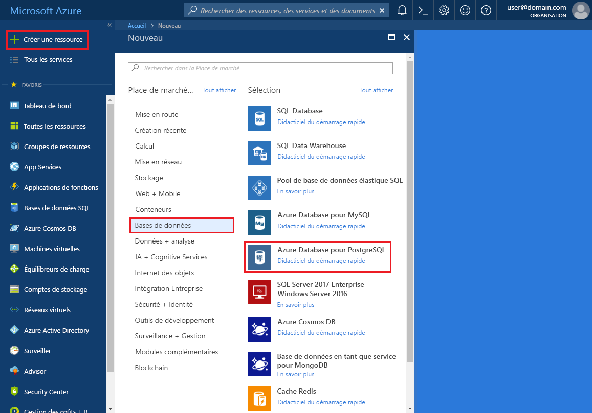
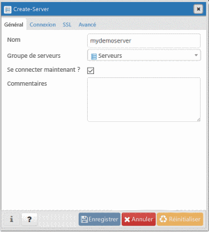

# <a name="create-an-azure-database-for-postgresql-in-the-azure-portal"></a>Créer une base de données Azure pour PostgreSQL dans le portail Azure

Base de données Azure pour PostgreSQL est un service géré qui vous permet d’exécuter, de gérer et de mettre à l’échelle des bases de données PostgreSQL hautement disponibles dans le cloud. Ce guide de démarrage rapide vous montre comment créer un serveur de base de données Azure pour PostgreSQL à l’aide du portail Azure.

Si vous n’avez pas d’abonnement Azure, créez un compte [gratuit](https://azure.microsoft.com/free/) avant de commencer.

## <a name="log-in-to-the-azure-portal"></a>Connectez-vous au portail Azure.

Connectez-vous au [portail Azure](https://portal.azure.com).

## <a name="create-an-azure-database-for-postgresql"></a>Créer une base de données Azure pour PostgreSQL

Un serveur de base de données Azure pour PostgreSQL est créé. Il contient un ensemble défini de [ressources de calcul et de stockage](./concepts-compute-unit-and-storage.md). Ce serveur est créé dans un [groupe de ressources Azure](../azure-resource-manager/resource-group-overview.md).

Pour créer un serveur de base de données Azure pour PostgreSQL, suivez les étapes ci-après :
1.  Cliquez sur le bouton **Nouveau** dans le coin supérieur gauche du portail Azure.
2.  Sélectionnez **Bases de données** dans la page **Nouveau**, puis **Base de données Azure pour PostgreSQL** dans la page **Bases de données**.
 

3.  Renseignez le formulaire du nouveau serveur avec les informations suivantes, comme indiqué dans l’illustration précédente :
    - Nom du serveur : **mypgserver-20170401** (le nom du serveur correspond au nom DNS et doit ainsi être globalement unique). 
    - Abonnement : si vous avez plusieurs abonnements, sélectionnez l’abonnement approprié dans lequel la ressource existe ou est facturée.
    - Groupe de ressources : **myresourcegroup**.
    - Connexion d’administrateur du serveur et mot de passe de votre choix.
    - Lieu
    - Version de PostgreSQL.

  > [!IMPORTANT]
  > La connexion d’administrateur serveur et le mot de passe que vous spécifiez ici seront requis plus loin dans ce guide de démarrage rapide pour la connexion au serveur et à ses bases de données. Retenez ou enregistrez ces informations pour une utilisation ultérieure.

4.  Cliquez sur **Niveau tarifaire** pour spécifier le niveau de service et le niveau de performances pour votre nouvelle base de données. Pour ce guide de démarrage rapide, choisissez le niveau **De base**, **50 unités de calcul** et **50 Go** de stockage inclus.
 
5.  Cliquez sur **OK**.
6.  Cliquez sur **Créer** pour approvisionner le serveur. L’approvisionnement prend quelques minutes.

  > [!TIP]
  > Cochez l’option **Épingler au tableau de bord** pour faciliter le suivi de vos déploiements.

7.  Dans la barre d’outils, cliquez sur **Notifications** pour surveiller le processus de déploiement.
 
   
  Par défaut, la création de la base de données **postgres** intervient sous votre serveur. La base de données [postgres](https://www.postgresql.org/docs/9.6/static/app-initdb.html) est une base de données par défaut destinée aux utilisateurs, utilitaires et applications tierces. 

## <a name="configure-a-server-level-firewall-rule"></a>Configurer une règle de pare-feu au niveau du serveur

Le service Base de données Azure pour PostgreSQL crée un pare-feu au niveau du serveur. Le pare-feu empêche les applications et les outils externes de se connecter au serveur et à toute base de données sur le serveur, sauf si une règle de pare-feu est créée pour ouvrir le pare-feu à des adresses IP spécifiques. 

1.  Une fois le déploiement terminé, cliquez sur **Toutes les ressources** dans le menu de gauche et saisissez le nom **mypgserver-20170401** pour rechercher le serveur qui vient d’être créé. Cliquez sur le nom du serveur figurant dans les résultats de la recherche. La page **Présentation** correspondant à votre serveur s’ouvre et propose des options pour poursuivre la configuration de la page.
 
 

2.  Dans le panneau du serveur, sélectionnez **Sécurité de la connexion**. 
3.  Cliquez dans la zone de texte sous **Nom de la règle**, puis ajoutez une nouvelle règle de pare-feu pour placer la plage d’adresses IP pour la connectivité dans la liste approuvée. Dans le cadre de ce démarrage rapide, nous allons autoriser toutes les adresses IP. Pour cela, tapez **Nom de la règle = AllowAllIps**, **Adresse IP de début = 0.0.0.0** et **Adresse IP de fin = 255.255.255.255**, puis cliquez sur **Enregistrer**. Vous pouvez définir une règle de pare-feu qui couvre une plage d’adresses IP afin de vous connecter à partir de votre réseau.

 

4.  Cliquez sur **Enregistrer**, puis sur **X** pour fermer la page **Sécurité de la connexion**.

  > [!NOTE]
  > Le serveur Azure PostgreSQL communique sur le port 5432. Si vous essayez de vous connecter à partir d’un réseau d’entreprise, le trafic sortant sur le port 5432 peut ne pas être autorisé par le pare-feu de votre réseau. Dans ce cas, vous ne pouvez pas vous connecter à votre serveur Azure SQL Database, sauf si votre service informatique ouvre le port 5432.
  >

## <a name="get-the-connection-information"></a>Obtenir les informations de connexion

Lorsque nous avons créé notre serveur de base de données Azure pour PostgreSQL, la base de données **postgres** par défaut a également été créée. Pour vous connecter à votre serveur de base de données, vous devez fournir des informations sur l’hôte et des informations d’identification pour l’accès.

1. Dans le menu de gauche du portail Azure, cliquez sur **Toutes les ressources**, puis recherchez le serveur **mypgserver-20170401** que vous venez de créer.

  

2. Cliquez sur le nom du serveur **mypgserver-20170401**.
3. Sélectionnez la page **Présentation** du serveur. Prenez note du **nom du serveur** et du **nom de connexion d’administrateur du serveur**.

 

## <a name="connect-to-postgresql-database-using-psql-in-cloud-shell"></a>Se connecter à la base de données PostgreSQL à l’aide de psql dans Cloud Shell

Nous allons maintenant utiliser l’utilitaire de ligne de commande psql pour nous connecter au serveur de base de données Azure pour PostgreSQL. 
1. Exécutez Azure Cloud Shell via l’icône de la console dans le volet de navigation supérieur.

   

2. Azure Cloud Shell s’ouvre dans votre navigateur, ce qui vous permet de saisir des commande bash.

   

3. À l’invite Cloud Shell, connectez-vous à votre serveur de base de données Azure pour PostgreSQL en utilisant les commandes psql. Le format suivant est utilisé pour se connecter à un serveur de base de données Azure pour PostgreSQL avec l’utilitaire [psql](https://www.postgresql.org/docs/9.6/static/app-psql.html) :
   ```bash
   psql --host=<myserver> --port=<port> --username=<server admin login> --dbname=<database name>
   ```

   Par exemple, la commande suivante permet de se connecter à la base de données par défaut appelée **postgres** sur votre serveur PostgreSQL **mypgserver-20170401.postgres.database.azure.com** à l’aide des informations d’identification d’accès. À l’invite, entrez votre mot de passe d’administrateur du serveur.

   ```bash
   psql --host=mypgserver-20170401.postgres.database.azure.com --port=5432 --username=mylogin@mypgserver-20170401 --dbname=postgres
   ```
4.  Une fois que vous êtes connecté au serveur, créez une base de données vide à l’invite.
```bash
CREATE DATABASE mypgsqldb;
```

5.  À l’invite, exécutez la commande suivante pour basculer la connexion sur la base de données **mypgsqldb** nouvellement créée.
```bash
\c mypgsqldb
```

## <a name="connect-to-postgresql-database-using-pgadmin"></a>Se connecter à la base de données PostgreSQL avec pgAdmin

Pour se connecter au serveur Azure PostgreSQL à l’aide de l’outil d’interface graphique _pgAdmin_
1.  Lancez l’application _pgAdmin_ sur votre ordinateur client. Vous pouvez installer _pgAdmin_ à partir de http://www.pgadmin.org/.
2.  Choisissez **Ajouter un nouveau serveur** dans le menu **Liens rapides**.
3.  Dans l’onglet **Général** de la boîte de dialogue **Créer - Serveur**, entrez un nom convivial unique pour le serveur comme **Serveur Azure PostgreSQL**.

4.  Dans l’onglet **Connexion** de la boîte de dialogue **Créer - Serveur**, utilisez les paramètres comme indiqué et cliquez sur **Enregistrer**.
   
    - **Nom d’hôte/adresse** : mypgserver-20170401.postgres.database.azure.com 
        - Nom complet du serveur.
    - **Port :**  5432
        - Le numéro du port utilisé par ce serveur de base de données est 5432.
    - **Maintenance Database** (Base de données de maintenance) : postgres 
        - Nom de la base de données par défaut générée par le système.
    - **Nom d’utilisateur :** mylogin@mypgserver-20170401 
        - La connexion d’administrateur du serveur (user@mypgserver) obtenue précédemment dans ce démarrage rapide.
    - **Mot de passe** : le mot de passe que vous avez choisi lorsque vous avez créé le serveur plus tôt dans ce démarrage rapide.
    - **Mode SSL** : Exiger
        - Par défaut, tous les serveurs Azure PostgreSQL sont créés avec l’application du SSL activée. Pour désactiver l’application du SSL, consultez les détails dans [Configure SSL connectivity in Azure Database for PostgreSQL](./concepts-ssl-connection-security.md) (Configurer la connectivité SSL dans Base de données Azure pour PostgreSQL).
5.  Cliquez sur **Save**.
6.  Dans le volet gauche Navigateur, développez **Groupes de serveurs**. Choisissez votre serveur **Serveur Azure PostgreSQL**.
7.  Choisissez le **serveur** auquel vous vous êtes connecté, puis choisissez **Bases de données** sous ce dernier. 
8.  Cliquez avec le bouton droit sur **Bases de données** pour créer une base de données.
9.  Choisissez un nom de base de données **mypgsqldb** et son propriétaire en tant qu’administrateur serveur **mylogin**.
10. Cliquez sur **Enregistrer** pour créer une base de données vide.
11. Dans le volet **Navigateur**, développez **Serveur**. Développez le serveur que vous avez créé, et consultez la base de données **mypgsqldb** se trouvant en dessous.
 


## <a name="clean-up-resources"></a>Supprimer des ressources
Nettoyez toutes les ressources vous avez créées au cours de ce démarrage rapide en supprimant le [groupe de ressources Azure](../azure-resource-manager/resource-group-overview.md).

> [!TIP]
> Les autres démarrages rapides de cette collection reposent sur ce démarrage rapide. Si vous souhaitez continuer à utiliser d’autres démarrages rapides, ne nettoyez pas les ressources créées au cours de ce démarrage rapide. Sinon, procédez comme suit pour supprimer toutes les ressources créées au cours de ce démarrage rapide dans le portail Azure.

1.  Dans le menu de gauche du portail Azure, cliquez sur **Groupes de ressources**, puis sur **myresourcegroup**.
2.  Sur la page de votre groupe de ressources, cliquez sur **Supprimer**, tapez **myresourcegroup** dans la zone de texte, puis cliquez sur Supprimer.

Si vous souhaitez simplement supprimer le serveur nouvellement créé :
1.  Dans le menu de gauche du portail Azure, cliquez sur PostgreSQL servers (Serveurs PostgreSQL), puis recherchez le serveur que vous venez de créer.
2.  Sur la page Présentation, cliquez sur le bouton Supprimer dans le volet supérieur .
3.  Vérifiez le nom du serveur à supprimer et affichez les bases de données sous celui-ci qui seront affectées. Tapez **mypgserver-20170401** dans la zone de texte, puis cliquez sur Supprimer.

## <a name="next-steps"></a>Étapes suivantes
- Migrez votre base de données avec [Exportation et importation](./howto-migrate-using-export-and-import.md) ou [Vidage et restauration](./howto-migrate-using-dump-and-restore.md).
- Pour créer un serveur de base de données Azure pour PostgreSQL à l’aide de l’interface de ligne de commande Azure, consultez [Create an Azure Database for PostgreSQL using the Azure CLI](./quickstart-create-server-database-azure-cli.md) (Créer une base de données Azure pour PostgreSQL à l’aide de l’interface de ligne de commande Azure).
- Pour une présentation technique, consultez [What is Azure Database for PostgreSQL?](./overview.md) (Qu’est-ce que Base de données Azure pour PostgreSQL ?).
