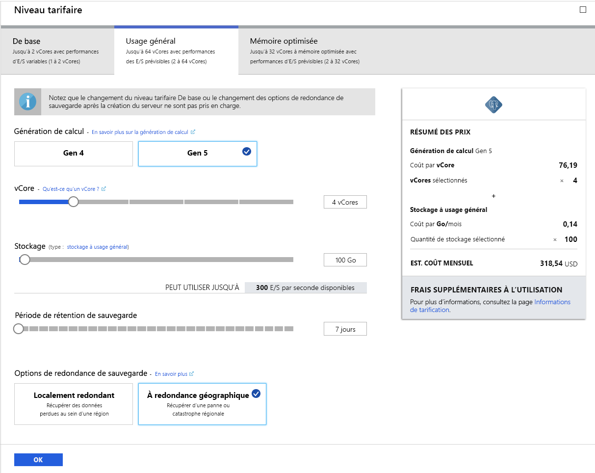
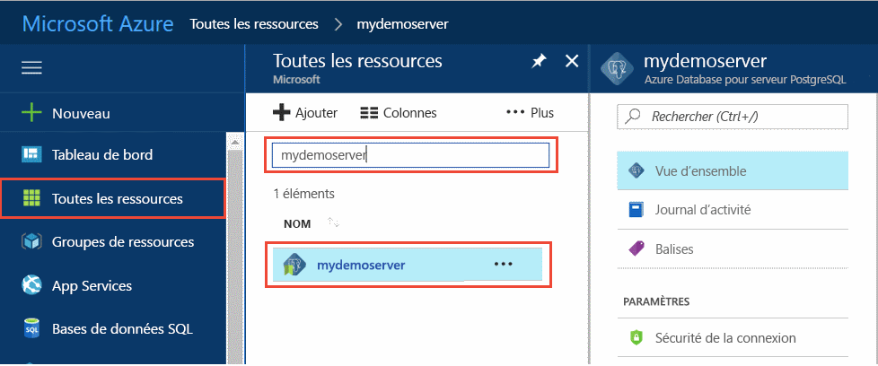
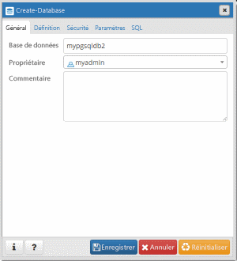

# <a name="quickstart-create-an-azure-database-for-postgresql-server-in-the-azure-portal"></a>Démarrage rapide : Créer un serveur Azure Database pour PostgreSQL dans le portail Azure

Azure Database pour PostgreSQL est un service administré que vous utilisez pour exécuter, gérer et mettre à l’échelle des bases de données PostgreSQL hautement disponibles dans le cloud. Ce démarrage rapide vous montre comment créer en quelques minutes un serveur Azure Database pour PostgreSQL à l’aide du portail Azure.

Si vous n’avez pas d’abonnement Azure, créez un [compte Azure gratuit](https://azure.microsoft.com/free/) avant de commencer.

## <a name="sign-in-to-the-azure-portal"></a>Connectez-vous au portail Azure.
Ouvrez votre navigateur web et accédez au [portail](https://portal.azure.com/). Entrez vos informations d’identification pour vous connecter au portail. Il s’ouvre par défaut sur le tableau de bord des services.

## <a name="create-an-azure-database-for-postgresql-server"></a>Créer un serveur Azure Database pour PostgreSQL

Un serveur Azure Database pour PostgreSQL est créé. Il contient un ensemble configuré de [ressources de calcul et de stockage](./concepts-pricing-tiers.md). Ce serveur est créé dans un [groupe de ressources Azure](../azure-resource-manager/resource-group-overview.md).

Pour créer un serveur Azure Database pour PostgreSQL, suivez ces étapes :
1. Sélectionnez **Créer une ressource** (+) dans l’angle supérieur gauche du portail.

2. Sélectionnez **Bases de données** > **Azure Database pour PostgreSQL**.

    

3. Sélectionnez l’option de déploiement **Serveur unique**.

   

4. Remplissez le formulaire **Informations de base** avec les informations suivantes :

    

    Paramètre|Valeur suggérée|Description
    ---|---|---
    Subscription|Votre nom d’abonnement|L’abonnement Azure que vous souhaitez utiliser pour votre serveur. Si vous avez plusieurs abonnements, sélectionnez l’abonnement dans lequel la ressource est facturée.
    Resource group|*myresourcegroup*| Un nouveau nom de groupe de ressources ou un nom de groupe existant dans votre abonnement.
    Nom du serveur |*mydemoserver*|Un nom unique qui identifie votre serveur Azure Database pour PostgreSQL. Le nom de domaine *postgres.database.azure.com* est ajouté au nom de serveur que vous fournissez. Le serveur ne peut contenir que des lettres minuscules, des chiffres et le caractère de trait d’union (-). Il doit contenir entre 3 et 63 caractères.
    Source de données | *Aucun* | Sélectionnez *Aucun* pour créer un serveur en partant de zéro. (Vous sélectionneriez *Sauvegarde* si vous créiez un serveur à partir d’une sauvegarde géographique d’un serveur Azure Database pour PostgreSQL existant).
    Nom d’utilisateur administrateur |*myadmin*| Votre propre compte de connexion en tant que compte à utiliser lorsque vous vous connectez au serveur. Le nom de connexion de l’administrateur ne doit pas être **azure_superuser**, **azure_pg_admin**, **admin**, **administrator**, **root**, **guest** ou **public**. Il ne peut pas commencer par **pg_** .
    Mot de passe |Votre mot de passe| Un nouveau mot de passe pour le compte Administrateur du serveur. Il doit contenir entre 8 et 128 caractères. Votre mot de passe doit contenir des caractères de trois des catégories suivantes : Lettres majuscules, lettres minuscules, chiffres (0 à 9) et caractères non alphanumériques (!, $, #, %, etc.).
    Location|La région la plus proche de vos utilisateurs| L’emplacement géographique le plus proche de vos utilisateurs.
    Version|La version principale la plus récente| La version principale PostgreSQL la plus récente, sauf si vous avez des exigences précises.
    Calcul + stockage | **Usage général**, **Gen 5**, **2 vCores**, **5 Go**, **7 jours**, **Géoredondant** | Les configurations de calcul, de stockage et de sauvegarde pour votre nouveau serveur. Sélectionnez **Configurer le serveur**. Ensuite, sélectionnez l’onglet **Usage général**. *Gen 5*, *4 vCores*, *100 Go* et *7 jours* sont les valeurs par défaut pour **Génération de calcul**, **vCore**, **Stockage** et la **Période de conservation des sauvegardes**. Vous pouvez laisser ces curseurs en l’état ou les ajuster. Pour activer les sauvegardes de votre serveur dans le stockage géoredondant, sélectionnez **Géographiquement redondant** dans les **Options de redondance de sauvegarde**. Pour enregistrer cette sélection du niveau tarifaire, sélectionnez **OK**. La capture d’écran suivante capture ces sélections.

   > [!NOTE]
   > Choisissez le niveau tarifaire De base si votre charge de travail n’a pas besoin d’une grande capacité de calcul et d’E/S. Notez que les serveurs créés avec le niveau tarifaire De base ne peuvent plus ensuite être mis à l’échelle vers le niveau Usage général ou Mémoire optimisée. Pour plus d’informations, consultez la [page des tarifs](https://azure.microsoft.com/pricing/details/postgresql/).
   > 

    

5. Sélectionnez **Vérifier + créer** pour passer en revue vos sélections. Sélectionnez **Créer** pour approvisionner le serveur. Cette opération peut prendre quelques minutes.

6. Dans la barre d’outils, sélectionnez l’icône **Notifications** (en forme de cloche) pour surveiller le processus de déploiement. Une fois le déploiement terminé, vous pouvez sélectionner **Épingler au tableau de bord**, ce qui crée une vignette pour ce serveur dans votre tableau de bord du portail Azure, en tant que raccourci vers la page **Vue d’ensemble** du serveur. En sélectionnant **Accéder à la ressource**, ouvrez la page **Vue d’ensemble** du serveur.

    
   
   Par défaut, la création d’une base de données **postgres** s’effectue sous votre serveur. La base de données [postgres](https://www.postgresql.org/docs/9.6/static/app-initdb.html) est une base de données par défaut qui est destinée aux utilisateurs, aux utilitaires et aux applications tierces. (L’autre base de données par défaut est **azure_maintenance**. Son rôle consiste à séparer les processus de service administré des actions des utilisateurs. Vous ne pouvez pas accéder à cette base de données.)

## <a name="configure-a-server-level-firewall-rule"></a>Configurer une règle de pare-feu au niveau du serveur

Azure Database pour PostgreSQL crée un pare-feu au niveau du serveur. Il empêche les applications et les outils externes de se connecter au serveur et à toute base de données sur le serveur, sauf si vous créez une règle de pare-feu pour ouvrir le pare-feu à des adresses IP spécifiques. 

1. Après le déploiement, localisez votre serveur. Si nécessaire, vous pouvez le rechercher. Par exemple, dans le menu de gauche, sélectionnez **Toutes les ressources**. Entrez le nom de votre serveur, par exemple **mydemoserver**, pour rechercher le serveur que vous venez de créer. Sélectionnez le nom de votre serveur dans la liste des résultats. La page **Présentation** correspondant à votre serveur s’ouvre et propose des options pour poursuivre la configuration de la page.
 
    

2. Sur la page du serveur, sélectionnez **Sécurité de la connexion**.

3. Sous **Règles de pare-feu**, dans la colonne **Nom de la règle**, sélectionnez la zone de texte vide pour commencer à créer la règle de pare-feu. 

   Renseignez les zones de texte avec un nom et la plage IP de début et de fin des clients qui accéderont à votre serveur. Dans le cas d’une adresse IP unique, utilisez la même valeur pour l’adresse IP de début et l’adresse IP de fin.

   
     

4. Dans la barre d’outils supérieure de la page **Sécurité de la connexion**, sélectionnez **Enregistrer**. Avant de continuer, attendez la notification indiquant que la mise à jour de la sécurité de la connexion s’est correctement déroulée.

    > [!NOTE]
    > Les connexions à votre serveur de base de données Azure pour PostgreSQL communiquent via le port 5432. Quand vous essayez de vous connecter à partir d’un réseau d’entreprise, le trafic sortant sur le port 5432 peut être bloqué par le pare-feu de votre réseau. Si c’est le cas, vous ne pouvez pas vous connecter à votre serveur, sauf si votre service informatique ouvre le port 5432.
    >

## <a name="get-the-connection-information"></a>Obtenir les informations de connexion

Lorsque vous créez votre serveur Azure Database pour PostgreSQL, une base de données par défaut nommée **postgres** est créée. Pour vous connecter à votre serveur de base de données, vous avez besoin de son nom de serveur complet et des informations d’identification de connexion d’administrateur. Il est possible que vous ayez noté ces valeurs précédemment, dans l’article se rapportant au guide de démarrage rapide. Si vous ne l’avez pas fait, vous pouvez facilement localiser le nom du serveur et les informations de connexion dans la page **Vue d’ensemble** du serveur sur le portail Azure.

Ouvrez la page **Vue d’ensemble** de votre serveur. Prenez note du **Nom du serveur** et du **Nom de connexion de l’administrateur du serveur**. Placez le curseur sur chaque champ, afin de faire apparaître le symbole de copie à droite du texte. Sélectionnez ce symbole pour copier les valeurs qui vous intéressent.

 

## <a name="connect-to-the-postgresql-database-using-psql"></a>Se connecter à la base de données PostgreSQL avec psql

Vous pouvez utiliser différentes applications pour vous connecter à votre serveur de base de données Azure pour PostgreSQL. Si votre ordinateur client a PostgreSQL installé, vous pouvez utiliser une instance locale de [psql](https://www.postgresql.org/docs/current/static/app-psql.html) pour vous connecter à un serveur Azure PostgreSQL. Nous allons maintenant utiliser l’utilitaire de ligne de commande psql pour nous connecter au serveur Azure pour PostgreSQL.

1. Exécutez la commande psql suivante pour vous connecter à un serveur Azure Database pour PostgreSQL
   ```bash
   psql --host=<servername> --port=<port> --username=<user@servername> --dbname=<dbname>
   ```

   Par exemple, la commande suivante se connecte à la base de données par défaut appelée **postgres** sur votre serveur PostgreSQL **mydemoserver.postgres.database.azure.com** à l’aide des informations d’identification d’accès. Saisissez le `<server_admin_password>` que vous avez choisi à l’invite de mot de passe.
  
   ```bash
   psql --host=mydemoserver.postgres.database.azure.com --port=5432 --username=myadmin@mydemoserver --dbname=postgres
   ```

   > [!TIP]
   > Si vous préférez utiliser un chemin d’URL pour vous connecter à Postgres, encodez par URL le signe @ dans le nom d’utilisateur avec `%40`. La chaîne de connexion pour psql serait, par exemple, 
   > ```
   > psql postgresql://myadmin%40mydemoserver@mydemoserver.postgres.database.azure.com:5432/postgres
   > ```

   Une fois connecté, l’utilitaire psql affiche une invite postgres dans laquelle vous pouvez taper des commandes sql. Il est possible qu’un avertissement s’affiche au niveau de la sortie de connexion initiale, car la version de l’utilitaire psql que vous utilisez peut être différente de celle du serveur Azure Database pour PostgreSQL. 

   Exemple de sortie psql :
   ```bash
   psql (9.5.7, server 9.6.2)
   WARNING: psql major version 9.5, server major version 9.6.
    Some psql features might not work.
    SSL connection (protocol: TLSv1.2, cipher: ECDHE-RSA-AES256-SHA384, bits: 256, compression: off)
   Type "help" for help.

   postgres=> 
   ```

   > [!TIP]
   > Si le pare-feu n’est pas configuré pour autoriser l’adresse IP de votre client, l’erreur suivante se produit :
   > 
   > « psql: FATAL: aucune entrée pg_hba.conf pour l’hôte `<IP address>`, utilisateur « myadmin », base de données « postgres », SSL sur FATAL : Connexion SSL obligatoire. Spécifiez les options SSL puis réessayez.
   > 
   > Confirmez que l'adresse IP de votre client est autorisée à l’étape des règles de pare-feu ci-dessus.

2. Créez une base de données vide nommée « mypgsqldb » à l’invite en tapant la commande suivante :
    ```bash
    CREATE DATABASE mypgsqldb;
    ```

3. À l’invite, exécutez la commande suivante pour basculer la connexion sur la base de données **mypgsqldb** nouvellement créée :
    ```bash
    \c mypgsqldb
    ```

4. Tapez `\q`, puis sélectionnez la touche Entrée pour quitter psql. 

Vous vous êtes connecté au serveur Azure Database pour PostgreSQL via psql, et vous avez créé une base de données utilisateur vide. Pour vous connecter à l’aide de pgAdmin, un autre outil courant, passez à la section suivante.

## <a name="connect-to-the-postgresql-server-using-pgadmin"></a>Se connecter au serveur PostgreSQL à l’aide de pgAdmin

pgAdmin est un outil open source utilisé avec PostgreSQL. Vous pouvez installer pgAdmin à partir du [site web pgadmin](https://www.pgadmin.org/). La version pgAdmin que vous utilisez peut être différente de celle utilisée dans ce démarrage rapide. Lisez la documentation pgAdmin si vous souhaitez obtenir des conseils supplémentaires.

1. Ouvrez l’application pgAdmin sur votre ordinateur client.

2. Dans la barre d’outils, accédez à **Objet**, placez le curseur sur **Créer**, puis sélectionnez **Serveur**.

3. Dans l’onglet **Général** de la boîte de dialogue **Créer - Serveur**, entrez un nom convivial unique pour le serveur, par exemple **mydemoserver**.

    

4. Dans l’onglet **Connexion** de la boîte de dialogue **Créer - Serveur**, remplissez le tableau Paramètres.

   

    Paramètre pgAdmin |Valeur|Description
    ---|---|---
    Nom/adresse de l’hôte | Nom du serveur | La valeur de nom de serveur utilisée lorsque vous avez créé le serveur Azure Database pour PostgreSQL. L’exemple de serveur utilisé ici est **mydemoserver.postgres.database.azure.com.** Utilisez le nom de domaine complet ( **\*.postgres.database.azure.com**), comme indiqué dans l’exemple. Si vous ne vous souvenez pas du nom de votre serveur, suivez les instructions de la section précédente pour obtenir les informations de connexion. 
    Port | 5432 | Le port à utiliser lorsque vous vous connectez au serveur Azure Database pour PostgreSQL. 
    Base de données de maintenance | *postgres* | Le nom de base de données par défaut généré par le système.
    Nom d’utilisateur | Nom de connexion de l’administrateur du serveur | Le nom d’utilisateur servant à la connexion de l’administrateur du serveur que vous avez fourni lorsque vous avez créé le serveur Azure Database pour PostgreSQL. Si vous ne vous souvenez pas du nom d’utilisateur, suivez les instructions de la section précédente pour obtenir les informations de connexion. Le format est *nom_utilisateur\@nom_serveur*.
    Mot de passe | Votre mot de passe d’administrateur | Le mot de passe que vous avez choisi lorsque vous avez créé le serveur précédemment dans ce guide de démarrage rapide.
    Role | Laisser vide | Il est inutile de fournir un nom de rôle à ce stade. Laissez le champ vide.
    Mode SSL | *Exiger* | Vous pouvez définir le mode SSL dans l’onglet SSL de pgAdmin. Par défaut, tous les serveurs Azure Database pour PostgreSQL sont créés avec l’application du protocole SSL activée. Pour désactiver l’application du SSL, consultez [Application du SSL](./concepts-ssl-connection-security.md).
    
5. Sélectionnez **Enregistrer**.

6. Dans la partie gauche du volet **Navigateur**, développez le nœud **Serveurs**. Sélectionnez votre serveur, par exemple **mydemoserver**, pour vous y connecter.

7. Développez le nœud serveur, puis **Bases de données** situé en-dessous. La liste doit inclure votre base de données *postgres* existante ainsi que les autres bases de données que vous avez créé. Vous pouvez créer plusieurs bases de données par serveur avec Azure Database pour PostgreSQL.

8. Cliquez avec le bouton droit sur **Bases de données**, sélectionnez le menu **Créer**, puis sélectionnez **Base de données**.

9. Entrez un nom de base de données de votre choix dans le champ **Base de données**, par exemple **mypgsqldb2**.

10. Sélectionnez le **Propriétaire** de la base de données dans la zone de liste. Sélectionnez le nom de connexion de votre administrateur de serveur, par exemple **myadmin**.

    

11. Sélectionnez **Enregistrer** pour créer une base de données vide.

12. Dans le volet **Navigateur**, vous pouvez remarquer la présence de la base de données que vous venez de créer dans la liste des bases de données qui se trouvent sous votre nom de serveur.


## <a name="clean-up-resources"></a>Supprimer des ressources
Vous disposez au choix de deux moyens de supprimer les ressources que vous avez créées dans ce guide de démarrage rapide. Vous pouvez supprimer le [groupe de ressources Azure](../azure-resource-manager/resource-group-overview.md) qui inclut toutes les ressources du groupe de ressources. Si vous souhaitez conserver les autres ressources intactes, ne supprimez que la ressource de serveur.

> [!TIP]
> Les autres guides de démarrage rapide de cette collection reposent sur ce guide. Si vous souhaitez continuer à utiliser d’autres guides de démarrage rapide, ne supprimez pas les ressources créées au cours de ce guide. Sinon, suivez ces étapes pour les supprimer dans le portail.

Pour supprimer l’intégralité du groupe de ressources, y compris le serveur nouvellement créé :
1. Localisez votre groupe de ressources dans le portail. Dans le menu de gauche, sélectionnez **Groupes de ressources**. Sélectionnez ensuite le nom de votre groupe de ressources, **myresourcegroup** dans l’exemple.

2. Dans la page de votre groupe de ressources, sélectionnez **Supprimer**. Pour confirmer la suppression, dans la zone de texte, entrez le nom de votre groupe de ressources (**myresourcegroup** dans l’exemple). Sélectionnez **Supprimer**.

Pour ne supprimer que le serveur nouvellement créé :
1. Localisez votre serveur dans le portail, s’il n’est pas ouvert. Dans le menu de gauche, sélectionnez **Toutes les ressources**. Recherchez ensuite le serveur que vous avez créé.

2. Dans la page **Vue d’ensemble**, sélectionnez **Supprimer**.

    

3. Vérifiez le nom du serveur à supprimer et affichez les bases de données affectées situées sous celui-ci. Entrez votre nom de serveur dans la zone de texte, par exemple **mydemoserver**. Sélectionnez **Supprimer**.

## <a name="next-steps"></a>Étapes suivantes
> [!div class="nextstepaction"]
> [Migration de votre base de données PostgreSQL par exportation et importation](./howto-migrate-using-export-and-import.md)
