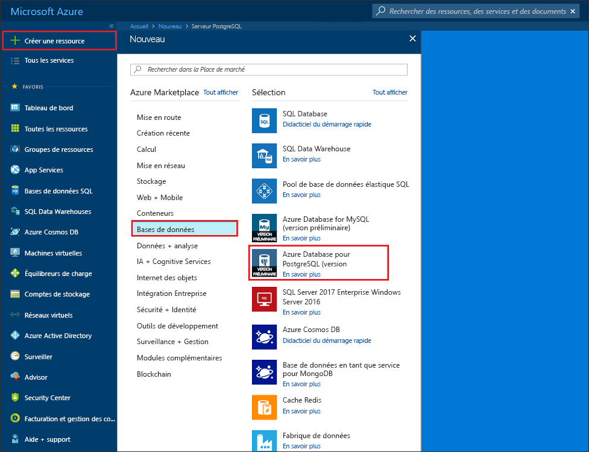
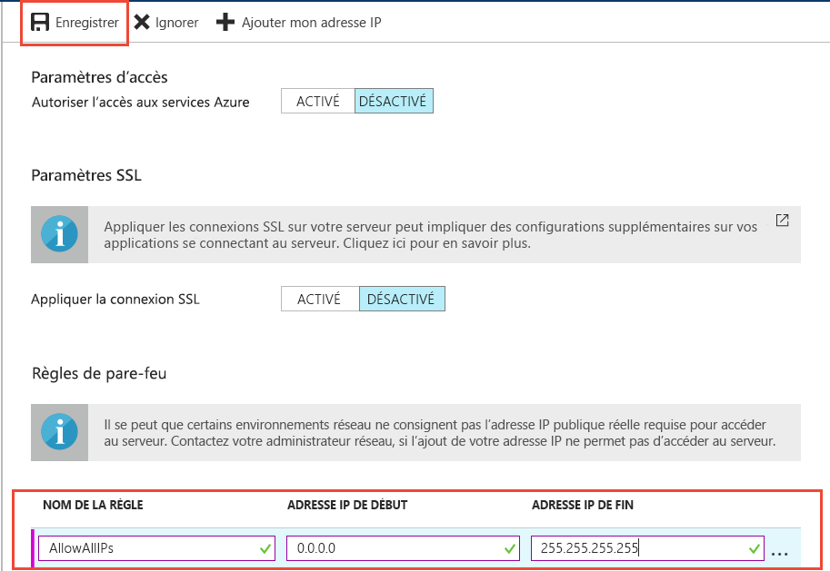

# <a name="tutorial-design-an-azure-database-for-postgresql-using-the-azure-portal"></a>Didacticiel : Concevoir une base de données Azure Database pour PostgreSQL à l’aide du portail Azure

Base de données Azure pour PostgreSQL est un service géré qui vous permet d’exécuter, de gérer et de mettre à l’échelle des bases de données PostgreSQL hautement disponibles dans le cloud. À l’aide du portail Azure, vous pouvez facilement gérer votre serveur et concevoir une base de données.

Ce didacticiel vous montre comment utiliser le portail Azure pour :
> [!div class="checklist"]
> * Créer un serveur Azure Database pour PostgreSQL
> * Configurer le pare-feu du serveur
> * Utiliser l’utilitaire [ **psql** ](https://www.postgresql.org/docs/9.6/static/app-psql.html) pour créer une base de données
> * Charger les exemples de données
> * Données de requête
> * Mettre à jour des données
> * Restaurer des données

## <a name="prerequisites"></a>Prérequis
Si vous n’avez pas d’abonnement Azure, créez un compte [gratuit](https://azure.microsoft.com/free/) avant de commencer.

## <a name="log-in-to-the-azure-portal"></a>Se connecter au portail Azure.
Connectez-vous au [portail Azure](https://portal.azure.com).

## <a name="create-an-azure-database-for-postgresql"></a>Créer une base de données Azure pour PostgreSQL

Un serveur de base de données Azure pour PostgreSQL est créé. Il contient un ensemble défini de [ressources de calcul et de stockage](./concepts-compute-unit-and-storage.md). Ce serveur est créé dans un [groupe de ressources Azure](../azure-resource-manager/resource-group-overview.md).

Pour créer un serveur de base de données Azure pour PostgreSQL, suivez les étapes ci-après :
1.  Cliquez sur **Créer une ressource** en haut à gauche du portail Azure.
2.  Sélectionnez **Bases de données** dans la page **Nouveau**, puis **Base de données Azure pour PostgreSQL** dans la page **Bases de données**.
  

3.  Remplissez le formulaire de détails du nouveau serveur avec les informations suivantes :

    

    - Nom du serveur : **mydemoserver** (le nom du serveur correspond au nom DNS et doit ainsi être globalement unique) 
    - Abonnement : Si vous possédez plusieurs abonnements, sélectionnez l’abonnement approprié dans lequel la ressource existe ou est facturée.
    - Groupe de ressources : **myresourcegroup**.
    - Connexion d’administrateur du serveur et mot de passe de votre choix.
    - Lieu
    - Version de PostgreSQL.

   > [!IMPORTANT]
   > La connexion d’administrateur serveur et le mot de passe que vous spécifiez ici seront requis plus loin dans ce tutoriel pour la connexion au serveur et à ses bases de données. Retenez ou enregistrez ces informations pour une utilisation ultérieure.

4.  Cliquez sur **Niveau tarifaire** pour spécifier le niveau tarifaire de votre nouveau serveur. Pour ce tutoriel, sélectionnez **Usage général**, la génération de calcul **Gen 4**, 2 **vCores**, 5 Go de **stockage** et une **période de rétention de sauvegarde** de 7 jours. Sélectionnez l’option de redondance de sauvegarde **Géographiquement redondant** afin que les sauvegardes automatiques de votre serveur soient stockées dans le stockage géoredondant.
 

5.  Cliquez sur **OK**.

6.  Cliquez sur **Créer** pour approvisionner le serveur. Le provisionnement prend quelques minutes.

7.  Dans la barre d’outils, cliquez sur **Notifications** pour surveiller le processus de déploiement.
 

   > [!TIP]
   > Cochez l’option **Épingler au tableau de bord** pour faciliter le suivi de vos déploiements.

   Par défaut, la création de la base de données **postgres** intervient sous votre serveur. La base de données [postgres](https://www.postgresql.org/docs/9.6/static/app-initdb.html) est une base de données par défaut destinée aux utilisateurs, utilitaires et applications tierces. 

## <a name="configure-a-server-level-firewall-rule"></a>Configurer une règle de pare-feu au niveau du serveur

Le service Azure Database pour PostgreSQL utilise un pare-feu au niveau du serveur. Par défaut, ce pare-feu empêche l’ensemble des applications et des outils externes de se connecter au serveur et à toute base de données sur le serveur, sauf si une règle de pare-feu est créée de manière à ouvrir le pare-feu pour une plage d’adresses IP spécifique. 

1.  Une fois le déploiement terminé, cliquez sur **Toutes les ressources** dans le menu de gauche et saisissez le nom **mydemoserver** pour rechercher le serveur qui vient d’être créé. Cliquez sur le nom du serveur figurant dans les résultats de la recherche. La page **Présentation** correspondant à votre serveur s’ouvre et propose des options pour poursuivre la configuration de la page.

   

2.  Sur la page du serveur, sélectionnez **Sécurité de la connexion**. 

3.  Cliquez dans la zone de texte sous **Nom de la règle**, puis ajoutez une nouvelle règle de pare-feu pour placer la plage IP pour la connectivité en liste verte. Entrez votre plage IP. Cliquez sur **Enregistrer**.

   

4.  Cliquez sur **Enregistrer**, puis sur **X** pour fermer la page **Sécurité de la connexion**.

   > [!NOTE]
   > Le serveur Azure PostgreSQL communique sur le port 5432. Si vous essayez de vous connecter à partir d’un réseau d’entreprise, le trafic sortant sur le port 5432 peut être bloqué par le pare-feu de votre réseau. Dans ce cas, vous ne pouvez pas vous connecter à votre serveur Azure SQL Database, sauf si votre service informatique ouvre le port 5432.
   >

## <a name="get-the-connection-information"></a>Obtenir les informations de connexion

Lorsque vous avez créé le serveur Azure Database pour PostgreSQL, la base de données **postgres** par défaut a également été créée. Pour vous connecter à votre serveur de base de données, vous devez fournir des informations sur l’hôte et des informations d’identification pour l’accès.

1. Dans le menu de gauche du portail Azure, cliquez sur **Toutes les ressources**, puis recherchez le serveur que vous venez de créer.

   

2. Cliquez sur le nom du serveur **mydemoserver**.

3. Sélectionnez la page **Présentation** du serveur. Prenez note du **nom du serveur** et du **nom de connexion d’administrateur du serveur**.

   


## <a name="connect-to-postgresql-database-using-psql-in-cloud-shell"></a>Se connecter à la base de données PostgreSQL à l’aide de psql dans Cloud Shell

Nous allons maintenant utiliser l’utilitaire de ligne de commande [psql](https://www.postgresql.org/docs/9.6/static/app-psql.html) pour nous connecter au serveur Azure Database pour PostgreSQL. 
1. Exécutez Azure Cloud Shell via l’icône de la console dans le volet de navigation supérieur.

   

2. Azure Cloud Shell s’ouvre dans votre navigateur, ce qui vous permet de saisir des commande bash.

   

3. À l’invite Cloud Shell, connectez-vous à votre serveur de base de données Azure pour PostgreSQL en utilisant les commandes psql. Le format suivant est utilisé pour se connecter à un serveur de base de données Azure pour PostgreSQL avec l’utilitaire [psql](https://www.postgresql.org/docs/9.6/static/app-psql.html) :
   ```bash
   psql --host=<myserver> --port=<port> --username=<server admin login> --dbname=<database name>
   ```

   Par exemple, la commande suivante se connecte à la base de données par défaut appelée **postgres** sur votre serveur PostgreSQL **mydemoserver.postgres.database.azure.com** à l’aide des informations d’identification d’accès. À l’invite, entrez votre mot de passe d’administrateur du serveur.

   ```bash
   psql --host=mydemoserver.postgres.database.azure.com --port=5432 --username=myadmin@mydemoserver --dbname=postgres
   ```

## <a name="create-a-new-database"></a>Créer une base de données
Une fois que vous êtes connecté au serveur, créez une base de données vide à l’invite.
```bash
CREATE DATABASE mypgsqldb;
```

À l’invite, exécutez la commande suivante pour basculer la connexion sur la base de données nouvellement créée **mypgsqldb**.
```bash
\c mypgsqldb
```
## <a name="create-tables-in-the-database"></a>Créer des tables dans la base de données
Maintenant que vous savez comment vous connecter à la base de données Azure Database pour PostgreSQL, vous pouvez effectuer certaines tâches de base :

Tout d’abord, créez une table et chargez-y des données. Nous allons créer une table qui assure le suivi des informations d’inventaire en utilisant ce code SQL :
```sql
CREATE TABLE inventory (
    id serial PRIMARY KEY, 
    name VARCHAR(50), 
    quantity INTEGER
);
```

Vous pouvez localiser cette nouvelle table dans la liste des tables en tapant :
```sql
\dt
```

## <a name="load-data-into-the-tables"></a>Charger des données dans les tables
Maintenant que vous disposez d’une table, insérez-y des données. Dans la fenêtre d’invite de commandes ouverte, exécutez la requête suivante pour insérer des lignes de données.
```sql
INSERT INTO inventory (id, name, quantity) VALUES (1, 'banana', 150); 
INSERT INTO inventory (id, name, quantity) VALUES (2, 'orange', 154);
```

La table d’inventaire que vous avez créée précédemment contient maintenant deux lignes d’exemples de données.

## <a name="query-and-update-the-data-in-the-tables"></a>Interroger et mettre à jour les données des tables
Exécutez la requête suivante pour récupérer des informations à partir de la table de base de données d’inventaire. 
```sql
SELECT * FROM inventory;
```

Vous pouvez également mettre à jour les données de la table.
```sql
UPDATE inventory SET quantity = 200 WHERE name = 'banana';
```

Vous pouvez voir les valeurs mises à jour quand vous récupérez les données.
```sql
SELECT * FROM inventory;
```

## <a name="restore-data-to-a-previous-point-in-time"></a>Restaurer les données à un point antérieur dans le temps
Imaginez que vous avez supprimé cette table par erreur. La récupération dans ce cas n’est pas simple. Azure Database pour PostgreSQL vous permet de revenir à n’importe quel point dans le temps pour lequel votre serveur possède des sauvegardes (selon la période de rétention de sauvegarde que vous avez configuré) et de restaurer ce point dans le temps vers un nouveau serveur. Vous pouvez alors utiliser ce nouveau serveur pour récupérer les données supprimées. Les étapes suivantes permettent de restaurer le serveur **mydemoserver** à un point dans le temps antérieur à l’ajout de la table.

1.  Dans la page **Vue d’ensemble** d’Azure Database pour PostgreSQL pour votre serveur, cliquez sur **Restaurer** dans la barre d’outils. La page **Restauration** s’ouvre.

   

2.  Remplissez le formulaire **Restaurer** avec les informations requises :

   

   - **Point de restauration** : sélectionnez un point dans le temps avant la modification du serveur
   - **Serveur cible** : indiquez le nom du nouveau serveur sur lequel vous souhaitez effectuer la restauration
   - **Emplacement** : vous ne pouvez pas sélectionner la région. Par défaut, elle est identique à celle du serveur source
   - **Niveau tarifaire** : vous ne pouvez pas changer cette valeur lors de la restauration d’un serveur. Elle est identique à celle du serveur source. 
3.  Cliquez sur **OK** pour [restaurer le serveur à un point dans le temps](./howto-restore-server-portal.md) antérieur à la suppression de la table. La restauration d’un serveur à un autre point dans le temps crée un serveur en double par rapport au serveur d’origine en date du point dans le temps que vous spécifiez, à condition qu’il se trouve dans la période de rétention de votre [niveau tarifaire](./concepts-pricing-tiers.md).

## <a name="next-steps"></a>Étapes suivantes
Ce didacticiel vous montre comment utiliser le portail Azure et d’autres utilitaires pour :
> [!div class="checklist"]
> * Créer un serveur Azure Database pour PostgreSQL
> * Configurer le pare-feu du serveur
> * Utiliser l’utilitaire [ **psql** ](https://www.postgresql.org/docs/9.6/static/app-psql.html) pour créer une base de données
> * Charger les exemples de données
> * Données de requête
> * Mettre à jour des données
> * Restaurer des données

Ensuite, suivez ce tutoriel afin d’apprendre à utiliser Azure CLI pour effectuer des tâches similaires : [Concevoir votre première base de données Azure Database pour PostgreSQL à l’aide d’Azure CLI](tutorial-design-database-using-azure-cli.md)
