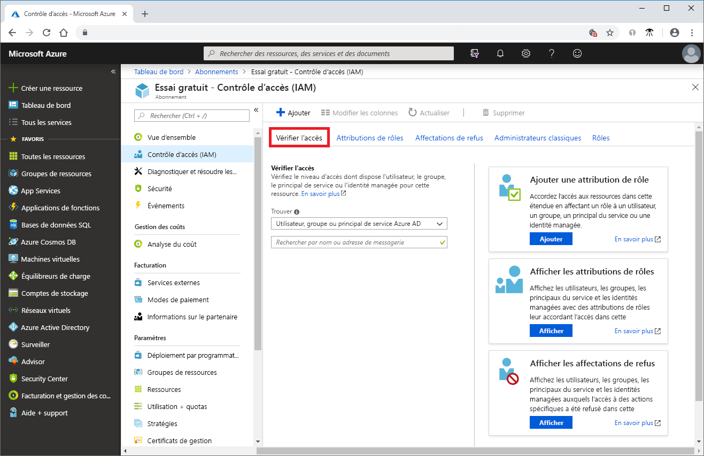
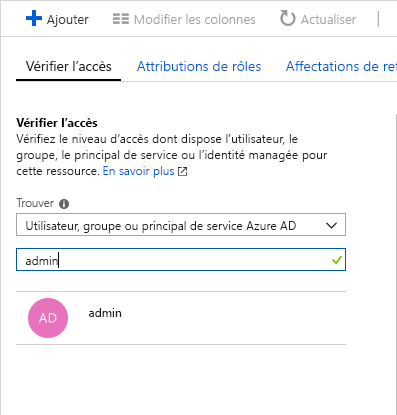
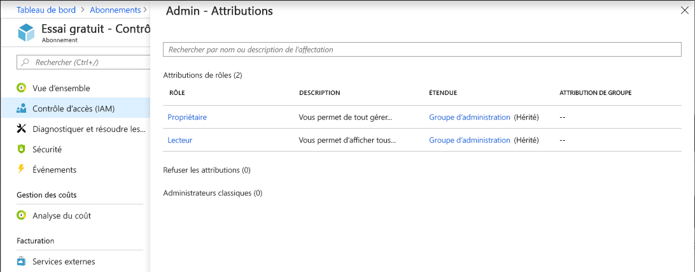

# Démarrage rapide : Afficher les rôles attribués à un utilisateur à l’aide du portail Azure

Vous pouvez utiliser le panneau **Contrôle d’accès (IAM)** dans [Contrôle d’accès en fonction du rôle (RBAC)](overview.md) pour voir les attributions de rôles de plusieurs utilisateurs, groupes, principaux de service et identités managées, mais parfois vous voulez juste voir rapidement les attributions de rôles d’un seul utilisateur, groupe, principal de service ou identité managée. Pour cela, le moyen le plus simple consiste à utiliser la fonctionnalité **Vérifier l’accès** dans le portail Azure.

## Voir les attributions de rôles

Suivez ces étapes pour voir les attributions de rôles d’un utilisateur, groupe, principal de service ou identité managée au niveau de l’abonnement.

1. Dans le portail Azure, cliquez sur **Tous les services**, puis sur **Abonnements**.

1. Cliquez sur votre abonnement.

1. Cliquez sur **Contrôle d’accès (IAM)**.

1. Cliquez sur l’onglet **Vérifier l’accès**.

    

1. Dans la liste **Rechercher**, sélectionnez le type principal de sécurité dont vous souhaitez contrôler l’accès.

1. Dans la zone de recherche, entrez une chaîne afin de rechercher, dans le répertoire, des noms d’affichage, des adresses e-mail ou des identificateurs d’objet.

    

1. Cliquez sur le principal de sécurité pour ouvrir le volet **Affectations**.

    

    Dans ce volet, vous pouvez voir les rôles attribués au principal de sécurité sélectionné et la portée. S’il existe des affectations de refus dans cette étendue, ou héritées par cette étendue, elles sont listées.

## Étapes suivantes

> [!div class="nextstepaction"]
> [Tutoriel : Accorder l’accès à un utilisateur avec RBAC et le portail Azure](quickstart-assign-role-user-portal.md)
