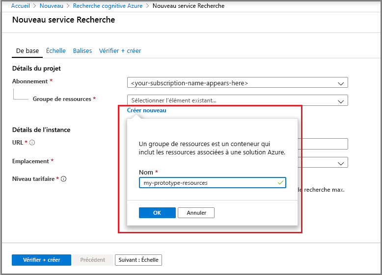
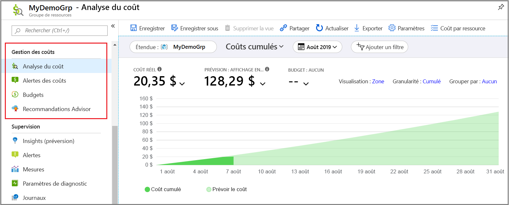
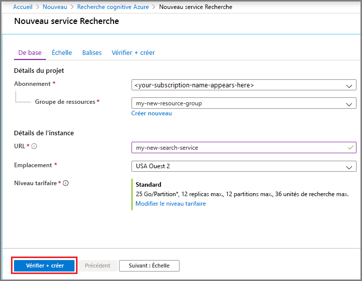
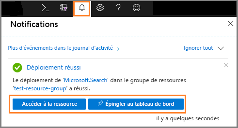
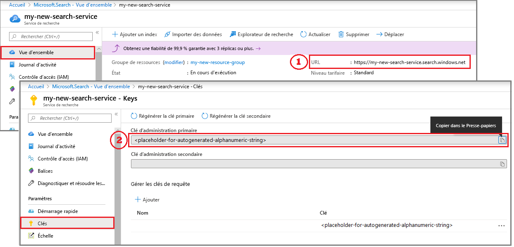
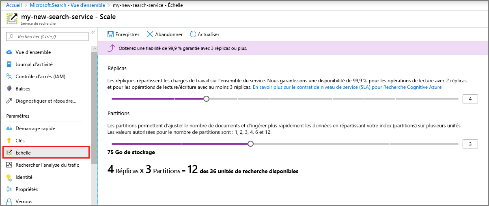

# Démarrage rapide : Créer un service Recherche cognitive Azure dans le portail

La Recherche cognitive Azure est une ressource autonome utilisée pour raccorder une expérience de recherche à des applications personnalisées. La Recherche cognitive s’intègre facilement à de nombreux autres services Azure, à des applications situées sur des serveurs réseau ou à des logiciels s’exécutant sur d’autres plateformes cloud.

Dans cet article, découvrez comment créer une ressource dans le [portail Azure](https://portal.azure.com/).

Vous préférez PowerShell ? Utilisez le [modèle de service](https://azure.microsoft.com/resources/templates/101-azure-search-create/) Azure Resource Manager. Pour obtenir de l’aide et bien démarrer, consultez [Gérer la Recherche cognitive Azure avec PowerShell](search-manage-powershell.md).

## Avant de commencer

Les propriétés de service suivantes sont fixes pendant la durée de vie du service et leur modification nécessite un nouveau service. Dans la mesure où elles sont fixes, songez aux implications quand vous remplissez chaque propriété :

* Le nom du service fait désormais partie du point de terminaison de l’URL ([Passez en revue ces conseils](#name-the-service) pour des noms de service explicites).
* Le niveau de service [affecte la facturation](search-sku-tier.md) et définit une limite supérieure sur la capacité. Certaines fonctionnalités ne sont pas disponibles sur le niveau gratuit.
* La région du service peut déterminer la disponibilité de certains scénarios. Si vous avez besoin de [fonctionnalités de haute sécurité](search-security-overview.md) ou d’[enrichissement par IA](cognitive-search-concept-intro.md), vous devez placer Recherche cognitive Azure dans la même région que les autres services ou dans des régions qui fournissent la fonctionnalité en question. 

## S’abonner (payant ou gratuit)

[Ouvrez un compte Azure gratuit](https://azure.microsoft.com/pricing/free-trial/?WT.mc_id=A261C142F) et utilisez les crédits gratuits pour essayer les services payants d’Azure. Une fois les crédits épuisés, conservez le compte et continuez à utiliser les services Azure gratuits, tels que les sites Web. Votre carte de crédit n’est pas débitée tant que vous n’avez pas explicitement modifié vos paramètres pour demander à l’être.

Vous pouvez également [activer les avantages d’abonnement MSDN](https://azure.microsoft.com/pricing/member-offers/msdn-benefits-details/?WT.mc_id=A261C142F). Un abonnement MSDN vous donne droit chaque mois à des crédits dont vous pouvez vous servir pour les services Azure payants. 

## Localiser la Recherche cognitive Azure

1. Connectez-vous au [portail Azure](https://portal.azure.com/).

1. Cliquez sur le signe plus (« + Créer une ressource ») en haut à gauche.

1. Utilisez la barre de recherche pour trouver la « Recherche cognitive Azure », ou accédez à la ressource via **Web** > **Recherche cognitive Azure**.

## Sélectionnez un abonnement

Si vous avez plusieurs abonnements, choisissez-en un pour votre service de recherche. Si vous implémentez le [double chiffrement](search-security-overview.md#double-encryption) ou d’autres fonctionnalités qui dépendent d’identités de service managées, choisissez le même abonnement que celui utilisé pour Azure Key Vault ou d’autres services pour lesquels des identités managées sont utilisées.

## Définir un groupe de ressources

Un groupe de ressources est un conteneur qui contient des ressources associées de votre solution Azure. Il est nécessaire pour le service de recherche. Il est également utile pour gérer l’ensemble des ressources, dont les coûts. Un groupe de ressources peut se composer d’un service ou de plusieurs services utilisés ensemble. Par exemple, si vous utilisez la Recherche cognitive Azure pour indexer une base de données Azure Cosmos DB, vous pouvez associer les deux services au sein du même groupe de ressources à des fins de gestion. 

Si vous ne combinez pas des ressources dans un même groupe, ou si les groupes de ressources existants sont remplis de ressources utilisées dans des solutions non liées, créez un groupe de ressources uniquement pour votre ressource Recherche cognitive Azure. 

Au fil du temps, vous pouvez effectuer le suivi des coûts actuels et prévus ou consulter les frais des différentes ressources. La capture d’écran suivante montre le type d’informations relatives aux coûts que vous pouvez vous attendre à voir quand vous combinez plusieurs ressources dans un groupe.

> [!TIP]
> Les groupes de ressources simplifient le nettoyage, car la suppression d’un groupe supprime tous les services qu’il contient. Pour les projets de prototype utilisant plusieurs services, le fait de les placer tous dans le même groupe de ressources facilite le nettoyage une fois le projet terminé.

## Nommer le service

Dans Détails de l’instance, indiquez un nom de service dans le champ **URL**. Le nom fait partie du point de terminaison URL par le biais duquel les appels d’API sont émis : `https://your-service-name.search.windows.net`. Par exemple, si vous souhaitez que le point de terminaison soit `https://myservice.search.windows.net`, vous devez entrer `myservice`.

Configuration requise du nom du service :

* il doit être unique dans l’espace de noms search.windows.net ;
* Il doit comprendre entre 2 et 60 caractères
* Vous devez utiliser des lettres minuscules, des chiffres ou des tirets (« - »)
* N’utilisez pas de tirets (« - ») pour les 2 premiers caractères ou le dernier
* Vous ne pouvez pas utiliser de tirets consécutifs (« -- »)

> [!TIP]
> Si vous pensez utiliser plusieurs services, nous vous recommandons d’inclure la région (ou l’emplacement) dans le nom du service comme convention d’affectation de noms. Les services d’une même région peuvent échanger des données gratuitement. Ainsi, si la Recherche cognitive Azure est située dans la région USA Ouest et si vous disposez d’autres services également dans cette région, un nom tel que `mysearchservice-westus` peut vous éviter de passer par la page de propriétés quand vous décidez de la façon d’associer ou d’attacher des ressources.

## Choisir un emplacement

La Recherche cognitive Azure est disponible dans la plupart des régions. Vous trouverez la liste des régions prises en charge dans la [page de tarification](https://azure.microsoft.com/pricing/details/search/).

> [!Note]
> Les régions Inde Centre et Émirats arabes unis Nord sont actuellement indisponibles pour les nouveaux services. Pour les services déjà présents dans ces régions, vous pouvez effectuer un scale-up sans aucune restriction, et votre service est entièrement pris en charge dans cette région. Les restrictions sont temporaires et ne concernent que les nouveaux services. Nous supprimerons cette note lorsque la restriction ne s’appliquera plus.
>
> Le double chiffrement est disponible seulement dans certaines régions. Pour plus d’informations, consultez [Double chiffrement](search-security-overview.md#double-encryption).

### Spécifications

 Si vous utilisez des enrichissements par IA, créez votre service de recherche dans la même région que Cognitive Services. *La colocalisation de la Recherche cognitive Azure et de Cognitive Services dans la même région est obligatoire pour l’enrichissement par IA*.

 Les clients ayant des exigences en matière de continuité d’activité et reprise d’activité (BCDR) doivent créer leurs services dans des [paires régionales](../best-practices-availability-paired-regions.md#azure-regional-pairs). Par exemple, si vous opérez en Amérique du Nord, vous pouvez choisir USA Est et USA Ouest, ou USA Centre Nord et USA Centre Sud, pour chaque service.

### Recommandations

Si vous utilisez plusieurs services Azure, choisissez une région qui héberge également votre service de données ou d’application. Cela réduit au minimum voire évite les frais de bande passante pour les données sortantes. Il n’y a aucuns frais liés aux données sortantes lorsque les services se trouvent dans la même région.

## Sélectionner un niveau tarifaire (SKU)

[La Recherche cognitive Azure est proposée à plusieurs niveaux tarifaires](https://azure.microsoft.com/pricing/details/search/) : Gratuit, De base ou Standard. Chaque niveau a ses propres [capacité et limites](search-limits-quotas-capacity.md). Pour obtenir de l’aide, voir [Choisir un niveau tarifaire ou une référence (SKU)](search-sku-tier.md) .

De base et Standard sont les options les plus courantes pour les charges de production, mais la plupart des clients démarrent avec le service gratuit. Les principales différences entre les niveaux sont la taille et la vitesse des partitions, ainsi que les limites du nombre d’objets que vous pouvez créer.

N’oubliez pas que vous ne pouvez pas changer de niveau tarifaire une fois le service créé. Si vous avez besoin d’un niveau plus élevé ou moins élevé, vous devez recréer le service.

## Créer votre service

Une fois que vous avez fourni les entrées nécessaires, continuez et créez le service. 

Votre service est déployé en quelques minutes. Vous pouvez superviser la progression par le biais de notifications Azure. Vous pouvez épingler le service à votre tableau de bord afin d’y accéder plus facilement la prochaine fois.

## Obtenir une clé et un point de terminaison d’URL

Si vous n’utilisez pas le portail, l’accès programmatique à votre nouveau service nécessite de spécifier le point de terminaison d’URL et une clé d’API d’authentification.

1. Dans la page **Vue d’ensemble**, recherchez et copiez le point de terminaison d’URL sur le côté droit de la page.

2. Dans la page **Clés**, copiez l’une des clés d’administration (elles sont équivalentes). Les clés d’API d’administrateur sont nécessaires pour la création, la mise à jour et la suppression d’objets sur votre service. Les clés de requête, quant à elles, fournissent un accès en lecture seule au contenu indexé.

   

Un point de terminaison et une clé ne sont pas nécessaires pour les tâches effectuées via le portail. Le portail est déjà lié à votre ressource Recherche cognitive Azure avec des droits d’administrateur. Pour obtenir une procédure pas à pas à effectuer dans le portail, commencez par [Guide de démarrage rapide : Créez un index de Recherche cognitive Azure dans le portail](search-get-started-portal.md).

## Mettre à l’échelle le service

Une fois votre service approvisionné, vous pouvez le mettre à l’échelle en fonction de vos besoins. Si vous avez choisi le niveau Standard pour votre service Recherche cognitive Azure, vous pouvez le mettre à l’échelle dans deux dimensions : réplicas et partitions. Si vous choisissez le niveau De base, vous pouvez uniquement ajouter des réplicas. Si vous configurez le service gratuit, la mise à l’échelle n’est pas disponible.

Les ***partitions*** permettent à votre service de stocker plus de documents et d’effectuer des recherches dans un plus grand nombre de documents.

Les ***réplicas*** permettent à votre service de gérer une charge supérieure de requêtes de recherche.

L’ajout de ressources augmente votre facture mensuelle. Le [calculatrice de prix](https://azure.microsoft.com/pricing/calculator/) peut vous aider à comprendre les conséquences de l’ajout de ressources pour la facturation. N’oubliez pas que vous pouvez ajuster les ressources en fonction de la charge. Par exemple, vous pouvez augmenter les ressources pour créer un index initial complet, puis les réduire ultérieurement à un niveau plus approprié pour l’indexation incrémentielle.

> [!Important]
> Un service doit avoir [2 réplicas pour SLA en lecture seule et 3 réplicas pour SLA en lecture/écriture](https://azure.microsoft.com/support/legal/sla/search/v1_0/).

1. Accédez à la page du service de recherche dans le portail Azure.
2. Dans le volet de navigation de gauche, sélectionnez **Paramètres** > **Mise à l’échelle**.
3. Utilisez le curseur pour ajouter des ressources de chaque type.

> [!Note]
> Le stockage par partition et la vitesse sont plus élevés dans les niveaux de service supérieurs. Pour plus d’informations, consultez [Capacité et limitations](search-limits-quotas-capacity.md).

## Quand ajouter un deuxième service

La plupart des clients n’utilisent qu’un seul service provisionné à un niveau qui fournit le [bon équilibre des ressources](search-sku-tier.md). Un service peut héberger plusieurs index, soumis aux [limites maximales du niveau sélectionné](search-capacity-planning.md), chaque index étant isolé des autres. Dans la Recherche cognitive Azure, les requêtes ne peuvent être dirigées que vers un seul index, ce qui réduit les risques d’extraction accidentelle ou intentionnelle de données à partir d’autres index du même service.

Bien que la plupart des clients utilisent un seul service, une redondance des services peut être nécessaire en cas d’exigences opérationnelles particulières, notamment :

+ [Continuité d’activité et reprise d’activité (BCDR)](../best-practices-availability-paired-regions.md). La Recherche cognitive Azure ne fournit pas de basculement instantané en cas de panne.

+ Les [architectures mutualisées](search-modeling-multitenant-saas-applications.md) appellent parfois deux ou plusieurs services.

+ Les applications déployées à l’échelle mondiale peuvent nécessiter des services de recherche dans chaque zone géographique pour réduire au minimum la latence.

> [!NOTE]
> Dans la Recherche cognitive Azure, vous ne pouvez pas séparer les opérations d’indexation et d’interrogation. Vous ne créez donc jamais plusieurs services pour des charges de travail distinctes. Un index est toujours interrogé sur le service dans lequel il a été créé (vous ne pouvez pas créer un index dans un service et le copier dans un autre).

Il n’est pas nécessaire de disposer d’un second service pour la haute disponibilité. La haute disponibilité des requêtes est atteinte si vous utilisez au moins deux réplicas dans le même service. Les mises à jour des réplicas sont séquentielles, ce qui signifie qu’au moins l’un d’eux est opérationnel lors du déploiement d’une mise à jour de service. Pour plus d’informations sur la disponibilité, consultez la page [Contrats de niveau de service](https://azure.microsoft.com/support/legal/sla/search/v1_0/).

## Étapes suivantes

Après avoir approvisionné un service, vous pouvez rester dans le portail et créer votre premier index.

> [!div class="nextstepaction"]
> [Démarrage rapide : Créer un index de Recherche cognitive Azure dans le portail](search-get-started-portal.md)