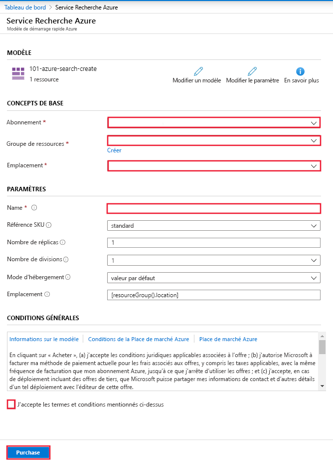

# Démarrage rapide : Déployer le service Recherche cognitive à l’aide d’un modèle Resource Manager

Cet article vous guide tout au long du processus d’utilisation d’un modèle Resource Manager pour déployer une ressource Recherche cognitive Azure dans le portail Azure.

[!INCLUDE [About Azure Resource Manager](../../includes/resource-manager-quickstart-introduction.md)]

## Prérequis

Si vous n’avez pas d’abonnement Azure, créez un [compte gratuit](https://azure.microsoft.com/free/?WT.mc_id=A261C142F) avant de commencer.

## Créer un service Recherche cognitive

### Vérifier le modèle

Le modèle utilisé dans ce guide de démarrage rapide est tiré des [modèles Azure](https://docs.microsoft.com/azure/templates/Microsoft.Search/2015-08-19/searchservices).

:::code language="json"source="~/quickstart-templates/101-azure-search-create/azuredeploy.json" range="1-86" highlight="4-50":::

La ressource Azure définie dans ce modèle :

- [Microsoft.Search/searchServices](https://docs.microsoft.com/azure/templates/Microsoft.Search/2015-08-19/searchServices) : créer un service Recherche cognitive Azure

### Déployer le modèle

Cliquez sur l’image ci-après pour vous connecter à Azure et ouvrir un modèle. Le modèle crée une ressource Recherche cognitive Azure.

Le portail affiche un formulaire qui vous permet de spécifier facilement des valeurs de paramètre. Certains paramètres sont préremplis avec les valeurs par défaut du modèle. Vous devrez spécifier votre abonnement, le groupe de ressources, l’emplacement et le nom du service. Si vous souhaitez utiliser Cognitive Services dans un pipeline d’[enrichissement par IA](https://docs.microsoft.com/azure/search/cognitive-search-concept-intro), par exemple pour analyser le texte de fichiers image binaires, choisissez un emplacement qui offre à la fois le service Recherche cognitive et Cognitive Services. Les deux services doivent se trouver dans la même région pour les charges de travail d’enrichissement par IA. Quand vous avez rempli le formulaire, vous devez accepter les conditions générales, puis sélectionner le bouton Acheter pour terminer votre déploiement.

> [!div class="mx-imgBorder"]
> 

## Vérifier les ressources déployées

Quand votre déploiement est terminé, vous pouvez accéder au nouveau groupe de ressources et au nouveau service de recherche dans le portail.

## Nettoyer les ressources

D’autres guides de démarrage rapide et tutoriels sur le service Recherche cognitive reposent sur ce guide de démarrage rapide. Si vous prévoyez d’utiliser les guides de démarrage rapide et tutoriels suivants, il peut être utile de conserver ces ressources. Si vous n’en avez plus besoin, vous pouvez supprimer le groupe de ressources. Dans ce cas, le service Recherche cognitive et les ressources associées seront également supprimés.

## Étapes suivantes

Dans ce guide de démarrage rapide, vous avez créé un service Recherche cognitive en utilisant un modèle Azure Resource Manager, puis vous avez validé le déploiement. Pour plus d’informations sur le service Recherche cognitive et Azure Resource Manager, consultez les articles ci-dessous.

 - [Présentation de la Recherche cognitive Azure](https://docs.microsoft.com/azure/search/search-what-is-azure-search)
 - [Créer un index](https://docs.microsoft.com/azure/search/search-get-started-portal) pour votre service de recherche
 - [Créer une application de recherche](https://docs.microsoft.com/azure/search/search-create-app-portal) à l’aide de l’Assistant du portail
 - [Créer un ensemble de compétences](https://docs.microsoft.com/azure/search/cognitive-search-quickstart-blob) pour extraire des informations de vos données

