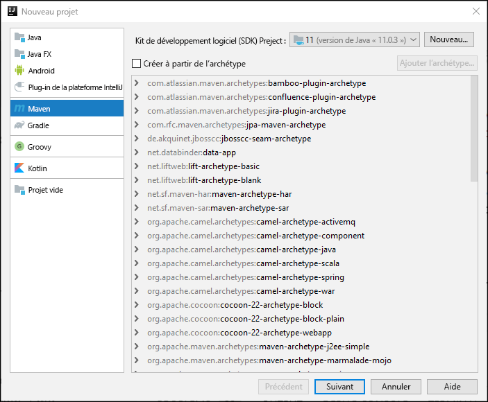
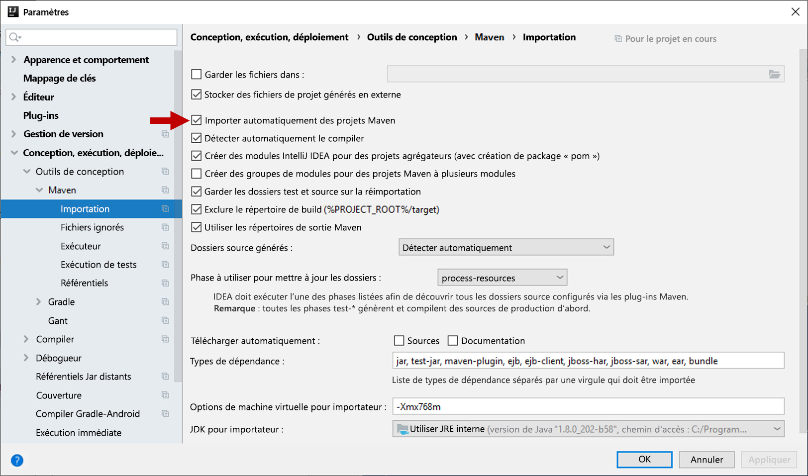
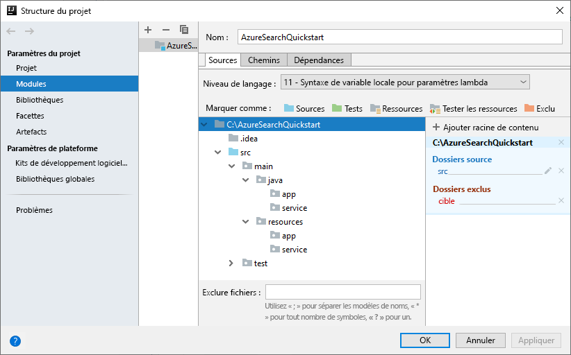
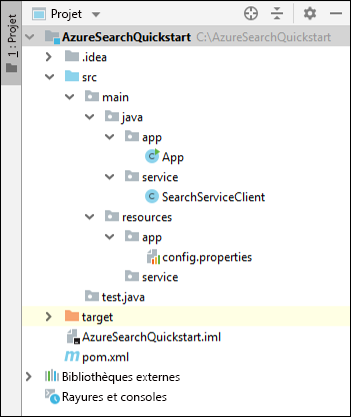
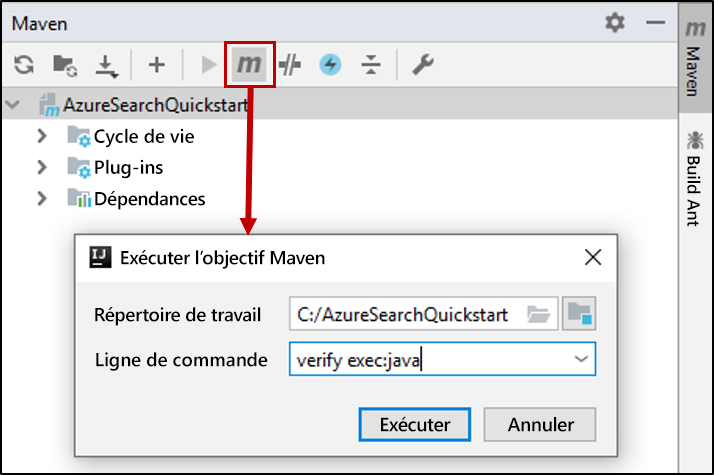

# <a name="quickstart-create-an-azure-cognitive-search-index-in-java-using-rest-apis"></a>Démarrage rapide : Créer un index Recherche cognitive Azure en Java à l’aide des API REST
> [!div class="op_single_selector"]
> * [JavaScript](search-get-started-nodejs.md)
> * [C#](search-get-started-dotnet.md)
> * [Java](search-get-started-java.md)
> * [Portail](search-get-started-portal.md)
> * [PowerShell](search-create-index-rest-api.md)
> * [Python](search-get-started-python.md)
> * [Postman](search-get-started-postman.md)

Générez une application console Java qui crée, charge et interroge un index de recherche à l’aide de [IntelliJ](https://www.jetbrains.com/idea/), du [SDK Java 11](/java/azure/jdk/?view=azure-java-stable) et de l’[API REST Recherche cognitive Azure](/rest/api/searchservice/). Cet article fournit des instructions pas à pas pour créer l’application. Vous pouvez aussi [télécharger et exécuter l’application complète](/samples/azure-samples/azure-search-java-samples/java-sample-quickstart/).

Si vous n’avez pas d’abonnement Azure, créez un [compte gratuit](https://azure.microsoft.com/free/?WT.mc_id=A261C142F) avant de commencer.

## <a name="prerequisites"></a>Prérequis

Nous avons utilisé les services et logiciels suivants pour générer et tester ce démarrage rapide :

+ [IntelliJ IDEA](https://www.jetbrains.com/idea/)

+ [Kit SDK Java 11](/java/azure/jdk/?view=azure-java-stable)

+ [Créez un service Recherche cognitive Azure](search-create-service-portal.md) ou [recherchez un service existant](https://ms.portal.azure.com/#blade/HubsExtension/BrowseResourceBlade/resourceType/Microsoft.Search%2FsearchServices) dans votre abonnement actuel. Vous pouvez utiliser un service gratuit pour ce guide de démarrage rapide.

<a name="get-service-info"></a>

## <a name="get-a-key-and-url"></a>Obtenir une clé et une URL

Les appels au service nécessitent un point de terminaison d’URL et une clé d’accès pour chaque requête. Un service de recherche est créé avec les deux. Ainsi, si vous avez ajouté la Recherche cognitive Azure à votre abonnement, effectuez ce qui suit pour obtenir les informations nécessaires :

1. [Connectez-vous au portail Azure](https://portal.azure.com/), puis dans la page **Vue d’ensemble** du service de recherche, récupérez l’URL. Voici un exemple de point de terminaison : `https://mydemo.search.windows.net`.

2. Dans **Paramètres** > **Clés**, obtenez une clé d’administration pour avoir des droits d’accès complets sur le service. Il existe deux clés d’administration interchangeables, fournies pour assurer la continuité de l’activité au cas où vous deviez en remplacer une. Vous pouvez utiliser la clé primaire ou secondaire sur les demandes d’ajout, de modification et de suppression d’objets.

   Créez également une clé de requête. Il est recommandé d’émettre des demandes de requête avec un accès en lecture seule.


Chaque demande envoyée à votre service nécessite une clé API. L’utilisation d’une clé valide permet d’établir, en fonction de chaque demande, une relation de confiance entre l’application qui envoie la demande et le service qui en assure le traitement.

## <a name="set-up-your-environment"></a>Configurer votre environnement

Commencez par ouvrir IntelliJ IDEA et configurer un nouveau projet.

### <a name="create-the-project"></a>Créer le projet

1. Ouvrez IntelliJ IDEA et sélectionnez **Create New Project** (Créer un projet).
1. Sélectionnez **Maven**.
1. Dans la liste **Project SDK**, sélectionnez le kit SDK Java 11.

     

1. Pour **GroupId** et **ArtifactId**,entrez `AzureSearchQuickstart`.
1. Acceptez les valeurs par défaut restantes pour ouvrir le projet.

### <a name="specify-maven-dependencies"></a>Spécifier les dépendances Maven

1. Sélectionnez **Fichier** > **Paramètres**.
1. Dans la fenêtre **Paramètres**, sélectionnez **Build, Execution, Deployment** > **Build Tools** > **Maven** > **Importing** (Build, Exécution, Déploiement > Outils de build > Maven > Importation).
1. Cochez la case **Import Maven projects automatically** (Importer les projets Maven automatiquement), puis cliquez sur **OK** pour fermer la fenêtre. Les plug-ins Maven et les autres dépendances sont désormais automatiquement synchronisés quand vous mettez à jour le fichier pom.xml à l’étape suivante.

    

1. Ouvrez le fichier pom.xml et remplacez le contenu par les détails de configuration Maven suivants. Ceux-ci incluent des références au [plug-in Exec Maven](https://www.mojohaus.org/exec-maven-plugin/) et une [API d’interface JSON](https://javadoc.io/doc/org.glassfish/javax.json/1.0.2)

    ```xml
    <?xml version="1.0" encoding="UTF-8"?>
    <project xmlns="http://maven.apache.org/POM/4.0.0"
             xmlns:xsi="http://www.w3.org/2001/XMLSchema-instance"
             xsi:schemaLocation="http://maven.apache.org/POM/4.0.0 http://maven.apache.org/xsd/maven-4.0.0.xsd">
        <modelVersion>4.0.0</modelVersion>
    
        <groupId>AzureSearchQuickstart</groupId>
        <artifactId>AzureSearchQuickstart</artifactId>
        <version>1.0-SNAPSHOT</version>
        <build>
            <sourceDirectory>src</sourceDirectory>
            <plugins>
                <plugin>
                    <artifactId>maven-compiler-plugin</artifactId>
                    <version>3.1</version>
                    <configuration>
                        <source>11</source>
                        <target>11</target>
                    </configuration>
                </plugin>
                <plugin>
                    <groupId>org.codehaus.mojo</groupId>
                    <artifactId>exec-maven-plugin</artifactId>
                    <version>1.6.0</version>
                    <executions>
                        <execution>
                            <goals>
                                <goal>exec</goal>
                            </goals>
                        </execution>
                    </executions>
                    <configuration>
                        <mainClass>main.java.app.App</mainClass>
                        <cleanupDaemonThreads>false</cleanupDaemonThreads>
                    </configuration>
                </plugin>
            </plugins>
        </build>
        <dependencies>
            <dependency>
                <groupId>org.glassfish</groupId>
                <artifactId>javax.json</artifactId>
                <version>1.0.2</version>
            </dependency>
        </dependencies>   
    </project>
    ```

### <a name="set-up-the-project-structure"></a>Configurer la structure de projet

1. Sélectionnez **Fichier** > **Structure du projet**.
1. Sélectionnez **Modules**, puis développez l’arborescence source pour accéder au contenu du dossier `src` >  `main`.
1. Dans le dossier `src` >  `main` > `java`, ajoutez les dossiers `app` et `service`. Pour ce faire, sélectionnez le dossier `java`, appuyez sur Alt+Insertion, puis entrez le nom du dossier.
1. Dans le dossier `src` >  `main` >`resources`, ajoutez les dossiers `app` et `service`.

    Quand vous avez terminé, l’arborescence de projet doit ressembler à l’image suivante.

    

1. Cliquez sur **OK** pour fermer la fenêtre.

### <a name="add-azure-cognitive-search-service-information"></a>Ajouter des informations relatives au service Recherche cognitive Azure

1. Dans la fenêtre **Projet**, développez l’arborescence source pour accéder au dossier `src` >  `main` >`resources` > `app`, puis ajoutez un fichier `config.properties`. Pour ce faire, sélectionnez le dossier `app`, appuyez sur Alt+Insertion, sélectionnez **Fichier**, puis entrez le nom du fichier.

1. Copiez les paramètres suivants dans le nouveau fichier et remplacez `<YOUR-SEARCH-SERVICE-NAME>`, `<YOUR-ADMIN-KEY>` et `<YOUR-QUERY-KEY>` par les clés et le nom de votre service. Si le point de terminaison de votre service est `https://mydemo.search.windows.net`, le nom du service serait « mydemo ».

    ```java
        SearchServiceName=<YOUR-SEARCH-SERVICE-NAME>
        SearchServiceAdminKey=<YOUR-ADMIN-KEY>
        SearchServiceQueryKey=<YOUR-QUERY-KEY>
        IndexName=hotels-quickstart
        ApiVersion=2020-06-30
    ```

### <a name="add-the-main-method"></a>Ajouter la méthode principale

1. Dans le dossier `src` >  `main` > `java` > `app`, ajoutez une classe `App`. Pour ce faire, sélectionnez le dossier `app`, appuyez sur Alt+Insertion, sélectionnez **Java Class** (Classe Java), puis entrez le nom de la classe.
1. Ouvrez la classe `App` et remplacez le contenu par le code suivant. Ce code contient la méthode `main`. 

    Le code sans marques de commentaire lit les paramètres du service de recherche et les utilise pour créer une instance du client du service de recherche. Le code client du service de recherche sera ajouté dans la section suivante.

    Le code commenté dans cette classe verra ses marques de commentaire supprimées dans une section ultérieure de ce guide de démarrage rapide.

    ```java
    package main.java.app;
    
    import main.java.service.SearchServiceClient;
    import java.io.IOException;
    import java.util.Properties;
    
    public class App {
    
        private static Properties loadPropertiesFromResource(String resourcePath) throws IOException {
            var inputStream = App.class.getResourceAsStream(resourcePath);
            var configProperties = new Properties();
            configProperties.load(inputStream);
            return configProperties;
        }
    
        public static void main(String[] args) {
            try {
                var config = loadPropertiesFromResource("/app/config.properties");
                var client = new SearchServiceClient(
                        config.getProperty("SearchServiceName"),
                        config.getProperty("SearchServiceAdminKey"),
                        config.getProperty("SearchServiceQueryKey"),
                        config.getProperty("ApiVersion"),
                        config.getProperty("IndexName")
                );
    
    
    //Uncomment the next 3 lines in the 1 - Create Index section of the quickstart
    //            if(client.indexExists()){ client.deleteIndex();}
    //            client.createIndex("/service/index.json");
    //            Thread.sleep(1000L); // wait a second to create the index
    
    //Uncomment the next 2 lines in the 2 - Load Documents section of the quickstart
    //            client.uploadDocuments("/service/hotels.json");
    //            Thread.sleep(2000L); // wait 2 seconds for data to upload
    
    //Uncomment the following 5 search queries in the 3 - Search an index section of the quickstart
    //            // Query 1
    //            client.logMessage("\n*QUERY 1****************************************************************");
    //            client.logMessage("Search for: Atlanta'");
    //            client.logMessage("Return: All fields'");
    //            client.searchPlus("Atlanta");
    //
    //            // Query 2
    //            client.logMessage("\n*QUERY 2****************************************************************");
    //            client.logMessage("Search for: Atlanta");
    //            client.logMessage("Return: HotelName, Tags, Address");
    //            SearchServiceClient.SearchOptions options2 = client.createSearchOptions();
    //            options2.select = "HotelName,Tags,Address";
    //            client.searchPlus("Atlanta", options2);
    //
    //            //Query 3
    //            client.logMessage("\n*QUERY 3****************************************************************");
    //            client.logMessage("Search for: wifi & restaurant");
    //            client.logMessage("Return: HotelName, Description, Tags");
    //            SearchServiceClient.SearchOptions options3 = client.createSearchOptions();
    //            options3.select = "HotelName,Description,Tags";
    //            client.searchPlus("wifi,restaurant", options3);
    //
    //            // Query 4 -filtered query
    //            client.logMessage("\n*QUERY 4****************************************************************");
    //            client.logMessage("Search for: all");
    //            client.logMessage("Filter: Ratings greater than 4");
    //            client.logMessage("Return: HotelName, Rating");
    //            SearchServiceClient.SearchOptions options4 = client.createSearchOptions();
    //            options4.filter="Rating%20gt%204";
    //            options4.select = "HotelName,Rating";
    //            client.searchPlus("*",options4);
    //
    //            // Query 5 - top 2 results, ordered by
    //            client.logMessage("\n*QUERY 5****************************************************************");
    //            client.logMessage("Search for: boutique");
    //            client.logMessage("Get: Top 2 results");
    //            client.logMessage("Order by: Rating in descending order");
    //            client.logMessage("Return: HotelId, HotelName, Category, Rating");
    //            SearchServiceClient.SearchOptions options5 = client.createSearchOptions();
    //            options5.top=2;
    //            options5.orderby = "Rating%20desc";
    //            options5.select = "HotelId,HotelName,Category,Rating";
    //            client.searchPlus("boutique", options5);
    
            } catch (Exception e) {
                System.err.println("Exception:" + e.getMessage());
                e.printStackTrace();
            }
        }
    }
    ```

### <a name="add-the-http-operations"></a>Ajouter les opérations HTTP

1. Dans le dossier `src` >  `main` > `java` > `service`, ajoutez une classe `SearchServiceClient`. Pour ce faire, sélectionnez le dossier `service`, appuyez sur Alt+Insertion, sélectionnez **Java Class** (Classe Java), puis entrez le nom de la classe.
1. Ouvrez la classe `SearchServiceClient` et remplacez son contenu par le code suivant. Ce code fournit les opérations HTTP nécessaires pour utiliser l’API REST de la Recherche cognitive Azure. Des méthodes supplémentaires pour la création d’un index, le chargement de documents et l’interrogation de l’index seront ajoutées dans une section ultérieure.

    ```java
    package main.java.service;

    import javax.json.Json;
    import javax.net.ssl.HttpsURLConnection;
    import java.io.IOException;
    import java.io.StringReader;
    import java.net.HttpURLConnection;
    import java.net.URI;
    import java.net.http.HttpClient;
    import java.net.http.HttpRequest;
    import java.net.http.HttpResponse;
    import java.nio.charset.StandardCharsets;
    import java.util.Formatter;
    import java.util.function.Consumer;
    
        /* This class is responsible for implementing HTTP operations for creating the index, uploading documents and searching the data*/
        public class SearchServiceClient {
            private final String _adminKey;
            private final String _queryKey;
            private final String _apiVersion;
            private final String _serviceName;
            private final String _indexName;
            private final static HttpClient client = HttpClient.newHttpClient();
    
        public SearchServiceClient(String serviceName, String adminKey, String queryKey, String apiVersion, String indexName) {
            this._serviceName = serviceName;
            this._adminKey = adminKey;
            this._queryKey = queryKey;
            this._apiVersion = apiVersion;
            this._indexName = indexName;
        }

        private static HttpResponse<String> sendRequest(HttpRequest request) throws IOException, InterruptedException {
            logMessage(String.format("%s: %s", request.method(), request.uri()));
            return client.send(request, HttpResponse.BodyHandlers.ofString());
        }

        private static URI buildURI(Consumer<Formatter> fmtFn)
                {
                    Formatter strFormatter = new Formatter();
                    fmtFn.accept(strFormatter);
                    String url = strFormatter.out().toString();
                    strFormatter.close();
                    return URI.create(url);
        }
    
        public static void logMessage(String message) {
            System.out.println(message);
        }
    
        public static boolean isSuccessResponse(HttpResponse<String> response) {
            try {
                int responseCode = response.statusCode();
    
                logMessage("\n Response code = " + responseCode);
    
                if (responseCode == HttpURLConnection.HTTP_OK || responseCode == HttpURLConnection.HTTP_ACCEPTED
                        || responseCode == HttpURLConnection.HTTP_NO_CONTENT || responseCode == HttpsURLConnection.HTTP_CREATED) {
                    return true;
                }
    
                // We got an error
                var msg = response.body();
                if (msg != null) {
                    logMessage(String.format("\n MESSAGE: %s", msg));
                }
    
            } catch (Exception e) {
                e.printStackTrace();
            }
    
            return false;
        }
    
        public static HttpRequest httpRequest(URI uri, String key, String method, String contents) {
            contents = contents == null ? "" : contents;
            var builder = HttpRequest.newBuilder();
            builder.uri(uri);
            builder.setHeader("content-type", "application/json");
            builder.setHeader("api-key", key);
    
            switch (method) {
                case "GET":
                    builder = builder.GET();
                    break;
                case "HEAD":
                    builder = builder.GET();
                    break;
                case "DELETE":
                    builder = builder.DELETE();
                    break;
                case "PUT":
                    builder = builder.PUT(HttpRequest.BodyPublishers.ofString(contents));
                    break;
                case "POST":
                    builder = builder.POST(HttpRequest.BodyPublishers.ofString(contents));
                    break;
                default:
                    throw new IllegalArgumentException(String.format("Can't create request for method '%s'", method));
            }
            return builder.build();
        }
    }
    
    ```

### <a name="build-the-project"></a>Créer le projet

1. Vérifiez que votre projet a la structure suivante.

    

1. Ouvrez la fenêtre Outil **Maven** et exécutez cet objectif Maven : `verify exec:java`


Une fois le traitement terminé, recherchez un message BUILD SUCCESS suivi d’un code de sortie zéro (0).

## <a name="1---create-index"></a>1 - Créer un index

La définition de l’index des hôtels contient des champs simples et un champ complexe. « HotelName » ou « Description » sont des exemples de champs simples. Le champ « Address » est un champ complexe, car il contient des sous-champs, tels que « Street Address » et « City ». Dans ce guide de démarrage rapide, la définition d’index est spécifiée à l’aide de JSON.

1. Dans la fenêtre **Projet**, développez l’arborescence source pour accéder au dossier `src` >  `main` >`resources` > `service`, puis ajoutez un fichier `index.json`. Pour ce faire, sélectionnez le dossier `app`, appuyez sur Alt+Insertion, sélectionnez **Fichier**, puis entrez le nom du fichier.

1. Ouvrez le fichier `index.json` et insérez la définition d’index suivante.

    ```json
    {
      "name": "hotels-quickstart",
      "fields": [
        {
          "name": "HotelId",
          "type": "Edm.String",
          "key": true,
          "filterable": true
        },
        {
          "name": "HotelName",
          "type": "Edm.String",
          "searchable": true,
          "filterable": false,
          "sortable": true,
          "facetable": false
        },
        {
          "name": "Description",
          "type": "Edm.String",
          "searchable": true,
          "filterable": false,
          "sortable": false,
          "facetable": false,
          "analyzer": "en.lucene"
        },
        {
          "name": "Description_fr",
          "type": "Edm.String",
          "searchable": true,
          "filterable": false,
          "sortable": false,
          "facetable": false,
          "analyzer": "fr.lucene"
        },
        {
          "name": "Category",
          "type": "Edm.String",
          "searchable": true,
          "filterable": true,
          "sortable": true,
          "facetable": true
        },
        {
          "name": "Tags",
          "type": "Collection(Edm.String)",
          "searchable": true,
          "filterable": true,
          "sortable": false,
          "facetable": true
        },
        {
          "name": "ParkingIncluded",
          "type": "Edm.Boolean",
          "filterable": true,
          "sortable": true,
          "facetable": true
        },
        {
          "name": "LastRenovationDate",
          "type": "Edm.DateTimeOffset",
          "filterable": true,
          "sortable": true,
          "facetable": true
        },
        {
          "name": "Rating",
          "type": "Edm.Double",
          "filterable": true,
          "sortable": true,
          "facetable": true
        },
        {
          "name": "Address",
          "type": "Edm.ComplexType",
          "fields": [
            {
              "name": "StreetAddress",
              "type": "Edm.String",
              "filterable": false,
              "sortable": false,
              "facetable": false,
              "searchable": true
            },
            {
              "name": "City",
              "type": "Edm.String",
              "searchable": true,
              "filterable": true,
              "sortable": true,
              "facetable": true
            },
            {
              "name": "StateProvince",
              "type": "Edm.String",
              "searchable": true,
              "filterable": true,
              "sortable": true,
              "facetable": true
            },
            {
              "name": "PostalCode",
              "type": "Edm.String",
              "searchable": true,
              "filterable": true,
              "sortable": true,
              "facetable": true
            },
            {
              "name": "Country",
              "type": "Edm.String",
              "searchable": true,
              "filterable": true,
              "sortable": true,
              "facetable": true
            }
          ]
        }
      ]
    }
    ```

    Le nom de l’index sera « hotels-quickstart ». Les attributs des champs d’index déterminent la manière dont les données indexées peuvent faire l’objet d’une recherche dans une application. Par exemple, l’attribut `IsSearchable` doit être affecté à tous les champs qui doivent être inclus dans une recherche en texte intégral. Pour en savoir plus sur les attributs, consultez [Collection et attributs de champs](search-what-is-an-index.md#fields-collection).
    
    Le champ `Description` de cet index utilise la propriété `analyzer` facultative pour remplacer l’analyseur de langage Lucene par défaut. Le champ `Description_fr` utilise l’analyseur Lucene en français (`fr.lucene`), car il stocke le texte en français. Le champ `Description` utilise l’analyseur de langage Microsoft facultatif en.lucene. Pour en savoir plus sur les analyseurs, consultez [Analyseurs pour le traitement de texte dans la Recherche cognitive Azure](search-analyzers.md).

1. Ajoutez le code suivant à la classe `SearchServiceClient` . Ces méthodes génèrent des URL de service REST pour la Recherche cognitive Azure, qui créent et suppriment un index, et qui déterminent son existence. Les méthodes constituent également la requête HTTP.

    ```java
    public boolean indexExists() throws IOException, InterruptedException {
        logMessage("\n Checking if index exists...");
        var uri = buildURI(strFormatter -> strFormatter.format(
                "https://%s.search.windows.net/indexes/%s/docs?api-version=%s&search=*",
                _serviceName,_indexName,_apiVersion));
        var request = httpRequest(uri, _adminKey, "HEAD", "");
        var response = sendRequest(request);
        return isSuccessResponse(response);
    }
    
    public boolean deleteIndex() throws IOException, InterruptedException {
        logMessage("\n Deleting index...");
        var uri = buildURI(strFormatter -> strFormatter.format(
                "https://%s.search.windows.net/indexes/%s?api-version=%s",
                _serviceName,_indexName,_apiVersion));
        var request = httpRequest(uri, _adminKey, "DELETE", "*");
        var response = sendRequest(request);
        return isSuccessResponse(response);
    }
    
    
    public boolean createIndex(String indexDefinitionFile) throws IOException, InterruptedException {
        logMessage("\n Creating index...");
        //Build the search service URL
        var uri = buildURI(strFormatter -> strFormatter.format(
                "https://%s.search.windows.net/indexes/%s?api-version=%s",
                _serviceName,_indexName,_apiVersion));
        //Read in index definition file
        var inputStream = SearchServiceClient.class.getResourceAsStream(indexDefinitionFile);
        var indexDef = new String(inputStream.readAllBytes(), StandardCharsets.UTF_8);
        //Send HTTP PUT request to create the index in the search service
        var request = httpRequest(uri, _adminKey, "PUT", indexDef);
        var response = sendRequest(request);
        return isSuccessResponse(response);
    }
    ```

1. Supprimez les marques de commentaire du code suivant dans la classe `App`. Ce code supprime l’index « hotels-quickstart », s’il existe, et crée un index basé sur la définition de l’index dans le fichier « index.json ». 

    Une pause d’une seconde est insérée après la demande de création d’index. Cette pause permet de s’assurer que l’index est créé avant de charger des documents.

    ```java
        if (client.indexExists()) { client.deleteIndex();}
          client.createIndex("/service/index.json");
          Thread.sleep(1000L); // wait a second to create the index
    ```

1. Ouvrez la fenêtre Outil **Maven** et exécutez cet objectif Maven : `verify exec:java`

    Lors de l’exécution du code, recherchez un message de type « Création d’index » suivi d’un code de réponse 201. Ce code de réponse confirme que l’index a été créé. L’exécution doit se terminer par un message BUILD SUCCESS et un code de sortie zéro (0).
    
## <a name="2---load-documents"></a>2 – Charger des documents

1. Dans la fenêtre **Projet**, développez l’arborescence source pour accéder au dossier `src` >  `main` >`resources` > `service`, puis ajoutez un fichier `hotels.json`. Pour ce faire, sélectionnez le dossier `app`, appuyez sur Alt+Insertion, sélectionnez **Fichier**, puis entrez le nom du fichier.
1. Insérez les documents d’hôtel suivants dans le fichier.

    ```json
    {
      "value": [
        {
          "@search.action": "upload",
          "HotelId": "1",
          "HotelName": "Secret Point Motel",
          "Description": "The hotel is ideally located on the main commercial artery of the city in the heart of New York. A few minutes away is Time's Square and the historic centre of the city, as well as other places of interest that make New York one of America's most attractive and cosmopolitan cities.",
          "Description_fr": "L'hôtel est idéalement situé sur la principale artère commerciale de la ville en plein cœur de New York. A quelques minutes se trouve la place du temps et le centre historique de la ville, ainsi que d'autres lieux d'intérêt qui font de New York l'une des villes les plus attractives et cosmopolites de l'Amérique.",
          "Category": "Boutique",
          "Tags": [ "pool", "air conditioning", "concierge" ],
          "ParkingIncluded": "false",
          "LastRenovationDate": "1970-01-18T00:00:00Z",
          "Rating": 3.60,
          "Address": {
            "StreetAddress": "677 5th Ave",
            "City": "New York",
            "StateProvince": "NY",
            "PostalCode": "10022",
            "Country": "USA"
          }
        },
        {
          "@search.action": "upload",
          "HotelId": "2",
          "HotelName": "Twin Dome Motel",
          "Description": "The hotel is situated in a  nineteenth century plaza, which has been expanded and renovated to the highest architectural standards to create a modern, functional and first-class hotel in which art and unique historical elements coexist with the most modern comforts.",
          "Description_fr": "L'hôtel est situé dans une place du XIXe siècle, qui a été agrandie et rénovée aux plus hautes normes architecturales pour créer un hôtel moderne, fonctionnel et de première classe dans lequel l'art et les éléments historiques uniques coexistent avec le confort le plus moderne.",
          "Category": "Boutique",
          "Tags": [ "pool", "free wifi", "concierge" ],
          "ParkingIncluded": "false",
          "LastRenovationDate": "1979-02-18T00:00:00Z",
          "Rating": 3.60,
          "Address": {
            "StreetAddress": "140 University Town Center Dr",
            "City": "Sarasota",
            "StateProvince": "FL",
            "PostalCode": "34243",
            "Country": "USA"
          }
        },
        {
          "@search.action": "upload",
          "HotelId": "3",
          "HotelName": "Triple Landscape Hotel",
          "Description": "The Hotel stands out for its gastronomic excellence under the management of William Dough, who advises on and oversees all of the Hotel’s restaurant services.",
          "Description_fr": "L'hôtel est situé dans une place du XIXe siècle, qui a été agrandie et rénovée aux plus hautes normes architecturales pour créer un hôtel moderne, fonctionnel et de première classe dans lequel l'art et les éléments historiques uniques coexistent avec le confort le plus moderne.",
          "Category": "Resort and Spa",
          "Tags": [ "air conditioning", "bar", "continental breakfast" ],
          "ParkingIncluded": "true",
          "LastRenovationDate": "2015-09-20T00:00:00Z",
          "Rating": 4.80,
          "Address": {
            "StreetAddress": "3393 Peachtree Rd",
            "City": "Atlanta",
            "StateProvince": "GA",
            "PostalCode": "30326",
            "Country": "USA"
          }
        },
        {
          "@search.action": "upload",
          "HotelId": "4",
          "HotelName": "Sublime Cliff Hotel",
          "Description": "Sublime Cliff Hotel is located in the heart of the historic center of Sublime in an extremely vibrant and lively area within short walking distance to the sites and landmarks of the city and is surrounded by the extraordinary beauty of churches, buildings, shops and monuments. Sublime Cliff is part of a lovingly restored 1800 palace.",
          "Description_fr": "Le sublime Cliff Hotel est situé au coeur du centre historique de sublime dans un quartier extrêmement animé et vivant, à courte distance de marche des sites et monuments de la ville et est entouré par l'extraordinaire beauté des églises, des bâtiments, des commerces et Monuments. Sublime Cliff fait partie d'un Palace 1800 restauré avec amour.",
          "Category": "Boutique",
          "Tags": [ "concierge", "view", "24-hour front desk service" ],
          "ParkingIncluded": "true",
          "LastRenovationDate": "1960-02-06T00:00:00Z",
          "Rating": 4.60,
          "Address": {
            "StreetAddress": "7400 San Pedro Ave",
            "City": "San Antonio",
            "StateProvince": "TX",
            "PostalCode": "78216",
            "Country": "USA"
          }
        }
      ]
    }
    ```

1. Insérez le code ci-après dans la classe `SearchServiceClient`. Ce code génère l’URL de service REST pour charger les documents d’hôtel dans l’index, puis crée la requête HTTP POST.

    ```java
    public boolean uploadDocuments(String documentsFile) throws IOException, InterruptedException {
        logMessage("\n Uploading documents...");
        //Build the search service URL
        var endpoint = buildURI(strFormatter -> strFormatter.format(
                "https://%s.search.windows.net/indexes/%s/docs/index?api-version=%s",
                _serviceName,_indexName,_apiVersion));
        //Read in the data to index
        var inputStream = SearchServiceClient.class.getResourceAsStream(documentsFile);
        var documents = new String(inputStream.readAllBytes(), StandardCharsets.UTF_8);
        //Send HTTP POST request to upload and index the data
        var request = httpRequest(endpoint, _adminKey, "POST", documents);
        var response = sendRequest(request);
        return isSuccessResponse(response);
    }
    ```

1. Supprimez les marques de commentaire du code suivant dans la classe `App`. Ce code charge les documents dans « hotels.json » dans l’index.

    ```java
    client.uploadDocuments("/service/hotels.json");
    Thread.sleep(2000L); // wait 2 seconds for data to upload
    ```

    Une pause de deux secondes est insérée après la demande de chargement pour vérifier que le processus de chargement de documents se termine avant d’interroger l’index.

1. Ouvrez la fenêtre Outil **Maven** et exécutez cet objectif Maven : `verify exec:java`

    Comme vous avez créé un index « hotels-quickstart » à l’étape précédente, le code le supprime et le recrée avant de charger les documents d’hôtel.

    Lors de l’exécution du code, recherchez un message de type « Chargement de documents » suivi d’un code de réponse 200. Ce code de réponse confirme que les documents ont été chargés dans l’index. L’exécution doit se terminer par un message BUILD SUCCESS et un code de sortie zéro (0).

## <a name="3---search-an-index"></a>3 – Rechercher dans un index

Maintenant que vous avez chargé les documents d’hôtels, vous pouvez créer des requêtes de recherche pour accéder aux données d’hôtels.

1. Ajoutez le code suivant à la classe `SearchServiceClient` . Ce code génère des URL de service REST pour la Recherche cognitive Azure afin de rechercher les données indexées et d’imprimer les résultats de la recherche.

    La classe `SearchOptions` et la méthode `createSearchOptions` vous permettent de spécifier un sous-ensemble des options de requête disponibles de l’API REST de la Recherche cognitive Azure. Pour plus d’informations sur les options de requête de l’API REST, consultez [Rechercher des documents (API REST de la Recherche cognitive Azure)](/rest/api/searchservice/search-documents).

    La méthode `SearchPlus` crée l’URL de requête de recherche, effectue la demande de recherche, puis imprime les résultats dans la console. 

    ```java
    public SearchOptions createSearchOptions() { return new SearchOptions();}

    //Defines available search parameters that can be set
    public static class SearchOptions {

        public String select = "";
        public String filter = "";
        public int top = 0;
        public String orderby= "";
    }

    //Concatenates search parameters to append to the search request
    private String createOptionsString(SearchOptions options)
    {
        String optionsString = "";
        if (options != null) {
            if (options.select != "")
                optionsString = optionsString + "&$select=" + options.select;
            if (options.filter != "")
                optionsString = optionsString + "&$filter=" + options.filter;
            if (options.top != 0)
                optionsString = optionsString + "&$top=" + options.top;
            if (options.orderby != "")
                optionsString = optionsString + "&$orderby=" +options.orderby;
        }
        return optionsString;
    }
    
    public void searchPlus(String queryString)
    {
        searchPlus( queryString, null);
    }
    
    public void searchPlus(String queryString, SearchOptions options) {
    
        try {
            String optionsString = createOptionsString(options);
            var uri = buildURI(strFormatter -> strFormatter.format(
                    "https://%s.search.windows.net/indexes/%s/docs?api-version=%s&search=%s%s",
                    _serviceName, _indexName, _apiVersion, queryString, optionsString));
            var request = httpRequest(uri, _queryKey, "GET", null);
            var response = sendRequest(request);
            var jsonReader = Json.createReader(new StringReader(response.body()));
            var jsonArray = jsonReader.readObject().getJsonArray("value");
            var resultsCount = jsonArray.size();
            logMessage("Results:\nCount: " + resultsCount);
            for (int i = 0; i <= resultsCount - 1; i++) {
                logMessage(jsonArray.get(i).toString());
            }
    
            jsonReader.close();
    
        }
        catch (Exception e) {
            e.printStackTrace();
        }
    
    }
    ```

1. Dans la classe `App`, supprimez les marques de commentaire du code suivant. Ce code configure cinq requêtes différentes, dont le texte de recherche, les paramètres de requête et les champs de données à retourner. 

    ```java
    // Query 1
    client.logMessage("\n*QUERY 1****************************************************************");
    client.logMessage("Search for: Atlanta");
    client.logMessage("Return: All fields'");
    client.searchPlus("Atlanta");

    // Query 2
    client.logMessage("\n*QUERY 2****************************************************************");
    client.logMessage("Search for: Atlanta");
    client.logMessage("Return: HotelName, Tags, Address");
    SearchServiceClient.SearchOptions options2 = client.createSearchOptions();
    options2.select = "HotelName,Tags,Address";
    client.searchPlus("Atlanta", options2);

    //Query 3
    client.logMessage("\n*QUERY 3****************************************************************");
    client.logMessage("Search for: wifi & restaurant");
    client.logMessage("Return: HotelName, Description, Tags");
    SearchServiceClient.SearchOptions options3 = client.createSearchOptions();
    options3.select = "HotelName,Description,Tags";
    client.searchPlus("wifi,restaurant", options3);

    // Query 4 -filtered query
    client.logMessage("\n*QUERY 4****************************************************************");
    client.logMessage("Search for: all");
    client.logMessage("Filter: Ratings greater than 4");
    client.logMessage("Return: HotelName, Rating");
    SearchServiceClient.SearchOptions options4 = client.createSearchOptions();
    options4.filter="Rating%20gt%204";
    options4.select = "HotelName,Rating";
    client.searchPlus("*",options4);

    // Query 5 - top 2 results, ordered by
    client.logMessage("\n*QUERY 5****************************************************************");
    client.logMessage("Search for: boutique");
    client.logMessage("Get: Top 2 results");
    client.logMessage("Order by: Rating in descending order");
    client.logMessage("Return: HotelId, HotelName, Category, Rating");
    SearchServiceClient.SearchOptions options5 = client.createSearchOptions();
    options5.top=2;
    options5.orderby = "Rating%20desc";
    options5.select = "HotelId,HotelName,Category,Rating";
    client.searchPlus("boutique", options5);
    ```


    Il existe deux [façons de mettre en correspondance des termes dans une requête](search-query-overview.md#types-of-queries) : la recherche en texte intégral et les filtres. Une requête de recherche en texte intégral recherche un ou plusieurs termes dans les champs `IsSearchable` de votre index. Un filtre est une expression booléenne évaluée sur les champs `IsFilterable` dans un index. Vous pouvez utiliser la recherche en texte intégral et les filtres conjointement ou séparément.

1. Ouvrez la fenêtre Outil **Maven** et exécutez cet objectif Maven : `verify exec:java`

    Recherchez un résumé de chaque requête et ses résultats. L’exécution doit se terminer par un message BUILD SUCCESS et un code de sortie zéro (0).

## <a name="clean-up-resources"></a>Nettoyer les ressources

Lorsque vous travaillez dans votre propre abonnement, il est judicieux à la fin d’un projet de supprimer les ressources dont vous n’avez plus besoin. Les ressources laissées en cours d’exécution peuvent vous coûter de l’argent. Vous pouvez supprimer les ressources une par une, ou choisir de supprimer le groupe de ressources afin de supprimer l’ensemble des ressources.

Vous pouvez rechercher et gérer les ressources dans le portail à l’aide des liens **Toutes les ressources** ou **Groupes de ressources** situés dans le volet de navigation de gauche.

Si vous utilisez un service gratuit, n’oubliez pas que vous êtes limité à trois index, indexeurs et sources de données. Vous pouvez supprimer des éléments un par un dans le portail pour ne pas dépasser la limite. 

## <a name="next-steps"></a>Étapes suivantes

Dans ce guide de démarrage rapide Java, vous avez effectué une série de tâches pour créer un index, le charger avec des documents et exécuter des requêtes. Si vous êtes familiarisé avec les concepts de base, nous vous recommandons l’article suivant qui liste les opérations d’indexeur dans REST.

> [!div class="nextstepaction"]
> [Opérations d’indexeur](/rest/api/searchservice/indexer-operations)
