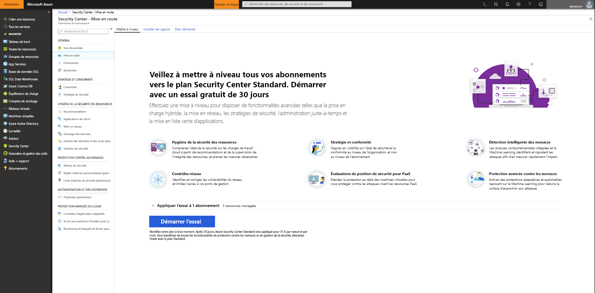
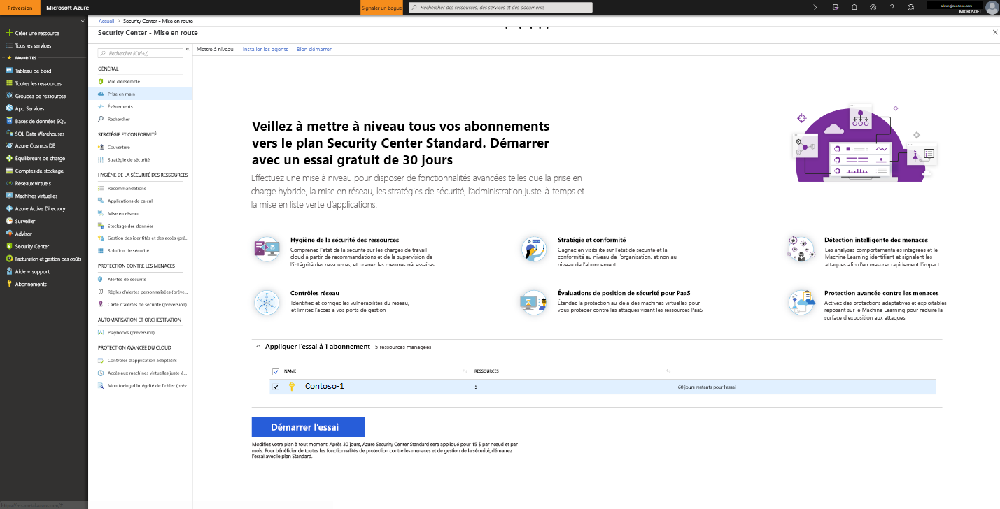

# Intégration d’Azure Security Center Standard pour une sécurité renforcée
Effectuez la mise à niveau vers Security Center Standard pour tirer profit d’une gestion de la sécurité et d’une protection contre les menaces renforcées pour vos charges de travail cloud hybrides.  Vous pouvez essayer gratuitement le niveau Standard. Pour plus d’informations, consultez la [page de tarification](https://azure.microsoft.com/pricing/details/security-center/) de Security Center.

Security Center Standard inclut :

- **Sécurité hybride** : obtenez une vue unifiée de la sécurité sur l’ensemble de vos charges de travail cloud et locales. Appliquez des stratégies de sécurité et évaluez en continu la sécurité de vos charges de travail cloud hybrides pour garantir la conformité aux normes de sécurité. Collectez, recherchez et analysez les données de sécurité à partir d’un large éventail de sources, dont les pare-feu et d’autres solutions partenaires.
- **Détection avancée des menaces** : utilisez l’analytique avancée et Microsoft Intelligent Security Graph pour avoir un avantage sur les cyberattaques en constante évolution.  Tirez parti des analytiques comportementales intégrées et de l’apprentissage machine pour identifier les attaques et les vulnérabilités zero-day. Surveillez les réseaux, machines et services cloud pour prévenir les attaques entrantes et les activités consécutives à une violation. Simplifiez l’investigation avec des outils interactifs et des informations sur les menaces contextuelles.
- **Contrôles d’accès et d’application** : bloquez les programmes malveillants et les autres applications indésirables en appliquant des recommandations de mise en liste verte adaptées à vos charges de travail spécifiques et alimentées par l’apprentissage machine. Réduisez la surface exposée aux attaques du réseau avec l’accès contrôlé juste à temps aux ports de gestion sur les machines virtuelles Azure, ce qui diminue de façon significative l’exposition aux attaques par force brute et autres attaques réseau.

## Détection des ressources non protégées     
Security Center détecte automatiquement les abonnements Azure ou les espaces de travail dans lesquels Security Center Standard n’est pas activé. Cela inclut les abonnements Azure utilisant Security Center Gratuit et les espaces de travail dans lesquels la solution de sécurité n’est pas activée.

Vous pouvez mettre à niveau un abonnement Azure entier vers le niveau Standard, qui est hérité par toutes les ressources prises en charge dans l’abonnement. Application de la norme de couche à un espace de travail s’applique à toutes les ressources associées à l’espace de travail.

> [!NOTE]
> Vous pouvez gérer vos coûts et limiter la quantité de données collectées pour une solution en limitant celle-ci à un ensemble spécifique d’agents. Le [ciblage de solution](../operations-management-suite/operations-management-suite-solution-targeting.md) vous permet d’appliquer une étendue à la solution et de cibler un sous-ensemble d’ordinateurs dans l’espace de travail.  Si vous utilisez le ciblage de solution, Security Center répertorie l’espace de travail comme n’ayant pas de solution.
>
>

## Mettre à niveau un abonnement ou un espace de travail Azure
Pour mettre à niveau un abonnement ou un espace de travail vers Standard :
1. Dans le menu principal de Security Center, sélectionnez **Prise en main**.
  
2. Dans **Mise à niveau**, Security Center liste les abonnements et les espaces de travail éligibles à l’intégration. 
   - Vous pouvez cliquer sur le menu déroulant **Appliquer votre version d’évaluation** pour afficher la liste de tous les abonnements et espaces de travail avec leur éligibilité pour la version d'évaluation.
   -    Vous pouvez mettre à niveau des abonnements et espaces de travail qui ne sont pas éligibles pour la version d’évaluation.
   -    Vous pouvez sélectionner des espaces de travail et abonnements éligibles pour démarrer votre évaluation.
3.  Cliquez sur **Démarrer la version d'évaluation** pour démarrer votre version d’évaluation sur les abonnements sélectionnés.
  

   > [!NOTE]
   > Les fonctionnalités gratuites de Security Center sont appliquées à vos machines virtuelles Azure et les VMSS uniquement. Les fonctionnalités du niveau Gratuit ne sont pas appliquées aux ordinateurs autres qu’Azure. Si vous sélectionnez Standard, les fonctionnalités Standard sont appliquées à toutes les machines virtuelles Azure identiques de machines virtuelles et ordinateurs non Azure à l’espace de travail. Nous vous conseillons d’appliquer le niveau Standard pour offrir une sécurité avancée à vos ressources Azure et autres qu’Azure.
   >
   >

## Intégrer des ordinateurs autres qu’Azure
Security Center peut surveiller l’état de sécurité de vos ordinateurs autres qu’Azure, mais vous devez d’abord intégrer ces ressources. Vous pouvez ajouter des ordinateurs autres qu’Azure à partir du panneau **Prise en main** ou du panneau **Calcul**. Nous allons examiner les deux méthodes.

### Ajouter des ordinateurs autres qu’Azure à partir du panneau **Prise en main**

1. Retournez à **Prise en main**.   
2. Sélectionnez l’onglet **Prise en main**.

   

3. Cliquez sur **Configurer** sous **Ajouter de nouveaux ordinateurs non Azure**. Une liste de vos espaces de travail Log Analytics apparaît. Elle comprend, le cas échéant, l’espace de travail par défaut créé pour vous par Security Center à l’activation de l’approvisionnement automatique. Sélectionnez cet espace de travail ou un autre espace de travail à utiliser.

   ![Ajouter un ordinateur autre qu’Azure][7]

Si vous avez des espaces de travail existants, ils sont répertoriés dans **Add new Non-Azure computers** (Ajouter de nouveaux ordinateurs autres qu’Azure). Vous pouvez ajouter des ordinateurs à un espace de travail existant ou créer un espace de travail. Pour créer un espace de travail, sélectionnez le lien **add a new workspace** (ajouter un nouvel espace de travail).

### Ajouter des ordinateurs autres qu’Azure à partir du panneau **Calcul**

**Créer un espace de travail et ajouter un ordinateur**

1. Dans **Add new Non-Azure computers** (Ajouter de nouveaux ordinateurs autres qu’Azure), sélectionnez **add a new workspace** (ajouter un nouvel espace de travail).

   ![Ajouter un espace de travail][4]

2. Dans **Security and Audit**, sélectionnez **Espace de travail OMS** pour créer un espace de travail.
   > [!NOTE]
   > Les espaces de travail OMS sont désormais appelés « espaces de travail Log Analytics ».
3. Dans **Espace de travail OMS**, entrez les informations de votre espace de travail.
4. Dans **Espace de travail OMS**, sélectionnez **OK**.  Une fois que vous sélectionnez OK, vous obtenez un lien pour télécharger un agent Windows ou Linux et des clés pour votre ID d’espace de travail, afin de les utiliser pour la configuration de l’agent.
5. Dans **Security and Audit**, sélectionnez **OK**.

**Sélectionner un espace de travail existant et ajouter un ordinateur**

Vous pouvez ajouter un ordinateur en suivant le flux de travail du panneau **Intégration**, comme indiqué ci-dessus. Vous pouvez également ajouter un ordinateur en suivant le flux de travail du panneau **Calcul**. Dans cet exemple, nous utilisons **Calcul**.

1. Revenez au menu principal de Security Center et au tableau de bord **Vue d’ensemble**.

   ![Présentation][5]

2. Sélectionnez **Compute et applications**.
3. Sous **Compute et applications**, sélectionnez **Ajouter des ordinateurs**.

   ![Panneau Calcul][6]

4. Dans **Add new Non-Azure computers** (Ajouter de nouveaux ordinateurs autres qu’Azure), sélectionnez un espace de travail auquel connecter votre ordinateur, puis cliquez sur **Ajouter des ordinateurs**.

   ![Ajouter des ordinateurs][7]

   Le panneau **Agent direct** fournit un lien pour télécharger un agent Windows ou Linux ainsi que l’ID d’espace de travail et les clés à utiliser pour la configuration de l’agent.   

## Étapes suivantes
Dans cet article, vous avez appris à intégrer des ressources Azure et autres qu’Azure pour tirer parti de la sécurité avancée de Security Center.  Pour utiliser davantage vos ressources intégrées, consultez les articles suivants :

- [Activer la collecte des données](security-center-enable-data-collection.md)
- [Rapport d’informations sur les menaces](security-center-threat-report.md)
- [Accès Juste à temps à la machine virtuelle](security-center-just-in-time.md)

<!--Image references-->
[1]: ./media/security-center-onboarding/onboard.png
[2]: ./media/security-center-onboarding/onboard-subscription.png
[3]: ./media/security-center-onboarding/get-started.png
[4]: ./media/security-center-onboarding/create-workspace.png
[5]: ./media/security-center-onboarding/overview.png
[6]: ./media/security-center-onboarding/compute-blade.png
[7]: ./media/security-center-onboarding/add-computer.png
[8]: ./media/security-center-onboarding/onboard-workspace.png
