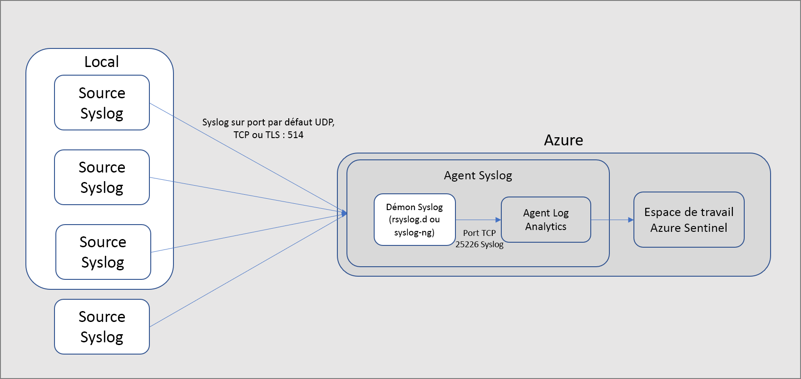

# Connectez votre solution externe en utilisant le format CEF

Lorsque vous connectez une solution externe qui envoie des messages CEF, il existe trois étapes pour la connexion à Azure Sentinel :

ÉTAPE 1 : [Connectez CEF en déployant l’agent](connect-cef-agent.md) ÉTAPE 2 : [Effectuez les étapes spécifiques à la solution](connect-cef-solution-config.md) ÉTAPE 3 : [Vérifiez la connectivité](connect-cef-verify.md)

Cet article décrit le fonctionnement de la connexion, fournit les conditions préalables et vous donne la procédure de déploiement de l’agent sur les solutions de sécurité qui envoient des messages CEF (Common Event format) à syslog. 

> [!NOTE] 
> Les données sont stockées dans l’emplacement géographique de l’espace de travail sur lequel vous exécutez Azure Sentinel.

Pour établir cette connexion, vous devez déployer un agent sur une machine Linux dédiée (machine virtuelle ou locale) pour prendre en charge la communication entre l’appliance et Azure Sentinel. Le diagramme suivant décrit la configuration dans le cas d’une machine virtuelle Linux dans Azure.

 

Cette configuration conviendra également si vous utilisez une machine virtuelle dans un autre cloud ou sur un ordinateur local. 

 

## Considérations relatives à la sécurité

Veillez à configurer la sécurité de la machine en fonction de la stratégie de sécurité de votre organisation. Par exemple, vous pouvez configurer votre réseau de sorte qu’il s’accorde à la stratégie de sécurité de votre réseau d’entreprise, et modifier les ports et les protocoles dans le démon pour les adapter à vos besoins. Vous pouvez utiliser les instructions suivantes pour améliorer la configuration de la sécurité de votre machine :  [Sécurisation de la machine virtuelle dans Azure](../virtual-machines/linux/security-policy.md), [Bonnes pratiques pour la sécurité réseau](../security/fundamentals/network-best-practices.md).

Pour utiliser la communication TLS entre la solution de sécurité et la machine Syslog, vous devez configurer le démon Syslog (rsyslog or syslog-ng) pour communiquer avec le TLS : [Chiffrement du trafic Syslog avec TLS –rsyslog](https://www.rsyslog.com/doc/v8-stable/tutorials/tls_cert_summary.html), [Chiffrement des messages du journal avec TLS – syslog-ng](https://support.oneidentity.com/technical-documents/syslog-ng-open-source-edition/3.22/administration-guide/60#TOPIC-1209298).

 
## Prérequis
Assurez-vous que la machine Linux que vous utilisez en tant que proxy exécute l’un des systèmes d’exploitation suivants :

- 64 bits
  - CentOS 6 et 7
  - Amazon Linux 2017.09
  - Oracle Linux 6 et 7
  - Red Hat Enterprise Linux Server 6 et 7
  - Debian GNU/Linux 8 et 9
  - Ubuntu Linux 14.04 LTS, 16.04 LTS et 18.04 LTS
  - SUSE Linux Enterprise Server 12
- 32 bits
   - CentOS 6
   - Oracle Linux 6
   - Red Hat Enterprise Linux Server 6
   - Debian GNU/Linux 8 et 9
   - Ubuntu Linux 14.04 LTS et 16.04 LTS
 
 - Versions du démon
   - Syslog-ng : 2.1 - 3.22.1
   - Rsyslog : v8
  
 - RFC Syslog pris en charge
   - RFC Syslog 3164
   - RFC Syslog 5424
 
Assurez-vous que votre machine répond également aux exigences suivantes : 
- Autorisations
    - Vous devez disposer d’autorisations élevées (sudo) sur votre machine. 
- Configuration logicielle requise
    - Vérifiez que Python est en cours d’exécution sur votre machine

## Étapes suivantes
Dans ce document, vous avez appris à connecter les appliances CEF à Azure Sentinel. Pour en savoir plus sur Azure Sentinel, voir les articles suivants :
- Découvrez comment [avoir une visibilité sur vos données et les menaces potentielles](quickstart-get-visibility.md).
- Prise en main de la [détection des menaces avec Azure Sentinel](tutorial-detect-threats.md).

